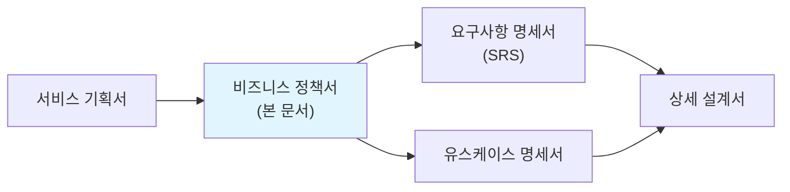
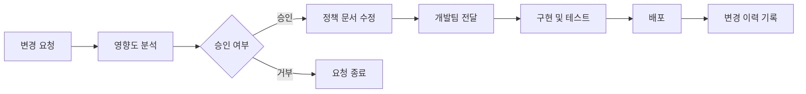

# 비즈니스 정책서 (Business Policy Document)

> 이 문서는 서비스의 비즈니스 동작 규칙을 독립적으로 정의하는 문서이다.
> "이런 상황에서 시스템은 어떻게 동작해야 하는가"를 **목적 / 규칙 / 예시** 구조로 명확히 기술하여, AI(Claude Code 등)가 바이브코딩 시 비즈니스 규칙을 정확히 구현하도록 한다.
> SRS의 기능 요구사항(FR)에 비즈니스 규칙이 흩어져 있으면 누락되기 쉬우므로, 이 문서에서 한곳에 모아 관리한다.

| 항목 | 내용 |
|------|------|
| **프로젝트명** | VIVE CRM |
| **문서 버전** | v1.0 |
| **작성일** | 2026-02-24 |
| **작성자** | 권영해 / 기획·개발 |
| **승인자** | 권영해 / 기획·개발 |
| **문서 상태** | 초안 |

---

## 변경 이력

| 버전 | 날짜 | 작성자 | 변경 내용 |
|------|------|--------|-----------|
| v0.1 | 2026-02-24 | 권영해 | 초안 작성 |

---

## 목차

1. [문서 개요](#1-문서-개요)
2. [정책 목록 및 요약](#2-정책-목록-및-요약)
3. [인증/권한 정책](#3-인증권한-정책)
4. [과금/결제 정책](#4-과금결제-정책)
5. [고객 관리 정책](#5-고객-관리-정책)
6. [파이프라인/영업 정책](#6-파이프라인영업-정책)
7. [AI 리드 스코어링 정책](#7-ai-리드-스코어링-정책)
8. [알림/푸시 정책](#8-알림푸시-정책)
9. [데이터 리셋/날짜 변경 정책](#9-데이터-리셋날짜-변경-정책)
10. [오프라인/에러 처리 정책](#10-오프라인에러-처리-정책)
11. [통계/카운팅 정책](#11-통계카운팅-정책)
12. [MVP 정책 적용 범위](#12-mvp-정책-적용-범위)
13. [정책 변경 관리](#13-정책-변경-관리)

---

## 1. 문서 개요

### 1.1 목적

이 문서는 **VIVE CRM** 서비스의 비즈니스 동작 규칙을 한곳에 모아 정의한다.

**이 문서가 필요한 이유:**

- SRS에 비즈니스 규칙이 기능별로 흩어져 있으면, AI 코딩 도구가 규칙을 누락하거나 잘못 해석하기 쉽다
- 비즈니스 규칙을 독립 문서로 관리하면 기획/개발/QA 모두 동일한 규칙을 참조할 수 있다
- "목적 / 규칙 / 예시" 구조는 AI가 가장 명확하게 이해하고 구현할 수 있는 형식이다

**이 문서의 대상 독자:**

| 독자 | 활용 방법 |
|------|-----------|
| AI 코딩 도구 (Claude Code 등) | 구현 시 비즈니스 규칙 참조. 예시의 "상황 -> 결과"를 테스트 케이스로 활용 |
| 개발팀 | 비즈니스 로직 구현의 기준 문서 |
| QA팀 | 테스트 케이스 도출의 기반. 예시를 경계값 테스트에 활용 |
| 기획팀 | 비즈니스 규칙 변경 관리의 단일 소스 |

### 1.2 정책 작성 가이드

> **모든 정책은 반드시 아래 4가지 요소를 포함해야 한다.**

| 요소 | 설명 | 작성 팁 |
|------|------|---------|
| **목적** | 이 정책이 존재하는 이유 | "왜 이 규칙이 필요한가"를 1~2문장으로 |
| **규칙** | 구체적인 동작 규칙 | 조건절 + 결과를 명확히. 모호한 표현("적절히", "필요 시") 금지 |
| **예시** | "상황 -> 결과" 형태의 구체적 시나리오 | 정상 케이스 + 경계 케이스 + 에러 케이스를 포함 |
| **변경이력** | 이 정책의 변경 기록 | 13장 통합 테이블에 기록. 정책별로도 주요 변경 기록 |

**좋은 규칙 vs 나쁜 규칙:**

| 구분 | 나쁜 예 | 좋은 예 |
|------|---------|---------|
| 모호한 표현 | "적절한 시간 후에 세션을 만료한다" | "마지막 활동으로부터 30분 경과 시 세션을 만료한다" |
| 조건 누락 | "결제를 환불한다" | "결제 후 7일 이내이고 서비스를 사용하지 않은 경우에만 전액 환불한다" |
| 경계값 누락 | "무료 사용자는 제한된 기능을 사용한다" | "무료 사용자는 최대 100명의 고객만 등록할 수 있다" |

**예시 작성 형식:**

```
상황: [구체적 상황 설명]
결과: [시스템의 동작]
```

### 1.3 관련 문서

| 문서명 | 관계 |
|--------|------|
| 서비스 기획서 | 본 문서의 상위 문서. 서비스 컨셉, MVP 스코프 정의 |
| 요구사항 명세서 (SRS) | 본 문서의 정책이 SRS의 기능 요구사항(FR)에서 참조됨 (BR-xxx) |
| 유스케이스 명세서 | 각 유스케이스의 "비즈니스 규칙" 항목이 본 문서를 참조 |



---

## 2. 정책 목록 및 요약

> 전체 정책의 인덱스 테이블이다. 각 정책의 상세 내용은 해당 섹션을 참조한다.

| 정책 ID | 정책 카테고리 | 핵심 규칙 요약 | MVP 적용 | 섹션 |
|---------|-------------|---------------|----------|------|
| BP-AUTH | 인증/권한 정책 | 이메일 기반 JWT 인증, Access Token 1시간, Refresh Token 14일 | Y | [3장](#3-인증권한-정책) |
| BP-PAY | 과금/결제 정책 | Freemium, 무료 100명 고객, Pro 월 ₩29,000~49,000 | Y | [4장](#4-과금결제-정책) |
| BP-CUSTOMER | 고객 관리 정책 | 소프트 삭제, 등급별 고객 수 제한, 중복 이메일 방지 | Y | [5장](#5-고객-관리-정책) |
| BP-PIPELINE | 파이프라인/영업 정책 | 리드→기회→제안→협상→계약/실패 단계 고정 | Y | [6장](#6-파이프라인영업-정책) |
| BP-AI | AI 리드 스코어링 정책 | 0-100점 자동 계산, 80+ A등급 분류 | Y | [7장](#7-ai-리드-스코어링-정책) |
| BP-NOTI | 알림/푸시 정책 | 마감일 당일 오전 9시 알림, 우선순위 높음은 하루 전 추가 | Y | [8장](#8-알림푸시-정책) |
| BP-RESET | 데이터 리셋/날짜 변경 정책 | KST 기준 일일 리셋, 미완료 작업 자동 알림 | Y | [9장](#9-데이터-리셋날짜-변경-정책) |
| BP-ERROR | 오프라인/에러 처리 정책 | 자동 재시도 3회, 오프라인 시 로컬 저장 | Y | [10장](#10-오프라인에러-처리-정책) |
| BP-STAT | 통계/카운팅 정책 | 실시간/배치 병행, 소프트 삭제 데이터 제외 집계 | Y | [11장](#11-통계카운팅-정책) |

---

## 3. 인증/권한 정책

> 사용자 인증, 세션 관리, 역할별 접근 권한에 관한 정책이다.

### 3.1 목적

사용자의 신원을 확인하고, 역할에 따라 적절한 기능과 데이터에만 접근할 수 있도록 한다. 보안 위협으로부터 사용자 계정과 데이터를 보호한다.

### 3.2 규칙

#### BP-AUTH-001: 회원 가입

| 규칙 ID | 규칙 | 비고 |
|---------|------|------|
| AUTH-001-1 | 이메일은 고유해야 한다. 이미 등록된 이메일로 가입 시도 시 "이미 등록된 이메일입니다" 메시지를 표시한다 | |
| AUTH-001-2 | 비밀번호는 최소 8자 이상이며, 영문 대소문자 + 숫자 + 특수문자 조합을 요구한다 | |
| AUTH-001-3 | 이메일 인증이 완료되어야 서비스 이용이 가능하다 | MVP 적용 |
| AUTH-001-4 | 소셜 로그인(Google) 지원 여부는 MVP 이후 v2에서 검토 | MVP 제외 |

#### BP-AUTH-002: 로그인 / 세션 관리

| 규칙 ID | 규칙 | 비고 |
|---------|------|------|
| AUTH-002-1 | 로그인 연속 실패 5회 시 계정을 30분간 잠금한다 | |
| AUTH-002-2 | Access Token 유효 기간은 1시간, Refresh Token 유효 기간은 14일이다 | 핵심 규칙 |
| AUTH-002-3 | 마지막 활동으로부터 30분 경과 시 세션을 만료한다 | |
| AUTH-002-4 | 동시 로그인은 최대 3개 기기까지 허용한다 | |
| AUTH-002-5 | 비밀번호 재설정 링크의 유효 기간은 24시간이다 | |

#### BP-AUTH-003: 역할 및 권한

| 역할 | 설명 | 주요 권한 | 비고 |
|------|------|-----------|------|
| 일반 사용자 (USER) | 기본 CRM 사용자 | 자신의 고객/파이프라인/작업 CRUD, AI 스코어링 조회 | 기본 역할 |
| 관리자 (ADMIN) | 팀/조직 관리자 | 전체 사용자/데이터 관리, 구독 관리, 팀원 초대 | |

### 3.3 예시

**정상 케이스:**

```
상황: 사용자가 올바른 이메일과 비밀번호로 로그인한다
결과: Access Token(1시간)과 Refresh Token(14일)이 발급되고, 대시보드로 이동한다
```

```
상황: Access Token이 만료된 상태에서 API를 호출한다
결과: 401 응답을 받고, 클라이언트가 자동으로 Refresh Token으로 새 Access Token을 발급받아 재요청한다
```

**경계 케이스:**

```
상황: 사용자가 4회 로그인에 실패한 후 5번째 시도에서 올바른 비밀번호를 입력한다
결과: 로그인 성공. 실패 카운트가 초기화된다
```

```
상황: 사용자가 5회 연속 로그인에 실패한다
결과: 계정이 30분간 잠금된다. 잠금 기간 중에는 올바른 비밀번호를 입력해도 로그인할 수 없다.
      "계정이 잠겼습니다. 30분 후에 다시 시도하거나 비밀번호를 재설정해주세요." 메시지를 표시한다
```

```
상황: 사용자가 4번째 기기에서 로그인을 시도한다
결과: 가장 오래된 세션을 자동으로 만료시키고 새로운 기기에서 로그인을 허용한다.
      "다른 기기의 세션이 만료되었습니다" 메시지를 표시한다
```

**에러 케이스:**

```
상황: Refresh Token도 만료된 상태에서 API를 호출한다
결과: 401 응답과 함께 로그인 페이지로 리다이렉트한다. 사용자에게 "세션이 만료되었습니다. 다시 로그인해주세요." 메시지를 표시한다
```

### 3.4 변경이력

| 날짜 | 규칙 ID | 변경 내용 | 변경 사유 |
|------|---------|-----------|-----------|
| - | - | - | - |

---

## 4. 과금/결제 정책

> 무료/유료 경계, 결제 처리, 환불, 구독 관리에 관한 정책이다.

### 4.1 목적

서비스의 유료 기능 사용에 대한 과금 규칙을 정의하고, 결제/환불 프로세스를 명확히 하여 사용자 불만과 분쟁을 예방한다.

### 4.2 규칙

#### BP-PAY-001: 무료/유료 경계

| 규칙 ID | 규칙 | 비고 |
|---------|------|------|
| PAY-001-1 | 무료 사용자에게 제공되는 기능: 고객 관리 최대 100명, 파이프라인 1개, 기본 알림 | 핵심 규칙 |
| PAY-001-2 | 유료 전용 기능: 고객 무제한, 파이프라인 무제한, 고급 AI 스코어링, 팀 협업 기능 | |
| PAY-001-3 | 무료 사용량 제한: 고객 등록 최대 100명, 파이프라인 1개 | 핵심 규칙 |
| PAY-001-4 | 무료 한도 초과 시 동작: "Pro 플랜으로 업그레이드하세요" 안내 모달 표시, 추가 등록 차단 | |

#### BP-PAY-002: 결제 처리

| 규칙 ID | 규칙 | 비고 |
|---------|------|------|
| PAY-002-1 | 지원 결제 수단: 신용카드, 계좌이체, 간편결제(카카오페이, 네이버페이) | |
| PAY-002-2 | 결제 실패 시 재시도: 자동 재시도 3회, 실패 시 수동 재결제 안내 | |
| PAY-002-3 | 결제 확인 대기 시간: 30초간 결제 완료 응답을 대기. 초과 시 "결제 확인 중" 상태로 전환 | |
| PAY-002-4 | 이중 결제 방지: 동일 주문에 대해 10초 이내 중복 결제 요청 차단 | |

#### BP-PAY-003: 요금제 구조

| 등급 | 월 요금 | 고객 수 | 파이프라인 | 비고 |
|------|---------|---------|------------|------|
| Free | 무료 | 최대 100명 | 1개 | 기본 기능 |
| Pro Starter | ₩29,000 | 무제한 | 3개 | 소규모팀 |
| Pro Business | ₩49,000 | 무제한 | 무제한 | 팀 협업 기능 포함 | 핵심 규칙 |

#### BP-PAY-004: 환불 정책

| 규칙 ID | 규칙 | 비고 |
|---------|------|------|
| PAY-004-1 | 환불 가능 기간: 결제 후 7일 이내 | |
| PAY-004-2 | 환불 가능 조건: 서비스를 사용하지 않은 경우에만 전액 환불 | |
| PAY-004-3 | 환불 처리 기간: 환불 승인 후 3~5영업일 이내 원 결제 수단으로 환불 | |
| PAY-004-4 | 환불 불가 사유: 7일 경과, 서비스 사용 이력 있음, 프로모션/할인 적용 구독 | |

#### BP-PAY-005: 구독 관리

| 규칙 ID | 규칙 | 비고 |
|---------|------|------|
| PAY-005-1 | 구독 갱신: 만료일 1일 전 자동 갱신 | |
| PAY-005-2 | 갱신 실패 시: 3일간의 유예 기간(Grace Period) 제공 후 Free 등급으로 전환 | |
| PAY-005-3 | 구독 해지: 즉시 해지 가능, 잔여 기간까지 사용 가능 | |
| PAY-005-4 | 등급 변경: 업그레이드 즉시 적용, 차액 결제 / 다운그레이드 다음 결제 주기부터 적용 | |
| PAY-005-5 | 다운그레이드 시 고객 초과: 100명 초과 고객이 있는 상태에서 Free로 다운그레이드 시, "고객 데이터 100개만 유지됩니다" 경고 후 진행 | |

### 4.3 예시

**정상 케이스:**

```
상황: 무료 사용자가 유료 구독(Pro Starter 월간)을 결제한다
결과: 결제 완료 즉시 유료 기능이 활성화된다. 다음 결제일은 30일 후로 설정된다
```

```
상황: Pro Starter 사용자가 Pro Business로 업그레이드한다
결과: 즉시 Pro Business 기능이 활성화되고, 잔여 기간을 일할 계산하여 차액을 결제한다
```

**경계 케이스:**

```
상황: 구독 자동 갱신일에 결제가 실패한다
결과: 3일간의 유예 기간을 제공한다. 유예 기간 중 매일 1회 자동 재시도한다.
      유예 기간 중에는 유료 기능을 계속 사용할 수 있다.
      3일 후에도 결제 실패 시 Free 등급으로 전환하고, 이메일로 안내한다
```

```
상황: Pro Business 사용자가 150명의 고객을 등록한 상태에서 Free로 다운그레이드한다
결과: "고객 데이터 100개만 유지됩니다. 나머지 50개는 접근 불가능해집니다. 계속하시겠습니까?" 경고 모달을 표시한다.
      사용자가 확인하면 다운그레이드가 적용되며, 100개 이상 고객은 읽기 전용으로 표시된다
```

**에러 케이스:**

```
상황: 결제 요청 후 PG사 응답이 30초간 없다
결과: "결제 확인 중" 상태로 전환한다. 사용자에게 "결제 처리 중입니다. 잠시 후 확인해주세요." 메시지를 표시한다.
      백그라운드에서 PG사에 결제 상태를 조회하여 최종 결과를 반영한다.
      결제 버튼을 비활성화하여 이중 결제를 방지한다
```

### 4.4 변경이력

| 날짜 | 규칙 ID | 변경 내용 | 변경 사유 |
|------|---------|-----------|-----------|
| - | - | - | - |

---

## 5. 고객 관리 정책

> 고객 정보 등록, 수정, 삭제, 조회에 관한 정책이다.

### 5.1 목적

사용자가 효율적으로 고객 정보를 관리할 수 있도록 하며, 데이터 보존과 개인정보 보호를 균형 있게 유지한다.

### 5.2 규칙

#### BP-CUSTOMER-001: 고객 등록

| 규칙 ID | 규칙 | 비고 |
|---------|------|------|
| CUSTOMER-001-1 | 고객 이메일은 동일 사용자 내에서 고유해야 한다. 중복 시 "이미 등록된 이메일입니다" 메시지를 표시한다 | |
| CUSTOMER-001-2 | 필수 입력 항목: 이름, 이메일(또는 전화번호 둘 중 하나) | |
| CUSTOMER-001-3 | 고객 등록 시 AI 리드 스코어링이 자동으로 계산된다 | 핵심 규칙 |
| CUSTOMER-001-4 | 무료 사용자는 최대 100명까지 고객 등록 가능하다. 100명 초과 시 "Pro 플랜으로 업그레이드하세요" 안내 | 핵심 규칙 |

#### BP-CUSTOMER-002: 고객 정보 수정

| 규칙 ID | 규칙 | 비고 |
|---------|------|------|
| CUSTOMER-002-1 | 고객 정보 수정 시 수정 일시와 수정자를 기록한다(감사 로그) | |
| CUSTOMER-002-2 | 이메일 변경 시 중복 체크를 수행한다 | |
| CUSTOMER-002-3 | 주요 정보(이름, 연락처) 변경 시 AI 리드 스코어링을 자동 재계산한다 | |

#### BP-CUSTOMER-003: 고객 삭제 (소프트 삭제)

| 규칙 ID | 규칙 | 비고 |
|---------|------|------|
| CUSTOMER-003-1 | 고객 삭제는 물리적 삭제가 아닌 소프트 삭제(논리적 삭제)로 처리한다 | 핵심 규칙 |
| CUSTOMER-003-2 | 삭제된 고객은 "삭제됨" 상태로 표시되며, 30일간 보관 후 완전 삭제된다 | |
| CUSTOMER-003-3 | 삭제된 고객은 기본 목록에서 조회되지 않으며, "휴지통" 메뉴에서 복구 가능하다 | |
| CUSTOMER-003-4 | 삭제된 고객과 연결된 파이프라인(Deal)은 유지되나, 고객명은 "삭제된 고객"으로 표시된다 | |

#### BP-CUSTOMER-004: 고객 등급/태그

| 규칙 ID | 규칙 | 비고 |
|---------|------|------|
| CUSTOMER-004-1 | 고객 등급: AI 리드 스코어링 결과에 따라 A(80-100), B(60-79), C(40-59), D(0-39)로 자동 분류 | 핵심 규칙 |
| CUSTOMER-004-2 | 사용자 정의 태그: 최대 20개까지 등록 가능, 중복 태그명 불가 | |
| CUSTOMER-004-3 | 고객당 태그: 최대 5개까지 지정 가능 | |

### 5.3 예시

**정상 케이스:**

```
상황: 사용자가 새로운 고객을 등록한다 (이름: 김철수, 이메일: kim@example.com)
결과: 고객이 등록되고, AI 리드 스코어링이 자동 계산되어 등급이 부여된다.
      등록 완료 알림이 표시되고 고객 상세 페이지로 이동한다
```

```
상황: 사용자가 고객을 삭제한다
결과: "정말 삭제하시겠습니까? 삭제 후 30일간 휴지통에서 복구 가능합니다." 확인 모달을 표시한다.
      확인 시 소프트 삭제 처리되고 휴지통으로 이동한다
```

**경계 케이스:**

```
상황: 무료 사용자가 100명째 고객을 등록하려 한다
결과: 고객 등록이 완료된다. "고객 등록 한도에 도달했습니다. 더 많은 고객을 관리하려면 Pro로 업그레이드하세요." 안내가 표시된다
```

```
상황: 무료 사용자가 101명째 고객을 등록하려 한다
결과: 등록이 차단되고 "무료 플랜은 최대 100명까지 등록 가능합니다. Pro로 업그레이드하세요" 모달이 표시된다
```

```
상황: 삭제된 지 30일이 경과한 고객을 복구하려 한다
결과: "복구 기간이 만료되어 해당 고객을 복구할 수 없습니다. 새로 등록해주세요." 메시지를 표시한다
```

**에러 케이스:**

```
상황: 이미 등록된 이메일로 고객 등록을 시도한다
결과: "이미 등록된 이메일입니다. 다른 이메일을 사용하거나 기존 고객 정보를 확인해주세요." 메시지를 표시한다
```

### 5.4 변경이력

| 날짜 | 규칙 ID | 변경 내용 | 변경 사유 |
|------|---------|-----------|-----------|
| - | - | - | - |

---

## 6. 파이프라인/영업 정책

> 영업 파이프라인 단계, Deal 진행, 성공/실패 처리에 관한 정책이다.

### 6.1 목적

영업 프로세스를 체계적으로 관리하고, 영업 기회의 진행 상황을 가시화하여 전환율을 개선한다.

### 6.2 규칙

#### BP-PIPELINE-001: 파이프라인 단계

| 규칙 ID | 규칙 | 비고 |
|---------|------|------|
| PIPELINE-001-1 | 파이프라인 단계는 고정된다: 리드(Lead) → 기회(Opportunity) → 제안(Proposal) → 협상(Negotiation) → 계약(Closed Won) 또는 실패(Closed Lost) | 핵심 규칙 |
| PIPELINE-001-2 | 단계는 순차적으로만 이동 가능하다. 한 번에 한 단계씩 전진 또는 후퇴 가능하다 | |
| PIPELINE-001-3 | 각 단계별 예상 매출(Expected Revenue)과 예상 마감일(Expected Close Date)을 설정할 수 있다 | |
| PIPELINE-001-4 | 무료 사용자는 파이프라인 1개만 생성 가능하다. Pro Starter는 3개, Pro Business는 무제한 생성 가능하다 | 핵심 규칙 |

#### BP-PIPELINE-002: Deal 생성 및 관리

| 규칙 ID | 규칙 | 비고 |
|---------|------|------|
| PIPELINE-002-1 | Deal은 반드시 고객과 연결되어야 한다. 고객 없이 Deal을 생성할 수 없다 | |
| PIPELINE-002-2 | Deal 금액은 0원 이상의 숫자만 입력 가능하다 | |
| PIPELINE-002-3 | Deal 생성 시 현재 단계는 자동으로 "리드"로 설정된다 | |
| PIPELINE-002-4 | Deal에 우선순위(높음/중간/낮음)를 설정할 수 있다 | |

#### BP-PIPELINE-003: Deal 상태 변경

| 규칙 ID | 규칙 | 비고 |
|---------|------|------|
| PIPELINE-003-1 | "계약" 단계로 변경 시 실제 매출(Actual Revenue)과 계약일(Closed Date)을 입력해야 한다 | |
| PIPELINE-003-2 | "실패" 단계로 변경 시 실패 사유(가격/타사선정/연락두절/기타)를 선택해야 한다 | |
| PIPELINE-003-3 | "계약" 또는 "실패" 상태의 Deal은 다시 이전 단계로 되돌릴 수 없다 | |
| PIPELINE-003-4 | Deal 상태 변경 시 변경 이력(Activity)이 자동으로 기록된다 | |

#### BP-PIPELINE-004: 마감일 및 알림

| 규칙 ID | 규칙 | 비고 |
|---------|------|------|
| PIPELINE-004-1 | 예상 마감일이 설정된 Deal은 마감일 당일 오전 9시에 알림이 발송된다 | 핵심 규칙 |
| PIPELINE-004-2 | 우선순위가 "높음"인 Deal은 마감일 하루 전에 추가 알림이 발송된다 | 핵심 규칙 |
| PIPELINE-004-3 | 마감일이 지난 Deal은 목록에서 "마감 초과" 배지로 표시된다 | |

### 6.3 예시

**정상 케이스:**

```
상황: 사용자가 새 Deal을 생성한다 (고객: 김철수, 금액: 5,000,000원, 예상 마감일: 2026-03-15)
결과: Deal이 "리드" 단계에 생성된다. AI 리드 스코어링 결과가 표시된다.
      예상 마감일에 맞춰 2026-03-15 오전 9시에 알림이 예약된다
```

```
상황: Deal을 "제안" 단계에서 "협상" 단계로 이동한다
결과: 단계가 변경되고, Activity에 "2026-02-24 14:30: 제안 → 협상" 이력이 기록된다
```

```
상황: Deal을 "계약" 단계로 변경한다 (실제 매출: 4,500,000원, 계약일: 2026-02-24)
결과: Deal 상태가 "계약"으로 변경되고, 해당 월 매출 통계에 반영된다.
      축하 메시지와 함께 "계약이 성사되었습니다!" 알림이 표시된다
```

**경계 케이스:**

```
상황: 예상 마감일이 오늘인 "높음" 우선순위 Deal이 있다
결과: 오늘 오전 9시에 마감일 알림이 발송된다.
      (어제 오전 9시에 이미 우선순위 높음 알림이 발송됨)
```

```
상황: "계약" 상태의 Deal을 "협상" 단계로 되돌리려 한다
결과: "계약 또는 실패 상태의 Deal은 되돌릴 수 없습니다. 새로운 Deal을 생성해주세요." 메시지를 표시한다
```

```
상황: 무료 사용자가 2번째 파이프라인을 생성하려 한다
결과: "무료 플랜은 파이프라인 1개만 생성 가능합니다. Pro로 업그레이드하세요" 모달이 표시된다
```

**에러 케이스:**

```
상황: 고객 없이 Deal 생성을 시도한다
결과: "Deal은 고객과 연결되어야 합니다. 고객을 먼저 등록하거나 선택해주세요." 메시지를 표시한다
```

### 6.4 변경이력

| 날짜 | 규칙 ID | 변경 내용 | 변경 사유 |
|------|---------|-----------|-----------|
| - | - | - | - |

---

## 7. AI 리드 스코어링 정책

> AI가 고객 데이터를 분석하여 리드 점수를 산출하는 정책이다.

### 7.1 목적

AI를 활용하여 고객의 구매 가능성을 객관적으로 평가하고, 영업 우선순위를 효율적으로 판단할 수 있도록 지원한다.

### 7.2 규칙

#### BP-AI-001: 스코어 계산

| 규칙 ID | 규칙 | 비고 |
|---------|------|------|
| AI-001-1 | AI 리드 스코어는 0-100점 범위의 정수로 계산된다 | 핵심 규칙 |
| AI-001-2 | 스코어는 고객 등록 시 자동으로 계산되며, 고객 정보 변경 시 재계산된다 | |
| AI-001-3 | 스코어 계산 요소: 이메일 도메인, 직책, 회사 규모, 산업군, 과거 Deal 이력, 웹사이트 방문 이력(연동 시) | |
| AI-001-4 | 스코어 계산은 최대 5초 이내에 완료되어야 한다 | |
| AI-001-5 | 계산 실패 시 기본값 50점을 부여하고 "스코어 계산 중" 상태를 표시한다 | |

#### BP-AI-002: 등급 분류

| 규칙 ID | 규칙 | 비고 |
|---------|------|------|
| AI-002-1 | 스코어에 따른 등급 분류: A등급(80-100), B등급(60-79), C등급(40-59), D등급(0-39) | 핵심 규칙 |
| AI-002-2 | A등급 고객은 목록 상단에 "HOT" 배지로 표시된다 | |
| AI-002-3 | 등급별 추천 행동: A(즉시 연락), B(이메일 발송), C(교육 콘텐츠 제공), D(장기 보류) | |

#### BP-AI-003: 고급 AI 스코어링 (유료)

| 규칙 ID | 규칙 | 비고 |
|---------|------|------|
| AI-003-1 | 무료 사용자는 기본 스코어링만 제공받는다 | |
| AI-003-2 | Pro 사용자는 고급 AI 스코어링을 이용할 수 있다: 예상 전환율, 추천 영업 전략, 유사 고객 분석 | |
| AI-003-3 | 고급 스코어링은 주 1회 자동 업데이트된다 | |

### 7.3 예시

**정상 케이스:**

```
상황: 사용자가 새 고객을 등록한다 (이메일: ceo@largecorp.com, 직책: CEO, 회사 규모: 500명)
결과: AI 스코어링이 수행되어 92점이 산출된다. A등급이 부여되고 "HOT" 배지가 표시된다.
      추천 행동: "즉시 연락하세요"가 표시된다
```

```
상황: 고객의 직책을 "인턴"에서 "팀장"으로 변경한다
결과: AI 스코어링이 재계산되어 45점에서 72점으로 상승한다. 등급이 C에서 B로 변경된다
```

**경계 케이스:**

```
상황: 스코어 80점인 고객이 있다 (A등급 경계값)
결과: A등급으로 분류되며 "HOT" 배지가 표시된다
```

```
상황: 스코어 79점인 고객이 있다
결과: B등급으로 분류되며 일반 배지가 표시된다
```

**에러 케이스:**

```
상황: AI 서비스 장애로 스코어 계산에 실패한다
결과: 기본값 50점이 부여되고 "스코어 계산 중입니다. 잠시 후 확인해주세요." 메시지가 표시된다.
      1시간 후 자동 재시도한다
```

### 7.4 변경이력

| 날짜 | 규칙 ID | 변경 내용 | 변경 사유 |
|------|---------|-----------|-----------|
| - | - | - | - |

---

## 8. 알림/푸시 정책

> 시스템 알림, 이메일 알림, 푸시 알림의 발송 조건과 빈도에 관한 정책이다.

### 8.1 목적

사용자에게 필요한 정보를 적시에 전달하되, 과도한 알림으로 인한 피로와 이탈을 방지한다.

### 8.2 규칙

#### BP-NOTI-001: 알림 채널 및 유형

| 알림 유형 | 채널 | 발송 조건 | 사용자 설정 가능 |
|-----------|------|-----------|-----------------|
| Deal 마감일 알림 | 이메일 + 인앱 | 마감일 당일 오전 9시 | Y |
| 우선순위 높음 Deal 알림 | 이메일 + 인앱 | 마감일 하루 전 오전 9시 | Y |
| 고객 등록 완료 | 인앱 | 고객 등록 시 | N (필수) |
| Deal 상태 변경 | 인앱 | 상태 변경 시 | N (필수) |
| 결제 확인 | 이메일 | 결제 완료 시 | N (필수) |
| 구독 갱신 알림 | 이메일 | 갱신 1일 전 | Y |
| 구독 만료 알림 | 이메일 | 만료일 당일, 3일 후 | Y |

#### BP-NOTI-002: 알림 빈도 제한

| 규칙 ID | 규칙 | 비고 |
|---------|------|------|
| NOTI-002-1 | 이메일 알림: 1일 최대 10건 (Deal 알림 제한 없음) | |
| NOTI-002-2 | 야간 시간대 (22:00 ~ 08:00) 이메일 알림 발송 금지 (예외: 긴급 보안 알림) | |
| NOTI-002-3 | 사용자가 알림을 끈 경우 해당 유형 알림을 발송하지 않는다. 필수 알림(결제, 보안)은 예외 | |
| NOTI-002-4 | 동일 Deal의 마감일 알림은 1일 1회만 발송한다 | 핵심 규칙 |

#### BP-NOTI-003: Deal 마감일 알림

| 규칙 ID | 규칙 | 비고 |
|---------|------|------|
| NOTI-003-1 | 예상 마감일이 설정된 Deal은 마감일 당일 오전 9시에 알림이 발송된다 | 핵심 규칙 |
| NOTI-003-2 | 우선순위가 "높음"인 Deal은 마감일 하루 전 오전 9시에 추가 알림이 발송된다 | 핵심 규칙 |
| NOTI-003-3 | 마감일이 지난 Deal은 3일마다 "마감 초과" 알림이 발송된다 (최대 3회) | |
| NOTI-003-4 | "계약" 또는 "실패" 상태가 된 Deal은 마감일 알림이 취소된다 | |

### 8.3 예시

**정상 케이스:**

```
상황: 예상 마감일이 2026-02-24인 일반 우선순위 Deal이 있다
결과: 2026-02-24 오전 9시에 "[Deal명] 마감일이 오늘입니다" 이메일과 인앱 알림이 발송된다
```

```
상황: 예상 마감일이 2026-02-24이고 우선순위가 "높음"인 Deal이 있다
결과: 2026-02-23 오전 9시에 "[Deal명] 마감일이 하루 남았습니다 (우선순위: 높음)" 알림이 발송된다.
      2026-02-24 오전 9시에 마감일 알림이 추가로 발송된다
```

**경계 케이스:**

```
상황: 사용자가 5개의 Deal에 대해 마감일 알림을 받을 예정이다
결과: 각 Deal마다 별도 알림이 발송된다 (최대 10건 제한 내)
```

```
상황: 마감일이 지난 Deal이 "계약" 상태로 변경된다
결과: 해당 Deal의 마감 초과 알림이 즉시 취소된다
```

**에러 케이스:**

```
상황: 알림 발송 서비스 장애로 이메일 발송에 실패한다
결과: 발송 실패 이력을 기록하고 1시간 후 재시도한다. 3회 재시도 후에도 실패하면 관리자에게 알림을 발송한다
```

### 8.4 변경이력

| 날짜 | 규칙 ID | 변경 내용 | 변경 사유 |
|------|---------|-----------|-----------|
| - | - | - | - |

---

## 9. 데이터 리셋/날짜 변경 정책

> 일일/주간/월간 리셋, 시간대 처리, 데이터 초기화에 관한 정책이다.

### 9.1 목적

데이터 리셋 시점과 시간대 처리 기준을 명확히 정의하여, 사용자별/지역별 데이터 정합성을 보장한다.

### 9.2 규칙

#### BP-RESET-001: 리셋 기준

| 규칙 ID | 규칙 | 비고 |
|---------|------|------|
| RESET-001-1 | 서비스 기준 시간대: KST (UTC+9) | |
| RESET-001-2 | 일일 리셋 시점: 매일 00:00 KST | |
| RESET-001-3 | 주간 리셋 시점: 매주 월요일 00:00 KST | |
| RESET-001-4 | 월간 리셋 시점: 매월 1일 00:00 KST | |

#### BP-RESET-002: 리셋 대상 데이터

| 대상 데이터 | 리셋 주기 | 리셋 내용 | 비고 |
|------------|-----------|-----------|------|
| 일일 알림 카운터 | 일일 | 0으로 초기화 | |
| 마감일 알림 예약 | 일일 | 당일 마감 Deal 알림 발송 | |
| 주간 리포트 데이터 | 주간 | 주간 통계 집계 및 리포트 생성 | |
| 월간 무료 AI 분석 횟수 | 월간 | 0으로 초기화 (무료 사용자) | |

#### BP-RESET-003: 자동 알림 처리

| 규칙 ID | 규칙 | 비고 |
|---------|------|------|
| RESET-003-1 | 매일 00:00 KST에 당일 마감 예정인 Deal 목록을 조회하여 알림을 예약한다 | 핵심 규칙 |
| RESET-003-2 | 매일 09:00 KST에 예약된 마감일 알림을 일괄 발송한다 | 핵심 규칙 |
| RESET-003-3 | 우선순위 높음 Deal의 하루 전 알림은 전날 09:00 KST에 발송된다 | 핵심 규칙 |

### 9.3 예시

```
상황: 예상 마감일이 2026-02-25인 Deal이 2개 있다 (일반 우선순위 1개, 높음 우선순위 1개)
결과: 2026-02-25 00:00 KST에 해당 Deal들이 알림 대상으로 등록된다.
      일반 Deal: 2026-02-25 09:00 KST에 알림 발송
      높음 Deal: 2026-02-24 09:00 KST에 선행 알림 발송, 2026-02-25 09:00 KST에 마감일 알림 발송
```

```
상황: 해외 사용자가 UTC 기준 15:00에 접속한다 (KST 00:00)
결과: 서비스 기준 시간대(KST)에 따라 일일 리셋이 적용된다. 사용자의 로컬 시간과 무관하게 KST 00:00에 리셋된다
```

### 9.4 변경이력

| 날짜 | 규칙 ID | 변경 내용 | 변경 사유 |
|------|---------|-----------|-----------|
| - | - | - | - |

---

## 10. 오프라인/에러 처리 정책

> 네트워크 오류, 서버 장애, 오프라인 상태에서의 서비스 동작에 관한 정책이다.

### 10.1 목적

네트워크 불안정, 서버 장애 등 비정상 상황에서의 사용자 경험을 보장하고, 데이터 유실을 방지한다.

### 10.2 규칙

#### BP-ERROR-001: 네트워크 오류 처리

| 규칙 ID | 규칙 | 비고 |
|---------|------|------|
| ERROR-001-1 | API 호출 실패 시 자동 재시도: 최대 3회, 1초/2초/4초 간격 (지수 백오프) | |
| ERROR-001-2 | 재시도 모두 실패 시: 사용자에게 "네트워크 연결을 확인해주세요" 메시지와 수동 재시도 버튼 표시 | |
| ERROR-001-3 | 오프라인 상태 감지 시: 오프라인 배너 표시, 캐시된 데이터로 읽기 전용 모드 | |

#### BP-ERROR-002: 데이터 보존

| 규칙 ID | 규칙 | 비고 |
|---------|------|------|
| ERROR-002-1 | 사용자 입력 도중 네트워크 오류 발생 시: 로컬에 임시 저장 후 연결 복구 시 자동 전송 | |
| ERROR-002-2 | 결제 중 네트워크 오류 발생 시: 결제 상태를 "확인 중"으로 표시. 서버에서 결제 결과를 비동기 확인하여 반영 | |
| ERROR-002-3 | 고객/Deal 등록 중 오류 발생 시: 작성 중인 내용을 브라우저 로컬 스토리지에 저장, 복구 시 안내 | |

#### BP-ERROR-003: 서버 오류 표시

| HTTP 상태 | 사용자 메시지 | 기술적 동작 |
|-----------|-------------|------------|
| 400 | "입력 정보를 확인해주세요" | 요청 파라미터 검증 실패. 실패 필드와 사유를 응답에 포함 |
| 401 | "로그인이 필요합니다" | 로그인 페이지로 리다이렉트 |
| 403 | "접근 권한이 없습니다" | 현재 페이지에서 안내 메시지 표시 |
| 404 | "요청하신 페이지를 찾을 수 없습니다" | 404 페이지 표시 + 홈으로 이동 링크 |
| 429 | "요청이 너무 많습니다. 잠시 후 다시 시도해주세요" | Rate Limit 초과. 재시도 가능 시점 안내 |
| 500 | "일시적인 오류가 발생했습니다" | 에러 로그 기록 + 모니터링 알림 |
| 503 | "서비스 점검 중입니다" | 점검 예상 종료 시간 표시 |

### 10.3 예시

```
상황: 사용자가 긴 글을 작성 중에 네트워크가 끊긴다
결과: 작성 중인 내용을 로컬 스토리지에 자동 저장한다. "네트워크 연결이 끊겼습니다. 작성 중인 내용은 자동 저장됩니다." 메시지를 표시한다.
      네트워크가 복구되면 "네트워크가 복구되었습니다. 저장하시겠습니까?" 안내를 표시한다
```

```
상황: 서버에서 500 에러가 연속 3회 발생한다
결과: 사용자에게 "일시적인 오류가 발생했습니다. 잠시 후 다시 시도해주세요." 메시지를 표시한다.
      내부적으로 에러 로그를 기록하고 모니터링 시스템에 알림을 발송한다.
      자동 재시도는 수행하지 않는다 (사용자가 수동으로 재시도)
```

### 10.4 변경이력

| 날짜 | 규칙 ID | 변경 내용 | 변경 사유 |
|------|---------|-----------|-----------|
| - | - | - | - |

---

## 11. 통계/카운팅 정책

> 수치 집계, 통계 산출, 카운팅 기준에 관한 정책이다.

### 11.1 목적

서비스 내 각종 수치(고객 수, Deal 수, 매출 등)의 집계 기준을 명확히 정의하여 데이터의 일관성과 신뢰성을 보장한다.

### 11.2 규칙

#### BP-STAT-001: 카운팅 기준

| 대상 | 카운팅 기준 | 중복 처리 | 갱신 주기 |
|------|------------|-----------|-----------|
| 고객 수 | 소프트 삭제되지 않은 고객 레코드 수 | 고객 ID 기준 중복 제거 | 실시간 |
| Deal 수 | 소프트 삭제되지 않은 Deal 레코드 수 | Deal ID 기준 중복 제거 | 실시간 |
| 파이프라인 수 | 사용자가 생성한 파이프라인 수 | 파이프라인 ID 기준 중복 제거 | 실시간 |
| 매출 | "계약" 상태 Deal의 실제 매출 합계 | 환불/취소 건은 차감 | 일일 배치 |
| 전환율 | "계약" 상태 Deal 수 / 전체 Deal 수 × 100 | - | 실시간 |
| AI 스코어 평균 | 고객별 AI 스코어 산술 평균 | - | 고객 변경 시 |

#### BP-STAT-002: 통계 표시 규칙

| 규칙 ID | 규칙 | 비고 |
|---------|------|------|
| STAT-002-1 | 1,000 이상 수치는 약식 표시: 1.2K, 3.5M 형식 | |
| STAT-002-2 | 통계 데이터 지연 허용 범위: 실시간 (최대 1분) | |
| STAT-002-3 | 0건인 경우 표시: "0" 표시 | |
| STAT-002-4 | 소프트 삭제된 데이터는 모든 통계에서 제외한다 | 핵심 규칙 |
| STAT-002-5 | "계약" 상태가 아닌 Deal은 매출 통계에 포함하지 않는다 | |

#### BP-STAT-003: 대시보드 통계

| 통계 항목 | 계산 방식 | 갱신 주기 |
|-----------|-----------|-----------|
| 이번 달 예상 매출 | 예상 마감일이 이번 달인 Deal의 예상 매출 합계 | 실시간 |
| 이번 달 실제 매출 | "계약" 상태이고 계약일이 이번 달인 Deal의 실제 매출 합계 | 실시간 |
| 파이프라별 Deal 분포 | 각 단계별 Deal 수 카운트 | 실시간 |
| A등급 고객 수 | AI 스코어 80점 이상 고객 수 | 실시간 |
| 마감 임박 Deal 수 | 예상 마감일이 7일 이내인 미완료 Deal 수 | 일일 배치 |

### 11.3 예시

```
상황: 고객 100명 중 5명이 삭제된 상태이다
결과: 고객 수 통계는 95명으로 표시된다 (소프트 삭제 제외)
```

```
상황: Deal 10개 중 3개가 "계약", 2개가 "실패", 5개가 진행 중이다
결과: 매출 통계는 "계약" 3개만 반영된다. 전환율은 3/10 = 30%로 계산된다
```

```
상황: 매출이 1,523,000원이다
결과: 목록 화면에서 "1.5M"으로 표시한다. 상세 화면에서는 "1,523,000"으로 정확히 표시한다
```

### 11.4 변경이력

| 날짜 | 규칙 ID | 변경 내용 | 변경 사유 |
|------|---------|-----------|-----------|
| - | - | - | - |

---

## 12. MVP 정책 적용 범위

> 서비스 기획서의 MVP 스코프와 연동하여, 각 정책의 MVP 적용 범위를 정의한다.

### 12.1 MVP에서 적용하는 정책

| 정책 ID | 정책명 | MVP 적용 범위 | 간소화 사항 |
|---------|--------|-------------|------------|
| BP-AUTH | 인증/권한 | 전체 적용 | 소셜 로그인은 v2에서 추가 |
| BP-PAY | 과금/결제 | 기본 적용 | 고급 결제 수단(해외 카드 등)은 v2에서 추가 |
| BP-CUSTOMER | 고객 관리 | 전체 적용 | - |
| BP-PIPELINE | 파이프라인/영업 | 전체 적용 | - |
| BP-AI | AI 리드 스코어링 | 기본 적용 | 고급 AI 스코어링(예상 전환율 등)은 Pro 전용으로 적용 |
| BP-NOTI | 알림/푸시 | 기본 적용 | 푸시 알림은 웹 기반, 모바일 앱 푸시는 v2에서 추가 |
| BP-RESET | 데이터 리셋/날짜 변경 | 전체 적용 | - |
| BP-ERROR | 오프라인/에러 | 기본 적용 | 오프라인 모드 완전 지원은 v2에서 강화 |
| BP-STAT | 통계/카운팅 | 전체 적용 | - |

### 12.2 MVP에서 제외하는 정책

| 정책 ID | 정책명 | 제외 근거 | 도입 시점 |
|---------|--------|-----------|-----------|
| BP-AUTH-SOCIAL | 소셜 로그인 | 기본 이메일 인증으로 충분 | v2 |
| BP-TEAM | 팀 협업 고급 기능 | 단일 사용자 MVP 우선 | v2 |
| BP-INTEGRATION | 외부 연동(Salesforce, Slack 등) | 핵심 CRM 기능 우선 | v2 이후 |
| BP-MOBILE-APP | 네이티브 모바일 앱 | 웹 기반으로 MVP 진행 | MAU 1,000 달성 시 검토 |

### 12.3 MVP 정책 간소화 가이드

> MVP 단계에서는 정책을 완전히 구현하기보다, 핵심 규칙만 적용하고 예외 처리는 간소화할 수 있다.

| 간소화 유형 | 설명 | 예시 |
|------------|------|------|
| 수동 처리로 대체 | 자동화 대신 관리자가 수동으로 처리 | "환불 요청은 관리자에게 이메일로 접수" |
| 단순 규칙 적용 | 복잡한 조건 분기 대신 단일 규칙 적용 | "전액 환불만 지원 (부분 환불은 v2)" |
| 기능 제한 안내 | 미구현 기능에 대한 안내 메시지 표시 | "이 기능은 준비 중입니다" |
| 기본값 사용 | 복잡한 설정 대신 기본값 적용 | "알림 시간은 고정 (사용자 설정 불가)" |

---

## 13. 정책 변경 관리

### 13.1 정책 변경 프로세스



### 13.2 정책 변경 시 확인 사항

- [ ] 변경되는 정책의 영향 범위(관련 기능, 화면, API)를 파악했는가
- [ ] 기존 사용자 데이터에 미치는 영향을 분석했는가
- [ ] SRS의 관련 기능 요구사항(BR-xxx)을 함께 업데이트했는가
- [ ] 변경 내용을 개발팀과 QA팀에 전달했는가
- [ ] 변경 이력 테이블에 기록했는가

### 13.3 통합 변경 이력

> 모든 정책의 변경 이력을 시간순으로 관리하는 통합 테이블이다.

| 날짜 | 정책 ID | 규칙 ID | 변경 전 | 변경 후 | 변경 사유 | 승인자 |
|------|---------|---------|---------|---------|-----------|--------|
| - | - | - | - | - | - | - |

---

## 부록

### A. 정책 ID 체계

| 접두사 | 의미 | 예시 |
|--------|------|------|
| BP-AUTH | 인증/권한 정책 | BP-AUTH-001 |
| BP-PAY | 과금/결제 정책 | BP-PAY-001 |
| BP-CUSTOMER | 고객 관리 정책 | BP-CUSTOMER-001 |
| BP-PIPELINE | 파이프라인/영업 정책 | BP-PIPELINE-001 |
| BP-AI | AI 리드 스코어링 정책 | BP-AI-001 |
| BP-NOTI | 알림/푸시 정책 | BP-NOTI-001 |
| BP-RESET | 데이터 리셋/날짜 변경 정책 | BP-RESET-001 |
| BP-ERROR | 오프라인/에러 처리 정책 | BP-ERROR-001 |
| BP-STAT | 통계/카운팅 정책 | BP-STAT-001 |

### B. 용어 정의

| 용어 | 정의 |
|------|------|
| 비즈니스 정책 | 서비스의 동작 규칙을 정의하는 비즈니스 수준의 규칙 |
| BR (Business Rule) | SRS에서 참조하는 비즈니스 규칙 코드. 본 문서의 규칙 ID와 매핑 |
| Grace Period | 결제 실패 후 서비스를 유지하는 유예 기간 |
| Rate Limit | 단위 시간당 허용되는 최대 요청 횟수 |
| 지수 백오프 | 재시도 간격을 지수적으로 증가시키는 방식 (1초, 2초, 4초, ...) |
| 소프트 삭제 | 물리적 삭제 대신 삭제 플래그를 설정하는 논리적 삭제 방식 |
| 리드(Lead) | 영업 파이프라인의 첫 단계. 잠재 고객 정보 수집 단계 |
| Deal | 영업 기회. 특정 고객에 대한 영업 활동 단위 |
| AI 리드 스코어 | AI가 산출한 고객의 구매 가능성 점수 (0-100) |
| KST | 한국 표준시 (UTC+9) |

### C. 승인

| 역할 | 이름 | 서명 | 날짜 |
|------|------|------|------|
| 기획 책임자 | 권영해 | | 2026-02-24 |
| 개발 리드 | 권영해 | | 2026-02-24 |
| QA 리드 | - | | - |
