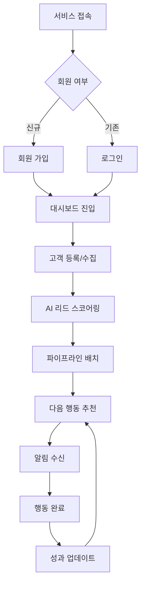
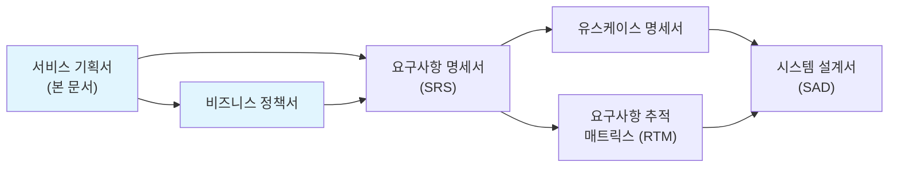

# 서비스 기획서 (Service Planning Document)

> 이 문서는 SRS(요구사항 명세서) 작성 이전에 "왜 이 서비스를 만드는가", "핵심 가치는 무엇인가", "MVP에 무엇을 포함/제외하는가"를 정의하는 선행 기획 문서이다.
> SRS가 "무엇을 만들 것인가(What)"에 집중한다면, 이 문서는 "왜 만드는가(Why)"와 "어디까지 만드는가(Scope)"에 집중한다.

| 항목 | 내용 |
|------|------|
| **프로젝트명** | VIVE CRM |
| **문서 버전** | v1.0 |
| **작성일** | 2026-02-24 |
| **작성자** | 조훈상 / 기획·개발 |
| **승인자** | 조훈상 / 프로젝트 오너 |
| **문서 상태** | 초안 |

---

> **용어 규칙:** 본 문서는 [`용어규칙.md`](./용어규칙.md)의 표기 원칙과 용어 사전을 준수한다. 새로운 용어 사용 시 반드시 해당 문서에 먼저 등록한다.

---

## 변경 이력

| 버전 | 날짜 | 작성자 | 변경 내용 |
|------|------|--------|-----------|
| v0.1 | 2026-02-24 | 조훈상 | 1페이지 사업 기획서 기반 초안 작성 |
| v1.0 | 2026-02-24 | 조훈상 | 서비스 기획서 템플릿 기반 상세화 |

---

## 목차

1. [서비스 개요](#1-서비스-개요)
2. [핵심 메커니즘](#2-핵심-메커니즘)
3. [콘텐츠/기능 전략](#3-콘텐츠기능-전략)
4. [수익화 전략](#4-수익화-전략)
5. [MVP 스코프 정의](#5-mvp-스코프-정의)
6. [KPI 가설 검증 프레임워크](#6-kpi-가설-검증-프레임워크)
7. [다음 단계](#7-다음-단계)
8. [관련 문서](#8-관련-문서)

---

## 1. 서비스 개요

### 1.1 서비스명 및 컨셉

| 항목 | 내용 |
|------|------|
| 서비스명 | VIVE CRM |
| 한 줄 설명 | 영업팀이 고객 관계를 체계적으로 관리하고, AI 기반 인사이트로 매출 전환율을 높이는 스마트 CRM 플랫폼 |
| 서비스 유형 | SaaS (웹 서비스) |
| 대상 플랫폼 | Web (반응형) |

**서비스 컨셉 설명:**

중소기업 영업팀과 개인 사업자들이 엑셀과 메모로 고객 정보를 관리하며 놓치는 기회와 잠재 고객을 AI 기반 인사이트로 발굴한다. 단순한 연락처 관리를 넘어 고객과의 모든 터치포인트(이메일, 전화, 미팅)를 추적하고, 다음 행동을 AI가 제안하는 "영업 코파일럿" 역할을 제공한다. "고객 관리"가 아니라 "매출 성장"에 집중하는 것이 핵심 가치이다.

**배경 및 동기:**

- 스프레드시트 기반 고객 관리의 한계로 영업 기회 상실이 빈번하게 발생한다
- 영업 사이클이 길어질수록 고객 맥락을 놓치고 후속 조치를 잊어버리는 경우가 많다
- 기존 CRM(Salesforce, HubSpot)은 중소기업에게 과도한 기능과 가격 부담이 있다
- 영업팀의 행동 패턴 데이터를 활용한 AI 기반 예측/추천 도구가 부재하다

### 1.2 핵심 가치 제안 (Value Proposition)

| 항목 | 내용 |
|------|------|
| 핵심 가치 | 영업팀이 "놓치지 않고 적시에" 고객과 교류하여 매출 전환율을 높일 수 있도록 AI 기반 인사이트와 자동화된 워크플로우를 제공한다 |
| 차별점 | AI 기반 다음 행동 추천 — 잠재 고객 발굴, 리드 스코어링, 후속 시점 예측 |
| 대안 대비 우위 | 스프레드시트(비효율), 국내 CRM(기능 부족), 글로벌 CRM(과도한 가격) 대비 최적화된 기능과 합리적인 가격 |

**가치 제안 캔버스:**

| 구분 | 내용 |
|------|------|
| 사용자의 할 일 (Jobs) | 잠재 고객을 발굴하고, 영업 파이프라인을 관리하며, 고객과 지속적인 관계를 유지하여 계약을 체결한다 |
| 사용자의 고통 (Pains) | 고객 정보가 여러 곳에 흩어져 있어 파악이 어렵다, 후속 조치 시점을 놓쳐 기회를 상실한다, 영업 성과를 데이터로 보여주기 어렵다 |
| 사용자의 이득 (Gains) | 한눈에 보는 고객 360도 뷰, 놓치지 않는 후속 알림, 데이터 기반 영업 전략 수립 |
| 고통 해결제 (Pain Relievers) | 통합 고객 프로필, 자동화된 후속 알림, 영업 파이프라인 시각화 |
| 이득 생성제 (Gain Creators) | AI 기반 리드 스코어링, 다음 행동 추천, 매출 예측 리포트 |

### 1.3 타겟 사용자 정의

#### 1.3.1 주요 사용자 페르소나

**페르소나 1: 영업팀장 "민수"**

| 항목 | 내용 |
|------|------|
| 이름 | 김민수 |
| 연령/직업 | 38세 / B2B SaaS 스타트업 영업팀장 (팀원 5명) |
| 기술 수준 | 중급 (CRM 경험 있음) |
| 핵심 목표 | 팀원들의 영업 활동을 가시화하고, 영업 예측을 정확히 하고 싶다 |
| 핵심 불편 | 팀원들이 엑셀로 각자 관리해서 현황 파악이 어렵다, Salesforce는 너무 비싸다 |
| 사용 시나리오 | 주간 영업 회의에서 팀 현황을 대시보드로 확인하고, 리스크 있는 딜을 AI가 식별하여 조기 대응 |
| 성공 기준 | 팀 전체 파이프라인 가시성 확보, 영업 예측 정확도 80% 이상 |

**페르소나 2: 영업 담당자 "지은"**

| 항목 | 내용 |
|------|------|
| 이름 | 박지은 |
| 연령/직업 | 29세 / 1인 사업자 (프리랜서 영업 대행) |
| 기술 수준 | 초중급 (CRM 처음 사용) |
| 핵심 목표 | 고객과의 모든 커뮤니케이션을 놓치지 않고, 잊어버리지 않고 싶다 |
| 핵심 불편 | 고객이 너무 많아 누구를 언제 팔로업해야 할지 모르겠다 |
| 사용 시나리오 | 아침에 로그인하면 AI가 "오늘 팔로업해야 할 고객" 목록을 제안해주는 것을 확인 |
| 성공 기준 | 하루 평균 30분 이내로 고객 관리, 후속 조치 누락 0건 |

**페르소나 3: 마케팅 담당자 "현우"**

| 항목 | 내용 |
|------|------|
| 이름 | 이현우 |
| 연령/직업 | 32세 / 중견기업 마케팅팀 (5인 팀) |
| 기술 수준 | 중급 |
| 핵심 목표 | 마케팅 캠페인으로 수집한 리드를 효율적으로 영업에 넘기고 싶다 |
| 핵심 불편 | 리드 정보가 부실하게 넘어가 영업에서 불만이 많다 |
| 사용 시나리오 | 웹사이트 문의 리드를 자동으로 CRM에 등록하고, 리드 스코어를 확인하여 영업 우선순위 제안 |
| 성공 기준 | 리드-영업 핸드오프 시간 단축, 리드 품질 개선 |

#### 1.3.2 사용자 세그먼트

| 세그먼트 | 설명 | 규모 추정 | 우선순위 | MVP 포함 |
|----------|------|-----------|----------|----------|
| 1~10인 스타트업 영업팀 | 리소스가 부족하여 효율적인 고객 관리 도구가 필요한 팀 | 전국 약 5만 팀 | P0 | Y |
| 프리랜서/1인 사업자 | 개인이 여러 고객을 관리해야 하는 경우 | 전국 약 20만 명 | P0 | Y |
| 중소기업 영업팀 | 기존 CRM의 복잡성과 비용 부담을 느끼는 기업 | 전국 약 10만 팀 | P1 | Y |
| 마케팅 에이전시 | 고객의 리드 관리를 대행하는 에이전시 | 전국 약 5천 개 | P1 | Y |

#### 1.3.3 비사용자 (Anti-Persona)

| 비사용자 | 이유 | 대안 |
|----------|------|------|
| 대기업 영업팀 | 이미 Salesforce, MS Dynamics 등 엔터프라이즈 CRM을 도입 완료 | 기존 엔터프라이즈 CRM |
| 비영업 직군 | 영업 업무가 아닌 경우 | 일반 업무 관리 툴 (Notion, Trello) |
| 오프라인 소매업 | 고객 관계 관리보다 POS/재고 관리가 우선 | POS 시스템 |
| 완전 비디지털 업종 | 디지털 도구 사용을 거부하는 업종 | 종이/전화 기반 관리 |

---

## 2. 핵심 메커니즘

### 2.1 서비스 작동 원리

**핵심 루프 (Core Loop):**

사용자가 고객 정보를 등록/수집하면, 시스템이 AI로 리드를 분석하고 스코어링하며, 적시에 후속 조치를 알림으로 제공하고, 사용자가 행동을 완료하면 다음 인사이트를 생성한다.

1. **고객 등록** — 수동 입력, 웹폼 연동, CSV 임포트로 고객 정보를 등록한다
2. **AI 리드 스코어링** — 고객 데이터를 기반으로 구매 가능성을 자동 평가한다
3. **파이프라인 배치** — 영업 단계(리드 → 기회 → 제안 → 협상 → 계약)에 배치한다
4. **다음 행동 추천** — AI가 최적의 다음 행동(이메일, 전화, 미팅)과 시기를 제안한다
5. **후속 알림** — 설정된 시점에 알림을 발송하여 행동을 유도한다
6. **성과 측정** — 영업 활동 데이터를 수집하여 성과 리포트를 생성한다

**핵심 원칙:**

- 데이터 입력은 최소화하고 AI가 자동으로 인사이트를 생성한다
- 모든 고객 터치포인트는 타임라인으로 추적된다
- 영업 성과는 실시간 대시보드로 가시화된다

### 2.2 전체 서비스 플로우

### 2.3 핵심 사용자 여정 (Key User Journey)

#### 여정 1: 첫 사용 — 고객 등록과 첫 인사이트

| 단계 | 사용자 행동 | 시스템 반응 | 감정 목표 | 핵심 지표 |
|------|------------|------------|-----------|-----------|
| 1. 진입 | 서비스 랜딩페이지 접속 | 핵심 가치 제안 + 데모 영상 표시 | 호기심 | 방문율 |
| 2. 첫 고객 등록 | 고객 정보 입력 또는 CSV 업로드 | AI가 자동으로 리드 스코어 계산 | 놀라움 ("이게 되네?") | 첫 고객 등록율 |
| 3. 인사이트 확인 | 추천된 다음 행동 확인 | 구체적이고 실행 가능한 제안 제공 | 신뢰 ("진짜 도움되네") | 인사이트 클릭율 |
| 4. 첫 후속 완료 | 제안된 이메일/전화 완료 | 성과 카운트업 애니메이션 | 성취감 | 첫 행동 완료율 |
| 5. 회원가입 | 결과 저장을 위해 가입 | 이전 활동 자동 저장 | 안심 | 가입 전환율 |

#### 여정 2: 반복 사용 — 파이프라인 관리

| 단계 | 사용자 행동 | 시스템 반응 | 감정 목표 | 핵심 지표 |
|------|------------|------------|-----------|-----------|
| 1. 재방문 | 대시보드 접속, 파이프라인 현황 확인 | 시각적 파이프라인 + 리스크 알림 | 친숙함 | D7 Retention |
| 2. 딜 진행 | 고객을 다음 단계로 이동 | 단계별 가이드와 템플릿 제공 | 생산성 | 파이프라인 이동률 |
| 3. 팀 공유 | 팀원에게 딜 언급/할당 | 실시간 알림과 협업 기능 | 협업 | 팀 기능 사용율 |
| 4. 리포트 확인 | 주간 성과 리포트 확인 | 데이터 기반 인사이트 제공 | 만족 | 리포트 열람률 |

---

## 3. 콘텐츠/기능 전략

### 3.1 핵심 기능 방향

| 기능 영역 | 전략 방향 | 우선순위 | MVP 포함 | 비고 |
|-----------|-----------|----------|----------|------|
| 고객 관리 (Contacts) | 고객 프로필, 히스토리, 태그 관리 | P0 | Y | 핵심 기능 |
| 파이프라인 관리 | 영업 단계별 칸반 보드, 딜 관리 | P0 | Y | 핵심 기능 |
| AI 리드 스코어링 | 고객 데이터 기반 구매 가능성 예측 | P0 | Y | 차별화 핵심 |
| 활동 추적 | 이메일, 전화, 미팅 등 모든 터치포인트 기록 | P0 | Y | 핵심 기능 |
| 다음 행동 추천 | AI 기반 최적 행동과 시기 제안 | P1 | Y | 핵심 경험 |
| 작업/알림 | 후속 조치 알림, 리마인더 | P1 | Y | 재방문 유도 |
| 대시보드/리포트 | 영업 성과, 예측 리포트 | P1 | Y | |
| 웹폼/리드 캡처 | 웹사이트 연동 리드 수집 | P2 | N | v2에서 추가 |
| 이메일 통합 | Gmail/Outlook 연동 | P2 | N | v2에서 추가 |
| 팀 협업 | 할당, 언급, 코멘트 | P2 | N | v2에서 추가 |

**기능 방향 의사결정 기록:**

| 항목 | A안 | B안 | 선택 | 근거 |
|------|-----|-----|------|------|
| 데이터 소스 | 수동 입력 중심 | 외부 연동 중심 | A | MVP에서 핵심 워크플로우 검증 우선 |
| AI 기능 범위 | 리드 스코어링 + 예측 | 생성형 AI (이메일 작성 등) | A | 예측이 생성보다 영업에 직접적 가치 |
| 파이프라인 | 고정 5단계 | 커스터마이징 가능 | A | 초기에는 표준화된 경험으로 학습 |

### 3.2 콘텐츠 전략

| 항목 | 내용 |
|------|------|
| 콘텐츠 유형 | 고객 데이터, 영업 활동 로그, AI 인사이트 |
| 콘텐츠 생산 방식 | 사용자 입력 + AI 자동 분석/스코어링 |
| 콘텐츠 큐레이션 | 리드 스코어, 파이프라인 단계, 우선순위 기반 자동 정렬 |
| 콘텐츠 갱신 주기 | 실시간 (활동 기록), 일간 (AI 스코어 갱신) |
| 품질 관리 | 데이터 유효성 검증, 중복 고객 감지 |

### 3.3 브랜드/톤앤매너

| 항목 | 내용 |
|------|------|
| 브랜드 톤 | 전문적이고 신뢰할 수 있는 — 영업흐 최적화 |
| 커뮤니케이션 스타일 | 존댓말 (UI), 명확한 액션 중심 문구, 이모지 적절 사용 |
| 시각적 아이덴티티 | 깔끔한 화이트/블루 테마, 데이터 시각화 중심 UI |
| 캐릭터/마스코트 | 없음 |

---

## 4. 수익화 전략

### 4.1 수익 모델 선택

| 항목 | 내용 |
|------|------|
| 주요 수익 모델 | 프리미엄(Freemium) — 기본 무료 + Pro 유료 구독 |
| 보조 수익 모델 | 기업용 커스텀 플랜 (장기) |
| 무료/유료 경계 | 무료: 고객 100명, 기본 파이프라인 / 유료: 무제한 고객, AI 기능, 고급 리포트 |
| 가격 전략 | Pro 월 ₩29,000~49,000, 기업용 별도 협의 |

#### 수익 모델 비교

| 기준 | 모델 A: 완전 무료 + 광고 | 모델 B: Freemium | 모델 C: B2B only |
|------|----------------------|----------------------|----------------------|
| 사용자 경험 영향 | 광고가 전문성 이미지 훼손 | 무료로 핵심 가치 체험 가능 | 개인 사용자 접근 불가 |
| 예상 수익 | 낮음 | 중간 (전환율 5% 가정) | 높지만 초기 영업 비용 큼 |
| 구현 복잡도 | 낮음 | 중간 | 높음 |
| MVP 적합성 | N | **Y** | N |
| **선택** | | **선택됨** | |

### 4.2 단계별 수익화 계획

| 단계 | 시점 / 조건 | 수익화 방식 | 목표 |
|------|------------|------------|------|
| Phase 0: PMF 검증 | MAU 500 달성 전 | 없음 (완전 무료, 기능 제한 완화) | 핵심 가치 검증 + 사용자 피드백 수집 |
| Phase 1: 초기 수익화 | MAU 500+ & D7 Retention 30%+ | Freemium 도입 (고객 수 제한 + Pro 구독) | 월 ₩500만 MRR 달성 |
| Phase 2: 수익 최적화 | MRR ₩2,000만+ | Pro 플랜 고도화 (AI 기능 강화), 연간 할인 | 전환율 7% 달성 |
| Phase 3: 수익 다각화 | MRR ₩1억+ | 기업용 플랜 (커스텀 개발, 전담 지원) | B2B 매출 비중 30% |

### 4.3 과금 정책 요약

| 항목 | 정책 방향 |
|------|-----------|
| 무료 체험 | 회원가입 후 고객 100명까지 무료 사용 |
| 환불 정책 | 연간 결제 시 30일 이내 전액 환불. 월간 결제는 환불 없음 (언제든 해지 가능) |
| 구독 갱신 | 월간/연간 자동 갱신. 갱신 7일 전 이메일 알림. 언제든 해지 가능 |
| 결제 수단 | 국내 카드, 가상계좌, 해외 결제 지원 |

---

## 5. MVP 스코프 정의

> **이 섹션은 본 문서의 핵심이다.**
> "만들 것"보다 **"안 만들 것 + 왜 안 만드는가"**를 명확히 정의하는 것이 범위 초과를 방지하는 핵심이다.

### 5.1 MVP 정의 기준

| 항목 | 내용 |
|------|------|
| MVP 목표 | "AI 기반 리드 스코어링과 다음 행동 추천이 영업팀의 고객 관리 효율을 실제로 높일 수 있는가"를 검증 |
| MVP 기간 | 8주 (설계 2주 + 개발 4주 + 테스트/출시 2주) |
| MVP 성공 기준 | 출시 4주 내 WAU 100+, 첫 고객 등록 후 재방문율(D7) 30% 이상, NPS 40+ |
| MVP 실패 시 대응 | D7 Retention 15% 미만 시 사용자 인터뷰 실시 → 기능 피벗 또는 타겟 변경 검토 |

### 5.2 포함 항목 (In-Scope)

| ID | 기능/항목 | 설명 | 우선순위 | 예상 공수 | 비고 |
|----|-----------|------|----------|-----------|------|
| MVP-001 | 고객 등록/수정 | 고객 정보 CRUD, CSV 임포트 | P0 | 3일 | 핵심 진입점 |
| MVP-002 | 고객 프로필/타임라인 | 360도 뷰, 활동 히스토리 | P0 | 5일 | 핵심 경험 |
| MVP-003 | 파이프라인 보드 | 칸반 보드, 단계 이동 | P0 | 5일 | 핵심 기능 |
| MVP-004 | AI 리드 스코어링 | 고객 데이터 기반 자동 평가 | P0 | 7일 | 차별화 핵심 |
| MVP-005 | 다음 행동 추천 | AI 기반 행동 제안 | P0 | 5일 | 차별화 핵심 |
| MVP-006 | 작업/알림 | 후속 조치 등록, 알림 | P0 | 4일 | |
| MVP-007 | 사용자 인증 (가입/로그인) | 이메일 기반 회원가입 | P1 | 3일 | |
| MVP-008 | 대시보드 | 핵심 지표, 파이프라인 현황 | P1 | 4일 | 재방문 유도 |
| MVP-009 | 기본 리포트 | 월간 활동 요약 | P1 | 3일 | |
| MVP-010 | 기본 분석 이벤트 수집 | 등록, 활동 완료 등 핵심 이벤트 트래킹 | P1 | 2일 | 가설 검증용 |
| MVP-011 | 랜딩 페이지 | 서비스 가치 제안, 가입 CTA | P2 | 3일 | 시간 허용 시 |
| MVP-012 | 고객 수 제한 로직 | 무료 100명 제한 | P2 | 2일 | 시간 허용 시 |

### 5.3 제외 항목 (Out-of-Scope) + 제외 근거

| ID | 제외 항목 | 제외 근거 | 대안 (MVP에서는 대신 무엇을 하는가) | v2 진입 조건 |
|----|-----------|-----------|--------------------------------------|-------------|
| EX-001 | 이메일 통합 (Gmail/Outlook) | PMF 미검증 상태에서 통합 개발은 과도한 투자. 핵심 가설 검증에 불필요 | 수동 이메일 기록 기능으로 대체 | 사용자 요청 30건 이상 또는 D7 Retention 30% 달성 시 |
| EX-002 | 웹폼/리드 캡처 | 다수의 외부 연동은 초기 복잡도 증가. 핵심 CRM 기능 검증 우선 | CSV 임포트로 대체 | MAU 1,000+ 및 사용자 피드백에서 폼 기능 요청 다수 시 |
| EX-003 | 팀 협업 기능 (할당, 언급) | 다인 협업 기능은 개인 사용자 PMF 달성 후 의미 있음. 초기에는 1인 사용 검증이 우선 | 단일 사용자 모드로 대체 | 팀/기업 사용자 비중 30% 이상 시 |
| EX-004 | 모바일 앱 | 개발 리소스 집중 필요. 웹 반응형으로 MVP 검증 우선 | 반응형 웹으로 모바일 접근 지원 | MAU 5,000+ 및 모바일 접속 비중 40% 이상 시 |
| EX-005 | API 연동 | 외부 시스템 연동은 안정화 이후 단계 | 없음 (수동 데이터 입력에 집중) | 기업 고객 10개사 이상 발생 시 |
| EX-006 | 고급 권한 관리 | 초기에는 단순한 역할 구분으로 충분 | 기본 역할(관리자/사용자)만 제공 | 팀 기능 도입 시 함께 개발 |
| EX-007 | 다국어 지원 | 초기 타겟은 국내 사용자 | 한국어 UI 전용 | 해외 사용자 비중 20% 이상 시 |

### 5.4 MVP 기능 범위 다이어그램

```mermaid
flowchart LR
    subgraph MVP["MVP (v1.0)"]
        direction TB
        F1["P0: 고객 등록/수정"]
        F2["P0: 고객 프로필/타임라인"]
        F3["P0: 파이프라인 보드"]
        F4["P0: AI 리드 스코어링"]
        F5["P0: 다음 행동 추천"]
        F6["P0: 작업/알림"]
        F7["P1: 사용자 인증"]
        F8["P1: 대시보드"]
        F9["P1: 기본 리포트"]
    end

    subgraph V2["v2.0 (조건 충족 시)"]
        direction TB
        F10["이메일 통합"]
        F11["웹폼/리드 캡처"]
        F12["팀 협업 기능"]
        F13["모바일 앱"]
    end

    subgraph FUTURE["장기 로드맵"]
        direction TB
        F14["기업용 커스텀 플랜"]
        F15["API 마켓플레이스"]
        F16["AI 영업 코치"]
    end

    MVP --> V2
    V2 --> FUTURE
```

### 5.5 기술적 MVP 결정사항

| 결정 항목 | MVP 선택 | 근거 | v2에서 전환 가능 |
|-----------|----------|------|------------------|
| 인프라 | Vercel (프론트) + Railway/Fly.io (백엔드) | 서버리스 기반으로 초기 비용 최소화, 빠른 배포 | Y (AWS/GCP로 전환 가능) |
| 프론트엔드 | Next.js (App Router) + Tailwind CSS | SSR/SSG 지원, 빠른 개발, SEO 유리 | Y |
| 백엔드 | Node.js (Hono 또는 Express) | 프론트엔드와 동일 언어로 개발 효율 | Y |
| AI/ML | Python (FastAPI) 또는 Node.js + TensorFlow.js | 초기에는 간단한 룰 기반 + 외부 API 활용 | Y |
| 데이터베이스 | PostgreSQL (Supabase 또는 Neon) | 관계형 데이터에 최적, 관리형 서비스로 운영 편의 | Y |
| 인증 | NextAuth.js 또는 자체 JWT | 이메일 기반 인증, 소셜 로그인 추가 가능 | Y |

---

## 6. KPI 가설 검증 프레임워크

### 6.1 검증할 가설 목록

| ID | 가설 | 검증 방법 | 성공 기준 | 실패 시 대응 | 우선순위 |
|----|------|-----------|-----------|-------------|----------|
| H-001 | "AI 리드 스코어링 결과를 확인한 사용자의 70% 이상이 추천된 다음 행동을 실제로 실행할 것이다" | 다음 행동 클릭률 및 완료율 측정 | 행동 완료율 50%+ | 추천 알고리즘 개선 또는 추천 형태 변경 | P0 |
| H-002 | "첫 고객 등록 후 유용한 인사이트를 경험한 사용자의 30% 이상이 7일 내 재방문할 것이다" | D7 Retention 측정 (첫 고객 등록 사용자 기준) | D7 Retention 30%+ | 인사이트 품질 개선 또는 사용자 온보딩 개선 | P0 |
| H-003 | "주 3회 이상 활동을 기록한 사용자의 월별 이탈률은 10% 미만일 것이다" | 코호트별 이탈률 측정 | 월 이탈률 10% 미만 | 재방문 유도 알림 강화 또는 핵심 가치 재정의 | P0 |
| H-004 | "유료 전환 제안 시 무료 사용자 중 5% 이상이 Pro 구독으로 전환할 것이다" | 전환율 측정 | 전환율 5%+ | 무료/유료 경계 조정, Pro 기능 가치 재설계 | P1 |

### 6.2 핵심 지표 (Key Metrics)

| 구분 | 지표명 | 정의 | 목표값 | 측정 방법 | 측정 주기 |
|------|--------|------|--------|-----------|-----------|
| **North Star** | 주간 활동 완료 수 (Weekly Activities Completed) | 사용자가 완료한 영업 활동(이메일, 전화, 미팅) 수 | 주 500회 (출시 8주 후) | 이벤트 트래킹 | 주간 |
| 획득 (Acquisition) | 신규 가입자 수 | 주간 신규 회원가입 수 | 주 50명 (출시 8주 후) | 가입 이벤트 | 주간 |
| 활성화 (Activation) | 첫 고객 등록률 | 가입 후 첫 고객을 등록한 사용자 비율 | 60%+ | 이벤트 트래킹 | 주간 |
| 유지 (Retention) | D1 / D7 / D30 Retention | 첫 고객 등록 후 1/7/30일 내 재방문 비율 | D1 40% / D7 30% / D15 15% | 코호트 분석 | 주간 |
| 수익 (Revenue) | MRR | 월간 반복 수익 | Phase 1 목표: ₩500만 | 결제 시스템 | 월간 |
| 추천 (Referral) | 추천 가입율 | 기존 사용자 추천으로 가입한 비율 | 10%+ | 추천 코드 추적 | 주간 |

---

## 7. 다음 단계

### 7.1 기획 완료 체크리스트

- [x] 서비스 컨셉이 한 문장으로 명확히 정의되었는가
- [x] 타겟 사용자가 구체적으로 정의되었는가 (비사용자 포함)
- [x] 핵심 가치 제안이 경쟁 대비 차별화되었는가
- [x] 핵심 메커니즘(Core Loop)이 명확한가
- [x] 수익 모델이 선택되고 근거가 있는가
- [x] MVP 포함/제외 항목이 모두 정의되었는가
- [x] **제외 항목에 "왜 제외하는가"와 "대안"이 모두 기록되었는가**
- [x] 검증할 가설이 정량적 성공 기준과 함께 정의되었는가
- [x] 가설 실패 시 대응 방안이 사전에 정의되었는가

### 7.2 v2+ 로드맵

| 버전 | 진입 조건 | 주요 기능 | 목표 |
|------|-----------|-----------|------|
| v1.0 (MVP) | - | 5.2절 참조 | 핵심 가설 검증 (AI 인사이트의 가치) |
| v1.1 | MVP 출시 후 2주 내 버그/피드백 반영 | 버그 수정, UX 개선 | 안정화 |
| v2.0 | D7 Retention 30% 달성 + MAU 1,000 | 이메일 통합, 웹폼, 팀 기능 | 성장 + 초기 수익화 |
| v3.0 | MRR ₩2,000만 달성 | 모바일 앱, 고급 AI 기능, 기업용 | 수익 최적화 |

---

## 8. 관련 문서

### 8.1 문서 간 관계

### 8.2 참조 문서 목록

| 문서명 | 위치 | 관계 |
|--------|------|------|
| 비즈니스 정책서 | `docs/분석/비즈니스정책서.md` | 본 문서의 비즈니스 규칙을 상세 정의 |
| 요구사항 명세서 (SRS) | `docs/분석/요구사항명세서-SRS.md` | 본 문서의 MVP 스코프를 시스템 요구사항으로 구체화 |
| 유스케이스 명세서 | `docs/분석/유스케이스명세서.md` | 핵심 사용자 여정을 유스케이스로 상세화 |
| 요구사항 추적 매트릭스 | `docs/분석/요구사항추적매트릭스-RTM.md` | 요구사항 추적 |

---

## 부록

### A. 경쟁 분석

| 항목 | 스프레드시트 | 국내 CRM (두레이 등) | 글로벌 CRM (Salesforce) | **VIVE CRM** |
|------|------------|---------------------|------------------------|-------------|
| 주요 기능 | 수동 데이터 관리 | 기본 CRM 기능 | 엔터프라이즈급 기능 | AI 기반 인사이트 + 다음 행동 추천 |
| 가격 | 무료 | ₩10만~30만/월 | $75~300/월 | Freemium (₩29,000~49,000/월) |
| 강점 | 누구나 사용 가능 | 국내 환경 최적화 | 기능 풍부, 커스터마이징 | **AI 인사이트, 합리적 가격, 직관적 UX** |
| 약점 | 비효율, 오류 발생 | AI 기능 부재 | 고가, 복잡함 | 초기 기능 제한, 신규 서비스 인지도 |
| 타겟 사용자 | 소규모 개인 | 중소기업 | 대기업 | 중소기업, 개인 사업자 |
| **차별화 포인트** | | | | AI 기반 리드 스코어링 + 다음 행동 추천 + 합리적 가격 |

### B. 용어 정의

> 전체 용어 사전은 [`용어규칙.md`](./용어규칙.md)를 참조한다.

### C. 승인

| 역할 | 이름 | 서명 | 날짜 |
|------|------|------|------|
| 기획 책임자 | 조훈상 | | |
| 프로젝트 오너 | 조훈상 | | |
