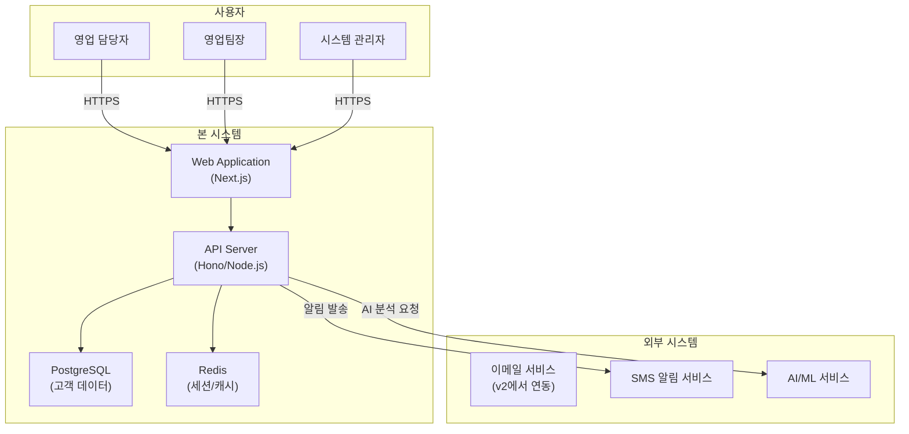

# 소프트웨어 요구사항 명세서 (SRS)

> Software Requirements Specification

---

## 문서 정보

| 항목 | 내용 |
|------|------|
| 프로젝트명 | VIVE CRM |
| 문서 번호 | SRS-001 |
| 버전 | 1.0.0 |
| 작성일 | 2026-02-24 |
| 작성자 | 조훈상 / 기획·개발 |
| 보안 등급 | 공개 |

---

## 변경 이력

| 버전 | 날짜 | 변경 내용 | 작성자 | 승인자 |
|------|------|-----------|--------|--------|
| 0.1 | 2026-02-24 | 초안 작성 | 조훈상 | - |
| 1.0 | 2026-02-24 | 최종 승인 | 조훈상 | 조훈상 |

---

## 목차

1. [문서 개요](#1-문서-개요)
2. [전체 시스템 설명](#2-전체-시스템-설명)
3. [기능 요구사항](#3-기능-요구사항)
4. [비기능 요구사항](#4-비기능-요구사항)
5. [외부 인터페이스 요구사항](#5-외부-인터페이스-요구사항)
6. [데이터 요구사항](#6-데이터-요구사항)
7. [제약 조건](#7-제약-조건)
8. [승인 내역](#8-승인-내역)

---

## 1. 문서 개요

### 1.1 목적

본 문서는 **VIVE CRM** 시스템의 소프트웨어 요구사항을 정의한다. 개발팀, 기획팀, QA팀, 운영팀 등 프로젝트 이해관계자가 시스템에 대한 동일한 이해를 가지도록 하는 것을 목적으로 한다.

본 문서는 다음 용도로 활용된다:

- 개발 범위 및 기능의 명확한 정의
- 설계, 구현, 테스트의 기준 문서
- 요구사항 추적(RTM)의 기반 문서
- 이해관계자 간 합의 및 승인의 근거

### 1.2 범위

본 문서에서 다루는 시스템의 범위는 다음과 같다:

- **포함 범위**: 
  - 고객(리드/연락처) 관리 기능
  - 영업 파이프라인(딜) 관리 기능
  - AI 기반 리드 스코어링 및 다음 행동 추천
  - 활동(이메일, 전화, 미팅, 메모) 추적
  - 작업/알림 관리
  - 대시보드 및 리포트
  - 사용자 인증 및 계정 관리

- **제외 범위**: 
  - 이메일 서비스 통합(Gmail/Outlook 연동)
  - 웹폼/리드 캡처 기능
  - 팀 협업 기능(할당, 언급)
  - 모바일 네이티브 앱
  - 외부 API 연동

시스템의 주요 목표:

1. 영업팀의 고객 관리 효율성 향상
2. AI 기반 인사이트로 매출 전환율 개선
3. 직관적인 UX로 낮은 학습 곡선 제공

### 1.3 용어 정의

| 용어 | 정의 |
|------|------|
| SRS | Software Requirements Specification. 소프트웨어 요구사항 명세서 |
| RTM | Requirements Traceability Matrix. 요구사항 추적 매트릭스 |
| FR | Functional Requirement. 기능 요구사항 |
| NFR | Non-Functional Requirement. 비기능 요구사항 |
| UC | Use Case. 유스케이스 |
| API | Application Programming Interface |
| SLA | Service Level Agreement. 서비스 수준 협약 |
| RBAC | Role-Based Access Control. 역할 기반 접근 제어 |
| JWT | JSON Web Token |
| CRUD | Create, Read, Update, Delete |
| CI/CD | Continuous Integration / Continuous Deployment |
| 리드(Lead) | 잠재 고객 |
| 딜(Deal) | 영업 기회 |
| 파이프라인(Pipeline) | 영업 단계의 시각적 흐름 |
| 스테이지(Stage) | 파이프라인의 각 단계 |

### 1.4 참고 문서

| 문서명 | 버전 | 비고 |
|--------|------|------|
| 서비스 기획서 | v1.0 | 프로젝트 배경 및 목표 |
| 유스케이스 명세서 | v1.0 | UC 상세 시나리오 |
| 요구사항 추적 매트릭스 (RTM) | v0.1 | 요구사항 추적 |
| 화면 설계서 (Wireframe) | v1.0 | UI/UX 참조 |

### 1.5 우선순위 정의

본 문서에서 사용하는 요구사항 우선순위 기준은 다음과 같다:

| 등급 | 라벨 | 정의 |
|------|------|------|
| P1 | 필수 (Must) | 반드시 구현해야 하는 핵심 기능. 미구현 시 시스템 출시 불가 |
| P2 | 권장 (Should) | 구현이 강력히 권장되는 기능. 일정에 따라 조정 가능 |
| P3 | 선택 (Could) | 구현하면 좋으나 필수는 아닌 기능. 후속 릴리스로 이관 가능 |
| P4 | 제외 (Won't) | 현재 범위에서 명시적으로 제외하는 기능 |

---

## 2. 전체 시스템 설명

### 2.1 시스템 관점도

### 2.2 사용자 유형 및 특성

| Actor ID | 사용자 유형 | 설명 | 권한 수준 | 사용 빈도 | 기술 숙련도 |
|----------|-------------|------|-----------|-----------|-------------|
| ACT-01 | 영업 담당자 | 일일 고객 관리, 활동 기록 | 기본 | 매일 | 초~중급 |
| ACT-02 | 영업팀장 | 팀 현황 모니터링, 리포트 확인 | 관리 | 매일 | 중~고급 |
| ACT-03 | 시스템 관리자 | 시스템 설정, 사용자 관리 | 최고 | 필요 시 | 고급 |
| ACT-04 | 마케팅 담당자 | 리드 수집 현황 확인 | 기본 | 주 2~3회 | 중급 |
| ACT-05 | 외부 시스템 | API를 통해 연동하는 외부 시스템 | API 전용 | 상시 | - |

### 2.3 운영 환경

#### 2.3.1 하드웨어 환경

| 구분 | 사양 | 비고 |
|------|------|------|
| Application Server | 2 vCPU, 4GB RAM, 50GB SSD | Railway/Fly.io 기준 |
| Database Server | 관리형 PostgreSQL (Supabase/Neon) | Free Tier ~ Pro Tier |
| Cache Server | 관리형 Redis (Upstash) | Free Tier |

#### 2.3.2 소프트웨어 환경

| 구분 | 기술 스택 | 버전 | 비고 |
|------|-----------|------|------|
| OS | Ubuntu Linux | 22.04 LTS | |
| Runtime | Node.js | 20.x | |
| Framework | Next.js (Frontend), Hono (Backend) | 14+, 4.x | |
| Database | PostgreSQL | 15+ | |
| Cache | Redis | 7.x | |
| Container | Docker | - | 로컬 개발용 |
| CI/CD | GitHub Actions | - | |

#### 2.3.3 클라이언트 환경

| 구분 | 지원 범위 | 비고 |
|------|-----------|------|
| 데스크톱 브라우저 | Chrome, Firefox, Safari, Edge 최신 2버전 | |
| 모바일 브라우저 | iOS Safari 15+, Android Chrome | 반응형 웹 |
| 최소 해상도 | 1280x720 | 반응형 웹 |
| 모바일 앱 | 미지원 (v2에서 검토) | |

### 2.4 제약사항

1. 월 운영 비용 $100 이내로 제한 (MVP 단계)
2. 1인 개발 리소스로 개발 및 운영
3. 국내 데이터 보호법(개인정보보호법) 준수
4. 2026년 Q2 내 MVP 출시 필요

### 2.5 가정 및 전제 조건

1. 사용자는 안정적인 인터넷 환경에서 시스템을 사용한다
2. 초기 사용자 수는 1,000명 이하로 예상한다
3. AI/ML 서비스는 외부 API(OpenAI 등)를 활용한다
4. 프로젝트 기간 중 요구사항의 대규모 변경은 없다

---

## 3. 기능 요구사항

### 3.1 기능 요구사항 요약 목록

| FR-ID | 기능명 | 설명 | 우선순위 | 관련 UC | 상태 |
|-------|--------|------|----------|---------|------|
| FR-001 | 회원가입/로그인 | 이메일 기반 회원가입 및 인증 | P1 필수 | UC-001 | 초안 |
| FR-002 | 고객(연락처) 관리 | 고객 정보 CRUD, 태그 관리 | P1 필수 | UC-002 | 초안 |
| FR-003 | 딜(영업기회) 관리 | 파이프라인 보드, 딜 CRUD | P1 필수 | UC-003 | 초안 |
| FR-004 | AI 리드 스코어링 | 고객 데이터 기반 자동 평가 | P1 필수 | UC-004 | 초안 |
| FR-005 | 다음 행동 추천 | AI 기반 행동 제안 | P1 필수 | UC-005 | 초안 |
| FR-006 | 활동 추적 | 이메일, 전화, 미팅, 메모 기록 | P1 필수 | UC-006 | 초안 |
| FR-007 | 작업/알림 | 후속 조치 등록, 알림 | P1 필수 | UC-007 | 초안 |
| FR-008 | 대시보드 | 핵심 지표, 파이프라인 현황 | P2 권장 | UC-008 | 초안 |
| FR-009 | 리포트 | 주간/월간 성과 리포트 | P2 권장 | UC-009 | 초안 |

---

### 3.2 FR-001: 회원가입/로그인

| 항목 | 내용 |
|------|------|
| **FR-ID** | FR-001 |
| **기능명** | 회원가입/로그인 |
| **설명** | 사용자가 이메일과 비밀번호를 통해 시스템에 회원가입하고 로그인할 수 있다. |
| **우선순위** | P1 필수 |
| **연관 기능** | FR-002 ~ FR-009 |
| **관련 UC** | UC-001 |

#### 입력

| 필드명 | 타입 | 필수 여부 | 유효성 검증 규칙 |
|--------|------|-----------|------------------|
| 이메일 | String | 필수 | 이메일 형식, 고유해야 함 |
| 비밀번호 | String | 필수 | 최소 8자, 영문/숫자/특수문자 포함 |
| 비밀번호 확인 | String | 필수 | 비밀번호와 일치 |
| 이름 | String | 필수 | 2~50자 |
| 회사명 | String | 선택 | 최대 100자 |

#### 처리 로직

1. 이메일 중복 확인
2. 비밀번호 해싱(bcrypt) 후 저장
3. JWT Access Token 및 Refresh Token 발급
4. 환영 이메일 발송

#### 출력

| 상황 | 응답 | HTTP Status |
|------|------|-------------|
| 성공 | 회원가입/로그인 완료, Access Token, Refresh Token 발급 | 200 OK / 201 Created |
| 유효성 검증 실패 | 필드별 오류 메시지 | 400 Bad Request |
| 중복 이메일 | "이미 등록된 이메일입니다" | 409 Conflict |
| 서버 오류 | 일반 오류 메시지 | 500 Internal Server Error |

---

### 3.3 FR-002: 고객(연락처) 관리

| 항목 | 내용 |
|------|------|
| **FR-ID** | FR-002 |
| **기능명** | 고객(연락처) 관리 |
| **설명** | 고객 정보를 등록, 조회, 수정, 삭제하고 태그로 분류할 수 있다. |
| **우선순위** | P1 필수 |
| **연관 기능** | FR-004, FR-005, FR-006 |
| **관련 UC** | UC-002 |

#### 입력 (등록/수정)

| 필드명 | 타입 | 필수 여부 | 유효성 검증 규칙 |
|--------|------|-----------|------------------|
| 이름 | String | 필수 | 2~100자 |
| 이메일 | String | 선택 | 이메일 형식 |
| 전화번호 | String | 선택 | 전화번호 형식 |
| 회사명 | String | 선택 | 최대 200자 |
| 직책 | String | 선택 | 최대 100자 |
| 소스 | Enum | 선택 | 웹사이트, 추천, 광고, 기타 |
| 태그 | String[] | 선택 | 최대 10개 |
| 메모 | Text | 선택 | 최대 5,000자 |

#### 처리 로직

1. 고객 데이터 유효성 검증
2. 중복 고객 검사 (이메일/전화번호 기준)
3. AI 리드 스코어 자동 계산 (FR-004 연동)
4. 고객 타임라인에 "등록" 활동 자동 기록

#### 출력

| 상황 | 응답 | HTTP Status |
|------|------|-------------|
| 등록 성공 | 생성된 고객 정보 | 201 Created |
| 목록 조회 성공 | 고객 목록 (페이지네이션) | 200 OK |
| 상세 조회 성공 | 고객 상세 정보 + 타임라인 | 200 OK |
| 수정 성공 | 수정된 고객 정보 | 200 OK |
| 삭제 성공 | 삭제 확인 메시지 | 200 OK |

#### 비고

- CSV 일괄 등록 지원
- 고객당 최대 100개 활동 저장
- 소프트 삭제 적용

---

### 3.4 FR-003: 딜(영업기회) 관리

| 항목 | 내용 |
|------|------|
| **FR-ID** | FR-003 |
| **기능명** | 딜(영업기회) 관리 |
| **설명** | 영업 기회를 파이프라인 보드로 관리하고 단계별로 추적한다. |
| **우선순위** | P1 필수 |
| **연관 기능** | FR-002, FR-006, FR-007 |
| **관련 UC** | UC-003 |

#### 파이프라인 스테이지

| 단계 | 코드 | 설명 |
|------|------|------|
| 리드 | lead | 잠재 고객 |
| 기회 | opportunity | 영업 기회 확인 |
| 제안 | proposal | 견적/제안 단계 |
| 협상 | negotiation | 협상/계약 조율 |
| 계약 | closed_won | 계약 체결 |
| 실패 | closed_lost | 영업 실패 |

#### 입력 (등록/수정)

| 필드명 | 타입 | 필수 여부 | 유효성 검증 규칙 |
|--------|------|-----------|------------------|
| 딜명 | String | 필수 | 1~200자 |
| 고객 ID | UUID | 필수 | 유효한 고객 ID |
| 금액 | Decimal | 선택 | 0 이상 |
| 예상 마감일 | Date | 선택 | 미래 날짜 |
| 스테이지 | Enum | 필수 | 파이프라인 단계 중 하나 |
| 확률 | Integer | 선택 | 0~100% |
| 메모 | Text | 선택 | 최대 5,000자 |

#### 출력

| 상황 | 응답 | HTTP Status |
|------|------|-------------|
| 등록 성공 | 생성된 딜 정보 | 201 Created |
| 파이프라인 조회 | 스테이지별 딜 목록 (칸반 형태) | 200 OK |
| 단계 이동 성공 | 업데이트된 딜 정보 | 200 OK |

#### 비고

- 드래그앤드롭으로 스테이지 이동 가능
- 딜 금액으로 예상 매출 계산

---

### 3.5 FR-004: AI 리드 스코어링

| 항목 | 내용 |
|------|------|
| **FR-ID** | FR-004 |
| **기능명** | AI 리드 스코어링 |
| **설명** | 고객 데이터를 분석하여 구매 가능성을 0~100점으로 자동 평가한다. |
| **우선순위** | P1 필수 |
| **연관 기능** | FR-002 |
| **관련 UC** | UC-004 |

#### 스코어 계산 기준

| 요소 | 가중치 | 설명 |
|------|--------|------|
| 기본 정보 완성도 | 20% | 필수 필드 입력 여부 |
| 소스 | 15% | 고품질 소스(추천, 웹사이트) 가중 |
| 활동 이력 | 25% | 최근 활동 빈도 및 반응 |
| 딜 이력 | 25% | 과거 딜 진행 여부 및 결과 |
| 업종/규모 | 15% | 타겟 업종 및 규모 일치도 |

#### 출력

| 상황 | 응답 | HTTP Status |
|------|------|-------------|
| 스코어 계산 성공 | 스코어(0~100) + 등급(A/B/C/D) | 200 OK |

#### 비고

- 고객 등록/수정 시 자동 재계산
- 80점 이상: A등급(높음), 60~79: B등급(중간), 40~59: C등급(낮음), 40미만: D등급(매우낮음)

---

### 3.6 FR-005: 다음 행동 추천

| 항목 | 내용 |
|------|------|
| **FR-ID** | FR-005 |
| **기능명** | 다음 행동 추천 |
| **설명** | AI가 고객 상태를 분석하여 최적의 다음 행동과 시기를 제안한다. |
| **우선순위** | P1 필수 |
| **연관 기능** | FR-002, FR-004 |
| **관련 UC** | UC-005 |

#### 추천 행동 유형

| 유형 | 설명 | 조건 |
|------|------|------|
| 이메일 발송 | 맞춤 이메일 제안 | 마지막 연락 3일 이상 |
| 전화 연락 | 통화 제안 | 고객이 이메일 미오픈, 긴급 딜 |
| 미팅 제안 | 온/오프라인 미팅 | 제안 단계 이상 |
| 제안서 전달 | 견적/제안서 | 기회 단계, 정보 충분 |
| 휴식 | 연락 보류 | 최근에 연락함, 거절 표시 |

#### 출력

| 상황 | 응답 | HTTP Status |
|------|------|-------------|
| 추천 성공 | 추천 행동 + 우선순위 + 권장 시기 | 200 OK |

#### 비고

- 매일 아침 "오늘의 추천 행동" 목록 생성
- 사용자가 행동 완료 시 피드백 수집하여 추천 정확도 개선

---

### 3.7 FR-006: 활동 추적

| 항목 | 내용 |
|------|------|
| **FR-ID** | FR-006 |
| **기능명** | 활동 추적 |
| **설명** | 고객과의 모든 터치포인트(이메일, 전화, 미팅, 메모)를 기록한다. |
| **우선순위** | P1 필수 |
| **연관 기능** | FR-002, FR-003 |
| **관련 UC** | UC-006 |

#### 활동 유형

| 유형 | 설명 | 입력 필드 |
|------|------|-----------|
| 이메일 | 이메일 발송/수신 기록 | 제목, 내용, 발송/수신 여부 |
| 전화 | 통화 기록 | 통화 유형(발신/수신), 통화 시간, 메모 |
| 미팅 | 미팅 기록 | 미팅 유형(온/오프라인), 장소, 참석자, 메모 |
| 메모 | 자유 메모 | 내용 |
| 딜 이동 | 파이프라인 단계 변경 | 이전 단계, 새 단계, 변경 사유 |

#### 출력

| 상황 | 응답 | HTTP Status |
|------|------|-------------|
| 등록 성공 | 생성된 활동 정보 | 201 Created |
| 타임라인 조회 | 활동 목록 (시간순) | 200 OK |

---

### 3.8 FR-007: 작업/알림

| 항목 | 내용 |
|------|------|
| **FR-ID** | FR-007 |
| **기능명** | 작업/알림 |
| **설명** | 후속 조치를 작업으로 등록하고 알림을 받는다. |
| **우선순위** | P1 필수 |
| **연관 기능** | FR-002, FR-003 |
| **관련 UC** | UC-007 |

#### 입력

| 필드명 | 타입 | 필수 여부 | 유효성 검증 규칙 |
|--------|------|-----------|------------------|
| 작업명 | String | 필수 | 1~200자 |
| 고객 ID | UUID | 선택 | 연관 고객 |
| 딜 ID | UUID | 선택 | 연관 딜 |
| 마감일 | DateTime | 선택 | 미래 시점 |
| 우선순위 | Enum | 선택 | 높음/중간/낮음 |
| 메모 | Text | 선택 | 최대 1,000자 |

#### 알림 채널

| 채널 | 설명 | MVP 포함 |
|------|------|----------|
| 인앱 알림 | 웹사이트 내 알림 | Y |
| 이메일 알림 | 이메일 발송 | Y |
| 브라우저 푸시 | Push Notification | N (v2) |
| SMS 알림 | 문자 메시지 | N (v2) |

---

### 3.9 FR-008: 대시보드

| 항목 | 내용 |
|------|------|
| **FR-ID** | FR-008 |
| **기능명** | 대시보드 |
| **설명** | 핵심 영업 지표와 파이프라인 현황을 시각화하여 제공한다. |
| **우선순위** | P2 권장 |
| **연관 기능** | FR-002, FR-003 |
| **관련 UC** | UC-008 |

#### 표시 지표

| 지표 | 설명 |
|------|------|
| 총 고객 수 | 전체 등록 고객 |
| 신규 고객(주간) | 이번 주 신규 등록 |
| 파이프라인별 금액 | 각 스테이지의 예상 금액 합계 |
| 이번 달 예상 매출 | 계약 예상 딜 금액 |
| 미완료 작업 | 완료되지 않은 작업 수 |
| AI 추천 행동 | 오늘 추천된 행동 수 |

---

### 3.10 FR-009: 리포트

| 항목 | 내용 |
|------|------|
| **FR-ID** | FR-009 |
| **기능명** | 리포트 |
| **설명** | 주간/월간 영업 성과 리포트를 생성한다. |
| **우선순위** | P2 권장 |
| **연관 기능** | FR-006, FR-008 |
| **관련 UC** | UC-009 |

#### 리포트 항목

| 항목 | 설명 |
|------|------|
| 활동 요약 | 유형별 활동 건수 |
| 파이프라인 변화 | 스테이지별 딜 이동 현황 |
| 성공률 | 계약 체결율 |
| 평균 영업 사이클 | 리드 → 계약 평균 소요 기간 |
| 리드 스코어 분포 | A/B/C/D 등급별 고객 수 |

---

## 4. 비기능 요구사항

### 4.1 비기능 요구사항 요약 목록

| NFR-ID | 분류 | 요구사항명 | 목표 수치 | 우선순위 |
|--------|------|-----------|-----------|----------|
| NFR-001 | 성능 | API 응답시간 | < 500ms (P95) | P1 필수 |
| NFR-002 | 성능 | 동시 사용자 처리 | 100명 CCU | P1 필수 |
| NFR-003 | 보안 | 인증/인가 | JWT + RBAC | P1 필수 |
| NFR-004 | 보안 | 데이터 암호화 | TLS 1.2+ | P1 필수 |
| NFR-005 | 보안 | 감사 로깅 | 전수 기록 | P1 필수 |
| NFR-006 | 가용성 | 업타임 목표 | 99.5% | P1 필수 |
| NFR-007 | 확장성 | 수평 확장 | 향후 고려 | P2 권장 |
| NFR-008 | 유지보수성 | 코드 품질 | 테스트 커버리지 70%+ | P2 권장 |

---

## 5. 외부 인터페이스 요구사항

### 5.1 사용자 인터페이스 (UI)

#### 5.1.1 UI 일반 원칙

| 항목 | 요구사항 |
|------|----------|
| 디자인 시스템 | shadcn/ui 기반 |
| 접근성 (Accessibility) | WCAG 2.1 Level AA 준수 |
| 국제화 (i18n) | 한국어 (단일 언어) |
| 다크 모드 | 미지원 (v2에서 검토) |
| 로딩 상태 | 모든 비동기 작업에 로딩 인디케이터 표시 |
| 오류 표시 | 사용자 친화적 오류 메시지, 기술적 상세 미노출 |

#### 5.1.2 주요 화면 목록

| 화면 ID | 화면명 | 설명 | 관련 FR |
|---------|--------|------|---------|
| SCR-01 | 로그인/회원가입 | 이메일 인증 | FR-001 |
| SCR-02 | 대시보드 | 핵심 지표 요약 | FR-008 |
| SCR-03 | 고객 목록 | 고객 관리 | FR-002 |
| SCR-04 | 고객 상세 | 프로필 + 타임라인 | FR-002, FR-006 |
| SCR-05 | 파이프라인 | 칸반 보드 | FR-003 |
| SCR-06 | 작업 목록 | 할 일 관리 | FR-007 |
| SCR-07 | 리포트 | 성과 리포트 | FR-009 |
| SCR-08 | 설정 | 프로필, 알림 설정 | FR-001 |

### 5.2 API 인터페이스

#### 5.2.1 API 일반 규격

| 항목 | 내용 |
|------|------|
| 프로토콜 | HTTPS (TLS 1.2+) |
| 아키텍처 스타일 | REST |
| 데이터 형식 | JSON (Content-Type: application/json) |
| 인증 방식 | Bearer Token (JWT) |
| API 문서 | OpenAPI 3.0 (Swagger) |
| Base URL | /api/v1 |

---

## 6. 데이터 요구사항

### 6.1 데이터 엔티티 개요

| 엔티티 | 설명 | 주요 속성 |
|--------|------|-----------|
| User | 사용자 계정 | id, email, name, password_hash |
| Contact | 고객(연락처) | id, name, email, phone, company, lead_score |
| Deal | 영업 기회 | id, title, amount, stage, probability |
| Activity | 활동 기록 | id, type, contact_id, deal_id, content |
| Task | 작업/할일 | id, title, due_date, priority, status |
| Tag | 태그 | id, name, color |

### 6.2 데이터 보존 정책

| 데이터 유형 | 보존 기간 | 삭제 정책 |
|------------|-----------|-----------|
| 사용자 계정 | 탈퇴 후 30일 | 30일 후 완전 삭제 |
| 고객 데이터 | 계정 삭제 시 함께 삭제 | 소프트 삭제 후 30일 후 완전 삭제 |
| 활동 로그 | 계정 삭제 시 함께 삭제 | 동일 |
| 감사 로그 | 2년 | 법적 요구사항 준수 |

---

## 7. 제약 조건

### 7.1 기술적 제약

| 제약 | 설명 | 대응 |
|------|------|------|
| 월 $100 예산 | 인프라 비용 제한 | 무료 티어 활용, 효율적 쿼리 |
| 1인 개발 | 개발 리소스 제한 | MVP 스코프 엄격 관리 |
| 서버리스 환경 | 상태 비저장 설계 필요 | JWT 기반 인증, 외부 세션 저장소 |

### 7.2 법적 제약

| 제약 | 설명 | 대응 |
|------|------|------|
| 개인정보보호법 | 고객 개인정보 보호 | 암호화, 접근 로그, 최소 수집 |
| 이메일 마케팅법 | 스팸 방지 | opt-in 확인, 수신 거부 기능 |

---

## 8. 승인 내역

| 역할 | 이름 | 서명 | 날짜 |
|------|------|------|------|
| 기획 책임자 | 조훈상 | | 2026-02-24 |
| 개발 책임자 | 조훈상 | | 2026-02-24 |
