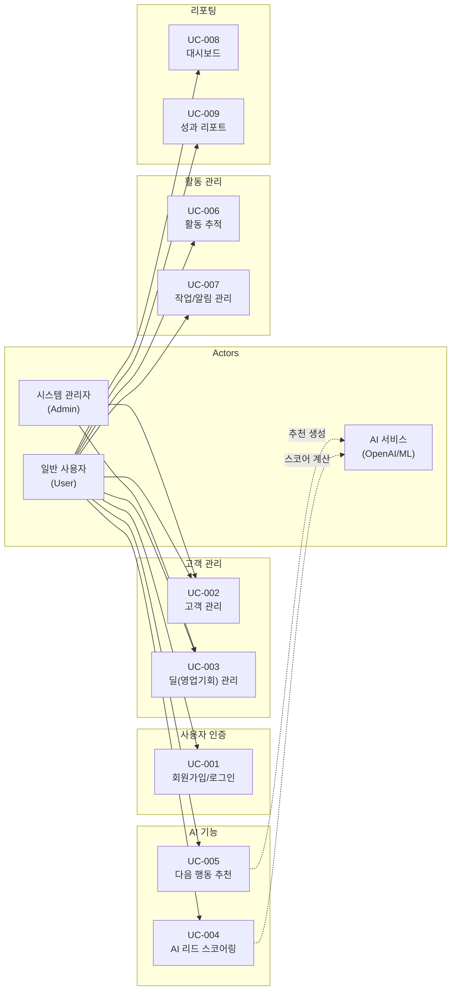
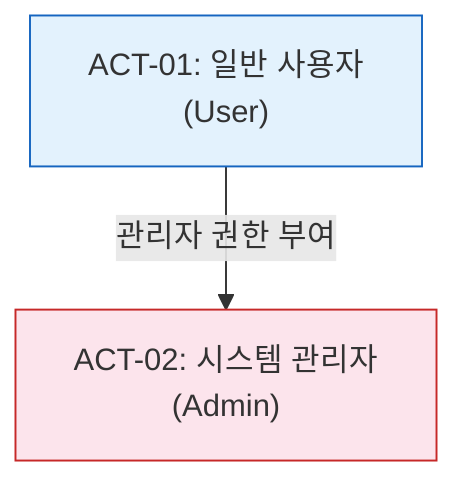

# 유스케이스 명세서

> Use Case Specification

---
## 문서 정보

| 항목 | 내용 |
|------|------|
| 프로젝트명 | VIVE CRM |
| 문서 번호 | UCS-001 |
| 버전 | 1.0.0 |
| 작성일 | 2026-02-24 |
| 작성자 | 권영해 / 기획·개발 |

---

> **용어 규칙:** 본 문서는 [`용어규칙.md`](./용어규칙.md)의 표기 원칙과 용어 사전을 준수한다. 새로운 용어 사용 시 반드시 해당 문서에 먼저 등록한다.

---

## 변경 이력

| 버전 | 날짜 | 변경 내용 | 작성자 | 승인자 |
|------|------|-----------|--------|--------|
| 0.1 | 2026-02-24 | 초안 작성 — 서비스기획안 기반 9개 유스케이스 도출 | 권영해 | - |
| 1.0 | 2026-02-24 | 전체 유스케이스 상세 명세 완료 | 권영해 | 권영해 |

---

## 목차

1. [유스케이스 다이어그램](#1-유스케이스-다이어그램)
2. [액터 정의](#2-액터-정의)
3. [유스케이스 목록](#3-유스케이스-목록)
4. [유스케이스 상세 명세](#4-유스케이스-상세-명세)

---

## 1. 유스케이스 다이어그램

### 1.1 전체 시스템 유스케이스 다이어그램

---

## 2. 액터 정의

### 2.1 주요 액터 (Primary Actors)

| Actor ID | 이름 | 설명 | 권한 수준 | 인증 여부 |
|----------|------|------|-----------|-----------|
| ACT-01 | 일반 사용자 (User) | 영업 담당자, 영업팀장 등 CRM을 사용하는 일반 사용자 | Level 1 (기본) | 인증됨 |
| ACT-02 | 시스템 관리자 (Admin) | 시스템 전반의 관리 권한을 가진 사용자 | Level 3 (최고) | 인증됨 |

### 2.2 보조 액터 (Secondary Actors)

| Actor ID | 이름 | 설명 | 연동 방식 |
|----------|------|------|-----------|
| ACT-S01 | AI 서비스 (OpenAI/ML) | 리드 스코어링 및 다음 행동 추천을 생성하는 외부 AI 서비스 | REST API |
| ACT-S02 | 이메일 서비스 | 알림 이메일 발송 서비스 | SMTP/API |

### 2.3 액터 계층 구조

---

## 3. 유스케이스 목록

| UC-ID | 유스케이스명 | 주요 액터 | 우선순위 | 상태 | 관련 MVP 항목 |
|-------|-------------|-----------|----------|------|---------------|
| UC-001 | 회원가입/로그인 | 일반 사용자 | P1 | 완료 | MVP-007 |
| UC-002 | 고객 관리 | 일반 사용자 | P1 | 완료 | MVP-001 |
| UC-003 | 딜(영업기회) 관리 | 일반 사용자 | P1 | 완료 | MVP-002 |
| UC-004 | AI 리드 스코어링 | 일반 사용자 | P1 | 완료 | MVP-003 |
| UC-005 | 다음 행동 추천 | 일반 사용자 | P1 | 완료 | MVP-004 |
| UC-006 | 활동 추적 | 일반 사용자 | P1 | 완료 | MVP-005 |
| UC-007 | 작업/알림 관리 | 일반 사용자 | P1 | 완료 | MVP-006 |
| UC-008 | 대시보드 | 일반 사용자 | P2 | 완료 | MVP-008 |
| UC-009 | 성과 리포트 | 일반 사용자 | P2 | 완료 | MVP-009 |

**상태 정의:**

| 상태 | 설명 |
|------|------|
| 초안 | 최초 작성, 검토 필요 |
| 검토중 | 이해관계자 검토 진행 중 |
| 완료 | 검토 완료 및 승인됨 |
| 변경중 | 승인 후 변경 사항 발생 |

---

## 4. 유스케이스 상세 명세

---

### 4.1 UC-001: 회원가입/로그인

| 항목 | 내용 |
|------|------|
| **UC-ID** | UC-001 |
| **유스케이스명** | 회원가입/로그인 |
| **액터** | 일반 사용자 (User) |
| **설명** | 사용자가 이메일과 비밀번호로 회원가입하고 로그인하여 서비스를 이용할 수 있다. |
| **우선순위** | P1 |
| **트리거** | 사용자가 서비스 접속 후 로그인이 필요한 기능 사용 시 |
| **관련 요구사항** | FR-001, MVP-007 |

#### 사전 조건 (Pre-conditions)

1. 사용자는 시스템에 로그인하지 않은 상태이다.
2. 회원가입 시 유효한 이메일 주소를 보유하고 있다.

#### 기본 흐름 (Main Flow)

| 단계 | 액터 | 시스템 |
|------|------|--------|
| 1 | 사용자가 로그인/회원가입 페이지에 접근한다. | 이메일/비밀번호 입력 폼을 표시한다. |
| 2 | (회원가입) 사용자가 이메일, 비밀번호, 이름을 입력하고 [가입하기]를 클릭한다. | - |
| 3 | - | 입력값 유효성을 검증하고, 중복 이메일 여부를 확인한다. |
| 4 | - | 계정을 생성하고 JWT 토큰을 발급한다. |
| 5 | (로그인) 사용자가 이메일, 비밀번호를 입력하고 [로그인]을 클릭한다. | - |
| 6 | - | 인증 정보를 검증하고 JWT 토큰을 발급한다. |
| 7 | - | 대시보드 페이지로 리다이렉트한다. |

#### 예외 흐름 (Exception Flow)

**EF-001-01: 중복 이메일**

- 회원가입 시 이미 등록된 이메일인 경우
- "이미 등록된 이메일입니다. 로그인해주세요." 메시지를 표시한다.

**EF-001-02: 로그인 실패**

- 이메일 또는 비밀번호가 일치하지 않는 경우
- "이메일 또는 비밀번호가 일치하지 않습니다." 메시지를 표시한다.

#### 사후 조건 (Post-conditions)

**성공 시:**

1. 사용자에게 유효한 Access Token과 Refresh Token이 발급되어 있다.
2. 로그인 이력이 기록되어 있다.
3. 사용자가 인증된 상태로 대시보드에 접근한 상태이다.

#### 비즈니스 규칙

| 규칙 ID | 내용 |
|---------|------|
| BR-001-01 | 이메일은 시스템 내에서 고유해야 한다 |
| BR-001-02 | 비밀번호는 최소 8자, 영문/숫자/특수문자를 포함해야 한다 |
| BR-001-03 | Access Token 유효기간: 1시간 |
| BR-001-04 | Refresh Token 유효기간: 14일 |

---

### 4.2 UC-002: 고객 관리

| 항목 | 내용 |
|------|------|
| **UC-ID** | UC-002 |
| **유스케이스명** | 고객 관리 |
| **액터** | 일반 사용자 (User) |
| **설명** | 고객 정보를 등록, 조회, 수정, 삭제하고 태그로 분류할 수 있다. AI 리드 스코어가 자동 계산된다. |
| **우선순위** | P1 |
| **트리거** | 사용자가 고객 메뉴를 클릭하거나 새로운 고객을 등록하려 할 때 |
| **관련 요구사항** | FR-002, MVP-001 |

#### 사전 조건 (Pre-conditions)

1. 사용자는 로그인한 상태이다.

#### 기본 흐름 (Main Flow) — 고객 등록

| 단계 | 액터 | 시스템 |
|------|------|--------|
| 1 | 사용자가 [고객 등록] 버튼을 클릭한다. | 고객 등록 폼을 표시한다. |
| 2 | 사용자가 이름, 이메일, 전화번호 등 정보를 입력한다. | - |
| 3 | 사용자가 [저장] 버튼을 클릭한다. | - |
| 4 | - | 입력값 유효성을 검증한다. |
| 5 | - | AI 리드 스코어를 자동 계산한다 (UC-004). |
| 6 | - | 고객을 저장하고 타임라인에 "등록" 활동을 기록한다. |
| 7 | - | 고객 상세 페이지로 이동한다. |

#### 대안 흐름 (Alternative Flow)

**AF-002-01: CSV 일괄 등록**

- 단계 1에서 사용자가 [CSV 업로드]를 선택한다.
- CSV 파일을 업로드하고 매핑 정보를 확인한다.
- 일괄 등록 결과(성공/실패 건수)를 표시한다.

#### 사후 조건 (Post-conditions)

**성공 시:**

1. 새로운 고객이 데이터베이스에 저장되어 있다.
2. AI 리드 스코어가 계산되어 저장되어 있다.
3. 타임라인에 등록 활동이 기록되어 있다.

#### 비즈니스 규칙

| 규칙 ID | 내용 |
|---------|------|
| BR-002-01 | 고객명은 필수 입력 항목이다 |
| BR-002-02 | 이메일/전화번호 중복 시 경고를 표시한다 |
| BR-002-03 | 무료 플랜은 최대 100명 고객 등록 가능하다 |
| BR-002-04 | 고객 삭제는 소프트 삭제로 처리한다 |

---

### 4.3 UC-003: 딜(영업기회) 관리

| 항목 | 내용 |
|------|------|
| **UC-ID** | UC-003 |
| **유스케이스명** | 딜(영업기회) 관리 |
| **액터** | 일반 사용자 (User) |
| **설명** | 영업 기회를 파이프라인 보드로 관리하고 단계별로 추적한다. |
| **우선순위** | P1 |
| **트리거** | 사용자가 파이프라인 메뉴를 클릭하거나 새로운 딜을 등록할 때 |
| **관련 요구사항** | FR-003, MVP-002 |

#### 사전 조건 (Pre-conditions)

1. 사용자는 로그인한 상태이다.
2. 딜을 연결할 고객이 등록되어 있다.

#### 기본 흐름 (Main Flow)

| 단계 | 액터 | 시스템 |
|------|------|--------|
| 1 | 사용자가 파이프라인 페이지에 접근한다. | 칸반 보드 형태의 파이프라인을 표시한다. |
| 2 | 사용자가 [딜 등록] 버튼을 클릭한다. | 딜 등록 폼을 표시한다. |
| 3 | 사용자가 딜명, 고객, 금액, 스테이지 등을 입력한다. | - |
| 4 | - | 딜을 저장하고 해당 스테이지에 표시한다. |
| 5 | 사용자가 딜 카드를 드래그하여 다른 스테이지로 이동한다. | - |
| 6 | - | 딜의 스테이지를 업데이트하고 타임라인에 기록한다. |

#### 사후 조건 (Post-conditions)

**성공 시:**

1. 딜이 데이터베이스에 저장되어 있다.
2. 파이프라인 보드에 표시된다.
3. 스테이지 변경 이력이 타임라인에 기록되어 있다.

#### 비즈니스 규칙

| 규칙 ID | 내용 |
|---------|------|
| BR-003-01 | 딜명은 필수 입력 항목이다 |
| BR-003-02 | 스테이지는 lead → opportunity → proposal → negotiation → closed_won/closed_lost 순으로 진행한다 |
| BR-003-03 | 계약 체결(closed_won) 시 예상 금액이 매출로 집계된다 |

---

### 4.4 UC-004: AI 리드 스코어링

| 항목 | 내용 |
|------|------|
| **UC-ID** | UC-004 |
| **유스케이스명** | AI 리드 스코어링 |
| **액터** | 일반 사용자 (User), AI 서비스 (Secondary) |
| **설명** | 고객 데이터를 AI로 분석하여 구매 가능성을 0~100점으로 자동 평가한다. |
| **우선순위** | P1 |
| **트리거** | 고객 등록/수정 시 자동 실행 |
| **관련 요구사항** | FR-004, MVP-003 |

#### 사전 조건 (Pre-conditions)

1. 고객이 등록되었거나 수정되었다.
2. AI 서비스가 정상 동작 중이다.

#### 기본 흐름 (Main Flow)

| 단계 | 액터 | 시스템 |
|------|------|--------|
| 1 | (트리거) 고객 등록/수정이 완료된다. | - |
| 2 | - | 고객 데이터를 AI 서비스로 전송한다. |
| 3 | - | AI가 다음을 분석한다: 정보 완성도, 소스, 활동 이력, 딜 이력 |
| 4 | - | 0~100점의 리드 스코어를 계산한다. |
| 5 | - | 등급을 산정한다: A(80~100), B(60~79), C(40~59), D(0~39) |
| 6 | - | 결과를 고객 데이터에 저장하고 표시한다. |

#### 예외 흐름 (Exception Flow)

**EF-004-01: AI 서비스 장애**

- AI 서비스 호출이 실패한 경우
- 기본 스코어(50점)를 부여하고 재시도를 예약한다.

#### 사후 조건 (Post-conditions)

**성공 시:**

1. 고객에게 리드 스코어와 등급이 부여되어 있다.
2. 스코어 기반으로 고객 목록 정렬이 가능하다.

#### 비즈니스 규칙

| 규칙 ID | 내용 |
|---------|------|
| BR-004-01 | 리드 스코어는 고객 데이터 변경 시 자동 재계산된다 |
| BR-004-02 | A등급 고객은 우선순위 대시보드에 표시된다 |
| BR-004-03 | 스코어 산출 기준은 운영자가 조정할 수 있다 (v2) |

---

### 4.5 UC-005: 다음 행동 추천

| 항목 | 내용 |
|------|------|
| **UC-ID** | UC-005 |
| **유스케이스명** | 다음 행동 추천 |
| **액터** | 일반 사용자 (User), AI 서비스 (Secondary) |
| **설명** | AI가 고객 상태를 분석하여 최적의 다음 행동(이메일, 전화, 미팅 등)과 시기를 제안한다. |
| **우선순위** | P1 |
| **트리거** | 사용자가 대시보드 접속 또는 고객 상세 페이지 조회 시 |
| **관련 요구사항** | FR-005, MVP-004 |

#### 사전 조건 (Pre-conditions)

1. 고객 데이터가 충분히 수집되어 있다.
2. AI 서비스가 정상 동작 중이다.

#### 기본 흐름 (Main Flow)

| 단계 | 액터 | 시스템 |
|------|------|--------|
| 1 | 사용자가 대시보드에 접속한다. | - |
| 2 | - | 각 고객의 최근 활동, 딜 상태, 리드 스코어를 분석한다. |
| 3 | - | AI가 다음 행동을 추천한다 (이메일/전화/미팅/휴식). |
| 4 | - | 우선순위를 계산하여 상위 5개를 "오늘의 추천"으로 표시한다. |
| 5 | 사용자가 추천된 행동을 확인하고 실행한다. | - |
| 6 | - | 행동 완료 피드백을 수집하여 추천 정확도를 개선한다. |

#### 사후 조건 (Post-conditions)

**성공 시:**

1. 사용자는 우선순위별 추천 행동 목록을 확인했다.
2. 행동 완료 여부가 시스템에 기록되었다.

#### 비즈니스 규칙

| 규칙 ID | 내용 |
|---------|------|
| BR-005-01 | 마지막 연락 3일 이상인 고객에게 연락 권장 |
| BR-005-02 | A등급 고객은 전화/미팅 우선 추천 |
| BR-005-03 | 거절 이력이 있는 고객은 휴식 기간(7일) 후 재추천 |

---

### 4.6 UC-006: 활동 추적

| 항목 | 내용 |
|------|------|
| **UC-ID** | UC-006 |
| **유스케이스명** | 활동 추적 |
| **액터** | 일반 사용자 (User) |
| **설명** | 고객과의 모든 터치포인트(이메일, 전화, 미팅, 메모)를 기록하고 타임라인으로 조회한다. |
| **우선순위** | P1 |
| **트리거** | 사용자가 활동을 기록하거나 고객 상세 페이지를 조회할 때 |
| **관련 요구사항** | FR-006, MVP-005 |

#### 사전 조건 (Pre-conditions)

1. 사용자는 로그인한 상태이다.
2. 활동을 기록할 고객이 등록되어 있다.

#### 기본 흐름 (Main Flow) — 활동 등록

| 단계 | 액터 | 시스템 |
|------|------|--------|
| 1 | 사용자가 고객 상세 페이지에서 [활동 추가]를 클릭한다. | 활동 유형 선택 모달을 표시한다. |
| 2 | 사용자가 활동 유형(이메일/전화/미팅/메모)을 선택한다. | 해당 유형의 입력 폼을 표시한다. |
| 3 | 사용자가 활동 내용을 입력하고 저장한다. | - |
| 4 | - | 활동을 저장하고 타임라인에 추가한다. |
| 5 | - | 관련 딜이 있으면 딜 타임라인에도 추가한다. |

#### 사후 조건 (Post-conditions)

**성공 시:**

1. 활동이 데이터베이스에 저장되어 있다.
2. 고객 타임라인에 표시된다.
3. 리드 스코어 재계산 트리거가 발생한다.

#### 비즈니스 규칙

| 규칙 ID | 내용 |
|---------|------|
| BR-006-01 | 모든 활동은 작성자와 시간이 자동 기록된다 |
| BR-006-02 | 활동은 수정 가능하나 삭제는 관리자만 가능하다 |
| BR-006-03 | 고객당 최대 100개 활동 저장 (초과 시 오래된 것부터 보관) |

---

### 4.7 UC-007: 작업/알림 관리

| 항목 | 내용 |
|------|------|
| **UC-ID** | UC-007 |
| **유스케이스명** | 작업/알림 관리 |
| **액터** | 일반 사용자 (User) |
| **설명** | 후속 조치를 작업으로 등록하고 마감일에 알림을 받는다. |
| **우선순위** | P1 |
| **트리거** | 사용자가 작업을 등록하거나 알림이 발생할 때 |
| **관련 요구사항** | FR-007, MVP-006 |

#### 사전 조건 (Pre-conditions)

1. 사용자는 로그인한 상태이다.

#### 기본 흐름 (Main Flow)

| 단계 | 액터 | 시스템 |
|------|------|--------|
| 1 | 사용자가 [작업 등록] 버튼을 클릭한다. | 작업 등록 폼을 표시한다. |
| 2 | 사용자가 작업명, 마감일, 우선순위 등을 입력한다. | - |
| 3 | - | 작업을 저장하고 알림을 예약한다. |
| 4 | (알림 시점) - | 인앱 알림과 이메일 알림을 발송한다. |
| 5 | 사용자가 작업을 완료 처리한다. | - |
| 6 | - | 작업 상태를 완료로 변경하고 알림을 취소한다. |

#### 사후 조건 (Post-conditions)

**성공 시:**

1. 작업이 등록되어 있다.
2. 알림이 예약되어 있다.
3. 작업 완료 시 상태가 업데이트되었다.

#### 비즈니스 규칙

| 규칙 ID | 내용 |
|---------|------|
| BR-007-01 | 마감일 당일 오전 9시에 알림 발송 |
| BR-007-02 | 우선순위 높음의 작업은 마감일 하루 전 추가 알림 |
| BR-007-03 | 완료되지 않은 작업은 다음 날까지 리마인더 |

---

### 4.8 UC-008: 대시보드

| 항목 | 내용 |
|------|------|
| **UC-ID** | UC-008 |
| **유스케이스명** | 대시보드 |
| **액터** | 일반 사용자 (User) |
| **설명** | 핵심 영업 지표와 파이프라인 현황을 한눈에 보여준다. |
| **우선순위** | P2 |
| **트리거** | 사용자가 로그인 후 메인 페이지 접속 또는 대시보드 메뉴 클릭 |
| **관련 요구사항** | FR-008, MVP-008 |

#### 표시 항목

| 위젯 | 내용 |
|------|------|
| KPI 카드 | 총 고객 수, 신규 고객(주간), 미완료 작업 수 |
| 파이프라인 요약 | 스테이지별 딜 수와 금액 |
| 오늘의 추천 | AI가 추천한 우선순위 행동 목록 |
| 리드 스코어 분포 | A/B/C/D 등급별 고객 수 차트 |

---

### 4.9 UC-009: 성과 리포트

| 항목 | 내용 |
|------|------|
| **UC-ID** | UC-009 |
| **유스케이스명** | 성과 리포트 |
| **액터** | 일반 사용자 (User) |
| **설명** | 주간/월간 영업 성과를 리포트 형태로 제공한다. |
| **우선순위** | P2 |
| **트리거** | 사용자가 리포트 메뉴를 클릭하거나 주간 알림 수신 |
| **관련 요구사항** | FR-009, MVP-009 |

#### 리포트 항목

| 항목 | 설명 |
|------|------|
| 활동 요약 | 유형별 활동 건수, 지난 주 대비 증감 |
| 파이프라인 변화 | 스테이지별 딜 이동, 신규/종료 딜 수 |
| 성공률 | 계약 체결율, 평균 영업 사이클 |
| 리드 스코어 변화 | 등급별 고객 수 변화 추이 |

---

> **문서 끝** | UCS-001 v1.0.0 | 2026-02-24 | 권영해
