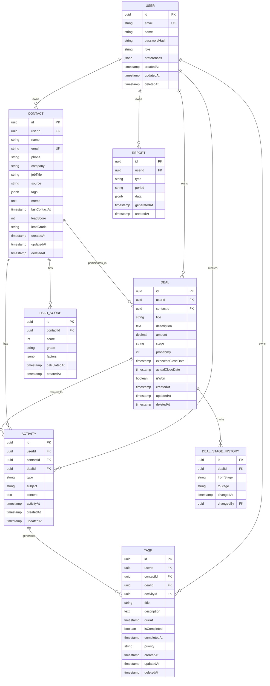

# 데이터베이스 설계서 (DDD)

| 항목 | 내용 |
|------|------|
| **프로젝트명** | VIVE CRM |
| **문서 버전** | v1.0 |
| **작성일** | 2026-02-24 |
| **작성자** | 조훈상 / 기획·개발 |
| **승인자** | 조훈상 / 프로젝트 오너 |
| **문서 상태** | 초안 |

---

> **용어 규칙:** 본 문서는 [`용어규칙.md`](../01-요구사항분석/용어규칙.md)의 표기 원칙과 용어 사전을 준수한다.

---

## 1. 데이터베이스 개요

### 1.1 설계 목적

VIVE CRM의 고객, 딜, 활동, 작업 등 핵심 도메인 데이터를 영구적으로 저장하고, AI 리드 스코어링 및 다음 행동 추천 기능을 위한 데이터 기반을 제공한다.

### 1.2 데이터베이스 선정

| 항목 | 내용 |
|------|------|
| **DBMS** | PostgreSQL 15+ |
| **선정 이유** | 관계형 데이터 모델 적합, JSONB 지원(유연한 메타데이터), Prisma ORM과의 우수한 호환성 |
| **호스팅** | Supabase 또는 Neon (관리형 PostgreSQL) |

### 1.3 데이터 모델 설계 원칙

| 원칙 | 설명 |
|------|------|
| DDD (Domain-Driven Design) | 도메인 모델 중심 설계, 바울드 컨텍스트 경계 명확화 |
| 데이터 정규화 | 중복 최소화를 위한 3NF 수준 정규화 |
| 식별자 | UUID(v4) 사용, 분산 환경에서도 안전한 ID 생성 |
| 감사 로그 | createdAt, updatedAt 필드 필수, 삭제는 Soft Delete |
| JSONB 활용 | 동적 속성, 확장 가능한 메타데이터 저장 |

---

## 2. ERD (Entity Relationship Diagram)



---

## 3. 테이블 명세

### 3.1 사용자 도메인 (User)

#### 테이블: `users`

| 컬럼명 | 타입 | NULL | 기본값 | 설명 |
|--------|------|------|--------|------|
| `id` | UUID | NO | gen_random_uuid() | PK, 사용자 고유 ID |
| `email` | VARCHAR(255) | NO | - | 사용자 이메일 (Unique) |
| `name` | VARCHAR(100) | NO | - | 사용자 이름 |
| `passwordHash` | VARCHAR(255) | NO | - | bcrypt 해시된 비밀번호 |
| `role` | VARCHAR(20) | NO | 'USER' | 역할 (USER, ADMIN) |
| `preferences` | JSONB | YES | '{}' | 사용자 설정 (시간대, 알림 등) |
| `createdAt` | TIMESTAMP | NO | now() | 생성일 |
| `updatedAt` | TIMESTAMP | NO | now() | 수정일 |
| `deletedAt` | TIMESTAMP | YES | NULL | 소프트 삭제일 |

**인덱스:**
```sql
CREATE UNIQUE INDEX idx_users_email ON users(email) WHERE deleted_at IS NULL;
CREATE INDEX idx_users_role ON users(role);
```

**제약조건:**
- `email`: RFC 5322 형식 검증 (애플리케이션 레벨에서 Zod로 처리)
- `role`: ENUM 제약 ('USER', 'ADMIN')

---

### 3.2 고객 도메인 (Contact)

#### 테이블: `contacts`

| 컬럼명 | 타입 | NULL | 기본값 | 설명 |
|--------|------|------|--------|------|
| `id` | UUID | NO | gen_random_uuid() | PK |
| `userId` | UUID | NO | - | 소유자 (FK → users.id) |
| `name` | VARCHAR(100) | NO | - | 고객 이름 |
| `email` | VARCHAR(255) | YES | - | 이메일 (사용자별 Unique) |
| `phone` | VARCHAR(50) | YES | - | 전화번호 |
| `company` | VARCHAR(200) | YES | - | 회사명 |
| `jobTitle` | VARCHAR(100) | YES | - | 직책 |
| `source` | VARCHAR(50) | YES | - | 유입 경로 (website, email, manual 등) |
| `tags` | JSONB | YES | '[]' | 태그 배열 (예: ["B2B", "제조업"]) |
| `memo` | TEXT | YES | - | 메모 |
| `lastContactAt` | TIMESTAMP | YES | NULL | 마지막 접촉일 |
| `leadScore` | INTEGER | YES | NULL | AI 계산 리드 스코어 (0-100) |
| `leadGrade` | VARCHAR(2) | YES | NULL | 리드 등급 (S/A/B/C) |
| `createdAt` | TIMESTAMP | NO | now() | 생성일 |
| `updatedAt` | TIMESTAMP | NO | now() | 수정일 |
| `deletedAt` | TIMESTAMP | YES | NULL | 소프트 삭제일 |

**인덱스:**
```sql
CREATE INDEX idx_contacts_user_id ON contacts(userId);
CREATE UNIQUE INDEX idx_contacts_email_per_user ON contacts(userId, email) WHERE deleted_at IS NULL;
CREATE INDEX idx_contacts_lead_score ON contacts(userId, leadScore DESC);
CREATE INDEX idx_contacts_tags ON contacts USING GIN(tags);
CREATE INDEX idx_contacts_company ON contacts(company);
CREATE INDEX idx_contacts_last_contact ON contacts(lastContactAt DESC);
```

**제약조건:**
- `userId`: ON DELETE CASCADE
- `leadScore`: CHECK (leadScore >= 0 AND leadScore <= 100)
- `leadGrade`: CHECK (leadGrade IN ('S', 'A', 'B', 'C', NULL))

---

#### 테이블: `lead_scores`

| 컬럼명 | 타입 | NULL | 기본값 | 설명 |
|--------|------|------|--------|------|
| `id` | UUID | NO | gen_random_uuid() | PK |
| `contactId` | UUID | NO | - | 고객 ID (FK → contacts.id) |
| `score` | INTEGER | NO | - | 계산된 스코어 (0-100) |
| `grade` | VARCHAR(2) | NO | - | 등급 (S/A/B/C) |
| `factors` | JSONB | YES | '{}' | 스코어 계산 요인 상세 |
| `calculatedAt` | TIMESTAMP | NO | now() | 계산 시점 |
| `createdAt` | TIMESTAMP | NO | now() | 생성일 |

**인덱스:**
```sql
CREATE INDEX idx_lead_scores_contact_id ON lead_scores(contactId);
CREATE INDEX idx_lead_scores_calculated_at ON lead_scores(calculatedAt DESC);
```

**제약조건:**
- `contactId`: ON DELETE CASCADE
- `score`: CHECK (score >= 0 AND score <= 100)

---

### 3.3 딜 도메인 (Deal)

#### 테이블: `deals`

| 컬럼명 | 타입 | NULL | 기본값 | 설명 |
|--------|------|------|--------|------|
| `id` | UUID | NO | gen_random_uuid() | PK |
| `userId` | UUID | NO | - | 소유자 (FK → users.id) |
| `contactId` | UUID | NO | - | 관련 고객 (FK → contacts.id) |
| `title` | VARCHAR(200) | NO | - | 딜 제목 |
| `description` | TEXT | YES | - | 상세 설명 |
| `amount` | DECIMAL(15,2) | YES | NULL | 예상 금액 (원) |
| `stage` | VARCHAR(50) | NO | 'lead' | 현재 단계 |
| `probability` | INTEGER | YES | NULL | 성공 확률 (%) |
| `expectedCloseDate` | DATE | YES | NULL | 예상 마감일 |
| `actualCloseDate` | DATE | YES | NULL | 실제 마감일 |
| `isWon` | BOOLEAN | YES | NULL | 성공 여부 |
| `createdAt` | TIMESTAMP | NO | now() | 생성일 |
| `updatedAt` | TIMESTAMP | NO | now() | 수정일 |
| `deletedAt` | TIMESTAMP | YES | NULL | 소프트 삭제일 |

**인덱스:**
```sql
CREATE INDEX idx_deals_user_id ON deals(userId);
CREATE INDEX idx_deals_contact_id ON deals(contactId);
CREATE INDEX idx_deals_stage ON deals(userId, stage);
CREATE INDEX idx_deals_expected_close ON deals(expectedCloseDate);
CREATE INDEX idx_deals_amount ON deals(amount DESC);
```

**제약조건:**
- `userId`: ON DELETE CASCADE
- `contactId`: ON DELETE RESTRICT (고객 삭제 시 딜 삭제 방지)
- `stage`: CHECK (stage IN ('lead', 'opportunity', 'proposal', 'negotiation', 'closed'))
- `probability`: CHECK (probability >= 0 AND probability <= 100)

---

#### 테이블: `deal_stage_history`

| 컬럼명 | 타입 | NULL | 기본값 | 설명 |
|--------|------|------|--------|------|
| `id` | UUID | NO | gen_random_uuid() | PK |
| `dealId` | UUID | NO | - | 딜 ID (FK → deals.id) |
| `fromStage` | VARCHAR(50) | YES | NULL | 이전 단계 |
| `toStage` | VARCHAR(50) | NO | - | 변경된 단계 |
| `changedAt` | TIMESTAMP | NO | now() | 변경 시점 |
| `changedBy` | UUID | NO | - | 변경자 (FK → users.id) |

**인덱스:**
```sql
CREATE INDEX idx_deal_stage_history_deal_id ON deal_stage_history(dealId);
CREATE INDEX idx_deal_stage_history_changed_at ON deal_stage_history(changedAt DESC);
```

**제약조건:**
- `dealId`: ON DELETE CASCADE

---

### 3.4 활동 도메인 (Activity)

#### 테이블: `activities`

| 컬럼명 | 타입 | NULL | 기본값 | 설명 |
|--------|------|------|--------|------|
| `id` | UUID | NO | gen_random_uuid() | PK |
| `userId` | UUID | NO | - | 생성자 (FK → users.id) |
| `contactId` | UUID | NO | - | 관련 고객 (FK → contacts.id) |
| `dealId` | UUID | YES | NULL | 관련 딜 (FK → deals.id) |
| `type` | VARCHAR(50) | NO | - | 활동 유형 |
| `subject` | VARCHAR(200) | YES | - | 제목 |
| `content` | TEXT | YES | - | 내용 |
| `activityAt` | TIMESTAMP | NO | now() | 활동 발생 시점 |
| `createdAt` | TIMESTAMP | NO | now() | 생성일 |
| `updatedAt` | TIMESTAMP | NO | now() | 수정일 |

**인덱스:**
```sql
CREATE INDEX idx_activities_user_id ON activities(userId);
CREATE INDEX idx_activities_contact_id ON activities(contactId);
CREATE INDEX idx_activities_deal_id ON activities(dealId);
CREATE INDEX idx_activities_type ON activities(type);
CREATE INDEX idx_activities_activity_at ON activities(activityAt DESC);
CREATE INDEX idx_activities_contact_time ON activities(contactId, activityAt DESC);
```

**제약조건:**
- `userId`: ON DELETE CASCADE
- `contactId`: ON DELETE CASCADE
- `dealId`: ON DELETE SET NULL
- `type`: CHECK (type IN ('call', 'email', 'meeting', 'note', 'task'))

---

### 3.5 작업 도메인 (Task)

#### 테이블: `tasks`

| 컬럼명 | 타입 | NULL | 기본값 | 설명 |
|--------|------|------|--------|------|
| `id` | UUID | NO | gen_random_uuid() | PK |
| `userId` | UUID | NO | - | 소유자 (FK → users.id) |
| `contactId` | UUID | YES | NULL | 관련 고객 (FK → contacts.id) |
| `dealId` | UUID | YES | NULL | 관련 딜 (FK → deals.id) |
| `activityId` | UUID | YES | NULL | 생성된 원인 활동 (FK → activities.id) |
| `title` | VARCHAR(200) | NO | - | 제목 |
| `description` | TEXT | YES | - | 설명 |
| `dueAt` | TIMESTAMP | YES | NULL | 마감일 |
| `isCompleted` | BOOLEAN | NO | false | 완료 여부 |
| `completedAt` | TIMESTAMP | YES | NULL | 완료 시점 |
| `priority` | VARCHAR(20) | YES | 'medium' | 우선순위 |
| `createdAt` | TIMESTAMP | NO | now() | 생성일 |
| `updatedAt` | TIMESTAMP | NO | now() | 수정일 |
| `deletedAt` | TIMESTAMP | YES | NULL | 소프트 삭제일 |

**인덱스:**
```sql
CREATE INDEX idx_tasks_user_id ON tasks(userId);
CREATE INDEX idx_tasks_contact_id ON tasks(contactId);
CREATE INDEX idx_tasks_deal_id ON tasks(dealId);
CREATE INDEX idx_tasks_is_completed ON tasks(isCompleted);
CREATE INDEX idx_tasks_due_at ON tasks(dueAt);
CREATE INDEX idx_tasks_priority ON tasks(priority);
CREATE INDEX idx_tasks_pending ON tasks(userId, isCompleted, dueAt) WHERE isCompleted = false;
```

**제약조건:**
- `userId`: ON DELETE CASCADE
- `contactId`: ON DELETE CASCADE
- `dealId`: ON DELETE SET NULL
- `priority`: CHECK (priority IN ('low', 'medium', 'high'))

---

### 3.6 리포트 도메인 (Report)

#### 테이블: `reports`

| 컬럼명 | 타입 | NULL | 기본값 | 설명 |
|--------|------|------|--------|------|
| `id` | UUID | NO | gen_random_uuid() | PK |
| `userId` | UUID | NO | - | 생성자 (FK → users.id) |
| `type` | VARCHAR(50) | NO | - | 리포트 유형 |
| `period` | VARCHAR(50) | NO | - | 기간 (weekly, monthly, custom) |
| `data` | JSONB | NO | '{}' | 리포트 데이터 |
| `generatedAt` | TIMESTAMP | NO | now() | 생성 시점 |
| `createdAt` | TIMESTAMP | NO | now() | 생성일 |

**인덱스:**
```sql
CREATE INDEX idx_reports_user_id ON reports(userId);
CREATE INDEX idx_reports_type ON reports(type);
CREATE INDEX idx_reports_generated_at ON reports(generatedAt DESC);
```

---

## 4. 관계 정의

### 4.1 관계 요약

| 부모 테이블 | 자식 테이블 | 관계 유형 | 삭제 규칙 | 설명 |
|-------------|-------------|-----------|-----------|------|
| users | contacts | 1:N | CASCADE | 사용자 삭제 시 해당 고객 모두 삭제 |
| users | deals | 1:N | CASCADE | 사용자 삭제 시 해당 딜 모두 삭제 |
| users | activities | 1:N | CASCADE | 사용자 삭제 시 해당 활동 모두 삭제 |
| users | tasks | 1:N | CASCADE | 사용자 삭제 시 해당 작업 모두 삭제 |
| contacts | deals | 1:N | RESTRICT | 고객 삭제 시 딜이 있으면 삭제 방지 |
| contacts | activities | 1:N | CASCADE | 고객 삭제 시 해당 활동 삭제 |
| contacts | tasks | 1:N | CASCADE | 고객 삭제 시 해당 작업 삭제 |
| contacts | lead_scores | 1:N | CASCADE | 고객 삭제 시 스코어 기록 삭제 |
| deals | activities | 1:N | SET NULL | 딜 삭제 시 활동은 유지 (고객과 연결) |
| deals | tasks | 1:N | SET NULL | 딜 삭제 시 작업은 유지 |
| deals | deal_stage_history | 1:N | CASCADE | 딜 삭제 시 단계 이력 삭제 |
| activities | tasks | 1:1 | SET NULL | 활동 삭제 시에도 작업 유지 가능 |

---

## 5. 트리거 및 뷰

### 5.1 자동 업데이트 트리거

```sql
-- updatedAt 자동 갱신 트리거 함수
CREATE OR REPLACE FUNCTION update_updated_at_column()
RETURNS TRIGGER AS $$
BEGIN
    NEW.updated_at = now();
    RETURN NEW;
END;
$$ language 'plpgsql';

-- 각 테이블에 트리거 적용
CREATE TRIGGER update_users_updated_at BEFORE UPDATE ON users
    FOR EACH ROW EXECUTE FUNCTION update_updated_at_column();

CREATE TRIGGER update_contacts_updated_at BEFORE UPDATE ON contacts
    FOR EACH ROW EXECUTE FUNCTION update_updated_at_column();

CREATE TRIGGER update_deals_updated_at BEFORE UPDATE ON deals
    FOR EACH ROW EXECUTE FUNCTION update_updated_at_column();

CREATE TRIGGER update_activities_updated_at BEFORE UPDATE ON activities
    FOR EACH ROW EXECUTE FUNCTION update_updated_at_column();

CREATE TRIGGER update_tasks_updated_at BEFORE UPDATE ON tasks
    FOR EACH ROW EXECUTE FUNCTION update_updated_at_column();
```

### 5.2 마지막 접촉일 자동 갱신 트리거

```sql
-- 활동 등록 시 연락처의 lastContactAt 자동 갱신
CREATE OR REPLACE FUNCTION update_contact_last_contact_at()
RETURNS TRIGGER AS $$
BEGIN
    UPDATE contacts 
    SET last_contact_at = NEW.activity_at
    WHERE id = NEW.contact_id;
    RETURN NEW;
END;
$$ language 'plpgsql';

CREATE TRIGGER update_contact_last_contact_on_activity
    AFTER INSERT ON activities
    FOR EACH ROW
    EXECUTE FUNCTION update_contact_last_contact_at();
```

### 5.3 딜 단계 변경 이력 트리거

```sql
-- 딜 단계 변경 시 이력 자동 기록
CREATE OR REPLACE FUNCTION log_deal_stage_change()
RETURNS TRIGGER AS $$
BEGIN
    IF OLD.stage IS DISTINCT FROM NEW.stage THEN
        INSERT INTO deal_stage_history (deal_id, from_stage, to_stage, changed_by)
        VALUES (NEW.id, OLD.stage, NEW.stage, NEW.user_id);
    END IF;
    RETURN NEW;
END;
$$ language 'plpgsql';

CREATE TRIGGER log_deal_stage_change
    AFTER UPDATE ON deals
    FOR EACH ROW
    EXECUTE FUNCTION log_deal_stage_change();
```

### 5.4 유용한 뷰

```sql
-- 활성 고객 목록 (삭제되지 않은)
CREATE VIEW active_contacts AS
SELECT * FROM contacts WHERE deleted_at IS NULL;

-- 활성 딜 목록 (삭제되지 않은)
CREATE VIEW active_deals AS
SELECT * FROM deals WHERE deleted_at IS NULL;

-- 미완료 작업 목록
CREATE VIEW pending_tasks AS
SELECT * FROM tasks WHERE is_completed = false AND deleted_at IS NULL;

-- 최신 리드 스코어 뷰 (각 고객별 최신 스코어)
CREATE VIEW latest_lead_scores AS
SELECT DISTINCT ON (contact_id)
    id, contact_id, score, grade, factors, calculated_at
FROM lead_scores
ORDER BY contact_id, calculated_at DESC;
```

---

## 6. 보안 및 접근 제어

### 6.1 Row Level Security (RLS)

PostgreSQL RLS를 활용하여 사용자는 자신의 데이터만 접근할 수 있도록 제한한다.

```sql
-- contacts 테이블 RLS 활성화
ALTER TABLE contacts ENABLE ROW LEVEL SECURITY;

-- 사용자는 자신의 고객만 조회/수정/삭제 가능
CREATE POLICY contacts_user_policy ON contacts
    FOR ALL
    TO app_user
    USING (user_id = current_setting('app.current_user_id')::UUID);

-- deals 테이블 RLS
ALTER TABLE deals ENABLE ROW LEVEL SECURITY;

CREATE POLICY deals_user_policy ON deals
    FOR ALL
    TO app_user
    USING (user_id = current_setting('app.current_user_id')::UUID);

-- tasks 테이블 RLS
ALTER TABLE tasks ENABLE ROW LEVEL SECURITY;

CREATE POLICY tasks_user_policy ON tasks
    FOR ALL
    TO app_user
    USING (user_id = current_setting('app.current_user_id')::UUID);
```

### 6.2 민감 데이터 처리

| 데이터 유형 | 처리 방식 |
|-------------|-----------|
| 비밀번호 | bcrypt 해시 후 저장 (salt rounds: 12) |
| 이메일 | 일반 텍스트 저장, TLS 전송 암호화 |
| 전화번호 | 일반 텍스트 저장 |
| 메모/메모 | 일반 텍스트 저장 |

---

## 7. Prisma Schema 참고

### 7.1 핵심 엔티티 정의

```prisma
// prisma/schema.prisma

generator client {
  provider = "prisma-client-js"
}

datasource db {
  provider = "postgresql"
  url      = env("DATABASE_URL")
}

model User {
  id            String   @id @default(uuid())
  email         String   @unique
  name          String
  passwordHash  String
  role          Role     @default(USER)
  preferences   Json?    @default("{}")
  createdAt     DateTime @default(now())
  updatedAt     DateTime @updatedAt
  deletedAt     DateTime?

  contacts      Contact[]
  deals         Deal[]
  activities    Activity[]
  tasks         Task[]
  reports       Report[]

  @@index([role])
  @@index([deletedAt])
}

model Contact {
  id              String   @id @default(uuid())
  userId          String
  name            String
  email           String?
  phone           String?
  company         String?
  jobTitle        String?
  source          String?
  tags            Json?    @default("[]")
  memo            String?
  lastContactAt   DateTime?
  leadScore       Int?
  leadGrade       String?  // S, A, B, C
  createdAt       DateTime @default(now())
  updatedAt       DateTime @updatedAt
  deletedAt       DateTime?

  user            User     @relation(fields: [userId], references: [id], onDelete: Cascade)
  deals           Deal[]
  activities      Activity[]
  tasks           Task[]
  leadScores      LeadScore[]

  @@unique([userId, email])
  @@index([userId])
  @@index([leadScore])
  @@index([lastContactAt])
}

model Deal {
  id                String   @id @default(uuid())
  userId            String
  contactId         String
  title             String
  description       String?
  amount            Decimal? @db.Decimal(15, 2)
  stage             DealStage @default(LEAD)
  probability       Int?
  expectedCloseDate DateTime?
  actualCloseDate   DateTime?
  isWon             Boolean?
  createdAt         DateTime @default(now())
  updatedAt         DateTime @updatedAt
  deletedAt         DateTime?

  user              User     @relation(fields: [userId], references: [id], onDelete: Cascade)
  contact           Contact  @relation(fields: [contactId], references: [id], onDelete: Restrict)
  activities        Activity[]
  tasks             Task[]
  stageHistories    DealStageHistory[]

  @@index([userId])
  @@index([contactId])
  @@index([stage])
}

enum Role {
  USER
  ADMIN
}

enum DealStage {
  LEAD
  OPPORTUNITY
  PROPOSAL
  NEGOTIATION
  CLOSED
}
```

---

## 8. 성능 최적화 전략

### 8.1 인덱스 전략

| 인덱스 | 목적 |
|--------|------|
| B-tree (PK, FK) | 기본적인 조회, 조인 성능 |
| B-tree (createdAt DESC) | 최신순 정렬 최적화 |
| GIN (tags) | JSONB 태그 배열 검색 |
| Partial Index | 소프트 삭제 필터링 (WHERE deleted_at IS NULL) |
| Composite Index | 다중 조건 필터링 (user_id + stage 등) |

### 8.2 쿼리 최적화

- 모든 리스트 조회는 페이지네이션 적용 (LIMIT/OFFSET)
- 대량 데이터 조회 시 커서 기반 페이지네이션 고려
- 자주 조회되는 계산값은 컬럼으로 저장 (leadScore 등)
- JSONB 조회는 특정 필드만 선택적으로 추출

---

## 9. 데이터 마이그레이션

### 9.1 초기 데이터 시드

```sql
-- 관리자 계정 시드
INSERT INTO users (id, email, name, password_hash, role)
VALUES (
    gen_random_uuid(),
    'admin@example.com',
    '관리자',
    '$2b$12$...', -- bcrypt 해시
    'ADMIN'
);
```

### 9.2 마이그레이션 도구

| 도구 | 용도 |
|------|------|
| Prisma Migrate | 스키마 변경 관리, 마이그레이션 파일 생성 |
| Prisma Seed | 초기 데이터 삽입 |

```bash
# 마이그레이션 생성
npx prisma migrate dev --name init

# 프로덕션 적용
npx prisma migrate deploy

# 시드 실행
npx prisma db seed
```

---

## 부록

### A. 데이터 용량 추정

| 테이블 | 예상 레코드 수 (1년) | 평균 크기 | 총 크기 |
|--------|---------------------|-----------|---------|
| users | 500명 | 1 KB | 500 KB |
| contacts | 50,000명 | 2 KB | 100 MB |
| deals | 10,000개 | 1.5 KB | 15 MB |
| activities | 200,000개 | 1 KB | 200 MB |
| tasks | 50,000개 | 0.8 KB | 40 MB |
| lead_scores | 150,000개 | 0.5 KB | 75 MB |
| **합계** | | | **~430 MB** |

> Supabase/Neon 무료 티어 (500MB~1GB) 범위 내에서 운영 가능
