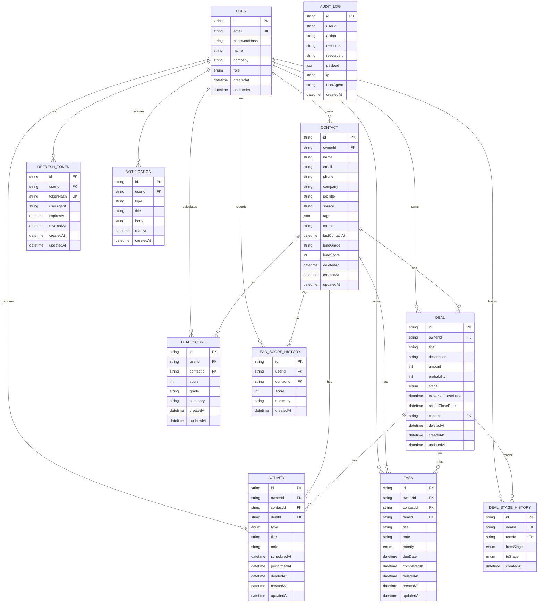

# 데이터베이스 설계서

| 항목 | 내용 |
|------|------|
| **프로젝트명** | VIVE CRM |
| **문서 버전** | v1.0 |
| **작성일** | 2026-02-26 |
| **작성자** | 권영해 / 기획·개발 |
| **승인자** | 권영해 / 프로젝트 오너 |
| **문서 상태** | 완료 |

---

> **용어 규칙:** 본 문서는 [`용어규칙.md`](../01-요구사항분석/용어규칙.md)의 표기 원칙과 용어 사전을 준수한다.

---

## 1. 개요

### 1.1 목적

본 문서는 VIVE CRM 시스템의 데이터베이스 구조를 정의하고, 데이터 모델, 관계, 인덱스 전략, 보안 정책을 기술한다.

### 1.2 DBMS 선정

| 항목 | 내용 |
|------|------|
| **DBMS** | PostgreSQL 15+ |
| **호스팅** | Supabase / Neon (관리형) |
| **ORM** | Prisma 5.x |
| **선정 이유** | 관계형 데이터 최적화, ACID 보장, Prisma와의 호환성, 관리형 서비스로 운영 편의성 |

### 1.3 데이터 모델 설계 원칙

| 원칙 | 설명 |
|------|------|
| **DDD (Domain-Driven Design)** | 도메인 경계에 따라 테이블 그룹화 |
| **3NF (제3정규형)** | 데이터 중복 최소화, 참조 무결성 보장 |
| **UUID Primary Key** | 분산 환경에서의 ID 충돌 방지, 보안성 향상 |
| **Soft Delete** | `deletedAt` 필드로 논리적 삭제, 데이터 복구 가능 |
| **Audit Trail** | 생성/수정 시간 자동 기록, 변경 이력 추적 |

---

## 2. ERD (Entity Relationship Diagram)



---

## 3. 테이블 명세

### 3.1 users (사용자)

| 필드명 | 타입 | 제약조건 | 설명 |
|--------|------|----------|------|
| id | UUID | PK | 사용자 고유 식별자 |
| email | VARCHAR(255) | UK, NOT NULL | 로그인 이메일 |
| passwordHash | VARCHAR(255) | NOT NULL | bcrypt 해시 |
| name | VARCHAR(100) | NOT NULL | 사용자 이름 |
| company | VARCHAR(200) | NULL | 회사명 |
| role | ENUM | DEFAULT 'USER' | USER, ADMIN |
| createdAt | TIMESTAMP | DEFAULT now() | 생성일시 |
| updatedAt | TIMESTAMP | AUTO UPDATE | 수정일시 |

**인덱스**: `email` (Unique)

---

### 3.2 contacts (고객/연락처)

| 필드명 | 타입 | 제약조건 | 설명 |
|--------|------|----------|------|
| id | UUID | PK | 고객 고유 식별자 |
| ownerId | UUID | FK → users.id, NOT NULL | 소유 사용자 |
| name | VARCHAR(100) | NOT NULL | 고객명 |
| email | VARCHAR(255) | NULL | 이메일 |
| phone | VARCHAR(50) | NULL | 전화번호 |
| company | VARCHAR(200) | NULL | 회사명 |
| jobTitle | VARCHAR(100) | NULL | 직책 |
| source | VARCHAR(50) | NULL | 유입 경로 |
| tags | JSON | DEFAULT '[]' | 태그 배열 |
| memo | TEXT | NULL | 메모 |
| lastContactAt | TIMESTAMP | NULL | 최종 연락일 |
| leadGrade | CHAR(1) | NULL | A/B/C/D 등급 |
| leadScore | INTEGER | NULL | 0-100 점수 |
| deletedAt | TIMESTAMP | NULL | 소프트 삭제 시간 |
| createdAt | TIMESTAMP | DEFAULT now() | 생성일시 |
| updatedAt | TIMESTAMP | AUTO UPDATE | 수정일시 |

**인덱스**: 
- `ownerId` (B-tree) - 사용자별 조회
- `lastContactAt` (B-tree) - 최근 연락 순 정렬

**제약조건**:
- 동일 owner 내 email 중복 불가 (비즈니스 로직)
- leadScore 0-100 범위 (애플리케이션 레벨)

---

### 3.3 deals (영업기회)

| 필드명 | 타입 | 제약조건 | 설명 |
|--------|------|----------|------|
| id | UUID | PK | 딜 고유 식별자 |
| ownerId | UUID | FK → users.id, NOT NULL | 소유 사용자 |
| title | VARCHAR(200) | NOT NULL | 딜 제목 |
| description | TEXT | NULL | 상세 설명 |
| amount | INTEGER | DEFAULT 0 | 예상 금액(원) |
| probability | INTEGER | DEFAULT 0 | 성공 확률(%) |
| stage | ENUM | DEFAULT 'LEAD' | LEAD, QUALIFIED, PROPOSAL, NEGOTIATION, WON, LOST |
| expectedCloseDate | DATE | NULL | 예상 마감일 |
| actualCloseDate | DATE | NULL | 실제 마감일 |
| contactId | UUID | FK → contacts.id, NULL | 연결 고객 |
| deletedAt | TIMESTAMP | NULL | 소프트 삭제 시간 |
| createdAt | TIMESTAMP | DEFAULT now() | 생성일시 |
| updatedAt | TIMESTAMP | AUTO UPDATE | 수정일시 |

**인덱스**:
- `ownerId` (B-tree) - 사용자별 조회
- `stage` (B-tree) - 파이프라인 단계별 조회

**트리거**:
- WON/LOST로 stage 변경 시 actualCloseDate 자동 설정

---

### 3.4 activities (활동)

| 필드명 | 타입 | 제약조건 | 설명 |
|--------|------|----------|------|
| id | UUID | PK | 활동 고유 식별자 |
| ownerId | UUID | FK → users.id, NOT NULL | 작성자 |
| contactId | UUID | FK → contacts.id, NULL | 연결 고객 |
| dealId | UUID | FK → deals.id, NULL | 연결 딜 |
| type | ENUM | DEFAULT 'NOTE' | NOTE, CALL, EMAIL, MEETING |
| title | VARCHAR(200) | NOT NULL | 활동 제목 |
| note | TEXT | NULL | 상세 내용 |
| scheduledAt | TIMESTAMP | NULL | 예정일시 |
| performedAt | TIMESTAMP | NULL | 실제 수행일시 |
| deletedAt | TIMESTAMP | NULL | 소프트 삭제 시간 |
| createdAt | TIMESTAMP | DEFAULT now() | 생성일시 |
| updatedAt | TIMESTAMP | AUTO UPDATE | 수정일시 |

**인덱스**:
- `ownerId` (B-tree) - 사용자별 조회

---

### 3.5 tasks (작업)

| 필드명 | 타입 | 제약조건 | 설명 |
|--------|------|----------|------|
| id | UUID | PK | 작업 고유 식별자 |
| ownerId | UUID | FK → users.id, NOT NULL | 소유 사용자 |
| contactId | UUID | FK → contacts.id, NULL | 연결 고객 |
| dealId | UUID | FK → deals.id, NULL | 연결 딜 |
| title | VARCHAR(200) | NOT NULL | 작업 제목 |
| note | TEXT | NULL | 상세 내용 |
| priority | ENUM | DEFAULT 'MEDIUM' | LOW, MEDIUM, HIGH |
| dueDate | TIMESTAMP | NULL | 마감일 |
| completedAt | TIMESTAMP | NULL | 완료일시 |
| deletedAt | TIMESTAMP | NULL | 소프트 삭제 시간 |
| createdAt | TIMESTAMP | DEFAULT now() | 생성일시 |
| updatedAt | TIMESTAMP | AUTO UPDATE | 수정일시 |

**인덱스**:
- `ownerId` (B-tree) - 사용자별 조회
- `dueDate` (B-tree) - 마감일 기준 정렬

---

### 3.6 lead_scores (리드 스코어)

| 필드명 | 타입 | 제약조건 | 설명 |
|--------|------|----------|------|
| id | UUID | PK | 스코어 고유 식별자 |
| userId | UUID | FK → users.id, NOT NULL | 계산 사용자 |
| contactId | UUID | FK → contacts.id, UK, NOT NULL | 대상 고객 |
| score | INTEGER | NOT NULL | 0-100 점수 |
| grade | CHAR(1) | NULL | A/B/C/D 등급 |
| summary | TEXT | NOT NULL | AI 분석 요약 |
| createdAt | TIMESTAMP | DEFAULT now() | 생성일시 |
| updatedAt | TIMESTAMP | AUTO UPDATE | 수정일시 |

**인덱스**:
- `contactId` (Unique) - 고객당 하나의 스코어만 유지

---

### 3.7 lead_score_history (리드 스코어 이력)

| 필드명 | 타입 | 제약조건 | 설명 |
|--------|------|----------|------|
| id | UUID | PK | 이력 고유 식별자 |
| userId | UUID | FK → users.id, NOT NULL | 계산 사용자 |
| contactId | UUID | FK → contacts.id, NOT NULL | 대상 고객 |
| score | INTEGER | NOT NULL | 당시 점수 |
| summary | TEXT | NOT NULL | AI 분석 요약 |
| createdAt | TIMESTAMP | DEFAULT now() | 기록일시 |

---

### 3.8 deal_stage_history (딜 단계 변경 이력)

| 필드명 | 타입 | 제약조건 | 설명 |
|--------|------|----------|------|
| id | UUID | PK | 이력 고유 식별자 |
| dealId | UUID | FK → deals.id, NOT NULL | 대상 딜 |
| userId | UUID | FK → users.id, NOT NULL | 변경 사용자 |
| fromStage | ENUM | NOT NULL | 이전 단계 |
| toStage | ENUM | NOT NULL | 변경 단계 |
| createdAt | TIMESTAMP | DEFAULT now() | 변경일시 |

---

### 3.9 refresh_tokens (리프레시 토큰)

| 필드명 | 타입 | 제약조건 | 설명 |
|--------|------|----------|------|
| id | UUID | PK | 토큰 고유 식별자 |
| userId | UUID | FK → users.id, NOT NULL | 소유 사용자 |
| tokenHash | VARCHAR(255) | UK, NOT NULL | 토큰 해시 |
| userAgent | VARCHAR(500) | NULL | User-Agent |
| expiresAt | TIMESTAMP | NOT NULL | 만료일시 |
| revokedAt | TIMESTAMP | NULL | 폐기일시 |
| createdAt | TIMESTAMP | DEFAULT now() | 생성일시 |
| updatedAt | TIMESTAMP | AUTO UPDATE | 수정일시 |

---

### 3.10 notifications (알림)

| 필드명 | 타입 | 제약조건 | 설명 |
|--------|------|----------|------|
| id | UUID | PK | 알림 고유 식별자 |
| userId | UUID | FK → users.id, NOT NULL | 수신 사용자 |
| type | VARCHAR(50) | NOT NULL | task_due, task_overdue, deal_won 등 |
| title | VARCHAR(200) | NOT NULL | 알림 제목 |
| body | TEXT | NULL | 알림 내용 |
| readAt | TIMESTAMP | NULL | 읽음 처리 시간 |
| createdAt | TIMESTAMP | DEFAULT now() | 생성일시 |

**인덱스**:
- `userId` (B-tree) - 사용자별 조회
- `readAt` (Partial Index, WHERE readAt IS NULL) - 미읽은 알림 조회

---

### 3.11 audit_logs (감사 로그)

| 필드명 | 타입 | 제약조건 | 설명 |
|--------|------|----------|------|
| id | UUID | PK | 로그 고유 식별자 |
| userId | UUID | NULL | 수행 사용자 |
| action | VARCHAR(50) | NOT NULL | CREATE, UPDATE, DELETE 등 |
| resource | VARCHAR(50) | NOT NULL | 대상 테이블 |
| resourceId | VARCHAR(36) | NULL | 대상 레코드 ID |
| payload | JSON | NULL | 요청 데이터 |
| ip | VARCHAR(45) | NULL | 클라이언트 IP |
| userAgent | VARCHAR(500) | NULL | User-Agent |
| createdAt | TIMESTAMP | DEFAULT now() | 기록일시 |

**인덱스**:
- `userId` (B-tree) - 사용자별 조회
- `resource` (B-tree) - 리소스별 조회
- `createdAt` (B-tree) - 시간순 조회

---

## 4. 인덱스 전략

### 4.1 인덱스 목록

| 테이블 | 인덱스명 | 타입 | 필드 | 용도 |
|--------|----------|------|------|------|
| users | users_email_key | Unique | email | 로그인, 중복 체크 |
| contacts | contacts_ownerId_idx | B-tree | ownerId | 사용자별 고객 조회 |
| contacts | contacts_lastContactAt_idx | B-tree | lastContactAt | 최근 연락 순 정렬 |
| deals | deals_ownerId_idx | B-tree | ownerId | 사용자별 딜 조회 |
| deals | deals_stage_idx | B-tree | stage | 파이프라인 단계별 조회 |
| tasks | tasks_ownerId_idx | B-tree | ownerId | 사용자별 작업 조회 |
| tasks | tasks_dueDate_idx | B-tree | dueDate | 마감일 기준 정렬 |
| lead_scores | lead_scores_contactId_key | Unique | contactId | 고객당 하나의 스코어 |
| refresh_tokens | refresh_tokens_tokenHash_key | Unique | tokenHash | 토큰 검색 |
| notifications | notifications_userId_idx | B-tree | userId | 사용자별 알림 조회 |
| notifications | notifications_unread_idx | Partial | userId, readAt | 미읽은 알림 조회 |
| audit_logs | audit_logs_userId_idx | B-tree | userId | 사용자별 로그 조회 |
| audit_logs | audit_logs_resource_idx | B-tree | resource | 리소스별 로그 조회 |
| audit_logs | audit_logs_createdAt_idx | B-tree | createdAt | 시간순 로그 조회 |

### 4.2 성능 고려사항

| 쿼리 패턴 | 인덱스 전략 |
|-----------|-------------|
| 사용자별 데이터 조회 | ownerId 인덱스 필수 |
| 날짜 범위 조회 | createdAt, dueDate 등 인덱스 + 범위 스캔 |
| 텍스트 검색 | 향후 PostgreSQL Full Text Search 또는 GIN 인덱스 고려 |
| JSON 필드 검색 | tags 검색 시 GIN 인덱스 고려 |

---

## 5. 데이터 보존 및 보안

### 5.1 Soft Delete 정책

| 테이블 | 소프트 삭제 필드 | 물리 삭제 시기 |
|--------|-----------------|----------------|
| contacts | deletedAt | 탈퇴 후 30일 |
| deals | deletedAt | 탈퇴 후 30일 |
| activities | deletedAt | 탈퇴 후 30일 |
| tasks | deletedAt | 탈퇴 후 30일 |

### 5.2 데이터 백업

| 대상 | 주기 | 보관 기간 | 방법 |
|------|------|-----------|------|
| PostgreSQL | 일일 | 30일 | Supabase/Neon 자동 백업 |
| 감사 로그 | 실시간 | 2년 | 별도 테이블 보관 |

### 5.3 민감 데이터 처리

| 데이터 | 처리 방법 |
|--------|----------|
| 비밀번호 | bcrypt 해시 저장 |
| 토큰 | SHA-256 해시 저장 |
| 개인정보 | TLS 전송 암호화 |

---

## 6. 데이터 용량 추정

### 6.1 테이블별 예상 용량 (1년 기준)

| 테이블 | 예상 레코드 수 | 평균 레코드 크기 | 예상 용량 |
|--------|---------------|------------------|-----------|
| users | 1,000 | 200 bytes | 200 KB |
| contacts | 100,000 | 500 bytes | 50 MB |
| deals | 50,000 | 400 bytes | 20 MB |
| activities | 500,000 | 300 bytes | 150 MB |
| tasks | 200,000 | 300 bytes | 60 MB |
| lead_scores | 100,000 | 300 bytes | 30 MB |
| lead_score_history | 300,000 | 200 bytes | 60 MB |
| deal_stage_history | 150,000 | 150 bytes | 22.5 MB |
| refresh_tokens | 10,000 | 200 bytes | 2 MB |
| notifications | 1,000,000 | 200 bytes | 200 MB |
| audit_logs | 5,000,000 | 300 bytes | 1.5 GB |
| **합계** | - | - | **~2 GB** |

---

## 7. Prisma Schema 참조

실제 Prisma 스키마는 `apps/api/prisma/schema.prisma`에서 관리된다.

### 7.1 주요 마이그레이션 이력

| 마이그레이션 | 날짜 | 변경 내용 |
|-------------|------|-----------|
| add_contact_user_leadscore_fields | 2026-02-26 | Contact 필드 확장, User.company 추가 |
| add_notification_audit_deal_fields | 2026-02-26 | Notification, AuditLog, Deal 필드 추가 |

### 7.2 마이그레이션 명령어

```bash
# 개발 환경
npx prisma migrate dev --name [migration-name]

# 프로덕션 배포
npx prisma migrate deploy

# DB 동기화 (개발용)
npx prisma db push

# Prisma Client 생성
npx prisma generate
```

---

## 8. 부록

### A. ENUM 정의

| ENUM | 값 | 설명 |
|------|-----|------|
| Role | USER, ADMIN | 사용자 역할 |
| ContactGrade | HOT, WARM, COLD | 고객 등급 |
| DealStage | LEAD, QUALIFIED, PROPOSAL, NEGOTIATION, WON, LOST | 딜 단계 |
| TaskPriority | LOW, MEDIUM, HIGH | 작업 우선순위 |
| ActivityType | NOTE, CALL, EMAIL, MEETING | 활동 유형 |

### B. 외래키 제약조건

| 자식 테이블 | 부모 테이블 | ON DELETE |
|-------------|-------------|-----------|
| contacts | users | CASCADE |
| deals | users | CASCADE |
| deals | contacts | SET NULL |
| activities | users | CASCADE |
| activities | contacts | SET NULL |
| activities | deals | SET NULL |
| tasks | users | CASCADE |
| tasks | contacts | SET NULL |
| tasks | deals | SET NULL |

---

**마지막 업데이트**: 2026-02-26  
**문서 버전**: v1.0
