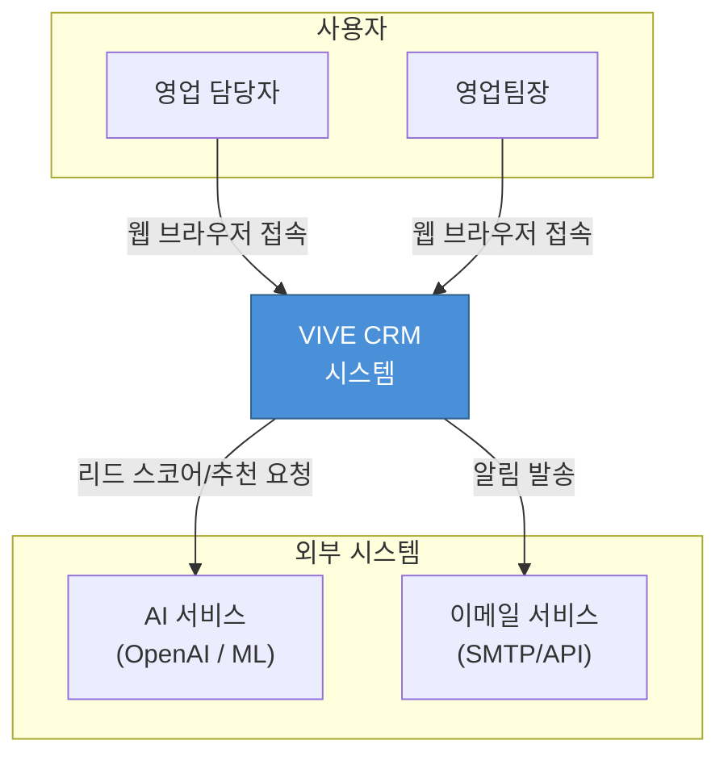
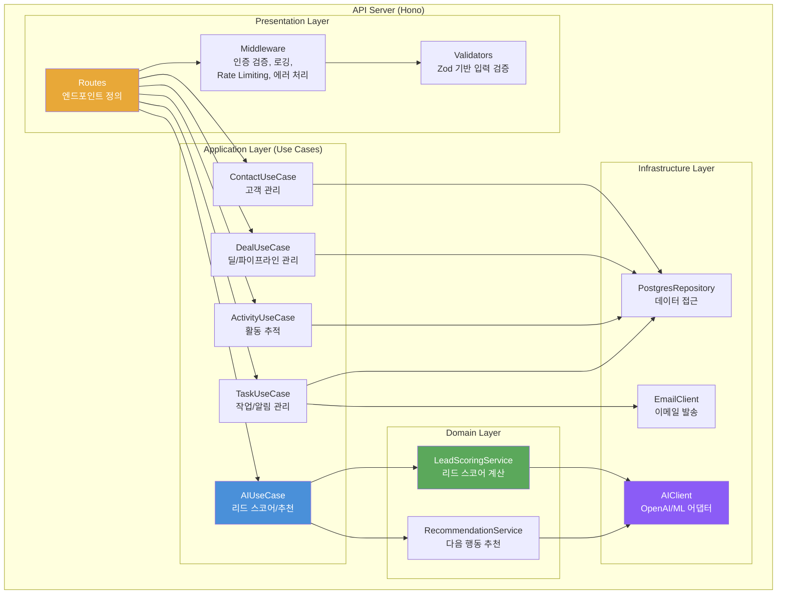
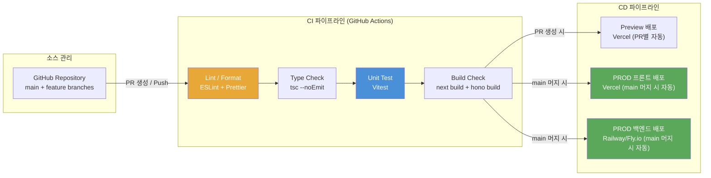

# 시스템 아키텍처 설계서 (SAD - System Architecture Document)

| 항목 | 내용 |
|------|------|
| **프로젝트명** | VIVE CRM |
| **문서 버전** | v1.0 |
| **작성일** | 2026-02-24 |
| **작성자** | 권영해 / 기획·개발 |
| **승인자** | 권영해 / 프로젝트 오너 |
| **문서 상태** | 초안 |

---

> **용어 규칙:** 본 문서는 [용어규칙.md](../01-요구사항분석/용어규칙.md)의 표기 원칙과 용어 사전을 준수한다.

---

## 1. 문서 개요

### 1.1 목적

본 문서는 VIVE CRM의 시스템 아키텍처를 정의하고, 주요 기술적 결정 사항과 설계 원칙을 기술한다. 1인 개발자(권영해)가 시스템의 전체 구조를 일관된 방향으로 설계·구현할 수 있도록 하며, 향후 협업자나 기여자가 시스템을 빠르게 이해할 수 있는 기준 문서 역할을 한다.

### 1.2 범위

- 시스템 전체 아키텍처 구조 및 구성 요소
- 기술 스택 선정 및 근거
- 배포 아키텍처 및 인프라 구성
- 비기능 요구사항에 대한 아키텍처 대응 전략
- 외부 시스템 통합 패턴

### 1.3 참조 문서

| 문서명 | 버전 | 비고 |
|--------|------|------|
| 서비스 기획서 | v1.0 | 서비스 개요, MVP 스코프, 기술 스택 방향 |
| 유스케이스 명세서 (UCS-001) | v1.0 | 9개 유스케이스 상세 명세 |
| 요구사항 추적 매트릭스 (RTM-001) | v0.1 | FR 9건, NFR 8건 추적 |
| 용어규칙 | v1.0 | 프로젝트 용어 표기 원칙 |

### 1.4 변경 이력

| 버전 | 날짜 | 작성자 | 변경 내용 |
|------|------|--------|-----------|
| v0.1 | 2026-02-24 | 권영해 | 초안 작성 |
| v1.0 | 2026-02-24 | 권영해 | 전체 아키텍처 설계 완료, ADR 4건 포함 |

---

## 2. 아키텍처 개요

### 2.1 아키텍처 스타일 선택

#### 선택된 아키텍처 스타일

**Layered Architecture + Modular Monolith**

#### 후보 아키텍처 스타일 비교

| 평가 항목 | Layered + Modular Monolith | Microservices | Serverless |
|-----------|---------------------------|---------------|------------|
| 구현 복잡도 | 낮음 | 높음 | 중간 |
| 확장성 | 중간 | 높음 | 높음 |
| 유지보수성 | 중간 | 높음 | 중간 |
| 1인 개발 적합성 | **매우 높음** | 매우 낮음 | 중간 |
| 배포 유연성 | 중간 | 높음 | 높음 |
| 운영 복잡도 | **낮음** | 매우 높음 | 낮음 |
| **종합 점수** | **4.5 / 5** | 2.0 / 5 | 3.5 / 5 |

#### 선택 근거

- **1인 개발 환경 최적화**: Microservices는 서비스 간 통신, 분산 트레이싱 등 운영 부담이 1인 개발에 비현실적이다
- **빠른 MVP 개발**: 8주 MVP 일정 내에 핵심 기능을 구현하려면 인프라 복잡도를 최소화해야 한다
- **명확한 모듈 경계**: Modular Monolith로 도메인별 모듈 경계를 유지하면, 향후 필요 시 특정 모듈을 독립 서비스로 분리할 수 있다
- **비용 효율**: 단일 서버 배포로 월 $100 예산 제한을 충족할 수 있다

### 2.2 아키텍처 원칙

| 원칙 | 설명 | 적용 방법 |
|------|------|-----------|
| 관심사 분리 (Separation of Concerns) | 각 계층/모듈은 단일 책임을 가짐 | 프론트엔드(UI), 백엔드(비즈니스 로직), 데이터(저장소)를 명확히 분리. 백엔드 낶도 도메인 모듈별로 디렉토리 분리 |
| 느슨한 결합 (Loose Coupling) | 모듈 간 의존성 최소화 | 모듈 간 통신은 인터페이스/타입을 통해 수행. 외부 서비스(AI API)는 어댑터 패턴으로 격리 |
| 높은 응집도 (High Cohesion) | 관련 기능을 하나의 모듈로 그룹화 | contact, deal, activity, task 등 도메인별 모듈로 그룹화 |
| DRY (Don't Repeat Yourself) | 코드 및 로직 중복 방지 | 공통 유틸리티, 타입 정의, 에러 처리를 shared 모듈로 추출 |
| 외부 서비스 격리 | 외부 API 의존성을 어댑터로 감싸기 | AI API 등 외부 서비스는 인터페이스 뒤에 구현을 숨겨 교체 용이성 확보 |
| MVP 우선 설계 | 과도한 추상화보다 동작하는 코드 우선 | 초기에는 실용적 설계를 우선하되, 모듈 경계만 명확히 유지 |

### 2.3 시스템 컨텍스트 다이어그램



### 2.4 컨테이너 다이어그램

```mermaid
flowchart TB
    subgraph 클라이언트
        WEB["Web Application<br/>Next.js (App Router)<br/>Tailwind CSS<br/>반응형 SPA/SSR"]
    end

    subgraph "시스템 경계"
        subgraph "프론트엔드 서버 (Vercel)"
            NEXT["Next.js Server<br/>SSR / API Routes<br/>Auth.js 세션 관리"]
        end

        subgraph "백엔드 서버 (Railway / Fly.io)"
            API["API Server<br/>Hono (Node.js)<br/>비즈니스 로직 + AI 통합"]
        end

        subgraph "데이터 저장소"
            PG[("PostgreSQL<br/>(Supabase / Neon)<br/>고객, 딜, 활동 데이터")]
            REDIS[("Redis<br/>(Upstash)<br/>세션, 캐시")]
        end
    end

    subgraph 외부 서비스
        AI_EXT["AI API<br/>(OpenAI / Anthropic)"]
        EMAIL_EXT["이메일 서비스"]
    end

    WEB -->|HTTPS| NEXT
    NEXT -->|HTTPS / REST API| API
    API -->|SQL (Prisma ORM)| PG
    API -->|Redis Client| REDIS
    API -->|AI 분석 요청| AI_EXT
    API -->|알림 발송| EMAIL_EXT

    style NEXT fill:#4A90D9,color:#fff
    style API fill:#4A90D9,color:#fff
    style PG fill:#5BA85B,color:#fff
    style REDIS fill:#DC382D,color:#fff
```

### 2.5 컴포넌트 다이어그램



---

## 3. 기술 스택 선정

### 3.1 선정 기준 매트릭스

1인 개발 + 월 $100 비용 제한 + 8주 MVP 환경을 반영하여, 일반적인 가중치를 조정한다.

| 평가 항목 | 가중치 | 설명 |
|-----------|--------|------|
| 학습 곡선 / 개발 속도 | 30% | 1인 개발에서 가장 중요. 이미 익숙하거나 빠르게 습득 가능한 기술 |
| 생태계 (Ecosystem) | 20% | 관련 라이브러리, 프레임워크 풍부도 |
| 비용 (Cost) | 20% | 무료 티어 또는 월 $100 이내 운영 가능 여부 |
| 커뮤니티 (Community) | 15% | 문제 해결 시 참고 자료 접근성 |
| 성능 (Performance) | 10% | MVP 단계 트래픽 수준에서의 적정 성능 |
| 안정성 (Stability) | 5% | 프로덕션 검증 수준 |

### 3.2 프론트엔드 기술 선정

#### 선정 결과

| 영역 | 선정 기술 | 버전 | 선정 근거 |
|------|-----------|------|-----------|
| Framework | Next.js (App Router) | 14+ | SSR/SSG 지원, SEO 유리, API Routes로 BFF 구현 가능, Vercel 무료 배포 |
| 스타일링 | Tailwind CSS | 3.x | 유틸리티 기반으로 빠른 UI 개발, 일관된 디자인 시스템 |
| 상태 관리 | Zustand | 4.x | 경량, 보일러플레이트 최소, React 친화적 |
| HTTP 클라이언트 | fetch (내장) | - | Next.js의 확장된 fetch로 캐싱/재검증 기본 지원 |
| 폼 검증 | Zod + React Hook Form | - | 프론트·백엔드 스키마 공유 가능 |
| 테스트 | Vitest + Testing Library | - | Vite 기반 빠른 테스트 실행 |

### 3.3 백엔드 기술 선정

#### 선정 결과

| 영역 | 선정 기술 | 버전 | 선정 근거 |
|------|-----------|------|-----------|
| Language | TypeScript | 5.x | 프론트엔드와 동일 언어로 개발 효율 극대화, 타입 안전성 |
| Framework | Hono | 4.x | 경량, Edge 런타임 호환, Express 대비 현대적 API, 빠른 라우팅 |
| ORM | Prisma | 5.x | 타입 안전 쿼리, 마이그레이션 관리, PostgreSQL 최적화 |
| 인증 | NextAuth.js 또는 자체 JWT | 5.x | 이메일 기반 인증, 소셜 로그인 확장 가능 |
| 입력 검증 | Zod | 3.x | TypeScript 네이티브 스키마 검증, 프론트엔드와 공유 가능 |
| 테스트 | Vitest | 1.x | TypeScript 네이티브, 빠른 실행 속도 |
| API 문서화 | Scalar (OpenAPI) | - | Hono의 OpenAPI 미들웨어와 통합, 자동 문서 생성 |
| 로깅 | Pino | 8.x | 경량 고성능 JSON 로거, 구조화된 로깅 |

### 3.4 데이터베이스 기술 선정

| 영역 | 선정 기술 | 버전 | 선정 근거 |
|------|-----------|------|-----------|
| Primary DB | PostgreSQL (Supabase 또는 Neon) | 15+ | 관리형 서비스 무료 티어, Prisma 호환, 관계형 데이터 최적화 |
| Cache | Redis (Upstash) | 7.x | 관리형 서비스 무료 티어, 세션 저장, 캐싱 |
| Message Queue | MVP 단계에서는 미적용 | - | 동기 처리로 시작. 필요 시 BullMQ 도입 검토 |

### 3.5 인프라 기술 선정

| 영역 | 선정 기술 | 선정 근거 |
|------|-----------|-----------|
| 프론트엔드 호스팅 | Vercel | Next.js 공식 호스팅, 무료 티어 (월 100GB 대역폭), 자동 CI/CD |
| 백엔드 호스팅 | Railway 또는 Fly.io | 저비용 컨테이너 호스팅, 무료~$5/월, 자동 배포 지원 |
| DB 호스팅 | Supabase 또는 Neon | PostgreSQL 관리형, 무료 티어 (500MB~1GB) |
| Cache 호스팅 | Upstash (Redis) | 무료 티어로 MVP 운영 가능 |
| CI/CD | GitHub Actions | GitHub 리포지토리 연동, 무료 (월 2,000분) |
| 도메인 / DNS | Cloudflare | 무료 DNS, SSL 자동 발급 |
| 모니터링 | Vercel Analytics + Sentry (무료 티어) | 프론트엔드 성능 모니터링 + 에러 트래킹 |

#### MVP 인프라 월 비용 추정

| 서비스 | 플랜 | 월 비용 |
|--------|------|---------|
| Vercel | Hobby (무료) | $0 |
| Railway / Fly.io | Starter | $5~10 |
| Supabase / Neon | Free | $0 |
| Upstash (Redis) | Free | $0 |
| AI API (OpenAI) | 종량제 | $20~40 (추정) |
| Cloudflare | Free | $0 |
| Sentry | Free | $0 |
| 도메인 | 연간 ~$12 | ~$1 |
| **합계** | | **$26~51 / 월** |

> 월 $100 예산 내에서 충분히 운영 가능하며, AI API 비용이 가장 큰 변수이다.

---

## 4. 배포 아키텍처

### 4.1 배포 다이어그램

```mermaid
flowchart TB
    subgraph 인터넷
        USER["사용자<br/>(웹 브라우저)"]
        CF["Cloudflare<br/>DNS + SSL"]
    end

    subgraph "Vercel (프론트엔드)"
        NEXT_EDGE["Next.js<br/>Edge Runtime<br/>SSR + 정적 자산"]
    end

    subgraph "Railway / Fly.io (백엔드)"
        HONO_API["Hono API Server<br/>비즈니스 로직<br/>AI 통합"]
    end

    subgraph "관리형 데이터 서비스"
        PG_DB[("PostgreSQL<br/>(Supabase / Neon)")]
        REDIS_DB[("Redis<br/>(Upstash)")]
    end

    subgraph "외부 API"
        AI_EXT["AI API<br/>(OpenAI)"]
        EMAIL_EXT["이메일 서비스"]
    end

    subgraph "관측성"
        SENTRY["Sentry<br/>에러 트래킹"]
    end

    USER -->|HTTPS| CF
    CF -->|프록시| NEXT_EDGE
    NEXT_EDGE -->|API 호출 (HTTPS)| HONO_API
    HONO_API -->|SQL (TLS)| PG_DB
    HONO_API -->|Redis| REDIS_DB
    HONO_API -->|AI 호출 (HTTPS)| AI_EXT
    HONO_API -->|SMTP/API| EMAIL_EXT
    NEXT_EDGE -->|에러 리포트| SENTRY
    HONO_API -->|에러 리포트| SENTRY

    style NEXT_EDGE fill:#4A90D9,color:#fff
    style HONO_API fill:#4A90D9,color:#fff
    style PG_DB fill:#5BA85B,color:#fff
    style REDIS_DB fill:#DC382D,color:#fff
    style CF fill:#E8A838,color:#fff
```

### 4.2 환경 구성

| 환경 | 용도 | URL 패턴 | 인프라 규모 | 데이터 |
|------|------|----------|-------------|--------|
| **Development (DEV)** | 로컬 개발/디버깅 | `localhost:3000` | 로컬 머신 | 테스트 데이터 (시드) |
| **Preview (PRV)** | PR별 미리보기, 기능 검증 | `pr-{번호}.vercel.app` | Vercel Preview 자동 생성 | 테스트 데이터 |
| **Production (PROD)** | 실서비스 운영 | `vive-crm.com` (가칭) | Vercel + Railway/Fly.io | 실 데이터 |

### 4.3 CI/CD 파이프라인



---

## 5. 아키텍처 결정 기록 (ADR)

### 5.1 ADR 목록

| ADR ID | 제목 | 상태 | 날짜 |
|--------|------|------|------|
| ADR-001 | 백엔드 프레임워크로 Hono 선정 | 승인 | 2026-02-24 |
| ADR-002 | 인증 방식으로 JWT + 이메일 기반 선정 | 승인 | 2026-02-24 |
| ADR-003 | AI 통합 방식으로 외부 API 호출 선정 | 승인 | 2026-02-24 |
| ADR-004 | Monorepo 구조 채택 | 승인 | 2026-02-24 |

---

### ADR-001: 백엔드 프레임워크로 Hono 선정

| 항목 | 내용 |
|------|------|
| **ADR ID** | ADR-001 |
| **상태** | 승인 (Accepted) |
| **날짜** | 2026-02-24 |
| **의사결정자** | 권영해 / 기획·개발 |

**컨텍스트**

VIVE CRM의 백엔드 API 서버를 구현할 프레임워크를 선정해야 한다. 1인 개발자로 TypeScript에 높은 숙련도를 갖고 있으며, 프론트엔드(Next.js)와 동일 언어를 사용하여 개발 효율을 극대화하려 한다.

**결정**

백엔드 프레임워크로 **Hono**를 선정한다.

**근거**

- 선택지 1: **Hono** -- Web Standards API 기반, Edge Runtime 호환, 경량(무의존성), TypeScript 네이티브
- 선택지 2: **Express** -- 가장 큰 커뮤니티, 풍부한 미들웨어 생태계. 단, 레거시 설계(콜백 기반)
- 선택지 3: **Fastify** -- 고성능, 스키마 기반 검증 내장. 단, 학습 곡선이 Hono보다 높음

Hono를 선정한 주요 이유:
1. Web Standards API 기반으로 Vercel Edge, Cloudflare Workers 등 다양한 런타임에 배포 가능
2. TypeScript 우선 설계로 타입 안전성이 높고, Express보다 현대적인 API 제공
3. OpenAPI 통합 미들웨어(`@hono/zod-openapi`)로 API 문서화 자동화 가능
4. 매우 경량(무의존성)으로 빠른 시작과 배포

---

### ADR-002: 인증 방식으로 JWT + 이메일 기반 선정

| 항목 | 내용 |
|------|------|
| **ADR ID** | ADR-002 |
| **상태** | 승인 (Accepted) |
| **날짜** | 2026-02-24 |
| **의사결정자** | 권영해 / 기획·개발 |

**컨텍스트**

사용자 인증 및 인가 방식을 결정해야 한다. 시스템은 웹 브라우저만 지원하며, 초기에는 이메일 기반 인증을 제공하고 향후 소셜 로그인을 추가할 예정이다.

**결정**

**JWT (JSON Web Token)** 기반 인증 방식을 채택한다. Access Token + Refresh Token 패턴을 사용한다.

**근거**

- 선택지 1: **JWT** -- Stateless, 프론트/백 독립적 검증 가능, 확장성 우수
- 선택지 2: **Session (Redis)** -- 서버 사이드 상태 관리, 즉각적인 무효화 가능
- 선택지 3: **NextAuth.js** -- Next.js와의 깊은 통합, 다양한 Provider 지원

JWT를 선정한 주요 이유:
1. 백엔드(Hono)와 프론트엔드(Next.js)가 분리된 아키텍처에 적합
2. 추후 모바일 앱 추가 시에도 동일 인증 방식 사용 가능
3. Redis를 사용한 세션 관리보다 인프라 단순화

---

### ADR-003: AI 통합 방식으로 외부 API 호출 선정

| 항목 | 내용 |
|------|------|
| **ADR ID** | ADR-003 |
| **상태** | 승인 (Accepted) |
| **날짜** | 2026-02-24 |
| **의사결정자** | 권영해 / 기획·개발 |

**컨텍스트**

AI 리드 스코어링과 다음 행동 추천 기능을 구현하기 위해 AI/ML 서비스를 통합해야 한다. 직접 모델을 학습시킬지, 외부 API를 활용할지 결정해야 한다.

**결정**

**외부 AI API (OpenAI/Anthropic)**를 활용한다. 어댑터 패턴으로 추상화하여 향후 자체 모델로 전환 가능하도록 설계한다.

**근거**

- 선택지 1: **외부 AI API** -- 빠른 구현, 고품질 결과, 종량제 과금
- 선택지 2: **자체 ML 모델** -- 데이터 축적 후 장기적으로 비용 효율적, 초기 학습 데이터 필요
- 선택지 3: **하이브리드** -- 간단한 룰 기반 + 외부 API 보조

외부 AI API를 선정한 주요 이유:
1. MVP 단계에서 AI 기능을 빠르게 검증할 수 있음
2. 학습 데이터가 충분히 축적된 후 자체 모델 전환 가능
3. 어댑터 패턴으로 벤더 교체 용이

---

### ADR-004: Monorepo 구조 채택

| 항목 | 내용 |
|------|------|
| **ADR ID** | ADR-004 |
| **상태** | 승인 (Accepted) |
| **날짜** | 2026-02-24 |
| **의사결정자** | 권영해 / 기획·개발 |

**컨텍스트**

프론트엔드(Next.js)와 백엔드(Hono)를 하나의 리포지토리에서 관리할지, 별도 리포지토리로 분리할지 결정해야 한다. 프론트엔드와 백엔드가 TypeScript를 공유하며, Zod 스키마와 타입 정의를 양쪽에서 사용해야 한다.

**결정**

**Monorepo (Turborepo 기반)** 구조를 채택한다. `apps/web`, `apps/api`, `packages/shared`로 워크스페이스를 구성한다.

**근거**

- 선택지 1: **Monorepo (Turborepo)** -- 공유 코드 관리 용이, 단일 PR로 전체 변경 추적, 1인 개발에 효율적
- 선택지 2: **멀티 리포지토리** -- 독립 배포, 명확한 경계. 단, 공유 타입 동기화 오버헤드

Monorepo를 선정한 주요 이유: 1인 개발에서 프론트/백엔드 간 타입 공유와 일관된 코드 관리가 개발 효율에 직접적 영향

---

## 6. 비기능 요구사항 대응 설계

### 6.1 성능 (Performance)

| 지표 | 목표 값 | 측정 방법 |
|------|---------|-----------|
| API 응답 시간 (P95) | < 500ms | Sentry Performance |
| 페이지 초기 로딩 (LCP) | < 2.5초 | Vercel Analytics / Lighthouse |
| 동시 접속자 수 | 100명 | 부하 테스트 (k6) |

### 6.2 보안 (Security)

| 계층 | 위협 | 대응 방안 |
|------|------|-----------|
| 네트워크 | DDoS, 중간자 공격 | Cloudflare DDoS 보호, TLS 1.3 |
| 인증 | 무차별 대입, 세션 탈취 | JWT 만료 시간 제한, HttpOnly 쿠키 |
| 인가 | 권한 상승 | RBAC 기반 접근 제어 |
| 입력 | SQL Injection, XSS | Prisma 파라미터 바인딩, Zod 입력 검증 |
| 데이터 | 개인정보 유출 | TLS 전송 암호화, DB 암호화 저장 |

### 6.3 가용성 (Availability)

| 항목 | 목표 |
|------|------|
| 전체 시스템 | 99.5% |
| 헬스체크 | `GET /health` 엔드포인트 제공 |
| 백업 | PostgreSQL 자동 일일 백업 |

---

## 부록

### A. 프로젝트 디렉토리 구조 (예상)

```
vive-crm/
├── apps/
│   ├── web/                    # Next.js 프론트엔드
│   │   ├── app/                # App Router 페이지
│   │   ├── components/         # UI 컴포넌트
│   │   ├── lib/                # 유틸리티, API 클라이언트
│   │   └── next.config.js
│   └── api/                    # Hono 백엔드 API
│       ├── src/
│       │   ├── routes/         # API 라우트 정의
│       │   ├── modules/        # 도메인 모듈
│       │   │   ├── contact/    # 고객 관리 모듈
│       │   │   ├── deal/       # 딜 관리 모듈
│       │   │   ├── activity/   # 활동 추적 모듈
│       │   │   ├── task/       # 작업 관리 모듈
│       │   │   ├── ai/         # AI 기능 모듈
│       │   │   └── auth/       # 인증 모듈
│       │   ├── shared/         # 공통 유틸, 타입, 에러 처리
│       │   └── infra/          # 외부 서비스 어댑터
│       │       ├── ai/         # AI API 클라이언트
│       │       └── db/         # Prisma 설정
│       └── prisma/
│           └── schema.prisma   # DB 스키마
├── packages/
│   └── shared/                 # 프론트/백엔드 공유 타입, Zod 스키마
├── docs/                       # 프로젝트 문서
└── .github/
    └── workflows/              # GitHub Actions CI/CD
```

### B. 기술 스택 요약

| 계층 | 기술 |
|------|------|
| 프론트엔드 | Next.js 14+ (App Router), Tailwind CSS, Zustand, Zod, Vitest |
| 백엔드 | Hono (Node.js), TypeScript, Prisma, Zod, Pino, Vitest |
| 데이터베이스 | PostgreSQL (Supabase/Neon), Redis (Upstash) |
| AI/ML | OpenAI API (외부 연동) |
| 인프라 | Vercel (프론트), Railway/Fly.io (백엔드), Cloudflare (DNS) |
| 도구 | GitHub Actions (CI/CD), Sentry (에러 추적) |
