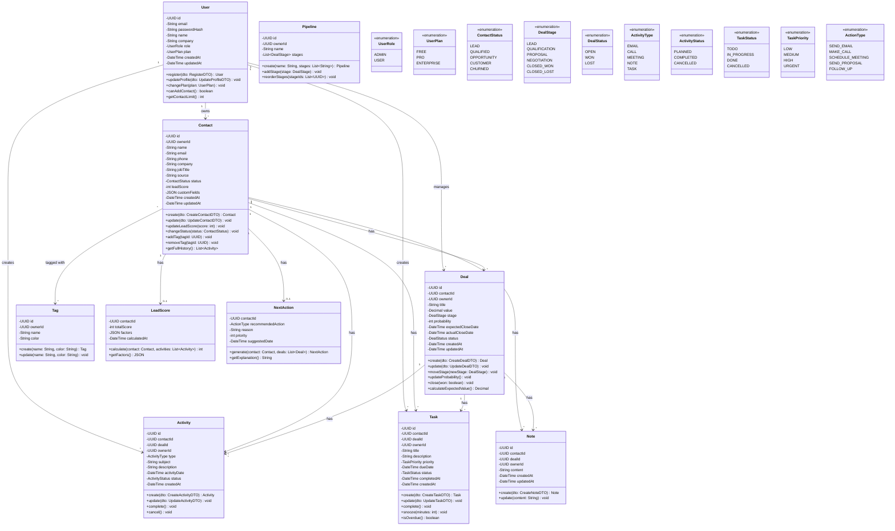
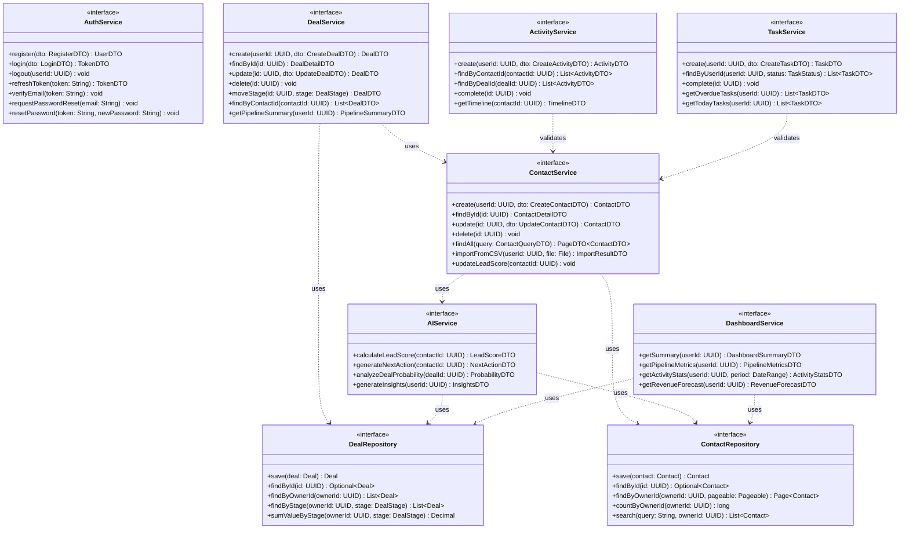
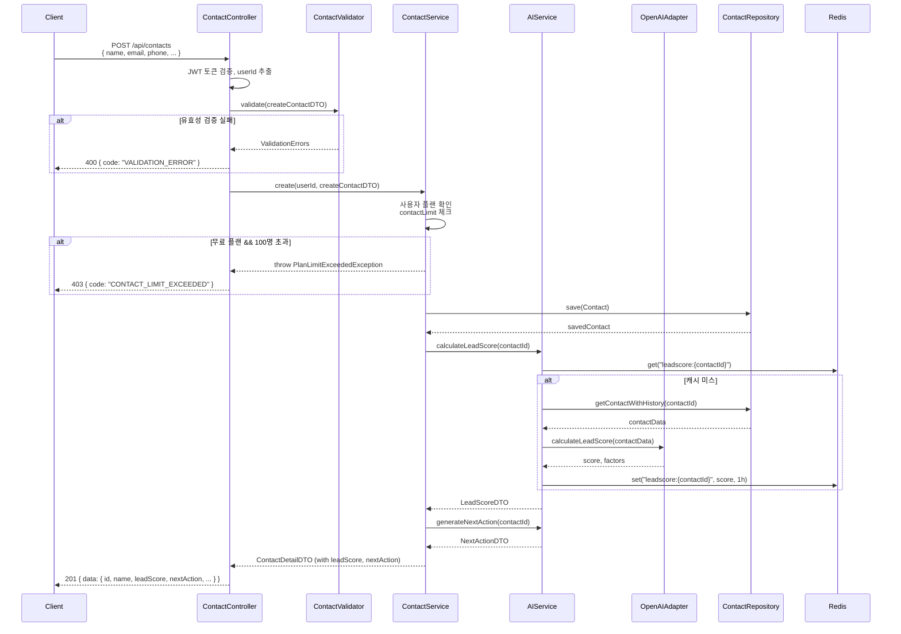
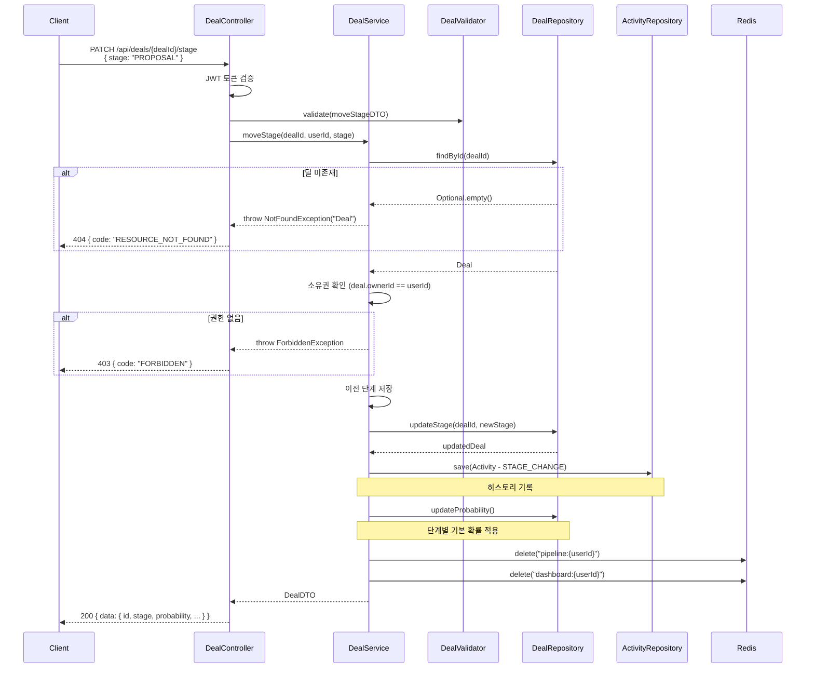
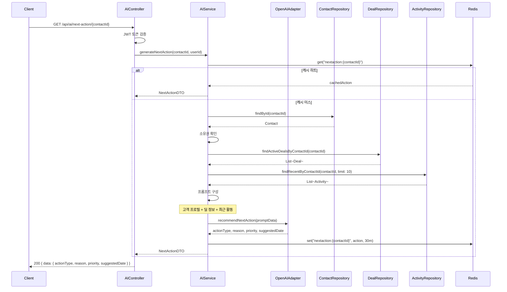
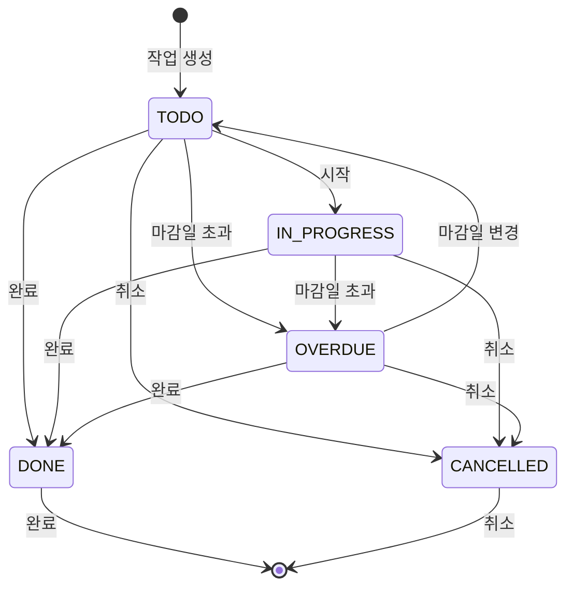
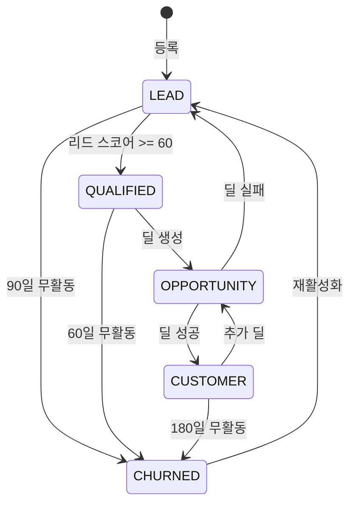

# 상세 설계서 (Detailed Design Document)

| 항목 | 내용 |
|------|------|
| **프로젝트명** | VIVE CRM |
| **문서 버전** | v1.0 |
| **작성일** | 2026-02-24 |
| **작성자** | 조훈상 / 기획·개발 |
| **승인자** | 조훈상 / 프로젝트 오너 |
| **문서 상태** | 초안 |

---

## 1. 문서 개요

### 1.1 목적

본 문서는 VIVE CRM의 상세 설계를 정의한다. 시스템 아키텍처 설계서(SAD)에서 정의된 아키텍처를 기반으로, 각 모듈의 클래스 구조, 시퀀스 흐름, 상태 전이, 디자인 패턴 적용 등 구현 수준의 설계를 기술한다.

### 1.2 범위

- 도메인 모델 및 클래스 다이어그램
- 주요 비즈니스 로직의 시퀀스 다이어그램
- 엔티티 상태 전이 다이어그램
- 모듈별 상세 설계 (인터페이스, 의존성, 주요 로직)
- AI 리드 스코어링 및 다음 행동 추천 알고리즘 설계
- 코딩 표준 및 코드 리뷰 체크리스트

### 1.3 참조 문서

| 문서명 | 버전 | 비고 |
|--------|------|------|
| 시스템 아키텍처 설계서 (SAD) | v1.0 | 아키텍처 및 기술 스택 |
| 데이터베이스 설계서 | v1.0 | 테이블 명세 및 관계 |
| API 설계서 | v1.0 | API 명세 |
| 화면 설계서 | v1.0 | UI/UX 명세 |
| 요구사항 정의서 (SRS) | v1.0 | 기능/비기능 요구사항 |

### 1.4 변경 이력

| 버전 | 날짜 | 작성자 | 변경 내용 |
|------|------|--------|-----------|
| v0.1 | 2026-02-24 | 조훈상 | 초안 작성 |
| v1.0 | 2026-02-24 | 조훈상 | CRM 도메인별 상세 설계 완료 |

---

## 2. 클래스 다이어그램

### 2.1 도메인 모델 전체 뷰



### 2.2 서비스 계층 클래스 다이어그램



### 2.3 Infrastructure 계층 클래스 다이어그램

```mermaid
classDiagram
    class JwtTokenProvider {
        -String secretKey
        -long accessTokenExpiry
        -long refreshTokenExpiry
        +generateAccessToken(userId: UUID, email: String) String
        +generateRefreshToken(userId: UUID) String
        +validateToken(token: String) boolean
        +extractUserId(token: String) UUID
        +extractEmail(token: String) String
    }

    class PasswordEncoder {
        <<interface>>
        +encode(rawPassword: String) String
        +matches(rawPassword: String, encodedPassword: String) boolean
    }

    class BcryptPasswordEncoder {
        -int costFactor
        +encode(rawPassword: String) String
        +matches(rawPassword: String, encodedPassword: String) boolean
    }

    class AIAdapter {
        <<interface>>
        +calculateLeadScore(contactData: JSON) int
        +recommendNextAction(contactHistory: JSON) ActionRecommendation
        +analyzeSentiment(text: String) SentimentScore
    }

    class OpenAIAdapter {
        -String apiKey
        -String model
        +calculateLeadScore(contactData: JSON) int
        +recommendNextAction(contactHistory: JSON) ActionRecommendation
        +analyzeSentiment(text: String) SentimentScore
    }

    class EmailClient {
        <<interface>>
        +send(to: String, subject: String, body: String) void
        +sendTemplate(to: String, template: String, data: Map) void
    }

    class SmtpEmailClient {
        -String host
        -int port
        -String username
        +send(to: String, subject: String, body: String) void
    }

    class CacheClient {
        <<interface>>
        +get(key: String) Optional~String~
        +set(key: String, value: String, ttl: Duration) void
        +delete(key: String) void
    }

    class RedisCacheClient {
        -RedisClient redisClient
        +get(key: String) Optional~String~
        +set(key: String, value: String, ttl: Duration) void
    }

    PasswordEncoder <|.. BcryptPasswordEncoder
    AIAdapter <|.. OpenAIAdapter
    EmailClient <|.. SmtpEmailClient
    CacheClient <|.. RedisCacheClient
```



---

## 3. 시퀀스 다이어그램

### 3.1 고객 등록 및 AI 리드 스코어링 플로우



### 3.2 파이프라인 딜 이동 플로우



### 3.3 다음 행동 추천 생성 플로우



---

## 4. 상태 다이어그램

### 4.1 딜(Deal) 상태

```mermaid
stateDiagram-v2
    [*] --> LEAD : 딜 생성

    LEAD --> QUALIFICATION : 자격 확인
    LEAD --> CLOSED_LOST : 실격/취소

    QUALIFICATION --> PROPOSAL : 제안 준비
    QUALIFICATION --> CLOSED_LOST : 기회 상실

    PROPOSAL --> NEGOTIATION : 협상 시작
    PROPOSAL --> CLOSED_LOST : 거절

    NEGOTIATION --> CLOSED_WON : 계약 체결
    NEGOTIATION --> CLOSED_LOST : 협상 결렬

    CLOSED_WON --> [*] : 완료
    CLOSED_LOST --> LEAD : 재시도
    CLOSED_LOST --> [*] : 포기

    state "오픈" as OpenState {
        [*] --> LEAD
    }

    note right of LEAD : 확률: 10%
    note right of QUALIFICATION : 확률: 25%
    note right of PROPOSAL : 확률: 50%
    note right of NEGOTIATION : 확률: 75%
    note right of CLOSED_WON : 확률: 100%
    note right of CLOSED_LOST : 확률: 0%
```

#### 상태 전이 규칙

| 현재 상태 | 이벤트 | 다음 상태 | 트리거 | 부가 동작 |
|-----------|--------|-----------|--------|-----------|
| - | 딜 생성 | LEAD | 사용자 | 리드 스코어 계산 |
| LEAD | 자격 확인 완료 | QUALIFICATION | 사용자 | 확률 25%로 업데이트 |
| LEAD | 실격/취소 | CLOSED_LOST | 사용자 | 실패 사유 기록 |
| QUALIFICATION | 제안 준비 완료 | PROPOSAL | 사용자 | 확률 50%로 업데이트 |
| QUALIFICATION | 기회 상실 | CLOSED_LOST | 사용자 | 실패 사유 기록 |
| PROPOSAL | 협상 시작 | NEGOTIATION | 사용자 | 확률 75%로 업데이트 |
| PROPOSAL | 거절 | CLOSED_LOST | 사용자 | 실패 사유 기록 |
| NEGOTIATION | 계약 체결 | CLOSED_WON | 사용자 | 실제 종료일 기록, 매출 집계 |
| NEGOTIATION | 협상 결렬 | CLOSED_LOST | 사용자 | 실패 사유 기록 |
| CLOSED_LOST | 재시도 | LEAD | 사용자 | 재시도 횟수 증가 |

### 4.2 작업(Task) 상태



### 4.3 연락처(Contact) 상태



---

## 5. 모듈 상세 설계

### 5.1 AuthModule

| 항목 | 내용 |
|------|------|
| **모듈명** | AuthModule |
| **책임** | 사용자 인증, 세션 관리, 비밀번호 관리 |
| **의존성** | Database (UserRepository), JwtTokenProvider, PasswordEncoder, EmailClient |

#### 인터페이스 정의

```
AuthService
├── register(dto: RegisterDTO): UserDTO
│   - 이메일 중복 검사
│   - 비밀번호 해싱 (bcrypt)
│   - 사용자 생성 (plan: FREE)
│   - JWT 토큰 발급
│
├── login(dto: LoginDTO): TokenDTO
│   - 이메일로 사용자 조회
│   - 비밀번호 검증
│   - Access Token + Refresh Token 발급
│   - 마지막 로그인 시각 갱신
│
├── logout(userId: UUID): void
│   - Refresh Token 무효화
│
├── refreshToken(refreshToken: String): TokenDTO
│   - Refresh Token 유효성 검증
│   - 새 Access Token 발급
│
├── requestPasswordReset(email: String): void
│   - 재설정 토큰 생성 (1시간 유효)
│   - 이메일 발송
│
└── resetPassword(token: String, newPassword: String): void
    - 토큰 검증
    - 새 비밀번호 해싱 & 저장
    - 모든 세션 무효화
```

### 5.2 ContactModule

| 항목 | 내용 |
|------|------|
| **모듈명** | ContactModule |
| **책임** | 고객(연락처) CRUD, 태그 관리, CSV 임포트 |
| **의존성** | UserModule, AIService, TagModule, FileStorage |

#### 주요 로직

**리드 스코어 자동 계산:**
```
calculateLeadScore(contact):
  1. 고객 프로필 점수 (30%)
     - 직책 (C-Level: 10점, VP: 7점, Manager: 5점, ...)
     - 회사 규모 (대기업: 10점, 중견: 7점, 중소: 5점, ...)
     - 연락처 완성도 (이메일+전화: 10점, ...)
  
  2. 행동 점수 (40%)
     - 최근 활동 빈도 (1주 내: 10점, 1개월: 5점, ...)
     - 이메일 오픈/클릭률 (높음: 10점, 중간: 5점, ...)
     - 웹사이트 방문 횟수
  
  3. 딜 관련 점수 (30%)
     - 현재 딜 단계 (NEGOTIATION: 10점, ...)
     - 딜 가치
     - 예상 종료일 임박
  
  4. 총점 = 가중 평균 (0~100)
  5. 60점 이상: QUALIFIED 상태로 전환
```

### 5.3 DealModule

| 항목 | 내용 |
|------|------|
| **모듈명** | DealModule |
| **책임** | 영업 파이프라인 관리, 딜 CRUD, 단계 이동 |
| **의존성** | ContactModule, ActivityModule, DashboardModule |

#### 파이프라인 기본 단계

| 단계 | 확률 | 예상 소요 기간 | 완료 기준 |
|------|------|---------------|-----------|
| LEAD | 10% | 1-2주 | 자격 확인 완료 |
| QUALIFICATION | 25% | 1-2주 | 니즈 확인, 예산 확인 |
| PROPOSAL | 50% | 2-4주 | 제안서 제출 |
| NEGOTIATION | 75% | 1-4주 | 협상 진행 중 |
| CLOSED_WON | 100% | - | 계약 체결 |
| CLOSED_LOST | 0% | - | 기회 상실 |

### 5.4 AIModule

| 항목 | 내용 |
|------|------|
| **모듈명** | AIModule |
| **책임** | 리드 스코어링, 다음 행동 추천, 인사이트 생성 |
| **의존성** | ContactModule, DealModule, ActivityModule, AIAdapter |

#### AI 추천 알고리즘

**다음 행동 추천 로직:**
```
generateNextAction(contact):
  1. 최근 활동 분석 (최근 30일)
     - 마지막 활동 유형 및 날짜
     - 활동 빈도 추이
     - 응답률 분석
  
  2. 딜 상태 확인
     - 현재 진행 중인 딜 단계
     - 예상 종료일 임박 여부
     - 딜 가치
  
  3. 추천 생성 규칙
     - 3일 이상 활동 없음 → FOLLOW_UP
     - QUALIFICATION 단계 → SCHEDULE_MEETING
     - PROPOSAL 단계 → SEND_PROPOSAL
     - NEGOTIATION 단계 → MAKE_CALL
     - 응답 없는 이메일 → SEND_EMAIL
  
  4. 우선순위 계산
     - 딜 가치 높음 + 종료일 임박 = URGENT
     - 리드 스코어 높음 = HIGH
     - 일반 = MEDIUM
  
  5. 추천 시점 계산
     - 업무 시간 기준 (09:00-18:00)
     - 고객 응답 패턴 분석
```

### 5.5 DashboardModule

| 항목 | 내용 |
|------|------|
| **모듈명** | DashboardModule |
| **책임** | 대시보드 데이터 집계, 리포트 생성, 메트릭 계산 |
| **의존성** | ContactModule, DealModule, ActivityModule, Cache |

#### 주요 메트릭

| 메트릭 | 설명 | 계산 방법 |
|--------|------|-----------|
| 파이프라인 가치 | 각 단계 딜 가치 합계 | SUM(deal.value) GROUP BY stage |
| 예상 매출 | 확률 가중 파이프라인 가치 | SUM(deal.value × deal.probability) |
| 전환율 | 단계 간 이동 비율 | COUNT(stage_n+1) / COUNT(stage_n) |
| 평균 영업 사이클 | LEAD → CLOSED_WON 평균 기간 | AVG(actualCloseDate - createdAt) |
| 활동 완료율 | 예정된 활동 중 완료 비율 | COUNT(completed) / COUNT(total) |

---

## 6. 디자인 패턴 적용 기록

### 6.1 적용 패턴 목록

| 패턴명 | 적용 위치 | 목적 | 코드 구조 설명 |
|--------|-----------|------|---------------|
| **Repository** | 모든 데이터 접근 계층 | 데이터 접근 로직을 도메인으로부터 분리 | `ContactRepository` 인터페이스 → `PrismaContactRepository` 구현체 |
| **Strategy** | AI 서비스 연동 | AI 제공사(OpenAI, Claude 등) 교체 용이성 | `AIAdapter` 인터페이스 → `OpenAIAdapter` 구현 |
| **Adapter** | 외부 서비스 연동 | 외부 API 변경 시 영향 최소화 | `EmailClient` 인터페이스 → `SmtpEmailClient` 구현 |
| **Observer (Event)** | 도메인 이벤트 처리 | 딜 단계 변경 시 알림, 리포트 갱신 등 부수 효과 처리 | `DealStageChangedEvent` → `NotificationHandler`, `ReportHandler` |
| **Builder** | DTO 생성, 쿼리 빌더 | 복잡한 객체 생성을 단계별로 구성 | `ContactQueryBuilder.withTags().withDeals().build()` |
| **Decorator** | 캐시 적용 | 기존 Repository에 캐싱 로직 투명하게 추가 | `CachedContactRepository`가 `ContactRepository`를 감싸는 구조 |
| **Factory** | AI 프롬프트 생성 | 다양한 AI 요청의 프롬프트 생성 로직 캡슐화 | `PromptFactory.createLeadScorePrompt(contactData)` |
| **Template Method** | CSV 임포트/익스포트 | 다양한 파일 형식의 공통 처리 흐름 정의 | `AbstractImporter.import()` → `CSVImporter.parse()` |

### 6.2 패턴 적용 상세 예시

#### Repository 패턴

```typescript
// 인터페이스 (Domain 계층)
interface ContactRepository {
  save(contact: Contact): Promise<Contact>;
  findById(id: string): Promise<Contact | null>;
  findByOwnerId(ownerId: string, options: PaginationOptions): Promise<Page<Contact>>;
  search(query: string, ownerId: string): Promise<Contact[]>;
}

// 구현체 (Infrastructure 계층)
class PrismaContactRepository implements ContactRepository {
  constructor(private prisma: PrismaClient) {}
  
  async save(contact: Contact): Promise<Contact> {
    return this.prisma.contact.upsert({...});
  }
  
  // ... 구현
}
```

#### Strategy 패턴 (AI 어댑터)

```typescript
interface AIAdapter {
  calculateLeadScore(contactData: ContactData): Promise<number>;
  recommendNextAction(history: ActivityHistory): Promise<ActionRecommendation>;
}

class OpenAIAdapter implements AIAdapter {
  async calculateLeadScore(contactData: ContactData): Promise<number> {
    const prompt = PromptFactory.createLeadScorePrompt(contactData);
    const response = await this.openai.chat.completions.create({...});
    return this.parseScore(response);
  }
}

// 사용
class AIService {
  constructor(private aiAdapter: AIAdapter) {}
  
  async calculateLeadScore(contactId: string) {
    const data = await this.getContactData(contactId);
    return this.aiAdapter.calculateLeadScore(data);
  }
}
```

---

## 7. 코딩 표준

### 7.1 네이밍 컨벤션

| 대상 | 규칙 | 예시 |
|------|------|------|
| 파일명 (클래스) | PascalCase | `ContactService.ts`, `DealController.ts` |
| 파일명 (유틸) | camelCase | `dateUtils.ts`, `formatHelpers.ts` |
| 클래스 | PascalCase | `ContactService`, `DealRepository` |
| 인터페이스 | PascalCase (접두사 `I` 미사용) | `ContactRepository`, `AIService` |
| 메서드/함수 | camelCase | `findById()`, `createContact()` |
| 변수 | camelCase | `contactId`, `dealValue` |
| 상수 | UPPER_SNAKE_CASE | `MAX_CONTACTS_FREE`, `DEFAULT_PAGE_SIZE` |
| Enum 값 | UPPER_SNAKE_CASE | `DealStage.PROPOSAL`, `TaskStatus.DONE` |
| DB 컬럼 | snake_case | `created_at`, `owner_id` |
| URL 경로 | kebab-case | `/api/contacts`, `/deals/pipeline` |

### 7.2 코드 구조

#### 디렉토리 구조

```
src/
├── modules/                    # 기능 모듈 (도메인별 그룹화)
│   ├── auth/
│   │   ├── controllers/
│   │   ├── services/
│   │   ├── dto/
│   │   └── guards/
│   ├── contacts/
│   │   ├── controllers/
│   │   ├── services/
│   │   ├── dto/
│   │   ├── repositories/
│   │   └── entities/
│   ├── deals/
│   ├── activities/
│   ├── tasks/
│   ├── ai/
│   └── dashboard/
├── common/                     # 공통 모듈
│   ├── exceptions/
│   ├── middleware/
│   ├── decorators/
│   ├── pipes/
│   └── utils/
├── config/                     # 환경 설정
└── infrastructure/             # 인프라 구현체
    ├── database/
    ├── cache/
    ├── email/
    └── ai/
```

### 7.3 에러 처리 규칙

| 규칙 | 설명 |
|------|------|
| 커스텀 예외 사용 | 비즈니스 로직 에러는 `AppException` 상속 클래스 사용 |
| 예외 계층 구조 | `AppException` → `NotFoundException`, `ValidationException` 등 |
| 글로벌 예외 핸들러 | 모든 예외를 한 곳에서 처리하여 일관된 에러 응답 반환 |
| 에러 코드 | `CONTACT_NOT_FOUND`, `DEAL_LIMIT_EXCEEDED` 등 도메인별 코드 사용 |

#### 예외 클래스 구조

```typescript
AppException (base)
├── NotFoundException        // 404 - 리소스 미존재
├── ValidationException      // 400 - 유효성 검증 실패
├── UnauthorizedException    // 401 - 인증 실패
├── ForbiddenException       // 403 - 권한 부족
├── ConflictException        // 409 - 중복/충돌
└── PlanLimitExceededException // 403 - 플랜 제한 초과
```

### 7.4 코드 리뷰 체크리스트

#### 기능 (Functionality)
- [ ] 요구사항을 올바르게 구현했는가?
- [ ] Edge Case가 처리되었는가?
- [ ] 에러 처리가 적절한가?

#### 보안 (Security)
- [ ] SQL Injection 방어 (Parameterized Query 사용)
- [ ] 인증/인가가 올바르게 적용되었는가?
- [ ] 민감 정보가 로그에 노출되지 않는가?

#### 성능 (Performance)
- [ ] N+1 쿼리 문제가 없는가?
- [ ] 적절한 인덱스를 사용하는가?
- [ ] 캐시가 필요한 곳에 적용되었는가?

#### 코드 품질 (Quality)
- [ ] 네이밍 컨벤션을 준수하는가?
- [ ] 코드 중복이 없는가? (DRY)
- [ ] 함수/메서드가 단일 책임을 가지는가?

---

## 부록

### A. DTO 목록

| DTO 명 | 용도 | 주요 필드 |
|--------|------|-----------|
| `RegisterDTO` | 회원 가입 요청 | email, password, name, company |
| `LoginDTO` | 로그인 요청 | email, password |
| `TokenDTO` | 토큰 응답 | accessToken, refreshToken, expiresIn |
| `CreateContactDTO` | 고객 생성 요청 | name, email, phone, company, jobTitle |
| `ContactDTO` | 고객 응답 | id, name, email, leadScore, status |
| `CreateDealDTO` | 딜 생성 요청 | title, value, contactId, stage |
| `DealDTO` | 딜 응답 | id, title, value, stage, probability |
| `CreateActivityDTO` | 활동 생성 요청 | type, subject, contactId, activityDate |
| `CreateTaskDTO` | 작업 생성 요청 | title, dueDate, priority, contactId |
| `LeadScoreDTO` | 리드 스코어 응답 | score, factors, calculatedAt |
| `NextActionDTO` | 다음 행동 추천 응답 | actionType, reason, priority, suggestedDate |
| `DashboardSummaryDTO` | 대시보드 요약 | totalContacts, totalDeals, pipelineValue, overdueTasks |

### B. 참조 문서

| 문서 | 경로 |
|------|------|
| 시스템 아키텍처 설계서 | `../02-시스템설계/시스템아키텍처설계서-SAD.md` |
| 데이터베이스 설계서 | `../02-시스템설계/데이터베이스설계서.md` |
| API 설계서 | `../02-시스템설계/API설계서.md` |
| 화면 설계서 | `../02-시스템설계/화면설계서.md` |
| 요구사항 정의서 | `../01-요구사항분석/요구사항명세서-SRS.md` |
