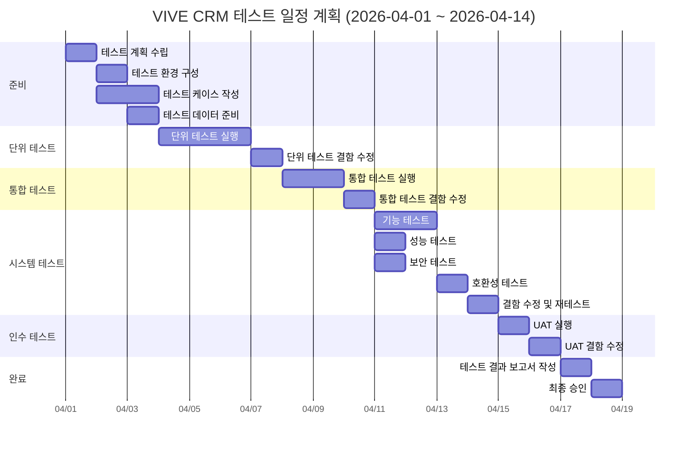

# 테스트 계획서 (Test Plan)

| 항목 | 내용 |
|------|------|
| **프로젝트명** | VIVE CRM |
| **문서 버전** | v1.0 |
| **작성일** | 2026-02-24 |
| **작성자** | 조훈상 / 기획·개발 |
| **승인자** | 조훈상 / Product Owner |
| **문서 상태** | [v] 초안 / [ ] 검토 중 / [ ] 승인됨 |

---

## 1. 문서 개요

### 1.1 목적

본 문서는 VIVE CRM 프로젝트의 테스트 활동 전반에 대한 계획을 수립하여, 테스트 범위, 전략, 일정, 리소스, 환경 등을 정의하고 관련 이해관계자 간 합의를 도출하기 위해 작성한다.

### 1.2 범위

- **대상 시스템**: VIVE CRM v1.0 (MVP)
- **테스트 대상 범위**: 회원가입/로그인, 고객(연락처) 관리, 딜(영업기회) 관리, AI 리드 스코어링, 다음 행동 추천, 활동 추적, 작업/알림, 대시보드, 리포트
- **테스트 기간**: 2026-04-01 ~ 2026-04-14

### 1.3 참조 문서

| 문서명 | 버전 | 비고 |
|--------|------|------|
| 요구사항 명세서 (SRS) | v1.0 | 기능/비기능 요구사항 기준 |
| 시스템 아키텍처 설계서 (SAD) | v1.0 | 아키텍처 및 인터페이스 기준 |
| API 설계서 | v1.0 | API 테스트 기준 |
| 화면설계서 | v1.0 | UI/UX 테스트 기준 |
| 데이터베이스 설계서 | v1.0 | 데이터 정합성 테스트 기준 |

### 1.4 변경 이력

| 버전 | 변경일 | 변경 내용 | 작성자 | 승인자 |
|------|--------|-----------|--------|--------|
| v0.1 | 2026-02-24 | 초안 작성 | 조훈상 | - |
| v0.9 | 2026-03-15 | MVP 범위 반영 | 조훈상 | - |
| v1.0 | 2026-03-25 | 최종 승인 | 조훈상 | 조훈상 |

### 1.5 용어 정의

| 용어 | 설명 |
|------|------|
| SUT (System Under Test) | 테스트 대상 시스템 |
| TC (Test Case) | 테스트 케이스 |
| RTM (Requirements Traceability Matrix) | 요구사항 추적 매트릭스 |
| UAT (User Acceptance Test) | 사용자 인수 테스트 |
| CI/CD | Continuous Integration / Continuous Deployment |
| SLA | Service Level Agreement |
| CRM | Customer Relationship Management |
| Lead Scoring | 잠재 고객의 구매 가능성을 수치화하는 AI 기능 |
| Deal | 영업기회 (딜) |

---

## 2. 테스트 전략

### 2.1 테스트 레벨별 전략

#### 2.1.1 단위 테스트 (Unit Test)

| 항목 | 내용 |
|------|------|
| **목적** | 개별 함수/메서드/컴포넌트 단위의 정확성 검증 |
| **범위** | 비즈니스 로직, 유틸리티 함수, 데이터 모델, 개별 UI 컴포넌트 |
| **테스트 도구** | Vitest |
| **커버리지 목표** | Statement Coverage 80% 이상, Branch Coverage 70% 이상 |
| **담당** | 개발팀 (각 모듈 개발자) |
| **자동화 수준** | 100% 자동화 (CI 파이프라인 연동) |
| **실행 빈도** | 코드 커밋 시 자동 실행 |

**단위 테스트 기준**:
- 모든 public 메서드에 대한 테스트 작성
- 경계값 및 예외 상황 포함
- 외부 의존성은 Mock/Stub 처리
- 각 테스트는 독립적으로 실행 가능해야 함

#### 2.1.2 통합 테스트 (Integration Test)

| 항목 | 내용 |
|------|------|
| **목적** | 모듈 간 인터페이스 및 데이터 흐름 검증 |
| **범위** | API 엔드포인트, DB 연동, 외부 서비스 연동, 모듈 간 호출 |
| **테스트 도구** | Vitest + Supertest |
| **담당** | 개발팀 |
| **자동화 수준** | 90% 자동화 |
| **실행 빈도** | PR 머지 시 / 일 1회 |

**통합 테스트 기준**:
- API 요청/응답 포맷 검증
- DB CRUD 정합성 검증
- 외부 서비스 연동 (실제 또는 Mock 서버)
- 인증/인가 흐름 검증
- 데이터 일관성 검증

#### 2.1.3 시스템 테스트 (System Test)

| 항목 | 내용 |
|------|------|
| **목적** | 전체 시스템 기능 및 비기능 요구사항의 충족 여부 검증 |
| **범위** | 전체 기능 시나리오, E2E 흐름, 성능, 보안, 호환성 |
| **테스트 도구** | Playwright / Cypress, k6 |
| **담당** | 개발팀 (QA) |
| **자동화 수준** | 핵심 시나리오 70% 자동화, 탐색적 테스트 수동 |
| **실행 빈도** | 스프린트/빌드 단위 |

**시스템 테스트 기준**:
- 요구사항 명세서 기반 전수 테스트
- E2E 시나리오 기반 테스트
- 비기능 요구사항 (성능, 보안, 호환성) 테스트
- 에러 핸들링 및 예외 상황 테스트

#### 2.1.4 인수 테스트 (Acceptance Test / UAT)

| 항목 | 내용 |
|------|------|
| **목적** | 사용자 관점에서 시스템이 비즈니스 요구사항을 충족하는지 검증 |
| **범위** | 핵심 비즈니스 시나리오, 사용자 워크플로우 |
| **테스트 도구** | 수동 테스트 + 테스트 시나리오 문서 |
| **담당** | Product Owner / 남편 (실제 사용자) |
| **자동화 수준** | 수동 |
| **실행 빈도** | 시스템 테스트 완료 후 1회 |

**인수 테스트 기준**:
- 비즈니스 시나리오 기반 테스트
- 실제 업무 데이터 활용
- 최종 사용자 참여 필수
- 인수 기준 사전 합의

### 2.2 테스트 유형별 전략

#### 2.2.1 기능 테스트 (Functional Test)

| 항목 | 내용 |
|------|------|
| **목적** | 명세된 기능 요구사항의 정확한 동작 검증 |
| **접근 방법** | 요구사항 기반 블랙박스 테스트 |
| **기법** | 동등 분할, 경계값 분석, 의사결정 테이블, 상태 전이 |
| **도구** | Playwright / Cypress |
| **우선순위** | 높음 |

#### 2.2.2 성능 테스트 (Performance Test)

| 항목 | 내용 |
|------|------|
| **목적** | 시스템 응답 시간, 처리량, 안정성 검증 |
| **유형** | 부하 테스트 (Load), 스트레스 테스트 (Stress), 지속성 테스트 (Endurance) |
| **도구** | k6 |
| **목표** | API 평균 응답 시간 200ms 이하, 동시 사용자 50명 처리 |
| **환경** | 스테이징 환경 |
| **우선순위** | 중간 |

**성능 테스트 시나리오**:
- 일반 부하: 평균 동시 사용자 수 기준 (10명)
- 피크 부하: 최대 예상 동시 사용자 수 기준 (50명)
- 스트레스: 최대 용량 초과 시 시스템 동작 확인
- 지속성: 1시간 연속 부하 시 성능 저하 여부

#### 2.2.3 보안 테스트 (Security Test)

| 항목 | 내용 |
|------|------|
| **목적** | 보안 취약점 식별 및 보안 요구사항 충족 검증 |
| **범위** | OWASP Top 10, 인증/인가, 데이터 보호, 입력 검증 |
| **도구** | OWASP ZAP, npm audit, SonarQube |
| **점검 항목** | XSS, CSRF, SQL Injection, 인증 우회, 세션 관리, 암호화 |
| **우선순위** | 높음 |

**보안 테스트 체크리스트**:
- [ ] 인증 및 세션 관리 취약점 점검
- [ ] 입력값 검증 (XSS, SQL Injection, Command Injection)
- [ ] CSRF 토큰 검증
- [ ] 민감 데이터 암호화 검증 (전송 중 / 저장 시)
- [ ] API 인가 검증 (권한 상승 시도)
- [ ] 에러 메시지 정보 노출 점검
- [ ] 의존성 취약점 스캔

#### 2.2.4 호환성 테스트 (Compatibility Test)

| 항목 | 내용 |
|------|------|
| **목적** | 다양한 환경에서의 정상 동작 검증 |
| **범위** | 브라우저, OS, 모바일 기기, 해상도 |
| **도구** | 실기기 테스트 |
| **우선순위** | 낮음 |

**대상 환경 매트릭스**:

| 브라우저 | 버전 | OS | 비고 |
|----------|------|----|------|
| Chrome | 최신 2개 버전 | Windows, macOS | 주력 브라우저 |
| Firefox | 최신 2개 버전 | Windows, macOS | |
| Safari | 최신 2개 버전 | macOS, iOS | |
| Edge | 최신 2개 버전 | Windows | |

| 모바일 기기 | OS 버전 | 해상도 | 비고 |
|-------------|---------|--------|------|
| iPhone 15 Pro | iOS 17+ | 393x852 | |
| iPhone SE | iOS 17+ | 375x667 | 소형 화면 |
| Galaxy S24 | Android 14+ | 360x780 | |
| iPad Air | iPadOS 17+ | 820x1180 | 태블릿 |

#### 2.2.5 접근성 테스트 (Accessibility Test)

| 항목 | 내용 |
|------|------|
| **목적** | 장애인 사용자를 포함한 모든 사용자의 시스템 이용 가능성 검증 |
| **기준** | WCAG 2.1 AA 준수 |
| **도구** | axe DevTools, Lighthouse, WAVE |
| **우선순위** | 중간 |

#### 2.2.6 UX 테스트 (Usability Test)

| 항목 | 내용 |
|------|------|
| **목적** | 사용자 경험 및 사용 편의성 검증 |
| **방법** | 태스크 기반 사용성 테스트, 휴리스틱 평가 |
| **참여자** | 대상 사용자 2명 (PO, 실제 사용자) |
| **도구** | 화면 녹화, 관찰 기록지 |
| **우선순위** | 중간 |

---

## 3. 테스트 범위

### 3.1 In-Scope 항목

| 기능 ID | 기능명 | 테스트 레벨 | 우선순위 | 비고 |
|---------|--------|-------------|----------|------|
| FR-001 | 회원가입/로그인 | 단위, 통합, 시스템, 인수 | 높음 | 소셜 로그인 포함 |
| FR-002 | 고객(연락처) 관리 | 단위, 통합, 시스템, 인수 | 높음 | CRUD, 태그, 필터 |
| FR-003 | 딜(영업기회) 관리 | 단위, 통합, 시스템, 인수 | 높음 | 파이프라인, 단계 관리 |
| FR-004 | AI 리드 스코어링 | 통합, 시스템 | 높음 | AI 모델 연동 |
| FR-005 | 다음 행동 추천 | 통합, 시스템 | 높음 | AI 추천 엔진 |
| FR-006 | 활동 추적 | 단위, 통합, 시스템 | 중간 | 이메일, 전화, 미팅 |
| FR-007 | 작업/알림 | 통합, 시스템 | 중간 | 알림, 리마인더 |
| FR-008 | 대시보드 | 시스템, 인수 | 중간 | KPI, 차트 |
| FR-009 | 리포트 | 시스템 | 낮음 | 기본 리포트 |
| REQ-NF-001 | 성능 요구사항 | 시스템 | 중간 | 비기능 |
| REQ-NF-002 | 보안 요구사항 | 시스템 | 높음 | 비기능 |
| REQ-NF-003 | 접근성 요구사항 | 시스템 | 중간 | 비기능 |

### 3.2 Out-of-Scope 항목

| 항목 | 사유 |
|------|------|
| 타 CRM 시스템 연동 (Salesforce, HubSpot) | Phase 2에서 수행 예정 |
| 다국어(i18n) 테스트 | 현재 버전은 한국어만 지원 |
| 이메일 발송 서비스 내부 동작 | 외부 서비스 제공사 책임 범위 |
| AI 모델 학습/재학습 테스트 | AI 서비스 제공사 책임 범위 |
| 재해 복구(DR) 테스트 | 인프라 별도 수행 |

---

## 4. 테스트 환경

### 4.1 환경 구성

#### 4.1.1 서버 환경

| 환경 | 용도 | 서버 구성 | OS | 비고 |
|------|------|-----------|----|----|
| 개발 (DEV) | 개발자 통합 테스트 | Vercel Hobby | - | 서버리스 |
| 테스트 (QA) | QA 테스트 전용 | Vercel Pro | - | 스테이징 환경 |
| 운영 (PROD) | 실 서비스 | Vercel Pro | - | 테스트 직접 불가 |

#### 4.1.2 데이터베이스

| 환경 | DBMS | 버전 | 호스트 | 비고 |
|------|------|------|--------|------|
| DEV | PostgreSQL | 15.x | Supabase / Neon | 개발용 인스턴스 |
| QA | PostgreSQL | 15.x | Supabase / Neon | 테스트용 인스턴스 |
| STG | PostgreSQL | 15.x | Supabase / Neon | 스테이징 인스턴스 |

**캐시/세션 저장소**:
| 환경 | 서비스 | 비고 |
|------|--------|------|
| 전체 | Redis (Upstash) | 세션, 캐시, Rate Limiting |

#### 4.1.3 외부 연동 서비스

| 서비스 | 테스트 환경 | 비고 |
|--------|-------------|------|
| Google OAuth | Sandbox | 소셜 로그인 |
| OpenAI API | 테스트 계정 | AI 리드 스코어링, 다음 행동 추천 |
| Resend / SendGrid | 테스트 계정 | 이메일 발송 |
| Vercel Blob | 테스트 버킷 | 파일 스토리지 |

### 4.2 테스트 데이터 준비 전략

| 구분 | 전략 | 도구/방법 | 비고 |
|------|------|-----------|------|
| 기초 데이터 | Seed 데이터 스크립트 | Prisma Seed | 매 테스트 사이클 초기화 |
| 대량 데이터 | 데이터 생성기 | Faker.js | 성능 테스트용 |
| 엣지 케이스 | 수동 구성 | 테스트 케이스별 정의 | 경계값, 특수문자 등 |

**테스트 데이터 관리 원칙**:
- 테스트 환경 데이터는 운영 데이터와 완전히 분리
- 개인정보가 포함된 데이터는 반드시 비식별화 처리
- 각 테스트 사이클 시작 시 데이터 초기화
- 테스트 데이터 생성/정리 스크립트 버전 관리

### 4.3 테스트 계정 목록

| 계정 ID | 역할 | 권한 수준 | 용도 | 비고 |
|---------|------|-----------|------|------|
| admin@vivecrm.test | 시스템 관리자 | 전체 관리 권한 | 관리자 기능 테스트 | |
| sales@vivecrm.test | 영업 담당자 | 딜/고객 관리 권한 | 일반 영업 기능 테스트 | |
| manager@vivecrm.test | 영업 매니저 | 팀 관리 권한 | 권한별 기능 테스트 | |
| readonly@vivecrm.test | 읽기 전용 | 조회 권한만 | 권한 제한 테스트 | |
| newuser@vivecrm.test | 신규 가입용 | 없음 | 회원가입 테스트 | 매회 초기화 |

---

## 5. 진입/종료 기준

### 5.1 테스트 레벨별 진입/종료 기준

#### 단위 테스트

| 구분 | 기준 |
|------|------|
| **진입 기준** | - 코드 구현 완료 및 코드 리뷰 통과 |
| | - Vitest 환경 구성 완료 |
| | - 테스트 대상 코드의 설계 문서 확인 |
| **종료 기준** | - Statement Coverage 80% 이상 달성 |
| | - Branch Coverage 70% 이상 달성 |
| | - 모든 Critical/Major 결함 수정 완료 |
| | - 테스트 결과 보고서 작성 완료 |

#### 통합 테스트

| 구분 | 기준 |
|------|------|
| **진입 기준** | - 단위 테스트 종료 기준 충족 |
| | - 통합 테스트 환경 구성 및 검증 완료 |
| | - API 명세서 최종 확정 |
| | - 테스트 데이터 준비 완료 |
| **종료 기준** | - 모든 통합 테스트 케이스 실행 완료 |
| | - API 테스트 통과율 95% 이상 |
| | - Critical/Major 결함 전수 수정 및 재검증 완료 |
| | - 데이터 정합성 검증 완료 |

#### 시스템 테스트

| 구분 | 기준 |
|------|------|
| **진입 기준** | - 통합 테스트 종료 기준 충족 |
| | - 시스템 테스트 환경 (STG) 구성 완료 |
| | - 전체 기능 배포 완료 |
| | - 테스트 케이스 작성 및 리뷰 완료 |
| **종료 기준** | - 전체 테스트 케이스 실행 완료 |
| | - 테스트 통과율 95% 이상 |
| | - Critical 결함 0건, Major 결함 미해결 3건 이하 |
| | - 성능/보안 테스트 목표치 달성 |
| | - 테스트 결과 보고서 승인 |

#### 인수 테스트

| 구분 | 기준 |
|------|------|
| **진입 기준** | - 시스템 테스트 종료 기준 충족 |
| | - 인수 테스트 시나리오 PO 합의 |
| | - 스테이징 환경 준비 완료 |
| | - 인수 기준 사전 합의 |
| **종료 기준** | - 전체 인수 시나리오 실행 완료 |
| | - PO 승인 획득 |
| | - Critical/Major 결함 전수 해결 |
| | - 인수 테스트 결과 보고서 서명 |

### 5.2 결함 심각도 정의

| 등급 | 심각도 | 정의 | 예시 |
|------|--------|------|------|
| S1 | **Critical** | 시스템 전체 장애, 핵심 기능 완전 불가, 데이터 손실/유출 | 서버 다운, 로그인 불가, 고객 데이터 삭제됨 |
| S2 | **Major** | 주요 기능 장애 (우회 방법 없음), 심각한 성능 저하 | 딜 생성 실패, AI 스코어링 오류, 10초 이상 응답 지연 |
| S3 | **Minor** | 부가 기능 장애 (우회 방법 존재), 경미한 성능 저하 | UI 깨짐, 필터 오동작, 알림 미발송 |
| S4 | **Trivial** | 사용에 영향 없는 경미한 문제 | 오탈자, 정렬 불일치, 미세한 색상 차이 |

### 5.3 결함 우선순위 정의

| 등급 | 우선순위 | 정의 | 대응 기한 |
|------|----------|------|-----------|
| P1 | **Immediate** | 즉시 수정 필요, 테스트 진행 차단 | 발견 후 4시간 이내 |
| P2 | **High** | 현재 테스트 사이클 내 수정 필요 | 발견 후 1영업일 이내 |
| P3 | **Medium** | 다음 빌드에서 수정 | 발견 후 3영업일 이내 |
| P4 | **Low** | 일정 여유 시 수정, 다음 릴리스로 이관 가능 | 릴리스 전 |

---

## 6. 일정 및 리소스

### 6.1 테스트 일정



### 6.2 역할/책임 매트릭스 (RACI)

| 활동 | QA 리드 | QA 엔지니어 | 개발 리드 | 개발자 | PM |
|------|---------|-------------|-----------|--------|-----|
| 테스트 계획 수립 | **R** | C | C | I | **A** |
| 테스트 케이스 작성 | A | **R** | C | C | I |
| 테스트 환경 구성 | A | **R** | **R** | C | - |
| 단위 테스트 실행 | I | I | A | **R** | - |
| 통합 테스트 실행 | A | **R** | C | **R** | - |
| 시스템 테스트 실행 | A | **R** | C | I | I |
| 성능 테스트 실행 | A | **R** | C | C | I |
| 보안 테스트 실행 | A | **R** | C | C | I |
| 인수 테스트 지원 | C | **R** | C | I | A |
| 결함 보고/관리 | A | **R** | C | I | I |
| 결함 수정 | I | I | A | **R** | - |
| 테스트 결과 보고 | **R** | C | I | I | **A** |

> **R**: Responsible (수행) / **A**: Accountable (승인) / **C**: Consulted (자문) / **I**: Informed (통보)

### 6.3 테스트 리소스

| 역할 | 인원 | 투입 기간 | 투입률 | 담당자 |
|------|------|-----------|--------|--------|
| QA 리드 | 1명 | 전체 기간 | 50% | 조훈상 |
| QA 엔지니어 | 1명 | 테스트 실행 기간 | 50% | 조훈상 |
| 개발자 (결함 수정) | 1명 | 결함 수정 기간 | 100% | 조훈상 |

---

## 7. 위험 관리

### 7.1 테스트 위험 식별 및 대응

| ID | 위험 | 영향도 | 발생 확률 | 위험 등급 | 대응 방안 | 담당 |
|----|------|--------|-----------|-----------|-----------|------|
| R-01 | 테스트 환경 구성 지연 | 높음 | 낮음 | 중간 | Vercel 서버리스 환경 활용, 신속 배포 | 조훈상 |
| R-02 | 요구사항 변경으로 인한 테스트 케이스 수정 | 높음 | 높음 | 높음 | MVP 범위 고정, 변경 시 영향 분석 우선 실행 | 조훈상 |
| R-03 | 테스트 인력 부족 | 높음 | 높음 | 높음 | 핵심 기능 우선 테스트, 자동화 확대 | 조훈상 |
| R-04 | OpenAI API 연동 불안정 | 중간 | 중간 | 중간 | Mock 서버 구축, 폴백 로직 구현 | 조훈상 |
| R-05 | 성능 테스트 목표 미달 | 중간 | 낮음 | 중간 | 조기 성능 프로파일링, Vercel Edge 활용 | 조훈상 |
| R-06 | Critical 결함 다수 발견 | 높음 | 낮음 | 중간 | 결함 수정 버퍼 기간 확보 | 조훈상 |
| R-07 | 테스트 데이터 부족/부적합 | 중간 | 낮음 | 낮음 | 사전 데이터 준비, Faker.js 활용 | 조훈상 |

---

## 8. 보고 체계

### 8.1 일일 보고 항목

| 항목 | 내용 |
|------|------|
| 보고 시점 | 매일 21:00 |
| 보고 방법 | Notion 대시보드 / Slack |
| **보고 내용** | |
| - 금일 실행 TC 수 | 신규 실행 / 재테스트 건수 |
| - 통과/실패/보류 현황 | 수치 및 비율 |
| - 신규 발견 결함 수 | 심각도별 분류 |
| - 수정 완료 결함 수 | 재검증 결과 포함 |
| - Blocking 이슈 | 테스트 진행 차단 사항 |
| - 내일 계획 | 테스트 대상 및 예상 TC 수 |

### 8.2 주간 보고 항목

| 항목 | 내용 |
|------|------|
| 보고 시점 | 매주 금요일 18:00 |
| 보고 방법 | Notion 보고서 |
| **보고 내용** | |
| - 주간 테스트 진행률 | 전체 대비 진행률 (%) |
| - 결함 추이 | 발견 vs 해결 추이 그래프 |
| - 주요 결함 요약 | Critical/Major 결함 목록 및 상태 |
| - 위험 사항 | 신규 위험 및 기존 위험 상태 변경 |
| - 일정 준수 현황 | 계획 대비 실적 |
| - 차주 계획 | 테스트 범위 및 목표 |

### 8.3 결함 관리 프로세스

```
발견(New) → 등록(Open) → 분류(Triaged) → 할당(Assigned)
    → 수정(Fixed) → 재검증(Verified) → 종료(Closed)
                                      → 재오픈(Reopened) → 할당
    → 보류(Deferred) → [다음 릴리스 이관]
    → 반려(Rejected) → 종료(Closed)
```

**결함 관리 규칙**:

| 단계 | 담당 | 활동 | 기한 |
|------|------|------|------|
| **발견/등록** | QA | 결함 발견 즉시 GitHub Issues 등록 | 발견 즉시 |
| **분류** | QA 리드 | 심각도/우선순위 분류, 담당 개발자 할당 | 등록 후 4시간 이내 |
| **할당** | 개발 리드 | 담당 개발자 확인 및 수정 착수 | 분류 후 4시간 이내 |
| **수정** | 개발자 | 결함 원인 분석 및 수정, 수정 사항 커밋 | 우선순위별 기한 준수 |
| **재검증** | QA | 수정된 빌드에서 결함 재현 테스트 | 수정 확인 후 1영업일 이내 |
| **종료** | QA | 재검증 통과 시 결함 종료 | 재검증 직후 |
| **재오픈** | QA | 재검증 실패 시 결함 재오픈 및 사유 기록 | 재검증 직후 |

**결함 관리 도구**: GitHub Issues

---

## 9. UX 테스트 계획

### 9.1 사용성 테스트 시나리오

#### 테스트 개요

| 항목 | 내용 |
|------|------|
| **목적** | 실제 사용자의 관점에서 시스템 사용성 검증 |
| **방법** | 태스크 기반 사용성 테스트 (Moderated) |
| **참여자** | 영업 담당자 1명, 영업 매니저 1명 |
| **장소** | 원격 (화면 공유) |
| **녹화** | 화면 + 음성 녹화 |
| **진행자** | 조훈상 |

#### 사용성 테스트 태스크

| 태스크 ID | 시나리오 | 성공 기준 | 시간 제한 | 난이도 |
|-----------|----------|-----------|-----------|--------|
| UX-T-01 | 신규 사용자로서 회원가입을 완료하세요 | 가입 완료 | 3분 | 쉬움 |
| UX-T-02 | 새로운 고객(연락처)을 등록하세요 | 고객 등록 완료 | 3분 | 쉬움 |
| UX-T-03 | 고객에게 새 딜(영업기회)을 생성하세요 | 딜 생성 완료 | 3분 | 보통 |
| UX-T-04 | 딜의 단계를 "제안"에서 "협상"으로 변경하세요 | 단계 변경 확인 | 2분 | 보통 |
| UX-T-05 | AI가 추천하는 다음 행동을 확인하고 실행하세요 | 추천 행동 확인 | 2분 | 보통 |
| UX-T-06 | 고객과의 통화 활동을 기록하세요 | 활동 기록 완료 | 2분 | 쉬움 |
| UX-T-07 | 오늘 해야 할 작업 목록을 확인하세요 | 작업 목록 확인 | 1분 | 쉬움 |
| UX-T-08 | 대시보드에서 이번 달 실적을 확인하세요 | 실적 데이터 확인 | 2분 | 쉬움 |

#### 측정 항목

| 측정 항목 | 설명 | 측정 방법 |
|-----------|------|-----------|
| 태스크 성공률 | 각 태스크의 완료 성공 비율 | 완료/실패/부분 완료 기록 |
| 태스크 완료 시간 | 태스크 시작~완료까지 소요 시간 | 타이머 측정 |
| 오류 횟수 | 태스크 수행 중 발생한 오류 수 | 관찰 기록 |
| 도움 요청 횟수 | 태스크 수행 중 도움을 요청한 횟수 | 관찰 기록 |
| SUS 점수 | System Usability Scale 설문 결과 | 설문 (68점 이상 목표) |
| NPS 점수 | 추천 의향 점수 | 설문 (0-10점) |

### 9.2 접근성 테스트 체크리스트 (WCAG 2.1 AA)

#### 인지 가능 (Perceivable)

| ID | 항목 | 기준 | 통과 | 비고 |
|----|------|------|------|------|
| A-01 | 모든 이미지에 대체 텍스트(alt) 제공 | 1.1.1 | [ ] | |
| A-02 | 콘텐츠 순서가 논리적으로 구성됨 | 1.3.1~1.3.3 | [ ] | |
| A-03 | 색상만으로 정보를 전달하지 않음 | 1.4.1 | [ ] | |
| A-04 | 텍스트 색상 대비 4.5:1 이상 | 1.4.3 | [ ] | |
| A-05 | 텍스트 200%까지 확대 가능 | 1.4.4 | [ ] | |
| A-06 | 반응형 레이아웃 (320px~) | 1.4.10 | [ ] | |
| A-07 | UI 컴포넌트 대비 3:1 이상 | 1.4.11 | [ ] | |

#### 조작 가능 (Operable)

| ID | 항목 | 기준 | 통과 | 비고 |
|----|------|------|------|------|
| A-08 | 모든 기능 키보드로 접근 가능 | 2.1.1 | [ ] | |
| A-09 | 키보드 함정 없음 | 2.1.2 | [ ] | |
| A-10 | 건너뛰기 링크 제공 | 2.4.1 | [ ] | |
| A-11 | 페이지 제목이 주제를 설명 | 2.4.2 | [ ] | |
| A-12 | 키보드 포커스 순서 논리적 | 2.4.3 | [ ] | |
| A-13 | 링크 텍스트가 목적을 설명 | 2.4.4 | [ ] | |
| A-14 | 키보드 포커스 표시 가시적 | 2.4.7 | [ ] | |

#### 이해 가능 (Understandable)

| ID | 항목 | 기준 | 통과 | 비고 |
|----|------|------|------|------|
| A-15 | 페이지 언어 명시 (lang 속성) | 3.1.1 | [ ] | |
| A-16 | 포커스 변경 시 예상치 않은 동작 없음 | 3.2.1 | [ ] | |
| A-17 | 입력 시 예상치 않은 동작 없음 | 3.2.2 | [ ] | |
| A-18 | 일관된 내비게이션 | 3.2.3 | [ ] | |
| A-19 | 일관된 식별 | 3.2.4 | [ ] | |
| A-20 | 입력 오류 식별 및 설명 | 3.3.1 | [ ] | |
| A-21 | 레이블/지시문 제공 | 3.3.2 | [ ] | |
| A-22 | 입력 오류 수정 제안 | 3.3.3 | [ ] | |

#### 견고함 (Robust)

| ID | 항목 | 기준 | 통과 | 비고 |
|----|------|------|------|------|
| A-23 | 유효한 HTML 마크업 | 4.1.1 | [ ] | |
| A-24 | 커스텀 컴포넌트 이름/역할/값 제공 | 4.1.2 | [ ] | |
| A-25 | 상태 메시지 보조기술로 전달 | 4.1.3 | [ ] | |

### 9.3 사용자 만족도 평가 기준

#### System Usability Scale (SUS) 설문

| # | 문항 | 1 (전혀 동의 안함) ~ 5 (매우 동의) |
|---|------|-------------------------------------|
| 1 | 이 시스템을 자주 사용하고 싶다 | 1 - 2 - 3 - 4 - 5 |
| 2 | 이 시스템이 불필요하게 복잡하다 | 1 - 2 - 3 - 4 - 5 |
| 3 | 이 시스템은 사용하기 쉽다 | 1 - 2 - 3 - 4 - 5 |
| 4 | 이 시스템을 사용하려면 기술 지원이 필요하다 | 1 - 2 - 3 - 4 - 5 |
| 5 | 이 시스템의 다양한 기능이 잘 통합되어 있다 | 1 - 2 - 3 - 4 - 5 |
| 6 | 이 시스템에 일관성이 없는 부분이 너무 많다 | 1 - 2 - 3 - 4 - 5 |
| 7 | 대부분의 사람들이 이 시스템을 빠르게 배울 수 있을 것이다 | 1 - 2 - 3 - 4 - 5 |
| 8 | 이 시스템은 사용하기 불편하다 | 1 - 2 - 3 - 4 - 5 |
| 9 | 이 시스템을 사용하는 데 자신감이 있다 | 1 - 2 - 3 - 4 - 5 |
| 10 | 이 시스템을 사용하기 전에 많은 것을 배워야 했다 | 1 - 2 - 3 - 4 - 5 |

**SUS 점수 해석**:
- 80 이상: 우수 (A등급)
- 68~80: 양호 (B등급, 평균 이상)
- 51~68: 보통 (C등급)
- 51 미만: 미흡 (개선 필요)

**목표**: SUS 점수 68점 이상

#### 추가 만족도 평가 항목

| 평가 영역 | 평가 항목 | 측정 방법 |
|-----------|-----------|-----------|
| 학습 용이성 | 처음 사용 시 주요 기능 수행 가능 여부 | 태스크 테스트 |
| 효율성 | 반복 사용 시 태스크 완료 시간 단축 여부 | 시간 측정 |
| 기억 용이성 | 일정 기간 후 재사용 시 어려움 여부 | 재테스트 |
| 오류 발생률 | 태스크 수행 중 오류 발생 빈도 | 관찰 기록 |
| 만족도 | 전반적인 사용 만족도 | 설문 (5점 척도) |
| 추천 의향 | 타인에게 추천할 의향 (NPS) | 설문 (0-10점) |

---

## 부록

### A. 테스트 자동화 전략

| 항목 | 내용 |
|------|------|
| 자동화 대상 | 회귀 테스트, 스모크 테스트, API 테스트, 성능 테스트 |
| 자동화 제외 | 탐색적 테스트, UX 테스트, 최초 기능 검증 |
| 자동화 프레임워크 | Vitest (단위), Playwright (E2E), k6 (성능) |
| CI/CD 연동 | GitHub Actions |
| 자동화 목표 | 전체 TC 대비 60% 자동화 |

### B. 테스트 도구 목록

| 도구 | 용도 | 버전 | 라이선스 |
|------|------|------|----------|
| Vitest | 단위 테스트 | 1.x | MIT |
| Playwright | E2E 테스트 | 1.x | Apache 2.0 |
| k6 | 성능 테스트 | 0.4x | AGPL |
| OWASP ZAP | 보안 테스트 | 2.14 | Apache 2.0 |
| axe DevTools | 접근성 테스트 | 최신 | Free |
| GitHub Issues | 결함 관리 | - | Free |
| Notion | 테스트 관리 | - | Free |

### C. 승인

| 역할 | 성명 | 서명 | 일자 |
|------|------|------|------|
| QA 리드 | 조훈상 | | 2026-02-24 |
| 개발 리드 | 조훈상 | | 2026-02-24 |
| PM | 조훈상 | | 2026-02-24 |
| PO | 조훈상 | | 2026-02-24 |
