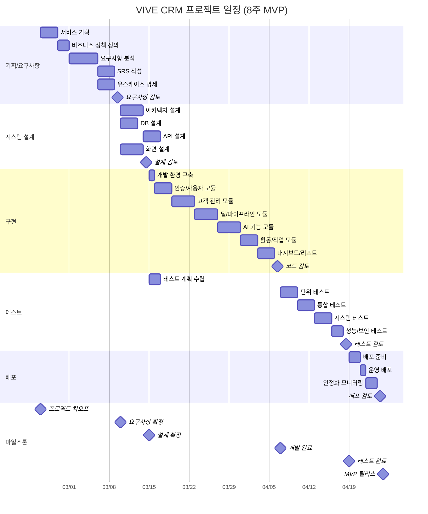
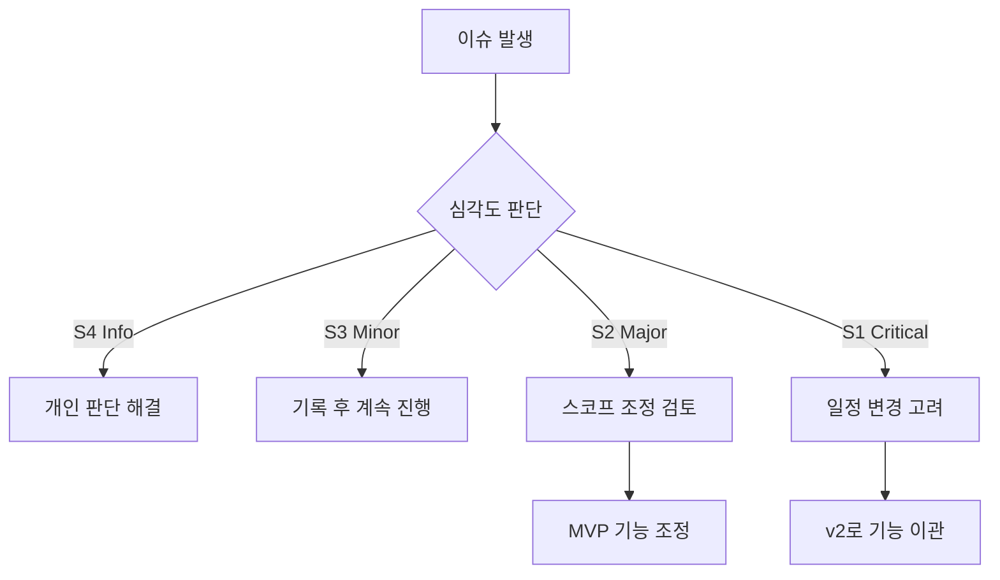
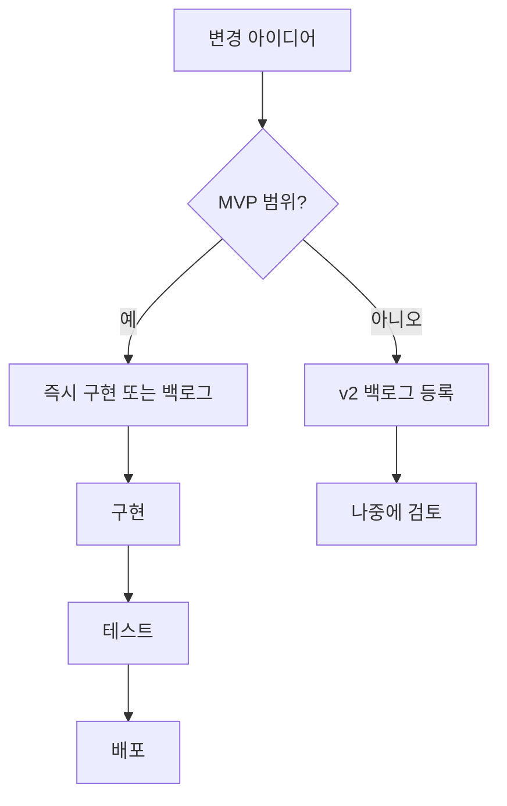

# 프로젝트 관리 산출물 (Project Management Artifacts)

> **프로젝트명:** VIVE CRM
> **문서 버전:** v1.0
> **작성일:** 2026-02-24
> **작성자:** 권영해 / 기획·개발

---

## 목차

1. [WBS (Work Breakdown Structure)](#1-wbs-work-breakdown-structure)
2. [위험 관리 대장 (Risk Register)](#2-위험-관리-대장-risk-register)
3. [커뮤니케이션 계획](#3-커뮤니케이션-계획)
4. [변경 관리 계획](#4-변경-관리-계획)
5. [프로젝트 완료 보고서](#5-프로젝트-완료-보고서)

---

## 1. WBS (Work Breakdown Structure)

### 1.1 WBS 작성 원칙

| 원칙 | 설명 |
|------|------|
| 100% Rule | WBS는 프로젝트 범위의 100%를 포함해야 한다 |
| 상호 배타성 | 각 작업 패키지(Work Package)는 중복되지 않아야 한다 |
| 결과물 기반 | 활동이 아닌 결과물(Deliverable) 중심으로 분해한다 |
| 8/80 Rule | 각 작업 패키지는 8시간 이상, 80시간 이하로 추정 가능해야 한다 |
| 3단계 이상 분해 | 최소 3 Level 이상으로 분해하여 관리 가능한 크기를 확보한다 |

### 1.2 워터폴 프로젝트 일정 (Gantt Chart)



### 1.3 WBS 상세 테이블

| WBS-ID | 작업명 | 시작일 | 종료일 | 기간(일) | 담당자 | 상태 | 산출물 |
|--------|--------|--------|--------|:--------:|--------|------|--------|
| **1** | **기획/요구사항** | 2026-02-24 | 2026-03-07 | 12 | 권영해 | In Progress | |
| 1.1 | 서비스 기획 | 2026-02-24 | 2026-02-26 | 3 | 권영해 | Completed | 서비스기획서.md |
| 1.2 | 비즈니스 정책 정의 | 2026-02-27 | 2026-02-28 | 2 | 권영해 | Completed | 비즈니스정책서.md |
| 1.3 | 요구사항 분석 | 2026-03-01 | 2026-03-05 | 5 | 권영해 | In Progress | 요구사항목록 |
| 1.4 | SRS 작성 | 2026-03-03 | 2026-03-05 | 3 | 권영해 | In Progress | SRS.md |
| 1.5 | 유스케이스 명세 | 2026-03-03 | 2026-03-05 | 3 | 권영해 | In Progress | 유스케이스명세서.md |
| 1.6 | 요구사항 검토 | 2026-03-06 | 2026-03-06 | 1 | 권영해 | Not Started | 검토 결과 |
| 1.7 | RTM 작성 | 2026-03-05 | 2026-03-06 | 2 | 권영해 | In Progress | 요구사항추적매트릭스-RTM.md |
| **2** | **시스템 설계** | 2026-03-07 | 2026-03-20 | 14 | 권영해 | Not Started | |
| 2.1 | 아키텍처 설계 | 2026-03-07 | 2026-03-10 | 4 | 권영해 | Not Started | 시스템아키텍처설계서-SAD.md |
| 2.2 | DB 설계 | 2026-03-07 | 2026-03-09 | 3 | 권영해 | Not Started | 데이터베이스설계서.md |
| 2.3 | API 설계 | 2026-03-11 | 2026-03-13 | 3 | 권영해 | Not Started | API설계서.md |
| 2.4 | 화면 설계 | 2026-03-07 | 2026-03-10 | 4 | 권영해 | Not Started | 화면설계서.md |
| 2.5 | 상세 설계 | 2026-03-11 | 2026-03-19 | 9 | 권영해 | Not Started | 상세설계서.md |
| 2.6 | 설계 검토 | 2026-03-19 | 2026-03-20 | 2 | 권영해 | Not Started | 검토 결과 |
| **3** | **구현** | 2026-03-21 | 2026-04-10 | 21 | 권영해 | Not Started | |
| 3.1 | 개발 환경 구축 | 2026-03-21 | 2026-03-21 | 1 | 권영해 | Not Started | 환경 구성 문서 |
| 3.2 | 인증/사용자 모듈 | 2026-03-22 | 2026-03-24 | 3 | 권영해 | Not Started | 소스 코드 |
| 3.3 | 고객 관리 모듈 | 2026-03-25 | 2026-03-28 | 4 | 권영해 | Not Started | 소스 코드 |
| 3.4 | 딜/파이프라인 모듈 | 2026-03-29 | 2026-04-01 | 4 | 권영해 | Not Started | 소스 코드 |
| 3.5 | AI 기능 모듈 | 2026-04-02 | 2026-04-05 | 4 | 권영해 | Not Started | 소스 코드 |
| 3.6 | 활동/작업 모듈 | 2026-04-06 | 2026-04-08 | 3 | 권영해 | Not Started | 소스 코드 |
| 3.7 | 대시보드/리포트 | 2026-04-07 | 2026-04-09 | 3 | 권영해 | Not Started | 소스 코드 |
| 3.8 | 코드 검토 | 2026-04-10 | 2026-04-10 | 1 | 권영해 | Not Started | 리뷰 결과 |
| **4** | **테스트** | 2026-04-08 | 2026-04-18 | 11 | 권영해 | Not Started | |
| 4.1 | 테스트 계획 수립 | 2026-03-15 | 2026-03-16 | 2 | 권영해 | Not Started | 테스트계획서.md |
| 4.2 | 테스트 케이스 작성 | 2026-03-17 | 2026-03-20 | 4 | 권영해 | Not Started | 테스트케이스.md |
| 4.3 | 단위 테스트 | 2026-04-11 | 2026-04-13 | 3 | 권영해 | Not Started | 테스트 결과 |
| 4.4 | 통합 테스트 | 2026-04-13 | 2026-04-15 | 3 | 권영해 | Not Started | 테스트 결과 |
| 4.5 | 시스템 테스트 | 2026-04-15 | 2026-04-17 | 3 | 권영해 | Not Started | 테스트결과보고서.md |
| 4.6 | 테스트 검토 | 2026-04-17 | 2026-04-18 | 2 | 권영해 | Not Started | 검토 결과 |
| **5** | **배포** | 2026-04-17 | 2026-04-21 | 5 | 권영해 | Not Started | |
| 5.1 | 배포 계획 수립 | 2026-04-14 | 2026-04-15 | 2 | 권영해 | Not Started | 배포계획서.md |
| 5.2 | 운영 환경 구성 | 2026-04-16 | 2026-04-16 | 1 | 권영해 | Not Started | 인프라 문서 |
| 5.3 | 운영 가이드 작성 | 2026-04-15 | 2026-04-16 | 2 | 권영해 | Not Started | 운영가이드.md |
| 5.4 | 운영 배포 | 2026-04-19 | 2026-04-19 | 1 | 권영해 | Not Started | 릴리스 노트 |
| 5.5 | 안정화 모니터링 | 2026-04-19 | 2026-04-20 | 2 | 권영해 | Not Started | 모니터링 보고서 |
| 5.6 | 배포 검토 | 2026-04-20 | 2026-04-21 | 2 | 권영해 | Not Started | 검토 결과 |

> **상태 값:** Not Started / In Progress / Completed / On Hold / Cancelled

---

## 2. 위험 관리 대장 (Risk Register)

### 2.1 위험 식별 카테고리

| 카테고리 | 설명 | 예시 |
|----------|------|------|
| 기술 (Technical) | 기술 스택, 아키텍처, 성능 관련 위험 | AI API 장애, 성능 미달 |
| 일정 (Schedule) | 마감일, 마일스톤 지연 관련 위험 | 요구사항 변경에 의한 일정 지연 |
| 리소스 (Resource) | 인력, 예산, 장비 관련 위험 | 1인 개발 리소스 부족 |
| 외부 (External) | 외부 의존성, 규제, 시장 관련 위험 | 3rd Party API 변경, 클라우드 장애 |
| 비즈니스 (Business) | 비즈니스 요구사항, 이해관계자 관련 위험 | 요구사항 불명확 |

### 2.2 위험 평가 매트릭스

**확률 (Probability)**

| 등급 | 수치 | 설명 |
|------|:----:|------|
| 매우 낮음 | 1 | 발생 가능성 10% 미만 |
| 낮음 | 2 | 발생 가능성 10~30% |
| 보통 | 3 | 발생 가능성 30~50% |
| 높음 | 4 | 발생 가능성 50~70% |
| 매우 높음 | 5 | 발생 가능성 70% 초과 |

**영향 (Impact)**

| 등급 | 수치 | 설명 |
|------|:----:|------|
| 매우 낮음 | 1 | 프로젝트에 미미한 영향 |
| 낮음 | 2 | 일부 작업에 경미한 지연 |
| 보통 | 3 | 마일스톤 지연 또는 예산 초과 |
| 높음 | 4 | 주요 목표 달성 위험 |
| 매우 높음 | 5 | 프로젝트 실패 가능성 |

**위험도 = 확률 x 영향**

|  | 영향 1 | 영향 2 | 영향 3 | 영향 4 | 영향 5 |
|:-:|:------:|:------:|:------:|:------:|:------:|
| **확률 5** | 5 | 10 | 15 | 20 | **25** |
| **확률 4** | 4 | 8 | 12 | 16 | **20** |
| **확률 3** | 3 | 6 | 9 | 12 | 15 |
| **확률 2** | 2 | 4 | 6 | 8 | 10 |
| **확률 1** | 1 | 2 | 3 | 4 | 5 |

> **위험도 등급:** 낮음(1~4) / 보통(5~9) / 높음(10~15) / 매우 높음(16~25)

### 2.3 위험 대응 전략

| 전략 | 설명 | 적용 시점 |
|------|------|-----------|
| 회피 (Avoid) | 위험 원인을 제거하여 발생 자체를 방지 | 위험도가 매우 높고 대응 가능 시 |
| 완화 (Mitigate) | 위험 발생 확률 또는 영향을 줄이는 조치 | 대부분의 위험에 적용 |
| 전가 (Transfer) | 위험을 제3자(보험, 외주 등)에게 이전 | 전문성 부족, 재무적 위험 |
| 수용 (Accept) | 위험을 인지하되 별도 조치 없이 감수 | 위험도가 낮거나 대응 비용이 과도 |

### 2.4 위험 관리 테이블

| RISK-ID | 카테고리 | 위험 설명 | 확률 | 영향 | 위험도 | 대응 전략 | 대응 계획 | 담당자 | 상태 |
|---------|----------|-----------|:----:|:----:|:------:|-----------|-----------|--------|------|
| RSK-001 | 기술 | OpenAI API Rate Limit 도달 또는 장애 | 3 | 4 | 12 | 완화 | API 호출 캐싱, Fallback 로직, Rate Limit 모니터링 | 권영해 | Open |
| RSK-002 | 리소스 | 1인 개발로 인한 진행 지연 | 4 | 3 | 12 | 완화 | MVP 스코프 엄격 관리, 외주 고려 (v2부터) | 권영해 | Open |
| RSK-003 | 기술 | 성능 목표 미달 (응답시간 > 500ms) | 3 | 3 | 9 | 완화 | 초기 성능 프로파일링, 캐싱 전략 적용 | 권영해 | Open |
| RSK-004 | 외부 | Supabase/Neon DB 장애 | 2 | 4 | 8 | 완화 | 정기 백업, 장애 시 복구 절차 수립 | 권영해 | Open |
| RSK-005 | 일정 | 요구사항 추가/변경으로 인한 일정 지연 | 3 | 3 | 9 | 회피 | MVP 범위 동결, 변경은 v2로 이관 | 권영해 | Open |
| RSK-006 | 기술 | AI 리드 스코어링 정확도 저하 | 3 | 3 | 9 | 완화 | 룰 기반 Fallback, 사용자 피드백 수집 | 권영해 | Open |
| RSK-007 | 보안 | 보안 취약점 발견 | 2 | 4 | 8 | 완화 | 개발 단계 보안 검토, OWASP 기반 점검 | 권영해 | Open |
| RSK-008 | 외부 | 외부 라이브러리/의존성 취약점 | 3 | 2 | 6 | 완화 | 정기 npm audit, 의존성 최소화 | 권영해 | Open |
| RSK-009 | 기술 | Vercel/Railway 무료 티어 한도 초과 | 3 | 2 | 6 | 완화 | 사용량 모니터링, 비용 알림 설정 | 권영해 | Open |
| RSK-010 | 비즈니스 | 경쟁사 유사 서비스 출시 | 2 | 3 | 6 | 수용 | 차별화 포인트 강화, 빠른 시장 진입 | 권영해 | Open |

> **상태:** Open / In Progress / Mitigated / Closed / Occurred

---

## 3. 커뮤니케이션 계획

### 3.1 이해관계자 분석 매트릭스

```
                높은 영향력
                    |
    B: 만족 유지     |     A: 핵심 관리
    (Keep Satisfied) |     (Manage Closely)
                    |
  ──────────────────┼──────────────────
                    |
    D: 모니터링      |     C: 정보 제공
    (Monitor)       |     (Keep Informed)
                    |
                낮은 영향력

    낮은 관심도 ←─────────────→ 높은 관심도
```

| 이해관계자 | 역할 | 관심도 | 영향력 | 분류 | 커뮤니케이션 전략 |
|-----------|------|:------:|:------:|------|------------------|
| 권영해 (개발자) | 전체 개발 | 높음 | 높음 | A | 자기 주도적 진행 |
| 권영해 (PO) | 요구사항 정의 | 높음 | 높음 | A | 일일 진척 체크 |
| 잠재 사용자 | 서비스 사용 | 높음 | 낮음 | C | 베타 테스트 참여 |
| 투자자 (예정) | 투자 검토 | 보통 | 높음 | B | MVP 완료 후 보고 |
| 경쟁사 | 시장 분석 | 낮음 | 낮음 | D | 모니터링 |

### 3.2 커뮤니케이션 매트릭스

| 대상 | 빈도 | 방법 | 주요 내용 | 담당자 |
|------|------|------|-----------|--------|
| 본인 (개발자) | 일 1회 | 개인 노트 | 일일 작업 계획, 진척 체크 | 권영해 |
| 커뮤니티/블로그 | 주 1회 | 블로그/Twitter | 개발 진행 상황 공유 | 권영해 |
| 베타 사용자 | 필요시 | 이메일/Slack | 피드백 요청, 업데이트 공지 | 권영해 |

### 3.3 회의 체계

#### 일일 개발 체크 (Daily Dev Check)

| 항목 | 내용 |
|------|------|
| 참석자 | 권영해 |
| 시간 | 매일 09:00 (15분) |
| 형식 | 3가지: 어제 완료, 오늘 예정, 블로커 |
| 기록 | Notion/Kimi 페이지 |

#### 주간 회고 (Weekly Retrospective)

| 항목 | 내용 |
|------|------|
| 참석자 | 권영해 |
| 시간 | 매주 일요일 20:00 (30분) |
| 안건 | 주간 진척, 문제점, 다음 주 계획 |
| 산출물 | 주간 개발 로그 |

### 3.4 에스컬레이션 경로



---

## 4. 변경 관리 계획

### 4.1 변경 요청 프로세스



> **원칙:** MVP 기간 중에는 기능 추가를 최소화하고, 버그 수정에 집중한다.

### 4.2 변경 요청서 (CR: Change Request) 템플릿

| 항목 | 내용 |
|------|------|
| **CR-ID** | CR-XXXX |
| **요청일** | YYYY-MM-DD |
| **요청자** | |
| **변경 유형** | [ ] 버그 수정 / [ ] 기능 개선 / [ ] 신규 기능 / [ ] 기타 |
| **우선순위** | [ ] Critical / [ ] High / [ ] Medium / [ ] Low |

**변경 내용:**

| 항목 | 상세 |
|------|------|
| 변경 제목 | |
| 현재 상태 (As-Is) | |
| 요청 사항 (To-Be) | |
| 변경 사유 | |
| MVP 영향 | [ ] MVP 포함 / [ ] v2로 이관 |

**승인 정보:**

| 단계 | 승인자 | 승인일 | 결과 | 비고 |
|------|--------|--------|------|------|
| 자체 검토 | 권영해 | | 승인 / v2 이관 | |

### 4.3 MVP 변경 관리 원칙

| 항목 | 원칙 |
|------|------|
| 버그 수정 | 즉시 처리, MVP 완료 필수 |
| 성능 개선 | MVP 중심으로 진행 |
| UI 개선 | MVP 출시 후 피드백 기반 |
| 신규 기능 | 원칙적으로 v2로 이관 |
| 기술 부채 | MVP 출시 후 정리 |

---

## 5. 프로젝트 완료 보고서

### 5.1 프로젝트 개요

| 항목 | 내용 |
|------|------|
| 프로젝트명 | VIVE CRM |
| 프로젝트 기간 | 2026-02-24 ~ 2026-04-15 |
| 프로젝트 목표 | AI 기반 영업 CRM MVP 출시 |
| 총 투입 인원 | 1명 |
| 총 투입 공수 | 2인월 (Man-Month) |
| 총 예산 | 약 $100 (인프라 비용) |

### 5.2 주요 성과 (계획 vs 실적)

**일정 현황:**

| 마일스톤 | 계획일 | 실적일 | 차이 | 사유 |
|----------|--------|--------|------|------|
| 요구사항 확정 | 2026-03-06 | | | |
| 설계 완료 | 2026-03-20 | | | |
| 개발 완료 | 2026-04-10 | | | |
| 테스트 완료 | 2026-04-18 | | | |
| MVP 릴리스 | 2026-04-19 | | | |

**일정 준수율:** `(기한 내 완료 마일스톤 수 / 전체 마일스톤 수) x 100 = ___%`

**예산 현황:**

| 항목 | 계획 (원) | 실적 (원) | 차이 (원) | 비율 |
|------|-----------|-----------|-----------|------|
| 인프라 (8주) | 100,000 | | | |
| 도메인 | 15,000 | | | |
| AI API | 50,000 | | | |
| **합계** | **165,000** | | | **%** |

### 5.3 품질 지표

| 지표 | 목표 | 실적 | 충족 여부 |
|------|------|------|-----------|
| 결함 밀도 (결함 수 / KLOC) | < 5 | | |
| Critical/Major 미해결 결함 | 0건 | | |
| 테스트 커버리지 | >= 80% | | |
| 테스트 통과율 | >= 95% | | |
| 성능 목표 달성률 | 100% | | |
| 접근성(WCAG AA) 적합률 | 100% | | |
| 보안 취약점 (High 이상) | 0건 | | |

### 5.4 범위 달성 현황

| 요구사항 분류 | 계획 수 | 완료 수 | 이월 수 | 취소 수 | 달성률 |
|--------------|:-------:|:-------:|:-------:|:-------:|:------:|
| P0 기능 | 6 | | | | % |
| P1 기능 | 3 | | | | % |
| 비기능 요구사항 | 8 | | | | % |
| **합계** | 17 | | | | **%** |

### 5.5 교훈 (Lessons Learned)

| # | 분류 | 내용 | 원인 | 개선방안 |
|---|------|------|------|----------|
| 1 | 1인 개발 | | | |
| 2 | AI 기능 | | | |
| 3 | MVP 스코프 | | | |
| 4 | 기술 선택 | | | |
| 5 | 테스트 | | | |

### 5.6 잔여 위험 및 권고사항

**잔여 위험:**

| # | 위험 설명 | 위험도 | 대응 권고 | 담당 |
|---|----------|:------:|-----------|------|
| 1 | AI API 비용 증가 | 보통 | 사용량 모니터링, 캐싱 강화 | 권영해 |
| 2 | 사용자 유입 대비 성능 | 보통 | 사전 스케일링 계획 수립 | 권영해 |

**권고사항:**

| # | 분류 | 권고 내용 | 우선순위 | 대상 |
|---|------|-----------|:--------:|------|
| 1 | 기술 부채 | 테스트 커버리지 90% 이상 달성 | High | v1.1 |
| 2 | 성능 개선 | 쿼리 최적화, 인덱스 추가 | Medium | v1.1 |
| 3 | 기능 확장 | 이메일 통합, 팀 기능 | Low | v2.0 |

### 5.7 프로젝트 종료 승인

| 역할 | 이름 | 서명 | 일자 |
|------|------|------|------|
| PM / 개발 | 권영해 | | |
| PO | 권영해 | | |

---

*프로젝트 완료 보고서는 프로젝트 종료 후 2주 이내에 작성하여 주요 이해관계자에게 배포한다.*
