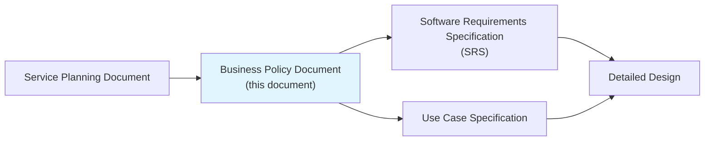
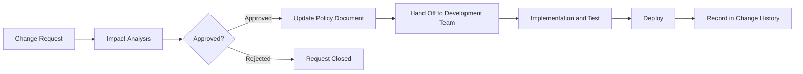

# Business Policy Document

> This document independently defines the service's business behavior rules.
> It clearly describes "how the system should behave in this situation" using a **purpose / rule / example** structure so that AI coding tools such as Claude Code can implement business rules accurately during vibe coding.
> When business rules are scattered across the functional requirements in the SRS, they are easy to miss, so this document manages them in one place.

| Item | Value |
|------|-------|
| **Project name** | VIVE CRM |
| **Document version** | v1.1 |
| **Created on** | 2026-02-24 |
| **Author** | Kwon Younghae / Planning and Development |
| **Approver** | Kwon Younghae / Planning and Development |
| **Document status** | Revised (Security policies enhanced) |

---

## Change History

| Version | Date | Author | Description |
|---------|------|--------|-------------|
| v0.1 | 2026-02-24 | Kwon Younghae | Initial draft created |

---

## Table of Contents

1. [Document Overview](#1-document-overview)
2. [Policy List and Summary](#2-policy-list-and-summary)
3. [Authentication and Authorization Policy](#3-authentication-and-authorization-policy)
4. [Billing and Payment Policy](#4-billing-and-payment-policy)
5. [Customer Management Policy](#5-customer-management-policy)
6. [Pipeline and Sales Policy](#6-pipeline-and-sales-policy)
7. [AI Lead Scoring Policy](#7-ai-lead-scoring-policy)
8. [Notification and Push Policy](#8-notification-and-push-policy)
9. [Data Reset and Date Handling Policy](#9-data-reset-and-date-handling-policy)
10. [Offline and Error Handling Policy](#10-offline-and-error-handling-policy)
11. [Statistics and Counting Policy](#11-statistics-and-counting-policy)
12. [MVP Policy Coverage](#12-mvp-policy-coverage)
13. [Policy Change Management](#13-policy-change-management)

---

## 1. Document Overview

### 1.1 Purpose

This document gathers and defines the business behavior rules of **VIVE CRM** in one place.

**Why this document is needed:**

- If business rules are scattered by feature in the SRS, AI coding tools are more likely to omit them or misinterpret them
- Managing business rules in an independent document allows planning, development, and QA to reference the same rules
- The "purpose / rule / example" structure is the clearest format for AI to understand and implement

**Target readers of this document:**

| Reader | How It Is Used |
|--------|----------------|
| AI coding tools (Claude Code, etc.) | Reference business rules during implementation. Use the "situation -> result" examples as test cases |
| Development team | Baseline document for implementing business logic |
| QA team | Basis for deriving test cases. Use examples for boundary-value tests |
| Planning team | Single source for managing business rule changes |

### 1.2 Policy Writing Guide

> **Every policy must include the following four elements.**

| Element | Description | Writing Tip |
|---------|-------------|-------------|
| **Purpose** | Why the policy exists | Explain "why this rule is needed" in 1 to 2 sentences |
| **Rule** | Specific behavioral rule | Make the condition and result explicit. Avoid vague phrases such as "appropriately" or "if needed" |
| **Example** | Concrete scenario in the form "situation -> result" | Include normal, boundary, and error cases |
| **Change history** | Change record for the policy | Record it in the unified table in Chapter 13, and optionally record important changes per policy |

**Good rules vs bad rules:**

| Category | Bad Example | Good Example |
|----------|-------------|--------------|
| Ambiguity | "Expire the session after an appropriate time" | "Expire the session after 30 minutes from the last activity" |
| Missing condition | "Refund the payment" | "Provide a full refund only if the request is within 7 days of payment and the service has not been used" |
| Missing boundary value | "Free users can use limited features" | "Free users can register up to 100 customers" |

**Example format:**

```text
Situation: [Describe the concrete situation]
Result: [Describe the system behavior]
```

### 1.3 Related Documents

| Document | Relationship |
|----------|--------------|
| Service Planning Document | Parent document of this one. Defines the service concept and MVP scope |
| Software Requirements Specification (SRS) | Policies from this document are referenced in the SRS functional requirements as `BR-xxx` |
| Use Case Specification | The "business rules" section of each use case refers back to this document |



---

## 2. Policy List and Summary

> This is the index table for all policies. Refer to each section for details.

| Policy ID | Policy Category | Summary of Core Rule | Applied in MVP | Section |
|-----------|-----------------|----------------------|----------------|---------|
| `BP-AUTH` | Authentication / authorization | Email-based JWT authentication, Access Token 1 hour, Refresh Token 14 days | Y | [Chapter 3](#3-authentication-and-authorization-policy) |
| `BP-PAY` | Billing / payment | Freemium, 100 free customers, Pro monthly KRW 29,000 to 49,000 | Y | [Chapter 4](#4-billing-and-payment-policy) |
| `BP-CUSTOMER` | Customer management | Soft delete, customer limits by tier, duplicate email prevention | Y | [Chapter 5](#5-customer-management-policy) |
| `BP-PIPELINE` | Pipeline / sales | Fixed stages `Lead → Opportunity → Proposal → Negotiation → Closed Won / Closed Lost` | Y | [Chapter 6](#6-pipeline-and-sales-policy) |
| `BP-AI` | AI lead scoring | Automatic `0-100` score calculation, A grade for `80+` | Y | [Chapter 7](#7-ai-lead-scoring-policy) |
| `BP-NOTI` | Notification / push | Reminder at `9:00 AM` on due date, additional reminder one day earlier for high priority | Y | [Chapter 8](#8-notification-and-push-policy) |
| `BP-RESET` | Data reset / date change | Daily reset in `KST`, automatic reminder for incomplete tasks | Y | [Chapter 9](#9-data-reset-and-date-handling-policy) |
| `BP-ERROR` | Offline / error handling | Automatic retry 3 times, local save while offline | Y | [Chapter 10](#10-offline-and-error-handling-policy) |
| `BP-STAT` | Statistics / counting | Real-time plus batch aggregation, exclude soft-deleted data | Y | [Chapter 11](#11-statistics-and-counting-policy) |

---

## 3. Authentication and Authorization Policy

> Policy covering user authentication, session management, and role-based access permissions.

### 3.1 Purpose

Verify user identity and ensure that users can access only the appropriate features and data according to their roles. Protect user accounts and data from security threats.

### 3.2 Rules

#### BP-AUTH-001: Sign Up

| Rule ID | Rule | Notes |
|---------|------|-------|
| `AUTH-001-1` | Email must be unique. If signup is attempted with a registered email, display the message "This email is already registered." | |
| `AUTH-001-2` | Password must be at least 8 characters and require a combination of uppercase/lowercase letters, numbers, and special characters | |
| `AUTH-001-3` | Email verification must be completed before the service can be used | Applied in MVP |
| `AUTH-001-4` | Support for social login (`Google`) will be reviewed after the MVP in v2 | Excluded from MVP |

#### BP-AUTH-002: Login / Session Management

| Rule ID | Rule | Notes |
|---------|------|-------|
| `AUTH-002-1` | Lock the account for 30 minutes after 5 consecutive login failures | |
| `AUTH-002-2` | Access Token validity is 1 hour and Refresh Token validity is 14 days | Core rule |
| `AUTH-002-3` | Expire the session 30 minutes after the last activity | |
| `AUTH-002-4` | Allow simultaneous login on up to 3 devices | |
| `AUTH-002-5` | Password reset links are valid for 24 hours | |

#### BP-AUTH-003: Roles and Permissions

| Role | Description | Main Permissions | Notes |
|------|-------------|------------------|-------|
| Regular user (`USER`) | Standard CRM user | CRUD for own customers/pipeline/tasks, view AI scoring | Default role |
| Administrator (`ADMIN`) | Team / organization administrator | Manage all users and data, manage subscriptions, invite team members | |

### 3.3 Examples

**Normal case:**

```text
Situation: A user logs in with the correct email and password
Result: An Access Token (1 hour) and Refresh Token (14 days) are issued, and the user is moved to the dashboard
```

```text
Situation: The user calls an API after the Access Token has expired
Result: A 401 response is returned, and the client automatically obtains a new Access Token through the Refresh Token and retries the request
```

**Boundary case:**

```text
Situation: The user fails login 4 times, then enters the correct password on the 5th attempt
Result: Login succeeds and the failure count is reset
```

```text
Situation: The user fails login 5 times in a row
Result: The account is locked for 30 minutes. Even with the correct password, login is not allowed during the lock period.
        Display the message "Your account is locked. Please try again after 30 minutes or reset your password."
```

```text
Situation: The user attempts to log in from a fourth device
Result: The oldest session is automatically expired and login is allowed on the new device.
        Display the message "A session on another device has expired."
```

**Error case:**

```text
Situation: The user calls an API after the Refresh Token has also expired
Result: A 401 response is returned and the user is redirected to the login page.
        Display the message "Your session has expired. Please log in again."
```

### 3.4 Change History

| Date | Rule ID | Description | Reason |
|------|---------|-------------|--------|
| - | - | - | - |

---

## 4. Billing and Payment Policy

> Policy covering the free and paid boundary, payment processing, refunds, and subscription management.

### 4.1 Purpose

Define billing rules for paid features and clarify payment and refund flows to prevent user complaints and disputes.

### 4.2 Rules

#### BP-PAY-001: Free vs Paid Boundary

| Rule ID | Rule | Notes |
|---------|------|-------|
| `PAY-001-1` | Features for free users: up to 100 customers, 1 pipeline, basic notifications | Core rule |
| `PAY-001-2` | Paid-only features: unlimited customers, unlimited pipelines, advanced AI scoring, team collaboration features | |
| `PAY-001-3` | Free usage limits: maximum 100 customers and 1 pipeline | Core rule |
| `PAY-001-4` | When the free limit is exceeded: show an "Upgrade to Pro" modal and block additional registration | |

#### BP-PAY-002: Payment Processing

| Rule ID | Rule | Notes |
|---------|------|-------|
| `PAY-002-1` | Supported payment methods: credit card, bank transfer, simple pay (`KakaoPay`, `Naver Pay`) | |
| `PAY-002-2` | Retry on payment failure: automatic retry up to 3 times, then guide the user to manual re-payment | |
| `PAY-002-3` | Payment confirmation wait time: wait up to 30 seconds for payment completion, then move to "payment being confirmed" status | |
| `PAY-002-4` | Double-payment prevention: block duplicate payment requests for the same order within 10 seconds | |

#### BP-PAY-003: Pricing Structure

| Tier | Monthly Fee | Customer Limit | Pipelines | Notes |
|------|-------------|----------------|-----------|-------|
| Free | Free | Up to 100 | 1 | Basic features |
| Pro Starter | KRW 29,000 | Unlimited | 3 | Small teams |
| Pro Business | KRW 49,000 | Unlimited | Unlimited | Includes team collaboration features, core rule |

#### BP-PAY-004: Refund Policy

| Rule ID | Rule | Notes |
|---------|------|-------|
| `PAY-004-1` | Refund window: within 7 days after payment | |
| `PAY-004-2` | Refund condition: full refund only if the service has not been used | |
| `PAY-004-3` | Refund timeline: refund to the original payment method within 3 to 5 business days after approval | |
| `PAY-004-4` | Non-refundable cases: more than 7 days passed, service usage history exists, or the subscription used promotion/discount pricing | |

#### BP-PAY-005: Subscription Management

| Rule ID | Rule | Notes |
|---------|------|-------|
| `PAY-005-1` | Subscription renewal: automatically renew one day before expiration | |
| `PAY-005-2` | If renewal fails: provide a 3-day grace period and then downgrade to Free | |
| `PAY-005-3` | Cancellation: may be cancelled immediately, but usage continues through the remaining period | |
| `PAY-005-4` | Tier change: upgrades apply immediately with proration; downgrades apply from the next billing cycle | |
| `PAY-005-5` | Excess customers on downgrade: if a user downgrades to Free with more than 100 customers, show the warning "Only 100 customer records will remain accessible" before proceeding | |

### 4.3 Examples

**Normal case:**

```text
Situation: A free user subscribes to Pro Starter monthly
Result: Paid features are enabled immediately after payment. The next billing date is set for 30 days later
```

```text
Situation: A Pro Starter user upgrades to Pro Business
Result: Pro Business features are enabled immediately, and the remaining period is prorated for payment
```

**Boundary case:**

```text
Situation: Payment fails on the auto-renewal date
Result: A 3-day grace period is provided. During the grace period, automatic retry runs once per day.
        Paid features remain available during the grace period.
        If payment still fails after 3 days, the subscription downgrades to Free and an email notice is sent
```

```text
Situation: A Pro Business user with 150 customers downgrades to Free
Result: Show a warning modal stating "Only 100 customer records will remain accessible. The remaining 50 will become inaccessible. Do you want to continue?"
        If the user confirms, the downgrade is applied and customers over the limit are shown as read-only
```

**Error case:**

```text
Situation: No response is received from the payment gateway for 30 seconds after the payment request
Result: Move to a "payment being confirmed" state. Show the message "Your payment is being processed. Please check again shortly."
        Query the payment gateway status in the background and reflect the final result.
        Disable the payment button to prevent duplicate payment
```

### 4.4 Change History

| Date | Rule ID | Description | Reason |
|------|---------|-------------|--------|
| - | - | - | - |

---

## 5. Customer Management Policy

> Policy covering customer registration, update, deletion, and retrieval.

### 5.1 Purpose

Allow users to manage customer information efficiently while balancing data retention and personal information protection.

### 5.2 Rules

#### BP-CUSTOMER-001: Customer Registration

| Rule ID | Rule | Notes |
|---------|------|-------|
| `CUSTOMER-001-1` | Customer email must be unique within the same user account. If duplicated, display "This email is already registered." | |
| `CUSTOMER-001-2` | Required inputs: `name`, and either `email` or `phone` | |
| `CUSTOMER-001-3` | AI lead scoring is automatically calculated when a customer is registered | Core rule |
| `CUSTOMER-001-4` | Free users can register up to 100 customers. Over 100, show "Upgrade to the Pro plan." | Core rule |

#### BP-CUSTOMER-002: Customer Information Updates

| Rule ID | Rule | Notes |
|---------|------|-------|
| `CUSTOMER-002-1` | When customer information is modified, record the timestamp and modifier in the audit log | |
| `CUSTOMER-002-2` | Run duplicate checks when the email is changed | |
| `CUSTOMER-002-3` | Recalculate AI lead scoring automatically when major fields such as name or contact information change | |

#### BP-CUSTOMER-003: Customer Deletion (Soft Delete)

| Rule ID | Rule | Notes |
|---------|------|-------|
| `CUSTOMER-003-1` | Customer deletion is handled as soft delete (logical deletion), not physical deletion | Core rule |
| `CUSTOMER-003-2` | Deleted customers are marked as "Deleted" and retained for 30 days before permanent deletion | |
| `CUSTOMER-003-3` | Deleted customers do not appear in the default list and may be restored from the Trash menu | |
| `CUSTOMER-003-4` | Deals linked to deleted customers remain, but the customer name is shown as "Deleted Customer" | |

#### BP-CUSTOMER-004: Customer Grades and Tags

| Rule ID | Rule | Notes |
|---------|------|-------|
| `CUSTOMER-004-1` | Customer grade is automatically classified as `A (80-100)`, `B (60-79)`, `C (40-59)`, or `D (0-39)` based on AI lead scoring | Core rule |
| `CUSTOMER-004-2` | User-defined tags: up to 20 tags can be created and tag names may not be duplicated | |
| `CUSTOMER-004-3` | Up to 5 tags can be assigned to a customer | |

### 5.3 Examples

**Normal case:**

```text
Situation: A user registers a new customer (name: Kim Cheolsu, email: kim@example.com)
Result: The customer is created, AI lead scoring is automatically calculated, and a grade is assigned.
        A registration-complete notification is shown and the user is moved to the customer detail page
```

```text
Situation: A user deletes a customer
Result: Show a confirmation modal stating "Are you sure you want to delete this? After deletion, it can be restored from the trash for 30 days."
        If confirmed, the record is soft-deleted and moved to the trash
```

**Boundary case:**

```text
Situation: A free user attempts to register the 100th customer
Result: Registration is completed. Show a notice stating "You have reached the customer registration limit. Upgrade to Pro to manage more customers."
```

```text
Situation: A free user attempts to register the 101st customer
Result: Registration is blocked and a modal appears stating "The free plan allows up to 100 customers. Please upgrade to Pro."
```

```text
Situation: A user tries to restore a customer deleted more than 30 days ago
Result: Display "The restore period has expired for this customer. Please register the customer again."
```

**Error case:**

```text
Situation: A user attempts to register a customer with an email that is already registered
Result: Display "This email is already registered. Please use another email or review the existing customer information."
```

### 5.4 Change History

| Date | Rule ID | Description | Reason |
|------|---------|-------------|--------|
| - | - | - | - |

---

## 6. Pipeline and Sales Policy

> Policy covering sales pipeline stages, deal progression, and success/failure handling.

### 6.1 Purpose

Manage the sales process systematically and improve conversion rates by making deal progress visible.

### 6.2 Rules

#### BP-PIPELINE-001: Pipeline Stages

| Rule ID | Rule | Notes |
|---------|------|-------|
| `PIPELINE-001-1` | Pipeline stages are fixed: `Lead → Opportunity → Proposal → Negotiation → Closed Won` or `Closed Lost` | Core rule |
| `PIPELINE-001-2` | Stages can move only sequentially. Users may move forward or backward by one stage at a time | |
| `PIPELINE-001-3` | Each stage may include `Expected Revenue` and `Expected Close Date` | |
| `PIPELINE-001-4` | Free users can create only 1 pipeline. Pro Starter can create 3, and Pro Business can create unlimited pipelines | Core rule |

#### BP-PIPELINE-002: Deal Creation and Management

| Rule ID | Rule | Notes |
|---------|------|-------|
| `PIPELINE-002-1` | A deal must always be linked to a customer. A deal cannot be created without a customer | |
| `PIPELINE-002-2` | Deal amount must be a number greater than or equal to 0 | |
| `PIPELINE-002-3` | When a deal is created, its stage is automatically set to `Lead` | |
| `PIPELINE-002-4` | A deal may have a priority of `high`, `medium`, or `low` | |

#### BP-PIPELINE-003: Deal Status Changes

| Rule ID | Rule | Notes |
|---------|------|-------|
| `PIPELINE-003-1` | When moving to `Closed Won`, `Actual Revenue` and `Closed Date` must be entered | |
| `PIPELINE-003-2` | When moving to `Closed Lost`, a loss reason (`price`, `competitor selected`, `lost contact`, `other`) must be selected | |
| `PIPELINE-003-3` | Deals in `Closed Won` or `Closed Lost` cannot return to earlier stages | |
| `PIPELINE-003-4` | An `Activity` history record is automatically created when the deal status changes | |

#### BP-PIPELINE-004: Due Dates and Notifications

| Rule ID | Rule | Notes |
|---------|------|-------|
| `PIPELINE-004-1` | For deals with an expected close date, a reminder is sent at `9:00 AM` on the due date | Core rule |
| `PIPELINE-004-2` | For deals with `high` priority, an additional reminder is sent one day before the due date | Core rule |
| `PIPELINE-004-3` | Deals past the due date are displayed with an "Overdue" badge in the list | |

### 6.3 Examples

**Normal case:**

```text
Situation: A user creates a new deal (customer: Kim Cheolsu, amount: KRW 5,000,000, expected close date: 2026-03-15)
Result: The deal is created in the `Lead` stage. The AI lead scoring result is shown.
        A reminder is scheduled for 9:00 AM on 2026-03-15 based on the expected close date
```

```text
Situation: A deal is moved from `Proposal` to `Negotiation`
Result: The stage changes and an activity log such as "2026-02-24 14:30: Proposal → Negotiation" is recorded
```

```text
Situation: A deal is moved to `Closed Won` (actual revenue: KRW 4,500,000, close date: 2026-02-24)
Result: The deal changes to `Closed Won` and is reflected in monthly revenue statistics.
        A congratulatory message and a notification stating "The deal has been closed!" are shown
```

**Boundary case:**

```text
Situation: There is a `high` priority deal whose expected close date is today
Result: The due-date reminder is sent at 9:00 AM today.
        (The high-priority early reminder was already sent at 9:00 AM yesterday)
```

```text
Situation: A user attempts to move a `Closed Won` deal back to `Negotiation`
Result: Display "Deals in Closed Won or Closed Lost cannot be reversed. Please create a new deal."
```

```text
Situation: A free user attempts to create a second pipeline
Result: Display a modal stating "The free plan allows only one pipeline. Please upgrade to Pro."
```

**Error case:**

```text
Situation: A user attempts to create a deal without linking a customer
Result: Display "A deal must be linked to a customer. Please register or select a customer first."
```

### 6.4 Change History

| Date | Rule ID | Description | Reason |
|------|---------|-------------|--------|
| - | - | - | - |

---

## 7. AI Lead Scoring Policy

> Policy for how AI analyzes customer data and calculates lead scores.

### 7.1 Purpose

Use AI to objectively evaluate customer purchase likelihood and help determine sales priority efficiently.

### 7.2 Rules

#### BP-AI-001: Score Calculation

| Rule ID | Rule | Notes |
|---------|------|-------|
| `AI-001-1` | AI lead score is calculated as an integer between `0` and `100` | Core rule |
| `AI-001-2` | Score is calculated automatically when a customer is registered and recalculated when customer information changes | |
| `AI-001-3` | Score factors include email domain, title, company size, industry, past deal history, and website visit history (when integrated) | |
| `AI-001-4` | Score calculation must complete within 5 seconds at most | |
| `AI-001-5` | If calculation fails, assign the default score `50` and show "Score is being calculated" | |

#### BP-AI-002: Grade Classification

| Rule ID | Rule | Notes |
|---------|------|-------|
| `AI-002-1` | Grade classification by score: `A (80-100)`, `B (60-79)`, `C (40-59)`, `D (0-39)` | Core rule |
| `AI-002-2` | Grade A customers are shown with a `HOT` badge at the top of the list | |
| `AI-002-3` | Recommended action by grade: `A (contact immediately)`, `B (send email)`, `C (provide educational content)`, `D (long-term hold)` | |

#### BP-AI-003: Advanced AI Scoring (Paid)

| Rule ID | Rule | Notes |
|---------|------|-------|
| `AI-003-1` | Free users receive only basic scoring | |
| `AI-003-2` | Pro users can use advanced AI scoring such as predicted conversion rate, recommended sales strategy, and similar-customer analysis | |
| `AI-003-3` | Advanced scoring is automatically updated once per week | |

### 7.3 Examples

**Normal case:**

```text
Situation: A user registers a new customer (email: ceo@largecorp.com, title: CEO, company size: 500 employees)
Result: AI scoring runs and produces a score of 92. The customer is assigned grade A and shown with a HOT badge.
        The recommended action "Contact immediately" is displayed
```

```text
Situation: A customer's title changes from "Intern" to "Team Lead"
Result: AI scoring is recalculated, increasing the score from 45 to 72. The grade changes from C to B
```

**Boundary case:**

```text
Situation: A customer has a score of 80, the boundary for grade A
Result: The customer is classified as grade A and shown with the HOT badge
```

```text
Situation: A customer has a score of 79
Result: The customer is classified as grade B and shown with a regular badge
```

**Error case:**

```text
Situation: Score calculation fails because of an AI service outage
Result: The default score 50 is assigned and the message "Score is being calculated. Please check again shortly." is shown.
        The system retries automatically after 1 hour
```

### 7.4 Change History

| Date | Rule ID | Description | Reason |
|------|---------|-------------|--------|
| - | - | - | - |

---

## 8. Notification and Push Policy

> Policy covering delivery conditions and frequency for system, email, and push notifications.

### 8.1 Purpose

Deliver necessary information to users at the right time while preventing fatigue and churn caused by excessive notifications.

### 8.2 Rules

#### BP-NOTI-001: Notification Channels and Types

| Notification Type | Channel | Trigger | User Configurable |
|-------------------|---------|---------|-------------------|
| Deal due-date reminder | Email + in-app | 9:00 AM on the due date | Y |
| High-priority deal reminder | Email + in-app | 9:00 AM one day before the due date | Y |
| Customer registration complete | In-app | When a customer is registered | N (required) |
| Deal status changed | In-app | When the status changes | N (required) |
| Payment confirmation | Email | When payment is completed | N (required) |
| Subscription renewal notice | Email | 1 day before renewal | Y |
| Subscription expiration notice | Email | On expiration date and 3 days later | Y |

#### BP-NOTI-002: Notification Frequency Limits

| Rule ID | Rule | Notes |
|---------|------|-------|
| `NOTI-002-1` | Email notifications: up to 10 per day (deal reminders excluded from this cap) | |
| `NOTI-002-2` | Do not send email notifications during night hours (`22:00 ~ 08:00`), except urgent security alerts | |
| `NOTI-002-3` | If the user has turned off a notification type, do not send it. Required notifications such as billing and security are exceptions | |
| `NOTI-002-4` | For the same deal, send due-date reminders at most once per day | Core rule |

#### BP-NOTI-003: Deal Due-Date Notifications

| Rule ID | Rule | Notes |
|---------|------|-------|
| `NOTI-003-1` | For a deal with an expected close date, send a reminder at `9:00 AM` on the due date | Core rule |
| `NOTI-003-2` | For a deal with `high` priority, send an additional reminder at `9:00 AM` one day before the due date | Core rule |
| `NOTI-003-3` | For overdue deals, send an "overdue" notification every 3 days up to 3 times | |
| `NOTI-003-4` | Cancel due-date reminders if the deal moves to `Closed Won` or `Closed Lost` | |

### 8.3 Examples

**Normal case:**

```text
Situation: A normal-priority deal has an expected close date of 2026-02-24
Result: At 9:00 AM on 2026-02-24, an email and in-app notification are sent with the message "[Deal Name] is due today"
```

```text
Situation: A high-priority deal has an expected close date of 2026-02-24
Result: At 9:00 AM on 2026-02-23, a reminder saying "[Deal Name] is due in one day (Priority: High)" is sent.
        At 9:00 AM on 2026-02-24, the due-date reminder is sent again
```

**Boundary case:**

```text
Situation: A user is scheduled to receive due-date reminders for 5 deals
Result: A separate notification is sent for each deal, remaining within the maximum of 10 notifications
```

```text
Situation: An overdue deal is changed to `Closed Won`
Result: Any overdue reminder for that deal is cancelled immediately
```

**Error case:**

```text
Situation: Email delivery fails because the notification service is down
Result: Record the delivery failure and retry after 1 hour. If it still fails after 3 retries, notify the administrator
```

### 8.4 Change History

| Date | Rule ID | Description | Reason |
|------|---------|-------------|--------|
| - | - | - | - |

---

## 9. Data Reset and Date Handling Policy

> Policy covering daily, weekly, and monthly reset behavior, timezone handling, and data initialization.

### 9.1 Purpose

Clearly define reset timing and timezone rules to guarantee data consistency across users and regions.

### 9.2 Rules

#### BP-RESET-001: Reset Baseline

| Rule ID | Rule | Notes |
|---------|------|-------|
| `RESET-001-1` | Service timezone: `KST (UTC+9)` | |
| `RESET-001-2` | Daily reset time: every day at `00:00 KST` | |
| `RESET-001-3` | Weekly reset time: every Monday at `00:00 KST` | |
| `RESET-001-4` | Monthly reset time: the 1st day of each month at `00:00 KST` | |

#### BP-RESET-002: Data Subject to Reset

| Data Target | Reset Cycle | Reset Behavior | Notes |
|-------------|-------------|----------------|-------|
| Daily notification counter | Daily | Reset to 0 | |
| Due-date reminder schedule | Daily | Send reminders for deals due that day | |
| Weekly report data | Weekly | Aggregate weekly statistics and generate reports | |
| Monthly free AI analysis count | Monthly | Reset to 0 for free users | |

#### BP-RESET-003: Automatic Reminder Handling

| Rule ID | Rule | Notes |
|---------|------|-------|
| `RESET-003-1` | At `00:00 KST` every day, query the list of deals due that day and register them for reminder delivery | Core rule |
| `RESET-003-2` | At `09:00 KST` every day, deliver all scheduled due-date reminders in batch | Core rule |
| `RESET-003-3` | For high-priority deals, the one-day-early reminder is delivered at `09:00 KST` the previous day | Core rule |

### 9.3 Examples

```text
Situation: There are 2 deals with expected close date 2026-02-25 (1 normal priority, 1 high priority)
Result: At 2026-02-25 00:00 KST, those deals are registered as reminder targets.
        Normal deal: reminder sent at 2026-02-25 09:00 KST
        High-priority deal: early reminder sent at 2026-02-24 09:00 KST and due-date reminder sent at 2026-02-25 09:00 KST
```

```text
Situation: An overseas user accesses the service at 15:00 UTC (00:00 KST)
Result: Daily reset is applied based on the service timezone (KST). Reset occurs at 00:00 KST regardless of the user's local time
```

### 9.4 Change History

| Date | Rule ID | Description | Reason |
|------|---------|-------------|--------|
| - | - | - | - |

---

## 10. Offline and Error Handling Policy

> Policy covering service behavior during network errors, server outages, and offline conditions.

### 10.1 Purpose

Maintain user experience during abnormal conditions such as unstable networks or server failures and prevent data loss.

### 10.2 Rules

#### BP-ERROR-001: Network Error Handling

| Rule ID | Rule | Notes |
|---------|------|-------|
| `ERROR-001-1` | On API failure, retry automatically up to 3 times with `1s / 2s / 4s` intervals (exponential backoff) | |
| `ERROR-001-2` | If all retries fail, show "Please check your network connection" and display a manual retry button | |
| `ERROR-001-3` | When offline is detected, show an offline banner and provide cached data in read-only mode | |

#### BP-ERROR-002: Data Preservation

| Rule ID | Rule | Notes |
|---------|------|-------|
| `ERROR-002-1` | If a network error occurs while the user is entering data, temporarily save it locally and automatically send it after the connection is restored | |
| `ERROR-002-2` | If a network error occurs during payment, mark the payment status as "checking." The server confirms the final payment result asynchronously and reflects it | |
| `ERROR-002-3` | If an error occurs while creating a customer or deal, save the draft to browser local storage and guide the user during recovery | |

#### BP-ERROR-003: Server Error Display

| HTTP Status | User Message | Technical Behavior |
|-------------|--------------|--------------------|
| 400 | "Please check the input information." | Request parameter validation failed. Include failing fields and reasons in the response |
| 401 | "Login is required." | Redirect to the login page |
| 403 | "You do not have permission to access this." | Show a message on the current page |
| 404 | "The page you requested could not be found." | Show the 404 page and provide a link to home |
| 429 | "Too many requests. Please try again later." | Rate limit exceeded. Show when retry is possible |
| 500 | "A temporary error has occurred." | Record error logs and send a monitoring alert |
| 503 | "The service is under maintenance." | Show the expected maintenance end time |

### 10.3 Examples

```text
Situation: A user is writing a long note and the network disconnects
Result: Save the in-progress content automatically in local storage. Show "The network connection has been lost. Your draft is being saved automatically."
        When the network is restored, show "The network has been restored. Would you like to save now?"
```

```text
Situation: The server returns 500 errors 3 times in a row
Result: Show "A temporary error has occurred. Please try again later."
        Internally, record error logs and send a notification to the monitoring system.
        Do not perform further automatic retries; require manual retry by the user
```

### 10.4 Change History

| Date | Rule ID | Description | Reason |
|------|---------|-------------|--------|
| - | - | - | - |

---

## 11. Statistics and Counting Policy

> Policy covering numeric aggregation, statistical calculation, and counting baselines.

### 11.1 Purpose

Clearly define the aggregation baseline for service metrics such as customer count, deal count, and revenue in order to guarantee data consistency and trustworthiness.

### 11.2 Rules

#### BP-STAT-001: Counting Baseline

| Target | Counting Rule | Duplicate Handling | Refresh Cycle |
|--------|---------------|--------------------|---------------|
| Customer count | Number of customer records not soft-deleted | Deduplicate by customer ID | Real time |
| Deal count | Number of deal records not soft-deleted | Deduplicate by deal ID | Real time |
| Pipeline count | Number of pipelines created by the user | Deduplicate by pipeline ID | Real time |
| Revenue | Sum of actual revenue for deals in `Closed Won` | Subtract refunds/cancellations | Daily batch |
| Conversion rate | `Closed Won deal count / total deal count × 100` | - | Real time |
| Average AI score | Arithmetic mean of AI scores by customer | - | On customer change |

#### BP-STAT-002: Statistics Display Rules

| Rule ID | Rule | Notes |
|---------|------|-------|
| `STAT-002-1` | For values above `1,000`, use short notation such as `1.2K` and `3.5M` | |
| `STAT-002-2` | Allowable delay for statistics data: real time, up to 1 minute | |
| `STAT-002-3` | If the count is zero, display `0` | |
| `STAT-002-4` | Exclude soft-deleted data from all statistics | Core rule |
| `STAT-002-5` | Do not include deals outside `Closed Won` in revenue statistics | |

#### BP-STAT-003: Dashboard Statistics

| Metric | Calculation Method | Refresh Cycle |
|--------|--------------------|---------------|
| Expected revenue this month | Sum of expected revenue for deals whose expected close date is this month | Real time |
| Actual revenue this month | Sum of actual revenue for deals in `Closed Won` whose close date is this month | Real time |
| Deal distribution by pipeline stage | Count deals in each stage | Real time |
| Number of A-grade customers | Count customers with AI score `80+` | Real time |
| Number of deals nearing due date | Count incomplete deals with expected close date within 7 days | Daily batch |

### 11.3 Examples

```text
Situation: 5 out of 100 customers are deleted
Result: Customer statistics display 95 customers, excluding the soft-deleted records
```

```text
Situation: Out of 10 deals, 3 are `Closed Won`, 2 are `Closed Lost`, and 5 are in progress
Result: Revenue statistics include only the 3 `Closed Won` deals. Conversion rate is calculated as 3/10 = 30%
```

```text
Situation: Revenue is KRW 1,523,000
Result: On list screens it is displayed as `1.5M`. On detail screens it is shown exactly as `1,523,000`
```

### 11.4 Change History

| Date | Rule ID | Description | Reason |
|------|---------|-------------|--------|
| - | - | - | - |

---

## 12. MVP Policy Coverage

> Defines which parts of each policy apply during the MVP phase in alignment with the MVP scope in the Service Planning Document.

### 12.1 Policies Applied in the MVP

| Policy ID | Policy Name | MVP Coverage | Simplification |
|-----------|-------------|--------------|----------------|
| `BP-AUTH` | Authentication and authorization | Full | Social login added in v2 |
| `BP-PAY` | Billing and payment | Basic | Advanced payment methods (international cards, etc.) added in v2 |
| `BP-CUSTOMER` | Customer management | Full | - |
| `BP-PIPELINE` | Pipeline and sales | Full | - |
| `BP-AI` | AI lead scoring | Basic | Advanced AI scoring (predicted conversion, etc.) is Pro-only |
| `BP-NOTI` | Notification and push | Basic | Web-based push only; mobile app push added in v2 |
| `BP-RESET` | Data reset and date handling | Full | - |
| `BP-ERROR` | Offline and error handling | Basic | Full offline-mode support strengthened in v2 |
| `BP-STAT` | Statistics and counting | Full | - |

### 12.2 Policies Excluded from the MVP

| Policy ID | Policy Name | Reason for Exclusion | Introduction Timing |
|-----------|-------------|----------------------|---------------------|
| `BP-AUTH-SOCIAL` | Social login | Basic email authentication is sufficient | v2 |
| `BP-TEAM` | Advanced team collaboration | Single-user MVP comes first | v2 |
| `BP-INTEGRATION` | External integrations (`Salesforce`, `Slack`, etc.) | Core CRM features first | After v2 |
| `BP-MOBILE-APP` | Native mobile app | MVP proceeds as web-based | Review after reaching `MAU 1,000` |

### 12.3 MVP Policy Simplification Guide

> During the MVP stage, the focus may be on implementing only the core rules while simplifying exception handling.

| Simplification Type | Description | Example |
|---------------------|-------------|---------|
| Replace with manual handling | Let an administrator handle it manually instead of automating it | "Refund requests are accepted by email to the administrator" |
| Apply a simple rule | Use a single rule instead of complex conditional branching | "Support full refunds only; partial refunds come in v2" |
| Show feature limitation notice | Display a notice for an unimplemented feature | "This feature is in preparation" |
| Use default values | Apply defaults instead of complex settings | "Reminder time is fixed and not user-configurable" |

---

## 13. Policy Change Management

### 13.1 Policy Change Process



### 13.2 Checks When Changing a Policy

- [ ] Has the impact scope of the changing policy been identified (related feature, screen, API)?
- [ ] Has the effect on existing user data been analyzed?
- [ ] Have the related SRS business requirements (`BR-xxx`) also been updated?
- [ ] Has the change been communicated to the development and QA teams?
- [ ] Has the change been recorded in the change history table?

### 13.3 Unified Change History

> A single table that manages the change history of all policies in chronological order.

| Date | Policy ID | Rule ID | Before | After | Reason for Change | Approver |
|------|-----------|---------|--------|-------|-------------------|----------|
| - | - | - | - | - | - | - |

---

## Appendix

### A. Policy ID Scheme

| Prefix | Meaning | Example |
|--------|---------|---------|
| `BP-AUTH` | Authentication / authorization policy | `BP-AUTH-001` |
| `BP-PAY` | Billing / payment policy | `BP-PAY-001` |
| `BP-CUSTOMER` | Customer management policy | `BP-CUSTOMER-001` |
| `BP-PIPELINE` | Pipeline / sales policy | `BP-PIPELINE-001` |
| `BP-AI` | AI lead scoring policy | `BP-AI-001` |
| `BP-NOTI` | Notification / push policy | `BP-NOTI-001` |
| `BP-RESET` | Data reset / date change policy | `BP-RESET-001` |
| `BP-ERROR` | Offline / error handling policy | `BP-ERROR-001` |
| `BP-STAT` | Statistics / counting policy | `BP-STAT-001` |

### B. Term Definitions

| Term | Definition |
|------|------------|
| Business policy | A business-level rule that defines how the service behaves |
| `BR` (Business Rule) | Business rule code referenced in the SRS and mapped to the rule IDs in this document |
| Grace Period | A grace period in which the service remains available after payment failure |
| Rate Limit | Maximum number of requests allowed per unit of time |
| Exponential backoff | A retry strategy where the interval grows exponentially (`1s`, `2s`, `4s`, ...) |
| Soft delete | Logical deletion by setting a delete flag instead of physically removing data |
| `Lead` | The first stage of the sales pipeline, where potential customer information is collected |
| Deal | A sales opportunity and a unit of sales activity for a specific customer |
| AI lead score | An AI-generated customer purchase-likelihood score (`0-100`) |
| `KST` | Korea Standard Time (`UTC+9`) |

### C. Approval

| Role | Name | Signature | Date |
|------|------|-----------|------|
