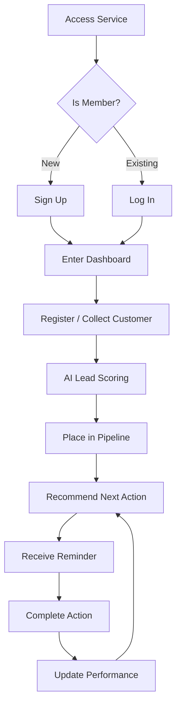
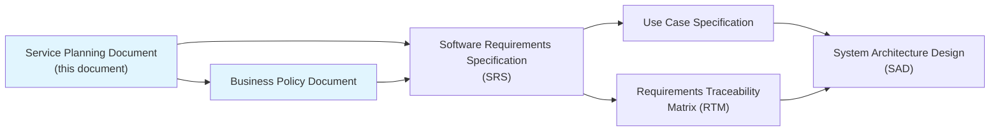

# Service Planning Document

> This document is a pre-planning document written before the SRS (Software Requirements Specification). It defines "why this service is being built," "what the core value is," and "what is included or excluded from the MVP."
> While the SRS focuses on "what to build," this document focuses on "why to build it" and "how far the scope should go."

| Item | Value |
|------|-------|
| **Project name** | VIVE CRM |
| **Document version** | v1.1 |
| **Created on** | 2026-02-24 |
| **Author** | Kwon Younghae / Planning and Development |
| **Approver** | Kwon Younghae / Project Owner |
| **Document status** | Revised (SEO/SaaS structure reflected) |

---

> **Terminology convention:** This document follows the notation principles and glossary defined in [`Terminology-Convention.md`](../01-Requirements-Analysis/Terminology-Convention.md). Any new term must be registered there first before being used.

---

## Change History

| Version | Date | Author | Description |
|---------|------|--------|-------------|
| v0.1 | 2026-02-24 | Kwon Younghae | Initial draft based on the one-page business plan |
| v1.0 | 2026-02-24 | Kwon Younghae | Expanded using the service planning template |
| v1.1 | 2026-03-17 | Kwon Younghae | Added SEO strategy, landing/app separation, SaaS security model |

---

## Table of Contents

1. [Service Overview](#1-service-overview)
2. [Core Mechanism](#2-core-mechanism)
3. [Content and Feature Strategy](#3-content-and-feature-strategy)
4. [Monetization Strategy](#4-monetization-strategy)
5. [MVP Scope Definition](#5-mvp-scope-definition)
6. [KPI Hypothesis Validation Framework](#6-kpi-hypothesis-validation-framework)
7. [Next Steps](#7-next-steps)
8. [Related Documents](#8-related-documents)

---

## 1. Service Overview

### 1.1 Service Name and Concept

| Item | Value |
|------|-------|
| Service name | VIVE CRM |
| One-line description | A smart CRM platform that helps sales teams manage customer relationships systematically and improve conversion rates with AI-based insights |
| Service type | SaaS (web service) |
| Target platform | Web (responsive) |

**Service concept description:**

Small and midsize sales teams and solo business operators often manage customer information through spreadsheets and notes, which causes them to miss opportunities and overlook potential leads. VIVE CRM surfaces those missed opportunities through AI-based insights. Beyond simple contact management, it tracks every customer touchpoint such as emails, calls, and meetings, and serves as a "sales copilot" by recommending the next action. The key value is to focus not on "customer management" itself, but on "revenue growth."

**Background and motivation:**

- Spreadsheet-based customer management frequently leads to lost sales opportunities
- The longer the sales cycle becomes, the easier it is to lose customer context and forget follow-up actions
- Existing CRMs such as Salesforce and HubSpot are too expensive and over-featured for small and midsize businesses
- There is a lack of AI-based prediction and recommendation tools built on sales behavior data

### 1.2 Core Value Proposition

| Item | Value |
|------|-------|
| Core value | Provide AI-based insights and automated workflows so sales teams can engage customers at the right time without missing opportunities and improve revenue conversion rates |
| Differentiator | AI-based next action recommendations: prospect discovery, lead scoring, follow-up timing prediction |
| Advantage over alternatives | Optimized features and reasonable pricing compared with spreadsheets (inefficient), domestic CRMs (insufficient features), and global CRMs (too expensive) |

**Value proposition canvas:**

| Category | Content |
|----------|---------|
| User jobs | Discover prospects, manage the sales pipeline, maintain ongoing relationships with customers, and close contracts |
| User pains | Customer information is scattered across multiple places, causing poor visibility; follow-up timing is missed and opportunities are lost; sales performance is hard to show with data |
| User gains | 360-degree customer view at a glance, follow-up reminders that prevent misses, data-driven sales strategy |
| Pain relievers | Unified customer profile, automated follow-up reminders, visual sales pipeline |
| Gain creators | AI lead scoring, next action recommendations, revenue forecast reports |

### 1.3 Target User Definition

#### 1.3.1 Primary User Personas

**Persona 1: Sales Team Lead "Minsu"**

| Item | Value |
|------|-------|
| Name | Kim Minsu |
| Age / occupation | 38 / Sales team lead at a B2B SaaS startup (5 team members) |
| Technical level | Intermediate (has CRM experience) |
| Core goal | Wants visibility into team sales activity and more accurate sales forecasting |
| Key pain point | Team members manage things separately in Excel, so it is hard to understand the current status, and Salesforce is too expensive |
| Usage scenario | Checks team status through a dashboard during weekly sales meetings and uses AI to identify risky deals for early action |
| Success criterion | Full visibility into the team pipeline and at least 80% forecasting accuracy |

**Persona 2: Sales Representative "Jieun"**

| Item | Value |
|------|-------|
| Name | Park Jieun |
| Age / occupation | 29 / Solo business operator (freelance sales agency) |
| Technical level | Beginner to intermediate (first CRM experience) |
| Core goal | Wants to avoid missing or forgetting any customer communication |
| Key pain point | Has too many customers and does not know who to follow up with or when |
| Usage scenario | Logs in every morning and checks the AI-provided list of customers who need follow-up today |
| Success criterion | Manage customers within 30 minutes per day on average and miss zero follow-ups |

**Persona 3: Marketing Manager "Hyunwoo"**

| Item | Value |
|------|-------|
| Name | Lee Hyunwoo |
| Age / occupation | 32 / Marketing team member at a midsize company (5-person team) |
| Technical level | Intermediate |
| Core goal | Wants to hand off marketing-generated leads to sales efficiently |
| Key pain point | Lead information is passed along with low quality, causing frustration on the sales side |
| Usage scenario | Automatically registers website inquiry leads in the CRM and uses lead scores to suggest sales priority |
| Success criterion | Shorter lead-to-sales handoff time and improved lead quality |

#### 1.3.2 User Segments

| Segment | Description | Estimated Size | Priority | Included in MVP |
|---------|-------------|----------------|----------|-----------------|
| Sales teams at startups with 1 to 10 people | Teams that need efficient customer management tools because of limited resources | About 50,000 teams nationwide | P0 | Y |
| Freelancers / solo operators | Individuals who need to manage many customers by themselves | About 200,000 people nationwide | P0 | Y |
| Small and midsize business sales teams | Companies feeling the complexity and cost burden of existing CRMs | About 100,000 teams nationwide | P1 | Y |
| Marketing agencies | Agencies that manage leads on behalf of customers | About 5,000 agencies nationwide | P1 | Y |

#### 1.3.3 Non-Users (Anti-Personas)

| Non-user | Reason | Alternative |
|----------|--------|-------------|
| Enterprise sales teams | Already using enterprise CRMs such as Salesforce or MS Dynamics | Existing enterprise CRM |
| Non-sales roles | Do not perform sales work | General work management tools such as Notion or Trello |
| Offline retail businesses | POS and inventory management are more important than customer relationship management | POS system |
| Completely non-digital industries | Refuse to use digital tools | Paper- and phone-based management |

---

## 2. Core Mechanism

### 2.1 How the Service Works

**Core loop:**

When a user registers or collects customer information, the system analyzes and scores the lead with AI, provides timely follow-up recommendations and reminders, and then generates the next insight after the user completes the action.

1. **Customer registration**: Register customer information through manual entry, web form integration, or CSV import
2. **AI lead scoring**: Automatically evaluate purchase likelihood based on customer data
3. **Pipeline placement**: Place the customer in a sales stage (`Lead → Opportunity → Proposal → Negotiation → Contract`)
4. **Next action recommendation**: AI suggests the best next action (`email`, `call`, `meeting`) and timing
5. **Follow-up reminder**: Send reminders at configured times to drive action
6. **Performance measurement**: Collect sales activity data and generate performance reports

**Core principles:**

- Minimize manual data entry and let AI automatically generate insights
- Every customer touchpoint is tracked in a timeline
- Sales performance is visualized through a real-time dashboard

### 2.2 Full Service Flow

### 2.3 Key User Journeys

#### Journey 1: First Use - Register a Customer and Receive the First Insight

| Stage | User Action | System Response | Emotional Goal | Key Metric |
|-------|-------------|----------------|----------------|------------|
| 1. Entry | Access landing page | Show core value proposition and demo video | Curiosity | Visit rate |
| 2. Register first customer | Enter customer information or upload CSV | AI automatically calculates lead score | Surprise ("This actually works") | First customer registration rate |
| 3. Review insight | Check the recommended next action | Provide a concrete and actionable suggestion | Trust ("This is genuinely helpful") | Insight click-through rate |
| 4. Complete first follow-up | Complete suggested email or call | Show performance count-up animation | Sense of achievement | First action completion rate |
| 5. Sign up | Sign up to save results | Automatically save previous activity | Relief | Signup conversion rate |

#### Journey 2: Repeated Use - Pipeline Management

| Stage | User Action | System Response | Emotional Goal | Key Metric |
|-------|-------------|----------------|----------------|------------|
| 1. Revisit | Open dashboard and review pipeline status | Visual pipeline plus risk alerts | Familiarity | D7 Retention |
| 2. Progress deal | Move customer to the next stage | Provide stage-specific guides and templates | Productivity | Pipeline movement rate |
| 3. Share with team | Mention or assign the deal to a team member | Real-time notification and collaboration feature | Collaboration | Team feature usage rate |
| 4. Review report | Check weekly performance report | Provide data-based insights | Satisfaction | Report open rate |

---

## 3. Content and Feature Strategy

### 3.1 Direction for Core Features

| Feature Area | Strategic Direction | Priority | Included in MVP | Notes |
|--------------|---------------------|----------|-----------------|-------|
| Contact management | Customer profile, history, and tag management | P0 | Y | Core feature |
| Pipeline management | Kanban board by sales stage, deal management | P0 | Y | Core feature |
| AI lead scoring | Predict purchase likelihood from customer data | P0 | Y | Core differentiator |
| Activity tracking | Record all touchpoints such as email, call, and meeting | P0 | Y | Core feature |
| Next action recommendation | Suggest the optimal action and timing through AI | P1 | Y | Core experience |
| Tasks and reminders | Follow-up reminders and notifications | P1 | Y | Drives repeat visits |
| Dashboard and reports | Sales performance and forecast reports | P1 | Y | |
| Web forms / lead capture | Collect leads through website integration | P2 | N | Add in v2 |
| Email integration | Gmail / Outlook integration | P2 | N | Add in v2 |
| Team collaboration | Assignment, mention, comment | P2 | N | Add in v2 |

**Feature direction decision log:**

| Item | Option A | Option B | Decision | Rationale |
|------|----------|----------|----------|-----------|
| Data source | Focus on manual entry | Focus on external integration | A | In the MVP, validating the core workflow comes first |
| Scope of AI | Lead scoring + prediction | Generative AI (email writing, etc.) | A | Prediction gives more direct sales value than generation |
| Pipeline | Fixed five stages | User-customizable | A | Start with a standardized experience for the early phase |

### 3.2 Content Strategy

| Item | Content |
|------|---------|
| Content types | Customer data, sales activity logs, AI insights |
| Content production method | User input plus AI-based automatic analysis and scoring |
| Content curation | Auto-sorted by lead score, pipeline stage, and priority |
| Content refresh cycle | Real time for activity logging, daily for AI score updates |
| Quality control | Data validation and duplicate customer detection |

### 3.3 Brand and Tone

| Item | Content |
|------|---------|
| Brand tone | Professional and trustworthy, optimized for sales flow |
| Communication style | Polite Korean UI, clear action-oriented wording, appropriate emoji usage |
| Visual identity | Clean white and blue theme, UI centered on data visualization |
| Character / mascot | None |

---

## 4. Monetization Strategy

### 4.1 Revenue Model Selection

| Item | Content |
|------|---------|
| Primary revenue model | Freemium: basic free plan plus paid Pro subscription |
| Secondary revenue model | Enterprise custom plans (long term) |
| Free / paid boundary | Free: up to 100 customers and one basic pipeline / Paid: unlimited customers, AI features, advanced reports |
| Pricing strategy | Pro monthly KRW 29,000 to 49,000, enterprise pricing negotiated separately |

#### Revenue Model Comparison

| Criteria | Model A: Fully Free + Ads | Model B: Freemium | Model C: B2B Only |
|----------|----------------------------|-------------------|------------------|
| User experience impact | Ads harm the professional brand image | Users can experience core value for free | Individual users cannot access it |
| Expected revenue | Low | Medium (assuming 5% conversion) | High, but early sales cost is large |
| Implementation complexity | Low | Medium | High |
| Suitability for MVP | N | **Y** | N |
| **Decision** |  | **Selected** |  |

### 4.2 Phased Monetization Plan

| Phase | Timing / Condition | Monetization Method | Goal |
|-------|--------------------|---------------------|------|
| Phase 0: PMF validation | Before reaching 500 MAU | None (fully free with relaxed feature limits) | Validate core value and gather user feedback |
| Phase 1: Initial monetization | `MAU 500+` and `D7 Retention 30%+` | Introduce freemium (customer limit + Pro subscription) | Reach KRW 5 million MRR |
| Phase 2: Revenue optimization | `MRR 20 million KRW+` | Upgrade Pro plan (stronger AI features), annual discount | Achieve 7% conversion |
| Phase 3: Revenue diversification | `MRR 100 million KRW+` | Enterprise plan (custom development, dedicated support) | 30% of revenue from B2B |

### 4.3 Billing Policy Summary

| Item | Policy Direction |
|------|------------------|
| Free trial | Free after signup up to 100 customers |
| Refund policy | Full refund within 30 days for annual plans. No refunds for monthly plans, though cancellation is allowed anytime |
| Subscription renewal | Monthly/annual auto-renewal, email notice 7 days before renewal, cancellation anytime |
| Payment methods | Domestic cards, virtual accounts, and international payment support |

---

## 5. MVP Scope Definition

> **This section is the core of the document.**
> Preventing scope creep depends more on clearly defining **"what will not be built and why"** than simply listing what will be built.

### 5.1 MVP Definition Criteria

| Item | Content |
|------|---------|
| MVP goal | Validate whether AI-based lead scoring and next action recommendations can actually improve customer management efficiency for sales teams |
| MVP duration | 8 weeks (2 weeks design + 4 weeks development + 2 weeks testing/release) |
| MVP success criteria | `WAU 100+` within 4 weeks of launch, `D7 Retention 30%+` after first customer registration, `NPS 40+` |
| Response if MVP fails | If `D7 Retention < 15%`, conduct user interviews and evaluate feature pivot or target change |

### 5.2 In-Scope

| ID | Feature / Item | Description | Priority | Estimated Effort | Notes |
|----|----------------|-------------|----------|------------------|-------|
| MVP-001 | Customer registration and editing | Customer information CRUD, CSV import | P0 | 3 days | Core entry point |
| MVP-002 | Customer profile / timeline | 360-degree view and activity history | P0 | 5 days | Core experience |
| MVP-003 | Pipeline board | Kanban board and stage movement | P0 | 5 days | Core feature |
| MVP-004 | AI lead scoring | Automatic assessment based on customer data | P0 | 7 days | Core differentiator |
| MVP-005 | Next action recommendation | AI-based action suggestions | P0 | 5 days | Core differentiator |
| MVP-006 | Tasks and reminders | Follow-up registration and reminders | P0 | 4 days | |
| MVP-007 | User authentication (signup/login) | Email-based signup | P1 | 3 days | |
| MVP-008 | Dashboard | Core metrics and pipeline status | P1 | 4 days | Drives repeat visits |
| MVP-009 | Basic reports | Monthly activity summary | P1 | 3 days | |
| MVP-010 | Basic analytics event collection | Track core events such as registration and activity completion | P1 | 2 days | For hypothesis validation |
| MVP-011 | Landing page | Service value proposition and signup CTA | P2 | 3 days | If time allows |
| MVP-012 | Customer limit logic | Free-tier limit of 100 customers | P2 | 2 days | If time allows |

### 5.3 Out-of-Scope and Rationale

| ID | Excluded Item | Reason for Exclusion | MVP Alternative | Condition for v2 Entry |
|----|---------------|----------------------|-----------------|------------------------|
| EX-001 | Email integration (`Gmail`/`Outlook`) | Integration development is too large an investment before PMF is validated and is unnecessary for the core hypothesis | Replace with manual email logging | When user requests exceed 30 or D7 Retention reaches 30% |
| EX-002 | Web forms / lead capture | Many external integrations increase early complexity; core CRM validation comes first | Replace with CSV import | When `MAU 1,000+` and form requests appear frequently in user feedback |
| EX-003 | Team collaboration (assignment, mention) | Multi-user collaboration becomes meaningful after PMF is proven for individual users; first validate solo use | Replace with single-user mode | When team / enterprise users exceed 30% of the base |
| EX-004 | Mobile app | Development focus must stay concentrated; responsive web should validate the MVP first | Support mobile access through responsive web | When `MAU 5,000+` and mobile traffic exceeds 40% |
| EX-005 | API integration | External system integration belongs after stabilization | None, focus on manual data input | When at least 10 enterprise customers appear |
| EX-006 | Advanced permission management | Simple role separation is sufficient early on | Provide only basic roles (`admin` / `user`) | Develop together when team features are introduced |
| EX-007 | Multilingual support | The initial target is domestic users | Korean-only UI | When overseas users exceed 20% |

### 5.4 MVP Feature Scope Diagram

```mermaid
flowchart LR
    subgraph MVP["MVP (v1.0)"]
        direction TB
        F1["P0: Customer Registration / Editing"]
        F2["P0: Customer Profile / Timeline"]
        F3["P0: Pipeline Board"]
        F4["P0: AI Lead Scoring"]
        F5["P0: Next Action Recommendation"]
        F6["P0: Tasks / Reminders"]
        F7["P1: User Authentication"]
        F8["P1: Dashboard"]
        F9["P1: Basic Reports"]
    end

    subgraph V2["v2.0 (when conditions are met)"]
        direction TB
        F10["Email Integration"]
        F11["Web Forms / Lead Capture"]
        F12["Team Collaboration"]
        F13["Mobile App"]
    end

    subgraph FUTURE["Long-Term Roadmap"]
        direction TB
        F14["Enterprise Custom Plan"]
        F15["API Marketplace"]
        F16["AI Sales Coach"]
    end

    MVP --> V2
    V2 --> FUTURE
```

### 5.5 Technical MVP Decisions

| Decision Item | MVP Choice | Rationale | Can Shift in v2 |
|---------------|------------|-----------|-----------------|
| Infrastructure | Vercel (frontend) + Railway/Fly.io (backend) | Minimize early cost with a serverless-based setup and enable fast deployment | Y (`AWS`/`GCP` migration possible) |
| Frontend | Next.js (`App Router`) + Tailwind CSS | Supports `SSR/SSG`, fast development, SEO advantage | Y |
| Backend | Node.js (`Hono` or `Express`) | Development efficiency by using the same language as the frontend | Y |
| AI / ML | Python (`FastAPI`) or Node.js + `TensorFlow.js` | Start with simple rules plus external APIs | Y |
| Database | PostgreSQL (`Supabase` or `Neon`) | Best fit for relational data, easier operations with a managed service | Y |
| Authentication | NextAuth.js or custom JWT | Email-based authentication, social login can be added later | Y |

---

## 6. KPI Hypothesis Validation Framework

### 6.1 Hypotheses to Validate

| ID | Hypothesis | Validation Method | Success Criterion | Response if Failed | Priority |
|----|------------|------------------|------------------|--------------------|----------|
| H-001 | "At least 70% of users who review AI lead scoring results will execute the recommended next action" | Measure next action click-through and completion | `50%+` action completion | Improve recommendation algorithm or change recommendation format | P0 |
| H-002 | "At least 30% of users who experience a useful insight after registering their first customer will revisit within 7 days" | Measure `D7 Retention` for users who registered a first customer | `D7 Retention 30%+` | Improve insight quality or onboarding | P0 |
| H-003 | "Users who record activity at least 3 times per week will have monthly churn below 10%" | Measure churn by cohort | Monthly churn below 10% | Strengthen return-driving reminders or redefine the core value | P0 |
| H-004 | "At least 5% of free users will convert to Pro when presented with a paid upgrade proposal" | Measure conversion rate | `5%+` conversion | Adjust the free/paid boundary or redesign Pro value | P1 |

### 6.2 Key Metrics

| Category | Metric | Definition | Target | Measurement Method | Frequency |
|----------|--------|------------|--------|--------------------|-----------|
| **North Star** | Weekly Activities Completed | Number of sales activities completed by users (email, call, meeting) | 500 per week (8 weeks after launch) | Event tracking | Weekly |
| Acquisition | New signups | Weekly count of new signups | 50 per week (8 weeks after launch) | Signup event | Weekly |
| Activation | First customer registration rate | Percentage of users who register a first customer after signup | `60%+` | Event tracking | Weekly |
| Retention | `D1 / D7 / D30 Retention` | Revisit rate within 1/7/30 days after first customer registration | `D1 40% / D7 30% / D15 15%` | Cohort analysis | Weekly |
| Revenue | MRR | Monthly recurring revenue | Phase 1 target: KRW 5 million | Billing system | Monthly |
| Referral | Referral signup rate | Percentage of signups coming from existing user referrals | `10%+` | Referral code tracking | Weekly |

---

## 7. Next Steps

### 7.1 Planning Completion Checklist

- [x] Is the service concept clearly defined in one sentence?
- [x] Are target users specifically defined, including non-users?
- [x] Is the core value proposition differentiated from competitors?
- [x] Is the Core Loop clear?
- [x] Has a revenue model been selected with rationale?
- [x] Are all in-scope and out-of-scope items defined?
- [x] **Are both "why excluded" and "what is used instead" recorded for excluded items?**
- [x] Are the hypotheses to validate defined with quantitative success criteria?
- [x] Are fallback responses defined in advance if the hypotheses fail?

### 7.2 v2+ Roadmap

| Version | Entry Condition | Main Features | Goal |
|---------|-----------------|---------------|------|
| v1.0 (MVP) | - | See Section 5.2 | Validate the core hypothesis (value of AI insight) |
| v1.1 | Reflect bugs and feedback within 2 weeks after MVP release | Bug fixes, UX improvements | Stabilization |
| v2.0 | `D7 Retention 30%` achieved and `MAU 1,000` | Email integration, web forms, team features | Growth + initial monetization |
| v3.0 | `MRR 20 million KRW` achieved | Mobile app, advanced AI features, enterprise offering | Revenue optimization |

---

## 8. Related Documents

### 8.1 Relationship Between Documents

### 8.2 Reference Documents

| Document | Location | Relationship |
|----------|----------|--------------|
| Business Policy Document | `docs/eng/00-Planning/Business-Policy-Document.md` | Defines the business rules from this document in detail |
| Requirements Specification (SRS) | `docs/eng/01-Requirements-Analysis/Software-Requirements-Specification-SRS.md` | Turns the MVP scope from this document into system requirements |
| Use Case Specification | `docs/eng/01-Requirements-Analysis/Use-Case-Specification.md` | Expands key user journeys into detailed use cases |
| Requirements Traceability Matrix | `docs/eng/01-Requirements-Analysis/Requirements-Traceability-Matrix-RTM.md` | Requirement traceability |

---

## Appendix

### A. Competitive Analysis

| Item | Spreadsheet | Domestic CRM (Dooray, etc.) | Global CRM (Salesforce) | **VIVE CRM** |
|------|-------------|-----------------------------|-------------------------|--------------|
| Core capability | Manual data management | Basic CRM features | Enterprise-grade features | AI-based insight + next action recommendation |
| Price | Free | KRW 100,000 to 300,000/month | USD 75 to 300/month | Freemium (KRW 29,000 to 49,000/month) |
| Strength | Anyone can use it | Optimized for the domestic environment | Feature-rich and customizable | **AI insight, reasonable price, intuitive UX** |
| Weakness | Inefficient and error-prone | No AI features | Expensive and complex | Limited initial features, low awareness as a new service |
| Target user | Small individuals | Small and midsize businesses | Enterprises | SMBs and solo business operators |
| **Differentiation point** |  |  |  | AI-based lead scoring + next action recommendation + reasonable pricing |

### B. Term Definitions

> For the full glossary, see [`Terminology-Convention.md`](../01-Requirements-Analysis/Terminology-Convention.md).

### C. Approval

| Role | Name | Signature | Date |
|------|------|-----------|------|
| Planning lead | Kwon Younghae | | |
| Project owner | Kwon Younghae | | |
