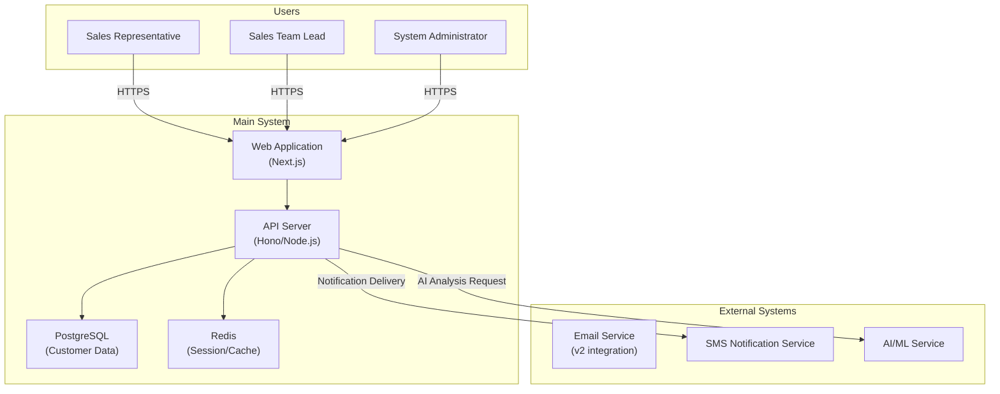

# Software Requirements Specification (SRS)

> **Version:** v1.1  
> **Document No.:** SRS-001  
> **Created on:** 2026-02-24  
> **Updated on:** 2026-03-17  
> **Author:** Kwon Younghae / Planning and Development  
> **Classification:** Public

---

## Change History

| Version | Date | Description | Author | Approver |
|---------|------|-------------|--------|----------|
| v0.1 | 2026-02-24 | Initial draft | Kwon Younghae | - |
| v1.0 | 2026-02-24 | Final approval | Kwon Younghae | Kwon Younghae |
| v1.1 | 2026-03-17 | Added SEO/SaaS requirements, security requirements, Workspace model | Kwon Younghae | Kwon Younghae |

---

## Table of Contents

1. [Document Overview](#1-document-overview)
2. [Overall System Description](#2-overall-system-description)
3. [Functional Requirements](#3-functional-requirements)
4. [Non-Functional Requirements](#4-non-functional-requirements)
5. [External Interface Requirements](#5-external-interface-requirements)
6. [Data Requirements](#6-data-requirements)
7. [Constraints](#7-constraints)
8. [Approval Record](#8-approval-record)

---

## 1. Document Overview

### 1.1 Purpose

This document defines the software requirements for the **VIVE CRM** system. It aims to ensure all project stakeholders (development team, planning team, QA team, operations team) share the same understanding of the system.

This document is used for:
- Clear definition of development scope and features
- Baseline document for design, implementation, and testing
- Foundation for Requirements Traceability Matrix (RTM)
- Basis for agreement and approval among stakeholders

### 1.2 Scope

The scope of the system covered in this document is as follows:

**In Scope:**
- Customer (lead/contact) management features
- Sales pipeline (deal) management features
- AI-based lead scoring and next action recommendations
- Activity tracking (email, phone, meeting, note)
- Task and notification management
- Dashboard and reports
- User authentication and account management

**Out of Scope:**
- Email service integration (Gmail/Outlook)
- Web form / lead capture features
- Team collaboration features (assignment, mention)
- Mobile native apps
- External API integration

Key objectives of the system:
1. Improve sales team customer management efficiency
2. Improve revenue conversion rates with AI-based insights
3. Provide intuitive UX with a low learning curve

### 1.3 Terminology

| Term | Definition |
|------|------------|
| SRS | Software Requirements Specification |
| RTM | Requirements Traceability Matrix |
| FR | Functional Requirement |
| NFR | Non-Functional Requirement |
| UC | Use Case |
| API | Application Programming Interface |
| SLA | Service Level Agreement |
| RBAC | Role-Based Access Control |
| JWT | JSON Web Token |
| CRUD | Create, Read, Update, Delete |
| CI/CD | Continuous Integration / Continuous Deployment |
| Lead | Potential customer |
| Deal | Sales opportunity |
| Pipeline | Visual flow of sales stages |
| Stage | Each step in the pipeline |

### 1.4 Reference Documents

| Document | Version | Notes |
|----------|---------|-------|
| Service Planning Document | v1.0 | Project background and objectives |
| Use Case Specification | v1.0 | Detailed UC scenarios |
| Requirements Traceability Matrix (RTM) | v0.1 | Requirement tracking |
| Screen Design (Wireframe) | v1.0 | UI/UX reference |

### 1.5 Priority Definition

The priority criteria used in this document are as follows:

| Level | Label | Definition |
|-------|-------|------------|
| P0 | Must | Core features that must be implemented. System launch impossible without them |
| P1 | Should | Strongly recommended features. Adjustable based on schedule |
| P2 | Could | Nice to have but not essential. Can be moved to subsequent releases |

---

## 2. Overall System Description

### 2.1 System Context Diagram

### 2.2 User Types and Characteristics

| Actor ID | User Type | Description | Permission Level | Usage Frequency | Technical Skill |
|----------|-----------|-------------|------------------|-----------------|-----------------|
| ACT-01 | Sales Representative | Daily customer management, activity recording | Basic | Daily | Beginner~Intermediate |
| ACT-02 | Sales Team Lead | Team status monitoring, report review | Admin | Daily | Intermediate~Advanced |
| ACT-03 | System Administrator | System settings, user management | Super | As needed | Advanced |
| ACT-04 | Marketing Manager | Lead collection status review | Basic | 2-3x/week | Intermediate |
| ACT-05 | External System | External systems connecting via API | API Only | Always | - |

### 2.3 Operating Environment

#### 2.3.1 Hardware Environment

| Category | Specification | Notes |
|----------|---------------|-------|
| Application Server | 2 vCPU, 4GB RAM, 50GB SSD | Based on Railway/Fly.io |
| Database Server | Managed PostgreSQL (Supabase/Neon) | Free Tier ~ Pro Tier |
| Cache Server | Managed Redis (Upstash) | Free Tier |

#### 2.3.2 Software Environment

| Category | Technology Stack | Version | Notes |
|----------|------------------|---------|-------|
| OS | Ubuntu Linux | 22.04 LTS | |
| Runtime | Node.js | 20.x | |
| Framework | Next.js (Frontend), Hono (Backend) | 14+, 4.x | |
| Database | PostgreSQL | 15+ | |
| Cache | Redis | 7.x | |
| Container | Docker | - | For local development |
| CI/CD | GitHub Actions | - | |

#### 2.3.3 Client Environment

| Category | Supported Range | Notes |
|----------|-----------------|-------|
| Desktop Browsers | Chrome, Firefox, Safari, Edge (latest 2 versions) | |
| Mobile Browsers | iOS Safari 15+, Android Chrome | Responsive web |
| Minimum Resolution | 1280x720 | Responsive web |
| Mobile App | Not supported (under review for v2) | |

### 2.4 Constraints

1. Monthly operating costs limited to $100 (MVP phase)
2. Development and operation by single developer resources
3. Compliance with Korean data protection laws (Personal Information Protection Act)
4. MVP launch required within Q2 2026

### 2.5 Assumptions and Preconditions

1. Users access the system in a stable internet environment
2. Initial user base expected to be under 1,000
3. AI/ML services utilize external APIs (OpenAI, etc.)
4. No large-scale requirement changes during the project period

---

## 3. Functional Requirements

### 3.1 Functional Requirements Summary

| FR-ID | Feature | Description | Priority | Related UC | Status |
|-------|---------|-------------|----------|------------|--------|
| FR-001 | Sign-up/Login | Email-based sign-up and authentication | P0 Must | UC-001 | Draft |
| FR-002 | Customer (Contact) Management | Customer info CRUD, tag management | P0 Must | UC-002 | Draft |
| FR-003 | Deal (Sales Opportunity) Management | Pipeline board, deal CRUD | P0 Must | UC-003 | Draft |
| FR-004 | AI Lead Scoring | Automatic evaluation based on customer data | P0 Must | UC-004 | Draft |
| FR-005 | Next Action Recommendation | AI-based action suggestions | P0 Must | UC-005 | Draft |
| FR-006 | Activity Tracking | Email, phone, meeting, note recording | P0 Must | UC-006 | Draft |
| FR-007 | Tasks/Notifications | Follow-up registration, notifications | P0 Must | UC-007 | Draft |
| FR-008 | Dashboard | Key metrics, pipeline status | P1 Should | UC-008 | Draft |
| FR-009 | Reports | Weekly/monthly performance reports | P1 Should | UC-009 | Draft |

---

### 3.2 FR-001: Sign-up/Login

| Item | Content |
|------|---------|
| **FR-ID** | FR-001 |
| **Feature** | Sign-up/Login |
| **Description** | Users can sign up and log in to the system using email and password |
| **Priority** | P0 Must |
| **Related Features** | FR-002 ~ FR-009 |
| **Related UC** | UC-001 |

#### Input

| Field | Type | Required | Validation Rules |
|-------|------|----------|------------------|
| Email | String | Required | Email format, must be unique |
| Password | String | Required | Min 8 chars, alphabetic/numeric/special chars required |
| Password Confirm | String | Required | Must match password |
| Name | String | Required | 2-50 characters |
| Company | String | Optional | Max 100 characters |

#### Processing Logic

1. Email duplicate check
2. Password hashing (bcrypt) and storage
3. JWT Access Token and Refresh Token issuance
4. Welcome email sent

#### Output

| Scenario | Response | HTTP Status |
|----------|----------|-------------|
| Success | Sign-up/login complete, Access Token, Refresh Token issued | 200 OK / 201 Created |
| Validation failed | Field-specific error messages | 400 Bad Request |
| Duplicate email | "Email already registered" | 409 Conflict |
| Server error | General error message | 500 Internal Server Error |

---

### 3.3 FR-002: Customer (Contact) Management

| Item | Content |
|------|---------|
| **FR-ID** | FR-002 |
| **Feature** | Customer (Contact) Management |
| **Description** | Register, view, modify, delete customer information and classify by tags |
| **Priority** | P0 Must |
| **Related Features** | FR-004, FR-005, FR-006 |
| **Related UC** | UC-002 |

#### Input (Create/Update)

| Field | Type | Required | Validation Rules |
|-------|------|----------|------------------|
| Name | String | Required | 2-100 characters |
| Email | String | Optional | Email format |
| Phone | String | Optional | Phone number format |
| Company | String | Optional | Max 200 characters |
| Job Title | String | Optional | Max 100 characters |
| Source | Enum | Optional | Website, referral, ad, etc. |
| Tags | String[] | Optional | Max 10 tags |
| Memo | Text | Optional | Max 5,000 characters |

#### Processing Logic

1. Customer data validation
2. Duplicate customer check (based on email/phone)
3. AI lead score automatic calculation (linked to FR-004)
4. "Registered" activity automatically recorded in customer timeline

#### Output

| Scenario | Response | HTTP Status |
|----------|----------|-------------|
| Create success | Created customer info | 201 Created |
| List view success | Customer list (pagination) | 200 OK |
| Detail view success | Customer details + timeline | 200 OK |
| Update success | Updated customer info | 200 OK |
| Delete success | Delete confirmation message | 200 OK |

#### Notes

- CSV bulk registration supported
- Max 100 activities per customer
- Soft delete applied

---

### 3.4 FR-003: Deal (Sales Opportunity) Management

| Item | Content |
|------|---------|
| **FR-ID** | FR-003 |
| **Feature** | Deal (Sales Opportunity) Management |
| **Description** | Manage sales opportunities through pipeline board and track by stage |
| **Priority** | P0 Must |
| **Related Features** | FR-002, FR-006, FR-007 |
| **Related UC** | UC-003 |

#### Pipeline Stages

| Stage | Code | Description |
|-------|------|-------------|
| Lead | lead | Potential customer |
| Opportunity | opportunity | Sales opportunity confirmed |
| Proposal | proposal | Quote/proposal stage |
| Negotiation | negotiation | Negotiation/contract coordination |
| Closed Won | closed_won | Contract signed |
| Closed Lost | closed_lost | Sales failed |

#### Input (Create/Update)

| Field | Type | Required | Validation Rules |
|-------|------|----------|------------------|
| Deal Name | String | Required | 1-200 characters |
| Customer ID | UUID | Required | Valid customer ID |
| Amount | Decimal | Optional | 0 or above |
| Expected Close Date | Date | Optional | Future date |
| Stage | Enum | Required | One of pipeline stages |
| Probability | Integer | Optional | 0-100% |
| Memo | Text | Optional | Max 5,000 characters |

#### Output

| Scenario | Response | HTTP Status |
|----------|----------|-------------|
| Create success | Created deal info | 201 Created |
| Pipeline view | Stage-grouped deal list (Kanban format) | 200 OK |
| Stage move success | Updated deal info | 200 OK |

#### Notes

- Drag-and-drop stage movement possible
- Expected revenue calculated from deal amount

---

### 3.5 FR-004: AI Lead Scoring

| Item | Content |
|------|---------|
| **FR-ID** | FR-004 |
| **Feature** | AI Lead Scoring |
| **Description** | Analyze customer data to automatically evaluate purchase likelihood on a 0-100 scale |
| **Priority** | P0 Must |
| **Related Features** | FR-002 |
| **Related UC** | UC-004 |

#### Score Calculation Criteria

| Factor | Weight | Description |
|--------|--------|-------------|
| Basic Info Completeness | 20% | Required field input status |
| Source | 15% | Weight for high-quality sources (referral, website) |
| Activity History | 25% | Recent activity frequency and response |
| Deal History | 25% | Past deal progress and results |
| Industry/Size | 15% | Match with target industry and size |

#### Output

| Scenario | Response | HTTP Status |
|----------|----------|-------------|
| Score calculation success | Score (0-100) + Grade (A/B/C/D) | 200 OK |

#### Notes

- Automatic recalculation on customer registration/update
- 80+: Grade A (High), 60-79: Grade B (Medium), 40-59: Grade C (Low), <40: Grade D (Very Low)

---

### 3.6 FR-005: Next Action Recommendation

| Item | Content |
|------|---------|
| **FR-ID** | FR-005 |
| **Feature** | Next Action Recommendation |
| **Description** | AI analyzes customer status to suggest optimal next action and timing |
| **Priority** | P0 Must |
| **Related Features** | FR-002, FR-004 |
| **Related UC** | UC-005 |

#### Recommendation Types

| Type | Description | Condition |
|------|-------------|-----------|
| Send Email | Customized email suggestion | Last contact 3+ days ago |
| Phone Call | Call suggestion | Customer hasn't opened email, urgent deal |
| Meeting Proposal | Online/offline meeting | Proposal stage or above |
| Proposal Delivery | Quote/proposal | Opportunity stage, sufficient info |
| Hold | Postpone contact | Recently contacted, rejection indicated |

#### Output

| Scenario | Response | HTTP Status |
|----------|----------|-------------|
| Recommendation success | Recommended action + priority + suggested timing | 200 OK |

#### Notes

- "Today's Recommended Actions" list generated every morning
- Feedback collected when user completes action to improve recommendation accuracy

---

### 3.7 FR-006: Activity Tracking

| Item | Content |
|------|---------|
| **FR-ID** | FR-006 |
| **Feature** | Activity Tracking |
| **Description** | Record all touchpoints with customers (email, phone, meeting, memo) |
| **Priority** | P0 Must |
| **Related Features** | FR-002, FR-003 |
| **Related UC** | UC-006 |

#### Activity Types

| Type | Description | Input Fields |
|------|-------------|--------------|
| Email | Email send/receive record | Subject, content, send/receive status |
| Phone | Call record | Call type (outbound/inbound), duration, memo |
| Meeting | Meeting record | Meeting type (online/offline), location, attendees, memo |
| Note | Free memo | Content |
| Deal Move | Pipeline stage change | Previous stage, new stage, reason |

#### Output

| Scenario | Response | HTTP Status |
|----------|----------|-------------|
| Create success | Created activity info | 201 Created |
| Timeline view | Activity list (chronological) | 200 OK |

---

### 3.8 FR-007: Tasks/Notifications

| Item | Content |
|------|---------|
| **FR-ID** | FR-007 |
| **Feature** | Tasks/Notifications |
| **Description** | Register follow-ups as tasks and receive notifications |
| **Priority** | P0 Must |
| **Related Features** | FR-002, FR-003 |
| **Related UC** | UC-007 |

#### Input

| Field | Type | Required | Validation Rules |
|-------|------|----------|------------------|
| Task Name | String | Required | 1-200 characters |
| Customer ID | UUID | Optional | Related customer |
| Deal ID | UUID | Optional | Related deal |
| Due Date | DateTime | Optional | Future time |
| Priority | Enum | Optional | High/Medium/Low |
| Memo | Text | Optional | Max 1,000 characters |

#### Notification Channels

| Channel | Description | MVP Included |
|---------|-------------|--------------|
| In-app Notification | In-website notification | Y |
| Email Notification | Email delivery | Y |
| Browser Push | Push Notification | N (v2) |
| SMS Notification | Text message | N (v2) |

---

### 3.9 FR-008: Dashboard

| Item | Content |
|------|---------|
| **FR-ID** | FR-008 |
| **Feature** | Dashboard |
| **Description** | Visualize key sales metrics and pipeline status |
| **Priority** | P1 Should |
| **Related Features** | FR-002, FR-003 |
| **Related UC** | UC-008 |

#### Display Metrics

| Metric | Description |
|--------|-------------|
| Total Customers | Total registered customers |
| New Customers (Weekly) | New registrations this week |
| Pipeline Amount by Stage | Expected amount sum per stage |
| This Month's Expected Revenue | Expected deal amount |
| Incomplete Tasks | Count of uncompleted tasks |
| AI Recommended Actions | Count of today's recommended actions |

---

### 3.10 FR-009: Reports

| Item | Content |
|------|---------|
| **FR-ID** | FR-009 |
| **Feature** | Reports |
| **Description** | Generate weekly/monthly sales performance reports |
| **Priority** | P1 Should |
| **Related Features** | FR-006, FR-008 |
| **Related UC** | UC-009 |

#### Report Items

| Item | Description |
|------|-------------|
| Activity Summary | Activity count by type |
| Pipeline Changes | Deal movement status by stage |
| Success Rate | Contract signing rate |
| Average Sales Cycle | Average duration from lead to contract |
| Lead Score Distribution | Customer count by A/B/C/D grade |

---

## 4. Non-Functional Requirements

### 4.1 Non-Functional Requirements Summary

| NFR-ID | Category | Requirement | Target | Priority |
|--------|----------|-------------|--------|----------|
| NFR-001 | Performance | API Response Time | < 500ms (P95) | P0 Must |
| NFR-002 | Performance | Concurrent Users | 100 CCU | P0 Must |
| NFR-003 | Security | Authentication/Authorization | JWT + RBAC | P0 Must |
| NFR-004 | Security | Data Encryption | TLS 1.2+ | P0 Must |
| NFR-005 | Security | Audit Logging | Full recording | P0 Must |
| NFR-006 | Availability | Uptime Target | 99.5% | P0 Must |
| NFR-007 | Scalability | Horizontal Scaling | Future consideration | P1 Should |
| NFR-008 | Maintainability | Code Quality | Test coverage 70%+ | P1 Should |

---

## 5. External Interface Requirements

### 5.1 User Interface (UI)

#### 5.1.1 UI General Principles

| Item | Requirement |
|------|-------------|
| Design System | Based on shadcn/ui |
| Accessibility | WCAG 2.1 Level AA compliance |
| Internationalization (i18n) | Korean (single language) |
| Dark Mode | Not supported (under review for v2) |
| Loading States | Loading indicator displayed for all async operations |
| Error Display | User-friendly error messages, no technical details exposed |

#### 5.1.2 Main Screen List

| Screen ID | Screen Name | Description | Related FR |
|-----------|-------------|-------------|------------|
| SCR-01 | Login/Sign-up | Email authentication | FR-001 |
| SCR-02 | Dashboard | Key metrics summary | FR-008 |
| SCR-03 | Customer List | Customer management | FR-002 |
| SCR-04 | Customer Detail | Profile + timeline | FR-002, FR-006 |
| SCR-05 | Pipeline | Kanban board | FR-003 |
| SCR-06 | Task List | Todo management | FR-007 |
| SCR-07 | Reports | Performance reports | FR-009 |
| SCR-08 | Settings | Profile, notification settings | FR-001 |

### 5.2 API Interface

#### 5.2.1 API General Specifications

| Item | Content |
|------|---------|
| Protocol | HTTPS (TLS 1.2+) |
| Architecture Style | REST |
| Data Format | JSON (Content-Type: application/json) |
| Authentication | Bearer Token (JWT) |
| API Documentation | OpenAPI 3.0 (Swagger) |
| Base URL | /api/v1 |

---

## 6. Data Requirements

### 6.1 Data Entity Overview

| Entity | Description | Key Attributes |
|--------|-------------|----------------|
| User | User account | id, email, name, password_hash |
| Contact | Customer (contact) | id, name, email, phone, company, lead_score |
| Deal | Sales opportunity | id, title, amount, stage, probability |
| Activity | Activity record | id, type, contact_id, deal_id, content |
| Task | Task/Todo | id, title, due_date, priority, status |
| Tag | Tag | id, name, color |

### 6.2 Data Retention Policy

| Data Type | Retention Period | Deletion Policy |
|-----------|------------------|-----------------|
| User Account | 30 days after withdrawal | Complete deletion after 30 days |
| Customer Data | Deleted with account | Soft delete then complete after 30 days |
| Activity Log | Deleted with account | Same as above |
| Audit Log | 2 years | Legal requirement compliance |

---

## 7. Constraints

### 7.1 Technical Constraints

| Constraint | Description | Response |
|------------|-------------|----------|
| $100/month budget | Infrastructure cost limit | Use free tiers, efficient queries |
| Single developer | Development resource limit | Strict MVP scope management |
| Serverless environment | Stateless design required | JWT-based auth, external session store |

### 7.2 Legal Constraints

| Constraint | Description | Response |
|------------|-------------|----------|
| Personal Information Protection Act | Customer personal info protection | Encryption, access logs, minimal collection |
| Email Marketing Act | Spam prevention | Opt-in confirmation, unsubscribe feature |

---

## 8. Approval Record

| Role | Name | Signature | Date |
|------|------|-----------|------|
| Planning Lead | Kwon Younghae | | 2026-02-24 |
| Development Lead | Kwon Younghae | | 2026-02-24 |

---

**This SRS serves as the approved baseline for downstream design, implementation, testing, and release planning.**
