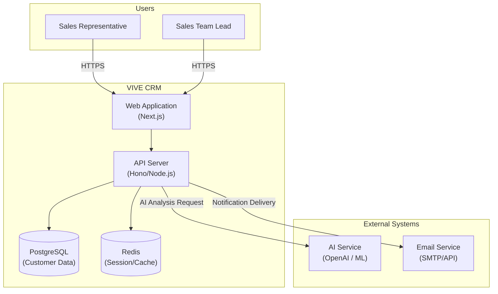
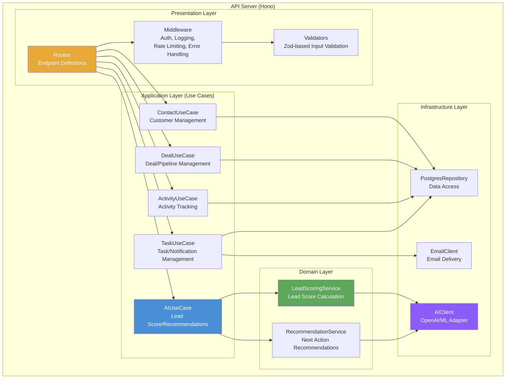

# System Architecture Design (SAD)

> **Project:** VIVE CRM  
> **Version:** v1.0  
> **Created on:** 2026-02-24  
> **Author:** Kwon Younghae / Planning and Development  
> **Approver:** Kwon Younghae / Project Owner  
> **Document Status:** Draft

---

> **Terminology Convention:** This document follows the notation principles and glossary defined in [`Terminology-Convention.md`](../01-Requirements-Analysis/Terminology-Convention.md).

---

## 1. Document Overview

### 1.1 Purpose

This document defines the system architecture for VIVE CRM and describes key technical decisions and design principles. It enables a single developer (Kwon Younghae) to design and implement the system in a consistent direction, and serves as a baseline document for future collaborators or contributors to quickly understand the system.

### 1.2 Scope

- Overall system architecture structure and components
- Technology stack selection and rationale
- Deployment architecture and infrastructure configuration
- Architecture response strategy for non-functional requirements
- External system integration patterns

### 1.3 Reference Documents

| Document | Version | Notes |
|----------|---------|-------|
| Service Planning Document | v1.0 | Service overview, MVP scope, technology stack direction |
| Use Case Specification (UCS-001) | v1.0 | Detailed specifications for 9 use cases |
| Requirements Traceability Matrix (RTM-001) | v0.1 | Tracking for 9 FRs, 8 NFRs |
| Terminology Convention | v1.0 | Project terminology notation principles |

### 1.4 Change History

| Version | Date | Author | Description |
|---------|------|--------|-------------|
| v0.1 | 2026-02-24 | Kwon Younghae | Initial draft |
| v1.0 | 2026-02-24 | Kwon Younghae | Complete architecture design with 4 ADRs |

---

## 2. Architecture Overview

### 2.1 Architecture Style Selection

#### Selected Architecture Style

**Layered Architecture + Modular Monolith**

#### Candidate Architecture Style Comparison

| Evaluation Item | Layered + Modular Monolith | Microservices | Serverless |
|-----------------|---------------------------|---------------|------------|
| Implementation Complexity | Low | High | Medium |
| Scalability | Medium | High | High |
| Maintainability | Medium | High | Medium |
| Single Developer Suitability | **Very High** | Very Low | Medium |
| Deployment Flexibility | Medium | High | High |
| Operational Complexity | **Low** | Very High | Low |
| **Overall Score** | **4.5 / 5** | 2.0 / 5 | 3.5 / 5 |

#### Selection Rationale

- **Optimized for single developer environment**: Microservices involve operational burdens such as inter-service communication and distributed tracing that are unrealistic for a single developer
- **Fast MVP development**: To implement core features within the 8-week MVP schedule, infrastructure complexity must be minimized
- **Clear module boundaries**: With Modular Monolith, domain-specific module boundaries are maintained, allowing specific modules to be separated into independent services when needed in the future
- **Cost efficiency**: Single server deployment can meet the $100 monthly budget constraint

### 2.2 Architecture Principles

| Principle | Description | Application Method |
|-----------|-------------|-------------------|
| Separation of Concerns | Each layer/module has a single responsibility | Clearly separate frontend (UI), backend (business logic), and data (storage). Within backend, separate directories by domain module |
| Loose Coupling | Minimize dependencies between modules | Module communication through interfaces/types. External services (AI API) isolated through adapter pattern |
| High Cohesion | Group related functions into a single module | Group into domain-specific modules: contact, deal, activity, task |
| DRY (Don't Repeat Yourself) | Prevent code and logic duplication | Extract common utilities, type definitions, error handling to shared module |
| External Service Isolation | Wrap external API dependencies in adapters | Hide AI API and other external service implementations behind interfaces for easy substitution |
| MVP-First Design | Prioritize working code over excessive abstraction | Prioritize practical design initially while maintaining clear module boundaries |

### 2.3 System Context Diagram



### 2.4 Container Diagram

| Container | Technology | Responsibility |
|-----------|------------|----------------|
| Web Application | Next.js 14+ (App Router) | UI rendering, SSR, routing |
| API Server | Hono (Node.js) | Business logic, API endpoints |
| Database | PostgreSQL (Supabase/Neon) | Persistent data storage |
| Cache | Redis (Upstash) | Session, cache, rate limiting |
| AI Service | External API (OpenAI) | Lead scoring, recommendations |

### 2.5 Component Diagram

Core backend components include:

| Component | Description |
|-----------|-------------|
| Auth | Authentication, authorization, JWT management |
| Contacts | Customer CRUD, search, tags, CSV import |
| Deals | Pipeline management, stage tracking |
| Activities | Activity recording, timeline generation |
| Tasks | Task management, reminders |
| AI | Lead scoring, next action recommendations |
| Dashboard | KPI aggregation, metrics |
| Notifications | In-app notifications, email delivery |
| Reporting | Weekly/monthly reports |



---

## 3. Technology Stack Selection

### 3.1 Selection Matrix

Reflecting single developer + $100/month budget + 8-week MVP constraints, standard weights are adjusted.

| Evaluation Criteria | Weight | Description |
|---------------------|--------|-------------|
| Learning Curve / Development Speed | 30% | Most important for single developer. Technologies already familiar or quickly learnable |
| Ecosystem | 20% | Richness of related libraries and frameworks |
| Cost | 20% | Free tier or operable within $100/month |
| Community | 15% | Accessibility of reference materials for problem solving |
| Performance | 10% | Appropriate performance for MVP-level traffic |
| Stability | 5% | Production validation level |

| Technology | Evaluation Criteria | Score | Rationale |
|------------|---------------------|-------|-----------|
| Next.js | Speed, Ecosystem, Learning Curve | 5/5 | App Router, SSR, built-in optimizations |
| Hono | Speed, TypeScript, Simplicity | 5/5 | Lightweight, fast, type-safe |
| PostgreSQL | Reliability, Ecosystem, Cost | 5/5 | Managed services available, proven |
| Prisma | Developer Experience, Type Safety | 5/5 | Auto-generated types, migration support |
| Redis | Performance, Simplicity | 4/5 | Managed service, session/cache ideal |
| Tailwind CSS | Development Speed, Consistency | 5/5 | Utility-first, design system compatible |

### 3.2 Frontend

**Next.js with App Router and Tailwind CSS**

| Area | Selected Technology | Version | Rationale |
|------|---------------------|---------|-----------|
| Framework | Next.js (App Router) | 14+ | SSR/SSG support, SEO benefits, API Routes for BFF, Vercel free deployment |
| Styling | Tailwind CSS | 3.x | Utility-based rapid UI development, consistent design system |
| State Management | Zustand | 4.x | Lightweight, minimal boilerplate, React-friendly |
| HTTP Client | fetch (built-in) | - | Next.js extended fetch with caching/revalidation |
| Form Validation | Zod + React Hook Form | - | Shareable schema between frontend/backend |
| Testing | Vitest + Testing Library | - | Vite-based fast test execution |

- **Selection Rationale**: SSR/SSG support, fast development, SEO benefits
- **Key Features**: App Router, Server Components, Image optimization
- **UI Library**: shadcn/ui component library

### 3.3 Backend

**Hono with TypeScript**

| Area | Selected Technology | Version | Rationale |
|------|---------------------|---------|-----------|
| Language | TypeScript | 5.x | Same language as frontend for maximum efficiency, type safety |
| Framework | Hono | 4.x | Lightweight, Edge runtime compatible, modern API vs Express, fast routing |
| ORM | Prisma | 5.x | Type-safe queries, migration management, PostgreSQL optimized |
| Authentication | JWT (custom) or NextAuth.js | - | Email-based auth, social login extensible |
| Input Validation | Zod | 3.x | TypeScript-native schema validation, shareable with frontend |
| Testing | Vitest | 1.x | TypeScript-native, fast execution |
| API Documentation | Scalar (OpenAPI) | - | Hono OpenAPI middleware integration, auto-generation |
| Logging | Pino | 8.x | Lightweight high-performance JSON logger, structured logging |

- **Selection Rationale**: Lightweight, fast, same language as frontend
- **Key Features**: Middleware support, type-safe routing, Edge compatible
- **Alternative Considered**: Express.js (selected Hono for smaller footprint)

### 3.4 Database

**PostgreSQL with Prisma**

| Area | Selected Technology | Version | Rationale |
|------|---------------------|---------|-----------|
| Database | PostgreSQL | 15+ | Relational consistency, ACID compliance, managed services |
| ORM | Prisma | 5.x | Type-safe queries, migration management, excellent DX |
| Cache | Redis | 7.x | Session storage, rate limiting, query caching |
| Managed Options | Supabase / Neon | - | Free tier available, serverless PostgreSQL |

- **Selection Rationale**: Relational consistency, type-safe access, migration tooling
- **Managed Options**: Supabase (free tier) or Neon (serverless PostgreSQL)
- **ORM**: Prisma for type-safe database access

### 3.5 Infrastructure

| Service | Purpose | Provider |
|---------|---------|----------|
| Frontend Hosting | Next.js deployment | Vercel |
| Backend Hosting | API server | Railway or Fly.io |
| Database | PostgreSQL | Supabase or Neon |
| Cache | Redis | Upstash |
| AI/ML | Lead scoring, recommendations | OpenAI API |
| Email | Transactional emails | Resend or SendGrid |
| Monitoring | Error tracking, performance | Sentry (optional) |

#### MVP Infrastructure Monthly Cost Estimate

| Service | Plan | Monthly Cost |
|---------|------|--------------|
| Vercel | Hobby (Free) | $0 |
| Railway / Fly.io | Starter | $5-10 |
| Supabase / Neon | Free | $0 |
| Upstash (Redis) | Free | $0 |
| AI API (OpenAI) | Pay-per-use | $20-40 (estimated) |
| Cloudflare | Free | $0 |
| Sentry | Free | $0 |
| Domain | Annual ~$12 | ~$1 |
| **Total** | | **$26-51 / month** |

> Can be operated within the $100 monthly budget. AI API cost is the biggest variable.

---

## 4. Deployment Architecture

### 4.1 Deployment Diagram

```
┌─────────────────────────────────────────────────────────────┐
│                         Users                               │
└──────────────────────┬──────────────────────────────────────┘
                       │ HTTPS
                       ▼
┌─────────────────────────────────────────────────────────────┐
│                      Vercel CDN                             │
│  ┌─────────────────────────────────────────────────────┐   │
│  │              Next.js Frontend                        │   │
│  │         (Static + Server Components)                 │   │
│  └────────────────────┬────────────────────────────────┘   │
└───────────────────────┼─────────────────────────────────────┘
                        │ API Calls
                        ▼
┌─────────────────────────────────────────────────────────────┐
│              Railway / Fly.io (Backend)                     │
│  ┌─────────────────────────────────────────────────────┐   │
│  │              Hono API Server                         │   │
│  └────────────────────┬────────────────────────────────┘   │
└───────────────────────┼─────────────────────────────────────┘
                        │
        ┌───────────────┼───────────────┐
        ▼               ▼               ▼
┌──────────────┐ ┌──────────────┐ ┌──────────────┐
│  PostgreSQL  │ │    Redis     │ │  External    │
│  (Supabase)  │ │  (Upstash)   │ │   AI API     │
└──────────────┘ └──────────────┘ └──────────────┘
```

### 4.2 Environment Layout

| Environment | Purpose | Data | Secrets |
|-------------|---------|------|---------|
| Development | Local development | Local/test data | Local secrets |
| Staging | Pre-production validation | Production-like | Staging secrets |
| Production | Live service | Real user data | Production secrets |

### 4.3 CI/CD Pipeline

```
Code Commit
    │
    ▼
GitHub Actions
    │
    ├─▶ Lint & Type Check
    ├─▶ Unit Tests
    ├─▶ Integration Tests
    ├─▶ Contract Audit
    │
    ▼
Deploy to Staging
    │
    ▼
Manual Approval
    │
    ▼
Deploy to Production
```

---

## 5. Architecture Decision Records (ADR)

### 5.1 ADR List

| ADR | Title | Status |
|-----|-------|--------|
| ADR-001 | Choose Hono as the Backend Framework | Accepted |
| ADR-002 | Choose JWT + Email-Based Authentication | Accepted |
| ADR-003 | Use External API Calls for AI Integration | Accepted |
| ADR-004 | Adopt a Monorepo Structure | Accepted |

### ADR-001: Choose Hono as the Backend Framework

**Context**: Need a lightweight, fast backend framework that works well with TypeScript and can run on serverless/edge environments.

**Decision**: Selected Hono over Express.js and Fastify.

**Rationale**:
- Smaller bundle size (faster cold starts)
- TypeScript-first design
- Edge runtime compatible
- Middleware ecosystem sufficient for MVP

**Consequences**: Positive - faster deployments, lower resource usage. Negative - smaller community than Express.

### ADR-002: Choose JWT + Email-Based Authentication

**Context**: MVP needs simple, secure authentication without external dependencies like Auth0.

**Decision**: Implement custom JWT-based authentication with email/password.

**Rationale**:
- No external service dependencies
- Full control over user data
- Easy to extend with social login later
- Stateless authentication suitable for serverless

**Consequences**: Positive - full control, no vendor lock-in. Negative - need to implement security best practices ourselves.

### ADR-003: Use External API Calls for AI Integration

**Context**: AI features (lead scoring, recommendations) require ML capabilities.

**Decision**: Use external APIs (OpenAI) instead of self-hosted models.

**Rationale**:
- No ML infrastructure to maintain
- Faster iteration on prompts/algorithms
- Pay-per-use pricing matches MVP stage
- Can switch providers or bring in-house later

**Consequences**: Positive - faster development, lower ops overhead. Negative - external dependency, latency concerns.

### ADR-004: Adopt a Monorepo Structure

**Context**: Single developer managing frontend, backend, and shared types.

**Decision**: Use a single repository with shared packages.

**Rationale**:
- Easy cross-cutting changes
- Shared type definitions between frontend/backend
- Simpler project management
- Atomic commits across stack

**Consequences**: Positive - simpler workflow, type safety. Negative - potential for tight coupling if not careful.

---

## 6. Design Response to Non-Functional Requirements

### 6.1 Performance (NFR-001, NFR-002)

| Strategy | Implementation |
|----------|----------------|
| Database Indexing | Indexes on frequently queried fields (email, phone, stage) |
| Caching | Redis for session and frequent queries |
| API Optimization | Efficient queries, pagination, field selection |
| CDN | Vercel CDN for static assets |

### 6.2 Security (NFR-003, NFR-004, NFR-005)

| Layer | Threat | Countermeasure |
|-------|--------|----------------|
| Network | DDoS, Man-in-the-middle | Cloudflare DDoS protection, TLS 1.3 |
| Authentication | Brute force, Session hijacking | JWT expiration limits, HttpOnly cookies |
| Authorization | Privilege escalation | RBAC-based access control |
| Input | SQL Injection, XSS | Prisma parameter binding, Zod input validation |
| Data | Personal data leakage | TLS transmission encryption, DB encryption at rest |

| Layer | Measures |
|-------|----------|
| Transport | TLS 1.2+ enforced |
| Authentication | JWT with secure httpOnly cookies |
| Authorization | RBAC middleware |
| Input Validation | Zod schemas for all inputs |
| Secrets Management | Environment variables, never committed |
| Audit Logging | All auth events logged |

### 6.3 Availability (NFR-006)

| Component | Target |
|-----------|--------|
| Overall System | 99.5% uptime |
| Health Check | `GET /health` endpoint provided |
| Backup | PostgreSQL automatic daily backup |

| Component | Strategy |
|-----------|----------|
| Health Checks | `/healthz` endpoint for monitoring |
| Database | Managed service with auto-backup |
| Rollback | Git-based rollback within minutes |
| Monitoring | Error tracking, uptime monitoring |

---

## Appendix

### A. Expected Project Directory Structure

```
vive-crm/
├── apps/
│   ├── web/                    # Next.js frontend
│   └── api/                    # Hono backend
├── packages/
│   ├── shared/                 # Shared types, utils
│   ├── database/               # Prisma schema, migrations
│   └── ui/                     # Shared UI components
├── docs/                       # Documentation
│   ├── eng/                    # English docs
│   └── ...                     # Korean docs
├── scripts/                    # Build, deploy scripts
└── docker-compose.yml          # Local development
```

### B. Technology Stack Summary

| Layer | Technology | Purpose |
|-------|------------|---------|
| Frontend | Next.js 14+, Tailwind CSS, shadcn/ui | Web UI |
| Backend | Hono, TypeScript, Zod | API server |
| Database | PostgreSQL, Prisma | Data persistence |
| Cache | Redis | Session, cache |
| AI/ML | OpenAI API | Lead scoring, recommendations |
| Auth | JWT, bcrypt | Authentication |
| Deployment | Vercel, Railway/Fly.io | Hosting |
| CI/CD | GitHub Actions | Automation |

---

**This document establishes the architecture baseline for the VIVE CRM project.**
