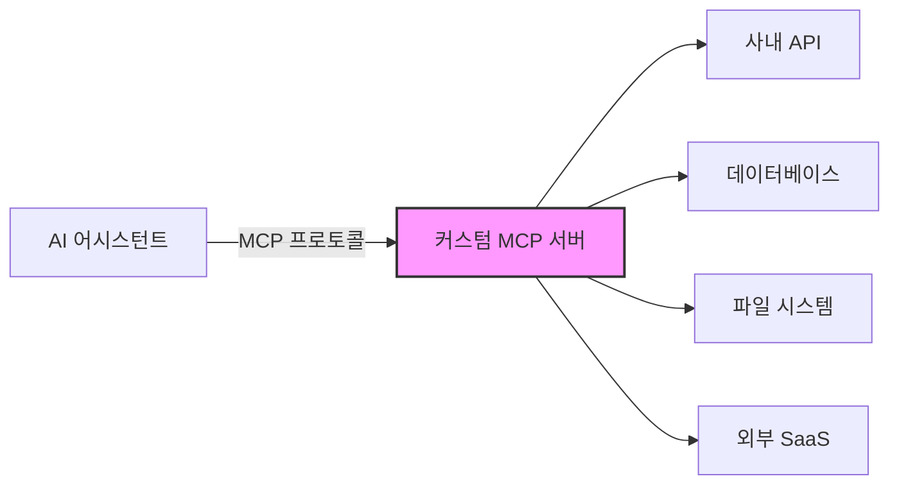

# MCP 서버 개발 가이드

> Model Context Protocol 커스텀 서버를 TypeScript/Python으로 개발하는 종합 가이드

---

## 목차

1. [커스텀 MCP 서버 개발 개요](#1-커스텀-mcp-서버-개발-개요)
2. [TypeScript SDK 서버 개발](#2-typescript-sdk-서버-개발)
3. [Python SDK (FastMCP) 서버 개발](#3-python-sdk-fastmcp-서버-개발)
4. [테스트 및 디버깅](#4-테스트-및-디버깅)
5. [배포](#5-배포)
6. [관련 문서 참조](#6-관련-문서-참조)

---

## 1. 커스텀 MCP 서버 개발 개요

### 1.1 왜 커스텀 서버를 만드는가

MCP 서버를 직접 개발하면 AI 어시스턴트가 접근할 수 없는 내부 시스템, 독자적 API, 레거시 데이터베이스를 Tool/Resource로 노출할 수 있다. 기존 MCP 서버가 커버하지 못하는 다음 시나리오에서 커스텀 서버가 필요하다:

| 시나리오 | 설명 |
|----------|------|
| **사내 API 연동** | 인증이 필요한 내부 REST/gRPC 서비스를 Tool로 래핑 |
| **레거시 DB 접근** | 직접 쿼리가 필요한 Oracle, MSSQL 등 레거시 데이터베이스 |
| **커스텀 비즈니스 로직** | 사내 규칙 엔진, 결재 시스템 등 도메인 특화 로직 |
| **파일 시스템 통합** | 특정 디렉토리 구조, 문서 변환, 미디어 처리 |
| **외부 SaaS 래핑** | Jira, Confluence, Slack 등 조직 맞춤 통합 |



### 1.2 서버 개발 전 체크리스트

서버 개발에 앞서 다음 항목을 점검한다:

- [ ] **노출할 기능 목록**: Tool, Resource, Prompt 각각에 매핑할 기능 식별
- [ ] **인증 요구사항**: OAuth, API Key, 서비스 계정 등 인증 방식 결정
- [ ] **데이터 민감도**: 노출할 데이터의 보안 등급 확인
- [ ] **Transport 방식**: stdio(로컬) vs SSE(원격) 결정
- [ ] **대상 클라이언트**: Claude Desktop, VS Code, 커스텀 클라이언트 등
- [ ] **에러 처리 전략**: 외부 서비스 장애 시 대응 방안
- [ ] **성능 요구사항**: 동시 요청 수, 응답 시간 제한

### 1.3 SDK 선택 가이드

| 기준 | TypeScript SDK | Python SDK (FastMCP) |
|------|---------------|---------------------|
| **설치** | `npm i @modelcontextprotocol/sdk` | `pip install "mcp[cli]"` |
| **정의 방식** | 명시적 스키마 등록 | 데코레이터 기반 |
| **타입 안전성** | Zod 스키마 | Pydantic + 타입 힌트 |
| **Transport** | Stdio, SSE, Streamable HTTP | Stdio, SSE, Streamable HTTP |
| **생태계** | npm 배포, Node.js 생태계 | PyPI 배포, Python 생태계 |
| **추천 상황** | 프론트엔드 팀, Node.js 인프라 | 데이터/ML 팀, Python 인프라 |

> **권장**: 팀의 주 기술 스택에 맞춰 선택한다. 기능적 차이는 거의 없다.

---

## 2. TypeScript SDK 서버 개발

### 2.1 패키지 설치 및 설정

```bash
# 프로젝트 초기화
mkdir my-mcp-server && cd my-mcp-server
npm init -y

# SDK 및 의존성 설치
npm install @modelcontextprotocol/sdk zod
npm install -D typescript @types/node tsx

# tsconfig.json 생성
npx tsc --init --target ES2022 --module Node16 --moduleResolution Node16 \
  --outDir ./dist --rootDir ./src --strict true
```

`package.json`에 다음을 추가한다:

```json
{
  "type": "module",
  "bin": {
    "my-mcp-server": "./dist/index.js"
  },
  "scripts": {
    "build": "tsc",
    "dev": "tsx src/index.ts",
    "start": "node dist/index.js"
  }
}
```

### 2.2 프로젝트 구조

```
my-mcp-server/
├── src/
│   ├── index.ts              # 엔트리포인트, Transport 연결
│   ├── server.ts             # Server 인스턴스 생성, Tool/Resource/Prompt 등록
│   ├── tools/
│   │   ├── weather.ts        # Tool 핸들러
│   │   └── database.ts
│   ├── resources/
│   │   └── config.ts         # Resource 핸들러
│   ├── prompts/
│   │   └── analysis.ts       # Prompt 핸들러
│   └── utils/
│       ├── logger.ts         # 로깅 유틸리티
│       └── errors.ts         # 에러 처리
├── tests/
│   ├── tools.test.ts
│   └── resources.test.ts
├── package.json
└── tsconfig.json
```

### 2.3 Server 클래스 초기화

```typescript
// src/server.ts
import { McpServer } from "@modelcontextprotocol/sdk/server/mcp.js";

export function createServer() {
  const server = new McpServer({
    name: "my-mcp-server",
    version: "1.0.0",
  });

  // Tool, Resource, Prompt 등록은 이 함수 내에서 수행
  registerTools(server);
  registerResources(server);
  registerPrompts(server);

  return server;
}
```

### 2.4 Tool 정의

Tool은 AI 어시스턴트가 호출할 수 있는 함수다. `name`, `description`, `inputSchema`, `handler`로 구성된다.

```typescript
// src/tools/weather.ts
import { McpServer } from "@modelcontextprotocol/sdk/server/mcp.js";
import { z } from "zod";

export function registerWeatherTools(server: McpServer) {
  // Tool 정의: Zod 스키마 사용
  server.tool(
    "get-weather",
    "지정한 도시의 현재 날씨 정보를 조회합니다",
    {
      city: z.string().describe("도시 이름 (예: Seoul, Tokyo)"),
      units: z
        .enum(["metric", "imperial"])
        .default("metric")
        .describe("온도 단위"),
    },
    async ({ city, units }) => {
      try {
        const apiKey = process.env.WEATHER_API_KEY;
        if (!apiKey) {
          return {
            content: [
              {
                type: "text",
                text: "WEATHER_API_KEY 환경변수가 설정되지 않았습니다",
              },
            ],
            isError: true,
          };
        }

        const url = `https://api.openweathermap.org/data/2.5/weather?q=${encodeURIComponent(city)}&units=${units}&appid=${apiKey}`;
        const response = await fetch(url);

        if (!response.ok) {
          return {
            content: [
              {
                type: "text",
                text: `날씨 조회 실패: ${response.status} ${response.statusText}`,
              },
            ],
            isError: true,
          };
        }

        const data = await response.json();
        const unitLabel = units === "metric" ? "°C" : "°F";

        return {
          content: [
            {
              type: "text",
              text: [
                `## ${data.name} 날씨`,
                `- 기온: ${data.main.temp}${unitLabel}`,
                `- 체감: ${data.main.feels_like}${unitLabel}`,
                `- 습도: ${data.main.humidity}%`,
                `- 상태: ${data.weather[0].description}`,
                `- 풍속: ${data.wind.speed} m/s`,
              ].join("\n"),
            },
          ],
        };
      } catch (error) {
        return {
          content: [
            {
              type: "text",
              text: `날씨 조회 중 오류: ${error instanceof Error ? error.message : String(error)}`,
            },
          ],
          isError: true,
        };
      }
    }
  );

  // 여러 도시 비교 Tool
  server.tool(
    "compare-weather",
    "여러 도시의 날씨를 비교합니다",
    {
      cities: z.array(z.string()).min(2).max(5).describe("비교할 도시 목록"),
    },
    async ({ cities }) => {
      const results = await Promise.all(
        cities.map(async (city) => {
          const url = `https://api.openweathermap.org/data/2.5/weather?q=${encodeURIComponent(city)}&units=metric&appid=${process.env.WEATHER_API_KEY}`;
          const res = await fetch(url);
          if (!res.ok) return { city, error: res.statusText };
          return { city, data: await res.json() };
        })
      );

      const table = results
        .map((r) => {
          if ("error" in r) return `| ${r.city} | 오류: ${r.error} | - | - |`;
          const d = r.data;
          return `| ${d.name} | ${d.main.temp}°C | ${d.main.humidity}% | ${d.weather[0].description} |`;
        })
        .join("\n");

      return {
        content: [
          {
            type: "text",
            text: `| 도시 | 기온 | 습도 | 상태 |\n|------|------|------|------|\n${table}`,
          },
        ],
      };
    }
  );
}
```

### 2.5 Resource 정의

Resource는 AI가 읽을 수 있는 데이터 소스다. URI 기반으로 접근하며, 정적 Resource와 템플릿 Resource를 지원한다.

```typescript
// src/resources/config.ts
import { McpServer } from "@modelcontextprotocol/sdk/server/mcp.js";
import { readFile } from "fs/promises";
import { join } from "path";

export function registerResources(server: McpServer) {
  // 정적 Resource: 고정 URI
  server.resource(
    "server-config",
    "config://server",
    { mimeType: "application/json", description: "서버 설정 정보" },
    async () => ({
      contents: [
        {
          uri: "config://server",
          mimeType: "application/json",
          text: JSON.stringify(
            {
              name: "my-mcp-server",
              version: "1.0.0",
              uptime: process.uptime(),
              nodeVersion: process.version,
            },
            null,
            2
          ),
        },
      ],
    })
  );

  // 템플릿 Resource: 동적 URI
  server.resource(
    "log-file",
    "logs://{date}",
    { mimeType: "text/plain", description: "날짜별 로그 파일 조회" },
    async (uri, { date }) => {
      const logPath = join("/var/log/app", `${date}.log`);
      try {
        const content = await readFile(logPath, "utf-8");
        return {
          contents: [
            {
              uri: uri.href,
              mimeType: "text/plain",
              text: content,
            },
          ],
        };
      } catch {
        return {
          contents: [
            {
              uri: uri.href,
              mimeType: "text/plain",
              text: `로그 파일을 찾을 수 없습니다: ${date}`,
            },
          ],
        };
      }
    }
  );
}
```

### 2.6 Prompt 정의

Prompt는 재사용 가능한 메시지 템플릿이다. 사용자 인자를 받아 AI에게 전달할 메시지를 구성한다.

```typescript
// src/prompts/analysis.ts
import { McpServer } from "@modelcontextprotocol/sdk/server/mcp.js";
import { z } from "zod";

export function registerPrompts(server: McpServer) {
  server.prompt(
    "analyze-data",
    "데이터 분석 요청 프롬프트를 생성합니다",
    {
      dataset: z.string().describe("분석할 데이터셋 이름"),
      goal: z.string().describe("분석 목적"),
      format: z
        .enum(["summary", "detailed", "executive"])
        .default("summary")
        .describe("결과 형식"),
    },
    ({ dataset, goal, format }) => ({
      messages: [
        {
          role: "user",
          content: {
            type: "text",
            text: [
              `## 데이터 분석 요청`,
              ``,
              `**데이터셋**: ${dataset}`,
              `**분석 목적**: ${goal}`,
              `**결과 형식**: ${format}`,
              ``,
              `위 데이터셋을 분석하여 ${goal}에 대한 인사이트를 도출해주세요.`,
              format === "executive"
                ? "경영진 보고용으로 핵심 지표와 권고사항을 중심으로 작성해주세요."
                : format === "detailed"
                  ? "통계적 분석과 시각화 제안을 포함한 상세 보고서를 작성해주세요."
                  : "주요 발견사항을 요약해주세요.",
            ].join("\n"),
          },
        },
      ],
    })
  );
}
```

### 2.7 Transport 연결

```typescript
// src/index.ts
import { StdioServerTransport } from "@modelcontextprotocol/sdk/server/stdio.js";
import { createServer } from "./server.js";

async function main() {
  const server = createServer();

  // Stdio Transport: 로컬 실행 (Claude Desktop, CLI)
  const transport = new StdioServerTransport();
  await server.connect(transport);

  // 디버그 로그는 반드시 stderr로 출력 (stdout은 MCP 통신 채널)
  console.error("MCP 서버가 시작되었습니다");
}

main().catch((error) => {
  console.error("서버 시작 실패:", error);
  process.exit(1);
});
```

SSE Transport를 사용하는 원격 서버 구성:

```typescript
// src/index-sse.ts
import express from "express";
import { SSEServerTransport } from "@modelcontextprotocol/sdk/server/sse.js";
import { createServer } from "./server.js";

const app = express();
const sessions = new Map<string, SSEServerTransport>();

app.get("/sse", async (req, res) => {
  const transport = new SSEServerTransport("/messages", res);
  sessions.set(transport.sessionId, transport);

  const server = createServer();
  await server.connect(transport);

  res.on("close", () => {
    sessions.delete(transport.sessionId);
  });
});

app.post("/messages", async (req, res) => {
  const sessionId = req.query.sessionId as string;
  const transport = sessions.get(sessionId);
  if (!transport) {
    res.status(404).send("Session not found");
    return;
  }
  await transport.handlePostMessage(req, res);
});

const PORT = process.env.PORT || 3001;
app.listen(PORT, () => {
  console.error(`SSE MCP 서버 실행 중: http://localhost:${PORT}`);
});
```

### 2.8 완전한 예시: 날씨 API MCP 서버

아래는 날씨 조회 기능을 제공하는 완전한 MCP 서버 코드다.

```typescript
// weather-server/src/index.ts
import { McpServer } from "@modelcontextprotocol/sdk/server/mcp.js";
import { StdioServerTransport } from "@modelcontextprotocol/sdk/server/stdio.js";
import { z } from "zod";

const server = new McpServer({
  name: "weather-server",
  version: "1.0.0",
});

// --- Tools ---

server.tool(
  "get-current-weather",
  "현재 날씨를 조회합니다",
  {
    city: z.string().describe("도시 이름"),
    units: z.enum(["metric", "imperial"]).default("metric"),
  },
  async ({ city, units }) => {
    const apiKey = process.env.WEATHER_API_KEY;
    if (!apiKey) {
      return {
        content: [{ type: "text", text: "WEATHER_API_KEY가 설정되지 않았습니다" }],
        isError: true,
      };
    }

    const url = `https://api.openweathermap.org/data/2.5/weather?q=${encodeURIComponent(city)}&units=${units}&appid=${apiKey}`;
    const res = await fetch(url);

    if (!res.ok) {
      return {
        content: [{ type: "text", text: `API 오류: ${res.status}` }],
        isError: true,
      };
    }

    const data = await res.json();
    const unit = units === "metric" ? "°C" : "°F";

    return {
      content: [
        {
          type: "text",
          text: [
            `## ${data.name}, ${data.sys.country}`,
            `- 기온: ${data.main.temp}${unit} (체감: ${data.main.feels_like}${unit})`,
            `- 습도: ${data.main.humidity}%`,
            `- 날씨: ${data.weather[0].main} - ${data.weather[0].description}`,
            `- 풍속: ${data.wind.speed} ${units === "metric" ? "m/s" : "mph"}`,
            `- 기압: ${data.main.pressure} hPa`,
          ].join("\n"),
        },
      ],
    };
  }
);

server.tool(
  "get-forecast",
  "5일간 날씨 예보를 조회합니다",
  {
    city: z.string().describe("도시 이름"),
    days: z.number().min(1).max(5).default(3).describe("예보 일수"),
  },
  async ({ city, days }) => {
    const apiKey = process.env.WEATHER_API_KEY;
    const url = `https://api.openweathermap.org/data/2.5/forecast?q=${encodeURIComponent(city)}&units=metric&cnt=${days * 8}&appid=${apiKey}`;
    const res = await fetch(url);

    if (!res.ok) {
      return {
        content: [{ type: "text", text: `API 오류: ${res.status}` }],
        isError: true,
      };
    }

    const data = await res.json();
    // 하루 단위로 그룹화 (3시간 간격 데이터)
    const dailyMap = new Map<string, any[]>();
    for (const item of data.list) {
      const date = item.dt_txt.split(" ")[0];
      if (!dailyMap.has(date)) dailyMap.set(date, []);
      dailyMap.get(date)!.push(item);
    }

    const lines = ["## 날씨 예보", `**${data.city.name}** - ${days}일간`, ""];
    for (const [date, items] of dailyMap) {
      const avgTemp =
        items.reduce((sum: number, i: any) => sum + i.main.temp, 0) / items.length;
      const maxTemp = Math.max(...items.map((i: any) => i.main.temp_max));
      const minTemp = Math.min(...items.map((i: any) => i.main.temp_min));
      lines.push(
        `### ${date}`,
        `- 평균: ${avgTemp.toFixed(1)}°C (${minTemp.toFixed(1)} ~ ${maxTemp.toFixed(1)}°C)`,
        ""
      );
    }

    return { content: [{ type: "text", text: lines.join("\n") }] };
  }
);

// --- Resources ---

server.resource(
  "api-status",
  "weather://api-status",
  { mimeType: "application/json", description: "날씨 API 상태 확인" },
  async () => ({
    contents: [
      {
        uri: "weather://api-status",
        mimeType: "application/json",
        text: JSON.stringify({
          configured: !!process.env.WEATHER_API_KEY,
          server: "weather-server",
          version: "1.0.0",
        }),
      },
    ],
  })
);

// --- Prompts ---

server.prompt(
  "weather-report",
  "특정 도시의 날씨 분석 보고서를 요청하는 프롬프트",
  { city: z.string().describe("도시 이름") },
  ({ city }) => ({
    messages: [
      {
        role: "user",
        content: {
          type: "text",
          text: `${city}의 현재 날씨와 5일 예보를 조회한 후, 외출 적합도, 주의사항, 옷차림 추천을 포함한 종합 날씨 보고서를 작성해주세요.`,
        },
      },
    ],
  })
);

// --- 서버 시작 ---

async function main() {
  const transport = new StdioServerTransport();
  await server.connect(transport);
  console.error("Weather MCP 서버 시작됨");
}

main().catch(console.error);
```

Claude Desktop 설정 (`claude_desktop_config.json`):

```json
{
  "mcpServers": {
    "weather": {
      "command": "node",
      "args": ["/path/to/weather-server/dist/index.js"],
      "env": {
        "WEATHER_API_KEY": "your-api-key-here"
      }
    }
  }
}
```

### 2.9 완전한 예시: 데이터베이스 쿼리 MCP 서버

```typescript
// db-server/src/index.ts
import { McpServer } from "@modelcontextprotocol/sdk/server/mcp.js";
import { StdioServerTransport } from "@modelcontextprotocol/sdk/server/stdio.js";
import { z } from "zod";
import Database from "better-sqlite3";

const DB_PATH = process.env.DB_PATH || "./data.db";
const db = new Database(DB_PATH, { readonly: false });

// WAL 모드 활성화
db.pragma("journal_mode = WAL");

const server = new McpServer({
  name: "db-query-server",
  version: "1.0.0",
});

// --- Tools ---

server.tool(
  "query",
  "SELECT 쿼리를 실행하고 결과를 반환합니다 (읽기 전용)",
  {
    sql: z.string().describe("실행할 SELECT SQL 쿼리"),
    params: z
      .array(z.union([z.string(), z.number(), z.null()]))
      .default([])
      .describe("바인딩 파라미터"),
  },
  async ({ sql, params }) => {
    // SELECT만 허용
    const normalized = sql.trim().toUpperCase();
    if (!normalized.startsWith("SELECT") && !normalized.startsWith("WITH")) {
      return {
        content: [
          { type: "text", text: "읽기 전용: SELECT/WITH 쿼리만 허용됩니다" },
        ],
        isError: true,
      };
    }

    // 위험한 키워드 차단
    const forbidden = ["DROP", "DELETE", "UPDATE", "INSERT", "ALTER", "TRUNCATE"];
    if (forbidden.some((kw) => normalized.includes(kw))) {
      return {
        content: [{ type: "text", text: "금지된 키워드가 포함되어 있습니다" }],
        isError: true,
      };
    }

    try {
      const stmt = db.prepare(sql);
      const rows = stmt.all(...params);

      if (rows.length === 0) {
        return { content: [{ type: "text", text: "결과 없음" }] };
      }

      // 마크다운 테이블로 포맷팅
      const columns = Object.keys(rows[0] as object);
      const header = `| ${columns.join(" | ")} |`;
      const separator = `| ${columns.map(() => "---").join(" | ")} |`;
      const body = rows
        .slice(0, 100) // 최대 100행
        .map(
          (row: any) =>
            `| ${columns.map((col) => String(row[col] ?? "NULL")).join(" | ")} |`
        )
        .join("\n");

      const result = [header, separator, body].join("\n");
      const footer =
        rows.length > 100 ? `\n\n> 전체 ${rows.length}행 중 100행만 표시` : "";

      return {
        content: [{ type: "text", text: result + footer }],
      };
    } catch (error) {
      return {
        content: [
          {
            type: "text",
            text: `쿼리 실행 오류: ${error instanceof Error ? error.message : String(error)}`,
          },
        ],
        isError: true,
      };
    }
  }
);

server.tool(
  "execute",
  "INSERT/UPDATE/DELETE 쿼리를 실행합니다 (쓰기)",
  {
    sql: z.string().describe("실행할 SQL 쿼리"),
    params: z
      .array(z.union([z.string(), z.number(), z.null()]))
      .default([])
      .describe("바인딩 파라미터"),
  },
  async ({ sql, params }) => {
    const normalized = sql.trim().toUpperCase();

    // DROP/TRUNCATE/ALTER 차단
    if (["DROP", "TRUNCATE", "ALTER"].some((kw) => normalized.startsWith(kw))) {
      return {
        content: [
          { type: "text", text: "DDL 명령(DROP/TRUNCATE/ALTER)은 허용되지 않습니다" },
        ],
        isError: true,
      };
    }

    try {
      const stmt = db.prepare(sql);
      const result = stmt.run(...params);

      return {
        content: [
          {
            type: "text",
            text: [
              `## 실행 결과`,
              `- 영향받은 행: ${result.changes}`,
              `- 마지막 INSERT ID: ${result.lastInsertRowid}`,
            ].join("\n"),
          },
        ],
      };
    } catch (error) {
      return {
        content: [
          {
            type: "text",
            text: `실행 오류: ${error instanceof Error ? error.message : String(error)}`,
          },
        ],
        isError: true,
      };
    }
  }
);

server.tool(
  "list-tables",
  "데이터베이스의 모든 테이블 목록을 조회합니다",
  {},
  async () => {
    const tables = db
      .prepare(
        "SELECT name, sql FROM sqlite_master WHERE type='table' AND name NOT LIKE 'sqlite_%' ORDER BY name"
      )
      .all() as { name: string; sql: string }[];

    if (tables.length === 0) {
      return { content: [{ type: "text", text: "테이블이 없습니다" }] };
    }

    const lines = tables.map(
      (t) => `### ${t.name}\n\`\`\`sql\n${t.sql}\n\`\`\``
    );

    return {
      content: [
        {
          type: "text",
          text: `## 데이터베이스 테이블 (${tables.length}개)\n\n${lines.join("\n\n")}`,
        },
      ],
    };
  }
);

// --- Resources ---

server.resource(
  "schema",
  "db://schema",
  { mimeType: "application/json", description: "데이터베이스 스키마 전체 조회" },
  async () => {
    const tables = db
      .prepare(
        "SELECT name, sql FROM sqlite_master WHERE type='table' AND name NOT LIKE 'sqlite_%'"
      )
      .all();

    return {
      contents: [
        {
          uri: "db://schema",
          mimeType: "application/json",
          text: JSON.stringify(tables, null, 2),
        },
      ],
    };
  }
);

server.resource(
  "table-data",
  "db://table/{tableName}",
  { mimeType: "application/json", description: "테이블 데이터 조회 (상위 50행)" },
  async (uri, { tableName }) => {
    // 테이블명 검증 (SQL Injection 방지)
    const validName = /^[a-zA-Z_][a-zA-Z0-9_]*$/.test(tableName as string);
    if (!validName) {
      return {
        contents: [
          {
            uri: uri.href,
            mimeType: "application/json",
            text: JSON.stringify({ error: "유효하지 않은 테이블명" }),
          },
        ],
      };
    }

    const rows = db.prepare(`SELECT * FROM "${tableName}" LIMIT 50`).all();
    return {
      contents: [
        {
          uri: uri.href,
          mimeType: "application/json",
          text: JSON.stringify(rows, null, 2),
        },
      ],
    };
  }
);

// --- 서버 시작 ---

async function main() {
  const transport = new StdioServerTransport();
  await server.connect(transport);
  console.error(`DB MCP 서버 시작됨 (DB: ${DB_PATH})`);
}

main().catch(console.error);
```

---

## 3. Python SDK (FastMCP) 서버 개발

### 3.1 패키지 설치

```bash
# uv 사용 (권장)
uv init my-mcp-server
cd my-mcp-server
uv add "mcp[cli]"

# 또는 pip
pip install "mcp[cli]"
```

### 3.2 FastMCP 클래스 기본 사용법

```python
# server.py
from mcp.server.fastmcp import FastMCP

mcp = FastMCP(
    name="my-mcp-server",
    version="1.0.0",
)

# Tool, Resource, Prompt 정의 후 실행
if __name__ == "__main__":
    mcp.run()  # stdio transport로 실행
```

실행 방법:

```bash
# 직접 실행
python server.py

# mcp CLI로 실행 (개발 모드 - Inspector 포함)
mcp dev server.py

# Claude Desktop에 설치
mcp install server.py
```

### 3.3 @mcp.tool() 데코레이터로 Tool 정의

함수의 docstring이 Tool description이 되고, 타입 힌트가 inputSchema가 된다.

```python
# tools.py
from mcp.server.fastmcp import FastMCP
import httpx

mcp = FastMCP("api-tools")

@mcp.tool()
async def get_weather(city: str, units: str = "metric") -> str:
    """지정한 도시의 현재 날씨를 조회합니다.

    Args:
        city: 도시 이름 (예: Seoul, Tokyo)
        units: 온도 단위 (metric 또는 imperial)
    """
    import os
    api_key = os.environ.get("WEATHER_API_KEY")
    if not api_key:
        return "WEATHER_API_KEY 환경변수가 설정되지 않았습니다"

    url = f"https://api.openweathermap.org/data/2.5/weather"
    params = {"q": city, "units": units, "appid": api_key}

    async with httpx.AsyncClient() as client:
        response = await client.get(url, params=params)
        if response.status_code != 200:
            return f"API 오류: {response.status_code}"

        data = response.json()
        unit_label = "°C" if units == "metric" else "°F"

        return (
            f"## {data['name']} 날씨\n"
            f"- 기온: {data['main']['temp']}{unit_label}\n"
            f"- 습도: {data['main']['humidity']}%\n"
            f"- 상태: {data['weather'][0]['description']}\n"
            f"- 풍속: {data['wind']['speed']} m/s"
        )

@mcp.tool()
def calculate(expression: str) -> str:
    """수학 표현식을 안전하게 계산합니다.

    Args:
        expression: 계산할 수학 표현식 (예: "2 + 3 * 4")
    """
    import ast
    import operator

    # 안전한 연산자만 허용
    ops = {
        ast.Add: operator.add,
        ast.Sub: operator.sub,
        ast.Mult: operator.mul,
        ast.Div: operator.truediv,
        ast.Pow: operator.pow,
        ast.USub: operator.neg,
    }

    def eval_node(node):
        if isinstance(node, ast.Constant) and isinstance(node.value, (int, float)):
            return node.value
        elif isinstance(node, ast.BinOp):
            left = eval_node(node.left)
            right = eval_node(node.right)
            op = ops.get(type(node.op))
            if op is None:
                raise ValueError(f"지원하지 않는 연산: {type(node.op).__name__}")
            return op(left, right)
        elif isinstance(node, ast.UnaryOp) and isinstance(node.op, ast.USub):
            return -eval_node(node.operand)
        else:
            raise ValueError("허용되지 않는 표현식")

    try:
        tree = ast.parse(expression, mode="eval")
        result = eval_node(tree.body)
        return f"{expression} = {result}"
    except Exception as e:
        return f"계산 오류: {e}"
```

### 3.4 @mcp.resource() 데코레이터로 Resource 정의

```python
# resources.py
from mcp.server.fastmcp import FastMCP
import json
from pathlib import Path
from datetime import datetime

mcp = FastMCP("file-resources")

@mcp.resource("config://app")
def get_app_config() -> str:
    """애플리케이션 설정 정보를 반환합니다."""
    config = {
        "app_name": "my-app",
        "version": "2.1.0",
        "environment": "production",
        "last_checked": datetime.now().isoformat(),
    }
    return json.dumps(config, indent=2, ensure_ascii=False)

@mcp.resource("files://{path}")
def read_file(path: str) -> str:
    """지정된 경로의 파일 내용을 읽어 반환합니다."""
    # 경로 검증: 상위 디렉토리 탐색 차단
    file_path = Path(path).resolve()
    allowed_base = Path("/data/shared").resolve()

    if not str(file_path).startswith(str(allowed_base)):
        return "접근 거부: 허용된 디렉토리 범위를 벗어났습니다"

    if not file_path.exists():
        return f"파일을 찾을 수 없습니다: {path}"

    return file_path.read_text(encoding="utf-8")
```

### 3.5 @mcp.prompt() 데코레이터로 Prompt 정의

```python
# prompts.py
from mcp.server.fastmcp import FastMCP
from mcp.types import TextContent

mcp = FastMCP("analysis-prompts")

@mcp.prompt()
def code_review(language: str, code: str) -> str:
    """코드 리뷰를 요청하는 프롬프트를 생성합니다.

    Args:
        language: 프로그래밍 언어
        code: 리뷰할 코드
    """
    return (
        f"다음 {language} 코드를 리뷰해주세요.\n\n"
        f"```{language}\n{code}\n```\n\n"
        "다음 관점에서 검토해주세요:\n"
        "1. 버그 또는 잠재적 문제\n"
        "2. 성능 개선 가능성\n"
        "3. 코드 가독성\n"
        "4. 보안 취약점"
    )

@mcp.prompt()
def sql_optimization(query: str, table_info: str) -> list[dict]:
    """SQL 쿼리 최적화를 요청하는 프롬프트를 생성합니다.

    Args:
        query: 최적화할 SQL 쿼리
        table_info: 관련 테이블 스키마 정보
    """
    return [
        {
            "role": "user",
            "content": {
                "type": "text",
                "text": (
                    f"다음 SQL 쿼리를 최적화해주세요.\n\n"
                    f"**테이블 스키마:**\n```\n{table_info}\n```\n\n"
                    f"**현재 쿼리:**\n```sql\n{query}\n```\n\n"
                    "실행 계획 분석, 인덱스 제안, 리팩토링된 쿼리를 제시해주세요."
                ),
            },
        }
    ]
```

### 3.6 Pydantic 모델 활용

복잡한 입력 구조는 Pydantic 모델로 정의한다.

```python
# models.py
from pydantic import BaseModel, Field
from enum import Enum

class Priority(str, Enum):
    LOW = "low"
    MEDIUM = "medium"
    HIGH = "high"
    CRITICAL = "critical"

class TaskCreate(BaseModel):
    title: str = Field(description="작업 제목")
    description: str = Field(default="", description="작업 설명")
    priority: Priority = Field(default=Priority.MEDIUM, description="우선순위")
    assignee: str | None = Field(default=None, description="담당자")
    labels: list[str] = Field(default_factory=list, description="라벨 목록")

# tools_with_models.py
from mcp.server.fastmcp import FastMCP

mcp = FastMCP("task-manager")

@mcp.tool()
def create_task(task: TaskCreate) -> str:
    """새 작업을 생성합니다."""
    # 실제 구현에서는 DB에 저장
    return (
        f"작업 생성 완료:\n"
        f"- 제목: {task.title}\n"
        f"- 우선순위: {task.priority.value}\n"
        f"- 담당자: {task.assignee or '미지정'}\n"
        f"- 라벨: {', '.join(task.labels) or '없음'}"
    )
```

### 3.7 완전한 예시: 파일 관리 MCP 서버

```python
# file_manager_server.py
"""파일 관리 MCP 서버 - 디렉토리 내 파일 CRUD 및 검색 기능 제공"""

from mcp.server.fastmcp import FastMCP
from pathlib import Path
from datetime import datetime
import json
import mimetypes
import os

# 관리 대상 디렉토리 (환경변수로 설정 가능)
BASE_DIR = Path(os.environ.get("FILE_MANAGER_BASE_DIR", "./managed_files")).resolve()
BASE_DIR.mkdir(parents=True, exist_ok=True)

mcp = FastMCP(
    name="file-manager",
    version="1.0.0",
)

def _validate_path(relative_path: str) -> Path:
    """경로를 검증하고 절대 경로를 반환합니다."""
    target = (BASE_DIR / relative_path).resolve()
    if not str(target).startswith(str(BASE_DIR)):
        raise ValueError("디렉토리 탈출 시도가 감지되었습니다")
    return target

# --- Tools ---

@mcp.tool()
def list_files(directory: str = ".", pattern: str = "*") -> str:
    """디렉토리의 파일 목록을 조회합니다.

    Args:
        directory: 조회할 디렉토리 (BASE_DIR 기준 상대경로)
        pattern: 글로브 패턴 (예: *.py, *.md)
    """
    target = _validate_path(directory)
    if not target.is_dir():
        return f"디렉토리가 존재하지 않습니다: {directory}"

    files = sorted(target.glob(pattern))
    if not files:
        return f"파일이 없습니다 (패턴: {pattern})"

    lines = [f"## {directory}/ ({len(files)}개 항목)", ""]
    for f in files:
        stat = f.stat()
        size = _format_size(stat.st_size)
        mtime = datetime.fromtimestamp(stat.st_mtime).strftime("%Y-%m-%d %H:%M")
        icon = "📁" if f.is_dir() else "📄"
        lines.append(f"- {icon} **{f.name}** ({size}, {mtime})")

    return "\n".join(lines)

@mcp.tool()
def read_file(path: str, encoding: str = "utf-8") -> str:
    """파일의 내용을 읽습니다.

    Args:
        path: 파일 경로 (BASE_DIR 기준 상대경로)
        encoding: 파일 인코딩
    """
    target = _validate_path(path)
    if not target.is_file():
        return f"파일이 존재하지 않습니다: {path}"

    mime_type = mimetypes.guess_type(str(target))[0] or "text/plain"

    if not mime_type.startswith("text/"):
        return f"텍스트 파일이 아닙니다 (MIME: {mime_type})"

    content = target.read_text(encoding=encoding)
    return f"**{target.name}** ({_format_size(target.stat().st_size)})\n\n```\n{content}\n```"

@mcp.tool()
def write_file(path: str, content: str, overwrite: bool = False) -> str:
    """파일을 생성하거나 내용을 씁니다.

    Args:
        path: 파일 경로 (BASE_DIR 기준 상대경로)
        content: 작성할 내용
        overwrite: True이면 기존 파일 덮어쓰기
    """
    target = _validate_path(path)

    if target.exists() and not overwrite:
        return f"파일이 이미 존재합니다: {path} (덮어쓰려면 overwrite=true)"

    target.parent.mkdir(parents=True, exist_ok=True)
    target.write_text(content, encoding="utf-8")

    return f"파일 작성 완료: {path} ({_format_size(len(content.encode()))})"

@mcp.tool()
def search_files(query: str, directory: str = ".", file_pattern: str = "**/*") -> str:
    """파일 내용에서 텍스트를 검색합니다.

    Args:
        query: 검색할 텍스트
        directory: 검색 시작 디렉토리
        file_pattern: 파일 글로브 패턴
    """
    target = _validate_path(directory)
    results = []

    for file_path in target.glob(file_pattern):
        if not file_path.is_file():
            continue
        try:
            content = file_path.read_text(encoding="utf-8")
            for i, line in enumerate(content.splitlines(), 1):
                if query.lower() in line.lower():
                    relative = file_path.relative_to(BASE_DIR)
                    results.append(f"- **{relative}:{i}**: `{line.strip()[:100]}`")
        except (UnicodeDecodeError, PermissionError):
            continue

    if not results:
        return f"'{query}'에 대한 검색 결과가 없습니다"

    return f"## 검색 결과: '{query}' ({len(results)}건)\n\n" + "\n".join(
        results[:50]
    )

@mcp.tool()
def file_info(path: str) -> str:
    """파일의 상세 정보를 조회합니다.

    Args:
        path: 파일 경로 (BASE_DIR 기준 상대경로)
    """
    target = _validate_path(path)
    if not target.exists():
        return f"파일이 존재하지 않습니다: {path}"

    stat = target.stat()
    mime_type = mimetypes.guess_type(str(target))[0] or "unknown"

    info = {
        "이름": target.name,
        "경로": str(target.relative_to(BASE_DIR)),
        "크기": _format_size(stat.st_size),
        "MIME": mime_type,
        "생성일": datetime.fromtimestamp(stat.st_ctime).isoformat(),
        "수정일": datetime.fromtimestamp(stat.st_mtime).isoformat(),
        "타입": "디렉토리" if target.is_dir() else "파일",
    }

    return "\n".join(f"- **{k}**: {v}" for k, v in info.items())

# --- Resources ---

@mcp.resource("files://tree")
def get_file_tree() -> str:
    """관리 디렉토리의 전체 파일 트리를 반환합니다."""
    lines = [f"# 파일 트리: {BASE_DIR.name}/", ""]
    for path in sorted(BASE_DIR.rglob("*")):
        relative = path.relative_to(BASE_DIR)
        depth = len(relative.parts) - 1
        indent = "  " * depth
        icon = "📁" if path.is_dir() else "📄"
        lines.append(f"{indent}- {icon} {path.name}")
    return "\n".join(lines)

@mcp.resource("files://stats")
def get_stats() -> str:
    """관리 디렉토리의 통계 정보를 반환합니다."""
    total_files = 0
    total_dirs = 0
    total_size = 0
    extensions: dict[str, int] = {}

    for path in BASE_DIR.rglob("*"):
        if path.is_file():
            total_files += 1
            total_size += path.stat().st_size
            ext = path.suffix or "(없음)"
            extensions[ext] = extensions.get(ext, 0) + 1
        elif path.is_dir():
            total_dirs += 1

    stats = {
        "base_dir": str(BASE_DIR),
        "total_files": total_files,
        "total_dirs": total_dirs,
        "total_size": _format_size(total_size),
        "extensions": dict(sorted(extensions.items(), key=lambda x: -x[1])),
    }
    return json.dumps(stats, indent=2, ensure_ascii=False)

# --- Prompts ---

@mcp.prompt()
def organize_files(directory: str = ".") -> str:
    """파일 정리를 요청하는 프롬프트를 생성합니다.

    Args:
        directory: 정리할 디렉토리
    """
    return (
        f"'{directory}' 디렉토리의 파일 목록을 조회한 후, "
        "파일 이름과 확장자를 기반으로 정리 방안을 제안해주세요. "
        "카테고리별 하위 디렉토리 구조와 이동 계획을 포함해주세요."
    )

# --- Utilities ---

def _format_size(size: int) -> str:
    for unit in ("B", "KB", "MB", "GB"):
        if size < 1024:
            return f"{size:.1f} {unit}"
        size /= 1024
    return f"{size:.1f} TB"

# --- 실행 ---

if __name__ == "__main__":
    mcp.run()
```

### 3.8 완전한 예시: REST API 래퍼 MCP 서버

```python
# rest_api_wrapper_server.py
"""REST API를 MCP Tool로 래핑하는 서버 - JSONPlaceholder를 예시로 사용"""

from mcp.server.fastmcp import FastMCP
from pydantic import BaseModel, Field
import httpx

API_BASE = "https://jsonplaceholder.typicode.com"

mcp = FastMCP(
    name="rest-api-wrapper",
    version="1.0.0",
)

# --- Pydantic Models ---

class PostCreate(BaseModel):
    title: str = Field(description="게시글 제목")
    body: str = Field(description="게시글 본문")
    userId: int = Field(description="작성자 ID")

class PostUpdate(BaseModel):
    title: str | None = Field(default=None, description="수정할 제목")
    body: str | None = Field(default=None, description="수정할 본문")

# --- HTTP Client ---

async def _request(method: str, path: str, **kwargs) -> dict | list | str:
    async with httpx.AsyncClient(base_url=API_BASE, timeout=30.0) as client:
        response = await client.request(method, path, **kwargs)
        if response.status_code >= 400:
            return f"HTTP {response.status_code}: {response.text}"
        return response.json()

# --- Tools ---

@mcp.tool()
async def list_posts(userId: int | None = None, limit: int = 10) -> str:
    """게시글 목록을 조회합니다.

    Args:
        userId: 특정 사용자의 게시글만 필터링 (선택)
        limit: 최대 조회 수 (기본 10)
    """
    params = {}
    if userId is not None:
        params["userId"] = userId

    data = await _request("GET", "/posts", params=params)
    if isinstance(data, str):
        return data

    posts = data[:limit]
    lines = [f"## 게시글 목록 ({len(posts)}건)", ""]
    for post in posts:
        lines.append(f"### [{post['id']}] {post['title']}")
        lines.append(f"> 작성자 ID: {post['userId']}")
        lines.append(f"{post['body'][:100]}...")
        lines.append("")

    return "\n".join(lines)

@mcp.tool()
async def get_post(post_id: int) -> str:
    """게시글 상세 정보를 조회합니다 (댓글 포함).

    Args:
        post_id: 게시글 ID
    """
    post = await _request("GET", f"/posts/{post_id}")
    if isinstance(post, str):
        return post

    comments = await _request("GET", f"/posts/{post_id}/comments")

    lines = [
        f"## {post['title']}",
        f"**작성자 ID**: {post['userId']}",
        "",
        post["body"],
        "",
    ]

    if isinstance(comments, list) and comments:
        lines.append(f"### 댓글 ({len(comments)}개)")
        for c in comments:
            lines.append(f"- **{c['name']}** ({c['email']}): {c['body'][:80]}...")

    return "\n".join(lines)

@mcp.tool()
async def create_post(post: PostCreate) -> str:
    """새 게시글을 작성합니다.

    Args:
        post: 게시글 정보 (title, body, userId)
    """
    data = await _request(
        "POST",
        "/posts",
        json=post.model_dump(),
    )
    if isinstance(data, str):
        return data

    return (
        f"게시글 생성 완료:\n"
        f"- ID: {data.get('id')}\n"
        f"- 제목: {data.get('title')}\n"
        f"- 작성자: {data.get('userId')}"
    )

@mcp.tool()
async def update_post(post_id: int, updates: PostUpdate) -> str:
    """게시글을 수정합니다.

    Args:
        post_id: 수정할 게시글 ID
        updates: 수정할 필드 (title, body)
    """
    payload = updates.model_dump(exclude_none=True)
    if not payload:
        return "수정할 내용이 없습니다"

    data = await _request("PATCH", f"/posts/{post_id}", json=payload)
    if isinstance(data, str):
        return data

    return f"게시글 #{post_id} 수정 완료: {', '.join(payload.keys())} 변경됨"

@mcp.tool()
async def search_posts(keyword: str) -> str:
    """게시글을 키워드로 검색합니다.

    Args:
        keyword: 검색 키워드 (제목/본문에서 검색)
    """
    all_posts = await _request("GET", "/posts")
    if isinstance(all_posts, str):
        return all_posts

    keyword_lower = keyword.lower()
    results = [
        p
        for p in all_posts
        if keyword_lower in p["title"].lower()
        or keyword_lower in p["body"].lower()
    ]

    if not results:
        return f"'{keyword}'에 대한 검색 결과가 없습니다"

    lines = [f"## 검색 결과: '{keyword}' ({len(results)}건)", ""]
    for post in results[:20]:
        lines.append(f"- **[{post['id']}]** {post['title']}")

    return "\n".join(lines)

@mcp.tool()
async def get_user(user_id: int) -> str:
    """사용자 정보를 조회합니다.

    Args:
        user_id: 사용자 ID
    """
    data = await _request("GET", f"/users/{user_id}")
    if isinstance(data, str):
        return data

    return (
        f"## {data['name']} (@{data['username']})\n"
        f"- 이메일: {data['email']}\n"
        f"- 전화: {data['phone']}\n"
        f"- 웹사이트: {data['website']}\n"
        f"- 회사: {data['company']['name']}\n"
        f"- 주소: {data['address']['city']}"
    )

# --- Resources ---

@mcp.resource("api://info")
async def get_api_info() -> str:
    """API 서버 정보를 반환합니다."""
    import json
    return json.dumps(
        {
            "base_url": API_BASE,
            "name": "JSONPlaceholder",
            "description": "Free REST API for testing and prototyping",
            "endpoints": [
                "/posts", "/comments", "/albums",
                "/photos", "/todos", "/users",
            ],
        },
        indent=2,
    )

@mcp.resource("api://posts/recent")
async def get_recent_posts() -> str:
    """최근 게시글 5건을 반환합니다."""
    import json
    data = await _request("GET", "/posts")
    if isinstance(data, str):
        return data
    return json.dumps(data[-5:], indent=2, ensure_ascii=False)

# --- Prompts ---

@mcp.prompt()
def analyze_user_activity(user_id: int) -> str:
    """사용자 활동 분석을 요청하는 프롬프트를 생성합니다.

    Args:
        user_id: 분석할 사용자 ID
    """
    return (
        f"사용자 ID {user_id}의 정보와 작성한 게시글을 모두 조회한 후, "
        "다음을 분석해주세요:\n"
        "1. 주요 관심 주제\n"
        "2. 글쓰기 패턴 (길이, 빈도)\n"
        "3. 활동 요약 리포트"
    )

# --- 실행 ---

if __name__ == "__main__":
    mcp.run()
```

---

## 4. 테스트 및 디버깅

### 4.1 MCP Inspector

MCP Inspector는 브라우저 기반 테스트 도구로, 개발 중인 MCP 서버를 인터랙티브하게 테스트할 수 있다.


**설치 및 실행:**

```bash
# TypeScript 서버 테스트
npx @modelcontextprotocol/inspector node dist/index.js

# Python 서버 테스트
npx @modelcontextprotocol/inspector python server.py

# FastMCP의 내장 dev 명령 (Inspector 자동 실행)
mcp dev server.py

# 환경변수 전달
npx @modelcontextprotocol/inspector -e WEATHER_API_KEY=abc123 node dist/index.js

# 커스텀 포트
npx @modelcontextprotocol/inspector --port 8080 node dist/index.js
```

Inspector에서 테스트할 수 있는 항목:

| 탭 | 기능 |
|----|------|
| **Tools** | Tool 목록 확인, 인자 입력, 실행 및 결과 확인 |
| **Resources** | Resource URI 목록, 읽기 테스트 |
| **Prompts** | Prompt 목록, 인자 입력, 생성된 메시지 확인 |
| **Notifications** | 서버/클라이언트 알림 로그 |
| **Ping** | 서버 연결 상태 확인 |

### 4.2 단위 테스트 (TypeScript - Vitest)

```typescript
// tests/tools.test.ts
import { describe, it, expect, beforeAll, afterAll } from "vitest";
import { Client } from "@modelcontextprotocol/sdk/client/index.js";
import { InMemoryTransport } from "@modelcontextprotocol/sdk/inMemory.js";
import { createServer } from "../src/server.js";

describe("DB Query Server Tools", () => {
  let client: Client;

  beforeAll(async () => {
    const server = createServer();
    const [clientTransport, serverTransport] =
      InMemoryTransport.createLinkedPair();

    await server.connect(serverTransport);
    client = new Client({ name: "test-client", version: "1.0.0" });
    await client.connect(clientTransport);
  });

  it("list-tables Tool이 테이블 목록을 반환한다", async () => {
    const result = await client.callTool({
      name: "list-tables",
      arguments: {},
    });

    expect(result.isError).toBeFalsy();
    expect(result.content).toHaveLength(1);
    expect((result.content[0] as any).text).toContain("테이블");
  });

  it("query Tool이 SELECT 외 쿼리를 거부한다", async () => {
    const result = await client.callTool({
      name: "query",
      arguments: { sql: "DROP TABLE users" },
    });

    expect(result.isError).toBe(true);
    expect((result.content[0] as any).text).toContain("SELECT");
  });

  it("query Tool이 파라미터 바인딩을 처리한다", async () => {
    const result = await client.callTool({
      name: "query",
      arguments: {
        sql: "SELECT * FROM users WHERE id = ?",
        params: [1],
      },
    });

    expect(result.isError).toBeFalsy();
  });

  afterAll(async () => {
    await client.close();
  });
});
```

### 4.3 단위 테스트 (Python - pytest)

```python
# tests/test_tools.py
import pytest
from mcp import ClientSession
from mcp.client.stdio import stdio_client, StdioServerParameters

@pytest.fixture
async def client():
    server_params = StdioServerParameters(
        command="python",
        args=["server.py"],
        env={"FILE_MANAGER_BASE_DIR": "/tmp/test_files"},
    )

    async with stdio_client(server_params) as (read, write):
        async with ClientSession(read, write) as session:
            await session.initialize()
            yield session

@pytest.mark.asyncio
async def test_list_tools(client):
    tools = await client.list_tools()
    tool_names = [t.name for t in tools.tools]
    assert "list_files" in tool_names
    assert "read_file" in tool_names
    assert "write_file" in tool_names

@pytest.mark.asyncio
async def test_write_and_read_file(client):
    # 파일 쓰기
    write_result = await client.call_tool(
        "write_file",
        {"path": "test.txt", "content": "Hello, MCP!"},
    )
    assert "작성 완료" in write_result.content[0].text

    # 파일 읽기
    read_result = await client.call_tool(
        "read_file",
        {"path": "test.txt"},
    )
    assert "Hello, MCP!" in read_result.content[0].text

@pytest.mark.asyncio
async def test_path_traversal_blocked(client):
    result = await client.call_tool(
        "read_file",
        {"path": "../../etc/passwd"},
    )
    assert "접근 거부" in result.content[0].text or "존재하지 않" in result.content[0].text
```

### 4.4 디버그 로깅 설정

**TypeScript:**

```typescript
// src/utils/logger.ts
const LOG_LEVELS = { DEBUG: 0, INFO: 1, WARN: 2, ERROR: 3 } as const;
type LogLevel = keyof typeof LOG_LEVELS;

const currentLevel: LogLevel =
  (process.env.MCP_LOG_LEVEL as LogLevel) || "INFO";

export function log(level: LogLevel, message: string, data?: unknown) {
  if (LOG_LEVELS[level] < LOG_LEVELS[currentLevel]) return;

  const entry = {
    timestamp: new Date().toISOString(),
    level,
    message,
    ...(data !== undefined && { data }),
  };

  // MCP는 stdout을 통신에 사용하므로 반드시 stderr로 출력
  console.error(JSON.stringify(entry));
}
```

**Python:**

```python
# logging_config.py
import logging
import sys

def setup_logging():
    handler = logging.StreamHandler(sys.stderr)  # stderr 필수
    handler.setFormatter(
        logging.Formatter("%(asctime)s [%(levelname)s] %(name)s: %(message)s")
    )

    logger = logging.getLogger("mcp-server")
    logger.addHandler(handler)
    logger.setLevel(logging.DEBUG if os.environ.get("MCP_DEBUG") else logging.INFO)

    return logger
```

> **중요**: MCP 서버에서 `stdout`은 프로토콜 통신 채널이다. 모든 로그/디버그 출력은 반드시 `stderr`로 보내야 한다.

---

## 5. 배포

### 5.1 npm 배포

```bash
# package.json 확인
# - "name": "@your-scope/mcp-server-name"
# - "bin" 필드에 실행 파일 매핑
# - "files" 필드에 dist/ 포함

# 빌드 및 배포
npm run build
npm publish --access public
```

사용자 설정:

```json
{
  "mcpServers": {
    "your-server": {
      "command": "npx",
      "args": ["-y", "@your-scope/mcp-server-name"],
      "env": {
        "API_KEY": "user-api-key"
      }
    }
  }
}
```

### 5.2 Docker 컨테이너화

```dockerfile
# Dockerfile
FROM node:22-alpine AS builder
WORKDIR /app
COPY package*.json ./
RUN npm ci
COPY . .
RUN npm run build

FROM node:22-alpine
WORKDIR /app
COPY --from=builder /app/dist ./dist
COPY --from=builder /app/node_modules ./node_modules
COPY --from=builder /app/package.json ./

# 비루트 사용자
RUN addgroup -g 1001 -S mcpuser && adduser -S mcpuser -u 1001
USER mcpuser

ENTRYPOINT ["node", "dist/index.js"]
```

```bash
# 빌드
docker build -t my-mcp-server .

# 실행 (stdio 모드에서는 -i 필수)
docker run -i --rm \
  -e WEATHER_API_KEY=your-key \
  my-mcp-server
```

Claude Desktop에서 Docker 서버 사용:

```json
{
  "mcpServers": {
    "weather": {
      "command": "docker",
      "args": ["run", "-i", "--rm", "-e", "WEATHER_API_KEY=your-key", "my-mcp-server"]
    }
  }
}
```

### 5.3 Smithery 레지스트리 등록

[Smithery](https://smithery.ai)는 MCP 서버의 중앙 레지스트리다.

```bash
# smithery.yaml 작성
# 저장소 루트에 위치
```

```yaml
# smithery.yaml
startCommand:
  type: stdio
  configSchema:
    type: object
    properties:
      weatherApiKey:
        type: string
        description: "OpenWeatherMap API Key"
    required:
      - weatherApiKey
  commandFunction: |-
    (config) => ({
      command: 'node',
      args: ['dist/index.js'],
      env: {
        WEATHER_API_KEY: config.weatherApiKey
      }
    })
```

등록 절차:
1. GitHub 저장소에 `smithery.yaml` 커밋
2. [smithery.ai](https://smithery.ai)에서 저장소 연결
3. 자동 빌드 및 배포 확인

### 5.4 버전 관리

```json
{
  "name": "@your-scope/mcp-server",
  "version": "1.2.0"
}
```

| 버전 변경 | 시기 |
|-----------|------|
| **Major** (2.0.0) | Tool 삭제, inputSchema 변경 등 Breaking Change |
| **Minor** (1.1.0) | 새 Tool/Resource 추가, 기존 Tool에 선택적 파라미터 추가 |
| **Patch** (1.0.1) | 버그 수정, 성능 개선, 문서 업데이트 |

---

## 6. 관련 문서 참조

| 문서 | 설명 |
|------|------|
| [MCP 종합 가이드 (README.md)](./README.md) | MCP 프로토콜 개요, 아키텍처, 설정 방법 |
| [MCP 보안/인증 가이드 (02)](./02-MCP-보안-인증-가이드.md) | OAuth 2.0, 시크릿 관리, 보안 체크리스트 |

---

> **참고**: 이 문서는 MCP TypeScript SDK 및 Python SDK (FastMCP) 기준으로 작성되었다. SDK 버전 업데이트에 따라 API가 변경될 수 있으므로, 공식 문서([modelcontextprotocol.io](https://modelcontextprotocol.io))를 함께 참고한다.
